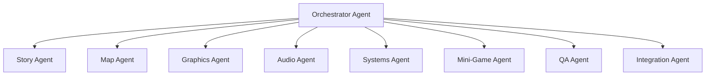

# Pig & Swine RPG — Master Development Plan

## Current State Summary

The game is a **canvas-based isometric legal RPG** built with Vite + ES modules. It has:
- 15 source files in `src/` with modular architecture
- 24×24 overworld + 4 interior room definitions (office, court, cafe, archive)
- 10 NPCs with dialogue topics and quest-gated lines
- 2 legal cases (Day One financial crisis + Nowak eviction)
- Coffee mini-game, random office incidents, badge system
- Procedural audio via Web Audio API (no music, just sound effects)
- Ace Attorney-style typewriter dialogue with 64×64 pixel portraits
- Save/load via localStorage, PWA-ready

> [!IMPORTANT]
> The game works but is shallow. Day One is ~10 minutes. After that, content runs out. Interiors are tile-color zones, not real rooms. Portraits are crude rectangles. There's no real music. The "world" is one flat map.

---

## Part 1: Story & Content Design

### Full Story Arc — 5 Chapters

#### Chapter 1: "The Financial Crisis" ✅ (exists, needs polish)
The better framing is: Chapter 1 should become the **polished playable prologue/tutorial**, not merely “more dialogue.” The source plan says Chapter 1 already exists but needs “true interior transitions, richer NPC dialogue, tutorial flow,” so the first sprint should lock the player’s first 20–30 minutes into something complete, charming, and structurally useful for later chapters. 

## Part 1 — Chapter 1 Development Spec

### Chapter 1: “The Financial Crisis”

Chapter 1 should teach the whole basic game loop:

**explore → talk → collect evidence → recruit help → prepare argument → go to court → win a ridiculous but legally coherent case.**

The player should finish Chapter 1 understanding four things: who Dr. A. Kula is, why Pig & Swine matters, how legal investigation works, and why the game’s comedy has a legal spine rather than being random.

The emotional arc is:

**confusion → panic → investigation → improvised teamwork → courtroom competence → fragile survival.**

The core joke is that Pig & Swine is both absurdly incompetent and somehow morally worth saving.

---

# Chapter spine

## 0. Cold open — arrival at Pig & Swine

The game should begin with Dr. A. Kula outside the office. The player gets immediate control, but only a small slice of the world is active. The objective is simple: **enter the office**.

This avoids starting with a long dialogue dump. The player learns movement first.

Suggested objective text:

> First day. New suit. Old debt. Enter Pig & Swine.

When the player enters the office, trigger the first interior transition: fade-to-black, load office interior, place player at the door.

This should be the first “wow, the game has real rooms now” moment.

---

## 1. Mr. Pig reveals the crisis

Inside the office, Mr. Pig is visibly panicking near his desk. Papers are everywhere. The coffee machine is making a noise that is legally suspicious.

Mr. Pig explains:

The firm is broke.
A disastrous hearing is scheduled today.
If they lose, the client leaves, the fee disappears, and the office becomes “a boutique cardboard concern.”
Mr. Swine is absent and sends only vague postcards.
Dr. Kula must save the day.

The player receives the first main quest:

> **Save Pig & Swine from immediate financial extinction.**

This should also introduce the quest log.

Important: Mr. Pig should not give the player everything. He should be too panicked to explain the case properly. That forces investigation.

Sample Mr. Pig line:

> “The firm is not bankrupt. Bankruptcy has paperwork. We are currently in the pre-paperwork screaming phase.”

---

## 2. Find Muraś — tutorial for investigation

Mr. Pig tells Dr. Kula to find Muraś, the only person who understands where anything is.

Muraś should be in reception or the archive-adjacent part of the office, depending on how the current map works. If interiors are implemented, he can begin in the reception area and direct the player toward the archive.

Muraś teaches the player three investigation basics:

examining objects,
talking to NPCs more than once,
quest-gated dialogue.

He gives the first structured case summary:

The client was affected by a defective procedural step.
There may have been defective service.
There may be a fair-hearing issue.
The court file is incomplete unless Dr. Kula finds the right binder and memo.

Sample Muraś line:

> “Law is mostly memory, deadlines, and finding the document everyone swears was ‘just here.’”

Quest update:

> **Find the law binder and the rights memo.**

---

## 3. Collect the law binder

The law binder should be in the office or archive. This is the first “object pickup” tutorial.

The binder should not be a generic item. It should be ridiculous but useful.

Item name:

> **The Unreasonably Heavy Procedural Binder**

Description:

> A binder so dense it has its own weather system. Contains the law on service, notice, and procedural fairness.

When collected, it unlocks the first court argument option:

> **Defective service**

The player should receive immediate feedback:

> New argument unlocked: Defective service.

This teaches that investigation creates courtroom tools.

---

## 4. Recruit Rak

Rak should be the observant, skeptical investigator type. He should not immediately join. He wants proof that Dr. Kula is not another “first-day optimism casualty.”

The player needs to show him the law binder or tell him what Muraś said.

Rak’s function in Chapter 1:

He confirms something is wrong with service.
He gives a sharper factual angle.
He unlocks a better version of the defective-service argument.

Sample Rak line:

> “The notice says delivered. The address says impossible. That is not service. That is postal theatre.”

Quest update:

> **Rak joins the case.**

Court effect:

The defective-service argument becomes stronger. If the player goes to court without Rak, the argument still works but gets a weaker judicial reaction.

---

## 5. Find the rights memo

The rights memo should be in a more socially gated location: perhaps Café Paragraf or the archive. This gives the player a reason to leave the office and enter another location.

Item name:

> **Rights Memo with Coffee Ring**

Description:

> A concise memo on fair hearing, equality of arms, and why courts should not treat people like misplaced envelopes.

Unlocks second court argument:

> **Fair hearing**

This should be the first moment where the game’s legal identity becomes clear. The point is not just “find object, win case,” but “translate facts into rights-based reasoning.”

---

## 6. Recruit Wymysl

Wymysl should provide chaotic legal creativity. He is useful but dangerous. He should be found in Café Paragraf, the archive, or wandering outside the court.

His function:

He turns the rights memo into a dramatic argument.
He adds humor and rhetorical force.
He introduces the idea that court performance matters.

Sample Wymysl line:

> “A fair hearing is like soup. If one side gets a spoon and the other gets a fork made of bees, the court must intervene.”

Quest update:

> **Wymysl joins the case.**

Court effect:

Unlocks a stronger fair-hearing argument or a special rhetorical flourish.

---

## 7. Optional coffee mini-game

The existing coffee mini-game should be placed here as an optional but encouraged tutorial moment.

Purpose:

It gives the player a breather before court.
It introduces mini-games without making Chapter 1 depend on reflex skill.
It can give a minor buff: “Focused,” “Over-caffeinated,” or “Procedurally Alert.”

Suggested effect:

If the player wins, court dialogue includes sharper responses.
If the player loses, Mr. Pig says something funny, but no progress is blocked.

Failure should be comic, not punitive.

Sample failure line:

> “You have brewed something that may be admissible only under seal.”

---

## 8. Court preparation checkpoint

Before the court sequence, Muraś or Mr. Pig should check whether the player is ready.

Minimum required:

law binder,
rights memo,
Rak recruited or equivalent service clue,
Wymysl recruited or equivalent fair-hearing clue.

If something is missing, the game should not merely say “you cannot proceed.” It should point the player clearly:

> “We can go to court, but without the rights memo we’ll be arguing fairness from vibes. Judges dislike vibes.”

This is also where the player learns that quest state matters.

---

# Court sequence

The first court should be short, readable, and satisfying. Three rounds are enough.

## Round 1 — Defective service

Judge asks why the client failed to appear or respond.

Player chooses between argument options. Correct answer:

> The service was defective.

Required support:

law binder + Rak’s observation.

Bad options should be funny but not totally nonsensical. For example:

> “The client was spiritually present.”
> “The envelope looked guilty.”
> “The deadline was emotionally unreasonable.”

Correct judicial reaction:

> “Counsel, surprisingly, that is a point.”

Outcome:

The court accepts that notice/service is questionable.

---

## Round 2 — Fair hearing

Judge asks why this matters legally.

Correct answer:

> Defective service undermined the client’s right to be heard / fair hearing.

Required support:

rights memo + Wymysl’s argument.

Sample Dr. Kula line:

> “A party cannot meaningfully defend a case it was never properly brought into. Procedure is not decoration; it is the doorway to being heard.”

This should be the Chapter 1 legal thesis.

---

## Round 3 — Remedy

Judge asks what the court should do.

Correct answer:

> Adjourn / reopen / allow proper participation / prevent irreversible consequence.

The exact remedy depends on the existing case structure, but it should be modest and procedurally plausible. The player should not “win everything”; they should win enough to save the client and the firm.

Good outcome:

The hearing is reset or the adverse consequence is avoided.
Client stays.
Pig & Swine receives enough money to survive Day One.

Judge final line:

> “Against several expectations, counsel has made a legally coherent submission.”

---

# Payoff scene

Back at the office:

Mr. Pig celebrates too early.
Muraś quietly updates the ledger.
Rak pretends not to be impressed.
Wymysl proposes turning the judgment into a musical.
The coffee machine makes an ominous sound.

Then Mr. Swine’s postcard arrives.

Postcard text:

> Greetings from Japan.
> Excellent news: I have discovered a business opportunity involving ski resorts, arbitration, and no immediate downside.
> Please keep the firm solvent until I return.
> Yours evasively,
> Swine.

This foreshadows Chapter 4 without derailing Chapter 1.

Final Chapter 1 badge:

> **Badge earned: Day-One Survivor**

Chapter completion flag:

```js
chapter1Complete = true
currentChapter = 2
```

---

# NPC dialogue expansion targets

For Chapter 1, each key NPC should have at least four dialogue states:

| NPC       | Before quest            | During investigation  | Ready for court            | After victory     |
| --------- | ----------------------- | --------------------- | -------------------------- | ----------------- |
| Mr. Pig   | Panic, financial crisis | Unhelpful anxiety     | Overdramatic encouragement | Relief, new panic |
| Muraś     | Dry orientation         | Practical hints       | Checklist confirmation     | Quiet approval    |
| Rak       | Skeptical               | Service clue          | Tactical confidence        | Muted respect     |
| Wymysl    | Chaotic aside           | Fair-hearing rhetoric | Court theatrics            | Wants sequel      |
| Judge     | N/A                     | N/A                   | Structured challenge       | Amused restraint  |
| Barista   | Local flavor            | Coffee mini-game      | Optional encouragement     | Running joke      |
| Archivist | Gatekeeping documents   | Binder/memo hint      | “Don’t lose it”            | Mildly impressed  |

The crucial design rule: every NPC should either reveal character, teach mechanics, or advance the legal case. No filler “hello again” lines unless they are funny.

---

# Quest flags

Chapter 1 should have explicit state flags rather than relying on vague inventory checks.

Suggested flags:

```js
chapter: 1,

chapter1: {
  started: false,
  enteredOffice: false,
  pigRevealedCrisis: false,

  metMuras: false,
  receivedCaseSummary: false,

  hasLawBinder: false,
  hasRightsMemo: false,

  recruitedRak: false,
  recruitedWymysl: false,

  coffeeTutorialSeen: false,
  coffeeBuff: null,

  courtUnlocked: false,
  courtStarted: false,

  arguedDefectiveService: false,
  arguedFairHearing: false,
  arguedRemedy: false,

  wonCourt: false,
  receivedSwinePostcard: false,
  complete: false
}
```

This makes later save/load, testing, and agent work much easier.

---

# Tutorial flow

Chapter 1 should teach mechanics in this order:

Movement: walk to office.
Doors: enter Pig & Swine.
Dialogue: speak to Mr. Pig.
Quest log: receive crisis objective.
Investigation: inspect binder/memo.
NPC gating: recruit Rak and Wymysl.
Inventory/evidence: unlock court arguments.
Mini-game: optional coffee.
Court choice: pick legally relevant arguments.
Chapter transition: victory, badge, postcard.

This is the right order because it starts with low cognitive load and only introduces legal reasoning once the player understands basic movement and interaction.

---

# Chapter 1 polish tasks

The minimum worthwhile Chapter 1 sprint should include:

| Priority | Task                                             | Reason                                   |
| -------- | ------------------------------------------------ | ---------------------------------------- |
| P0       | Office as real interior                          | First impression depends on it           |
| P0       | Court as real interior                           | Court must feel like a destination       |
| P0       | Clear quest chain                                | Prevents aimless wandering               |
| P0       | Expanded Mr. Pig / Muraś / Rak / Wymysl dialogue | Makes Day One feel authored              |
| P0       | 3-round court argument                           | Gives the chapter a real climax          |
| P0       | Chapter completion badge + postcard              | Gives payoff and future hook             |
| P1       | Café/Archive polish                              | Useful but not strictly required         |
| P1       | Optional coffee buff                             | Makes existing mini-game feel integrated |
| P1       | Extra post-victory NPC lines                     | Improves replay/charm                    |

---

# Acceptance criteria

Chapter 1 is “done” when the player can start a new game and complete this full loop without external explanation:

enter office,
learn the firm is broke,
find Muraś,
collect law binder,
collect rights memo,
recruit Rak,
recruit Wymysl,
optionally play coffee,
enter court,
make three correct arguments,
win the procedural reprieve,
return to office,
receive Mr. Swine postcard,
earn Day-One Survivor badge.

No step should require guessing. Every blocked step should have a hint from an NPC, object, or quest-log update.

---

# First implementation slice

The first actual work package should be:

**Chapter 1 Quest Spine + Dialogue Pass**

Files likely involved, based on the plan’s architecture:

```txt
src/data/dialogues.js
src/data/cases.js
src/data/npcs.js
src/state.js
src/systems/quests.js
src/systems/court.js
src/data/maps.js
src/main.js
```

The first code-facing deliverable should not be graphics or music. It should be the playable quest spine with placeholder interiors if necessary. Once the logic works, polish rooms, portraits, and audio around it.

Recommended order:

1. Add/clean Chapter 1 state flags.
2. Rewrite Chapter 1 quest objectives.
3. Expand Mr. Pig, Muraś, Rak, and Wymysl dialogue.
4. Ensure law binder and rights memo unlock court arguments.
5. Implement/clean 3-round court flow.
6. Add victory scene, badge, and Swine postcard.
7. Then polish interiors and transitions.

This gives you a testable Chapter 1 before sinking time into art.


#### Chapter 2: "The Eviction Defense" (partially exists as Nowak case)
Chapter 2 should be the first **real case chapter**: less tutorial, more investigation, evidence management, and adversarial litigation. The source plan frames it as “The Eviction Defense,” built around Ms. Nowak, three new interiors, three evidence items, two neighbor witnesses, an Evidence Board, a Document Chase mini-game, and a 3-round housing-court argument against Attorney Grzyb. 

# Part 1 — Chapter 2 Development Spec

## Chapter 2: “The Eviction Defense”

Chapter 2 should teach the player that Pig & Swine is not just surviving anymore. It is becoming a strange but serious human-rights law firm.

Chapter 1 was about saving the firm.
Chapter 2 is about saving someone’s home.

The chapter’s core loop should be:

**client intake → field investigation → witness interviews → evidence board → mini-game recovery sequence → housing court → victory with comic aftershock.**

The legal spine should be:

> An eviction cannot be treated as a mechanical property dispute where the tenant’s expressive conduct, proportionality, notice, and home-life consequences are ignored.

The comedy spine should be:

> The landlord believes posters are the first stage of constitutional collapse.

---

# Chapter spine

## 0. Opening state — after Day One

Chapter 2 begins in Pig & Swine Office, now slightly less chaotic but not truly stable. Mr. Pig is pretending everything is fine. Muraś knows it is not. Rak is looking at invoices. Wymysl has written “strategic litigation?” on a napkin.

The player should have limited post-Chapter 1 freedom for a minute, then Ms. Nowak enters.

Trigger condition:

```js
chapter1.complete === true && chapter2.started === false
```

Opening beat:

Ms. Nowak arrives holding eviction papers and a rolled-up human rights poster.

She says she is being evicted because she hung a poster in her apartment window. The landlord claims this breached building rules, disturbed public order, and “lowered the dignity of the façade.”

Mr. Pig initially sees only rent trouble. Muraś sees a procedural issue. Rak sees factual contradictions. Wymysl sees “poster-based tyranny.”

Main quest unlocked:

> **Defend Ms. Nowak from eviction.**

---

# Legal theory

The case should not be framed as “poster good, landlord bad.” That is too flat.

The stronger legal structure is:

1. **Home interference**
   Eviction is a serious interference with home life.

2. **Expression angle**
   The poster may be protected expressive conduct, depending on its content and context.

3. **Proportionality**
   Even if building rules exist, eviction may be disproportionate.

4. **Procedural fairness**
   The landlord may have skipped warnings, relied on vague rules, or ignored Ms. Nowak’s explanation.

5. **Evidence dispute**
   The alleged disturbance may be exaggerated or fabricated.

The chapter’s courtroom question should be:

> Was eviction a proportionate and procedurally fair response to a harmless poster?

That gives the chapter legal substance without becoming a lecture.

---

# New locations

## 1. Nowak’s Apartment

Purpose: emotional anchor.

This should be the first genuinely personal interior. It should feel small, warm, and vulnerable. The poster is visible. There should be small details: kettle, books, plant, folded blanket, stack of official letters.

Key interactables:

```js
poster
eviction_notice
window
kitchen_table
letter_stack
balcony
```

Evidence found here:

> **Eviction Notice**

Description:

> Formal, severe, and suspiciously enthusiastic. Alleges repeated disturbance but gives no concrete dates.

Unlocks argument slot:

> Lack of clear notice / vague allegations.

Ms. Nowak’s apartment should also introduce her personality. She is worried, but not helpless. She should care about the poster because it means something to her, not because the plot requires it.

Sample Ms. Nowak line:

> “It was just a poster. Then it became a warning. Then it became a file. Then it became my whole life.”

---

## 2. Landlord’s Office

Purpose: adversarial investigation.

The landlord’s office should be colder, more bureaucratic, and visually hostile. There should be a large desk, filing cabinets, framed rules, and a “NO POSTERS” sign that is much too large.

Key interactables:

```js
building_rules
complaint_log
no_posters_sign
locked_cabinet
landlord_desk
```

Evidence found here:

> **Building Rules Extract**

Description:

> Forbids “visual agitation, façade disharmony, and other disturbances as determined by management.” Legally, this sentence is wearing a fake moustache.

Unlocks argument slot:

> Overbroad / arbitrary rule.

The player should not simply steal documents. Either the landlord accidentally reveals them, Muraś obtains copies, or the player reviews what was served on Nowak. Keep the lawyer fantasy ethically silly but not criminal.

Potential landlord NPC name: **Mr. Cegła** or **Administrator Beton**. If you want to keep the plan’s opposition focused on Attorney Grzyb, the landlord can remain off-screen and represented through documents.

---

## 3. Housing Court

Purpose: Chapter 2 climax.

This should not reuse the Chapter 1 court unchanged. It should be smaller, dingier, more administrative, and faster-paced.

Visual identity:

small bench,
crowded files,
flickering light,
landlord’s attorney with excessive folders,
Ms. Nowak seated anxiously,
poster rolled up like contraband.

The court should support the Evidence Board mechanic and a 3-round argument.

---

# New NPCs

## Ms. Nowak

Role: client.

Tone: worried, sincere, quietly brave.

Function:

Explains stakes.
Gives access to apartment.
Provides emotional grounding.
Reacts to evidence discoveries.

Expressions:

```js
worried
hopeful
grateful
angry_quiet
```

Sample line:

> “I can move a poster. I cannot move my whole life because someone dislikes what it says.”

---

## Neighbor Kowalski

Role: comic witness who initially seems unhelpful but gives one crucial fact.

Personality: suspicious, curtain-watching, very proud of his “civic observations.”

Function:

Confirms there was no real disturbance.
May have seen the landlord photographing the poster repeatedly to manufacture a record.

Evidence unlocked:

> **Neighbor Statement: No Disturbance**

Sample line:

> “I hear everything in this building. Kettles. Arguments. A suspicious violin. But the poster? Silent. Very suspiciously silent.”

---

## Neighbor Zielińska

Role: sympathetic witness.

Personality: practical, warm, not easily intimidated.

Function:

Confirms Ms. Nowak was targeted after refusing to remove the poster.
Mentions missing papers that blew out of the landlord’s file during an argument or inspection.

Evidence unlocked:

> **Neighbor Statement: Targeted Enforcement**

Sample line:

> “Rules are rules, yes. But rules that wake up only when someone dislikes your opinion are not rules. They are costumes.”

---

## Attorney Grzyb

Role: Chapter 2 courtroom opponent.

Personality: pompous, procedural, faintly fungal.

Function:

Opposes the player in Housing Court.
Introduces adversarial counter-arguments.
Forces the player to use evidence, not just select the obvious moral answer.

Expressions:

```js
smug
offended
cornered
```

Sample line:

> “My client does not oppose rights. My client merely insists that rights be exercised in beige.”

Attorney Grzyb should not be stupid. He should have plausible arguments:

The tenant agreed to building rules.
The poster caused complaints.
The landlord has property-management discretion.
Eviction followed repeated non-compliance.

This makes the player’s proportionality argument meaningful.

---

# Evidence structure

Chapter 2 should introduce the first proper evidence set.

Minimum evidence:

```js
eviction_notice
building_rules_extract
neighbor_statement_no_disturbance
neighbor_statement_targeted_enforcement
poster_photo
recovered_missing_complaint_page
```

The plan says “collect 3 evidence items,” but I would slightly expand the internal evidence pool while requiring only three core items. That gives optional depth without bloating the main path.

Required evidence:

1. **Eviction Notice**
   Shows vague allegations and severe consequence.

2. **Building Rules Extract**
   Shows overbroad or arbitrary rule.

3. **Neighbor Statement / Recovered Complaint Page**
   Shows weak factual basis or targeted enforcement.

Optional evidence:

4. **Poster Photo**
   Shows poster is harmless / expressive rather than destructive.

5. **Targeted Enforcement Statement**
   Strengthens proportionality and discrimination/arbitrariness angle.

---

# Evidence Board mechanic

This should be Chapter 2’s main new system.

The Evidence Board should appear before court, not during the whole investigation. It should be a preparation screen where the player assigns evidence to argument slots.

Argument slots:

```js
notice_problem
rule_problem
factual_problem
proportionality_problem
```

Evidence cards:

```js
eviction_notice
building_rules_extract
neighbor_statement_no_disturbance
poster_photo
recovered_complaint_page
targeted_enforcement_statement
```

Example valid mappings:

```js
notice_problem -> eviction_notice
rule_problem -> building_rules_extract
factual_problem -> neighbor_statement_no_disturbance
proportionality_problem -> poster_photo
```

The player should not need perfect mapping to proceed. Instead, better mapping improves court performance.

Scoring model:

```js
0-1 correct slots: shaky case, court gives warnings, still recoverable if final choices are right
2-3 correct slots: normal path
4 correct slots: strong path, extra judge praise, badge variant
```

Do not make the Evidence Board a fiddly drag-and-drop-only mechanic. It should also support keyboard/controller selection. Use “select evidence → select slot” as the base interaction; drag-and-drop can be visual polish later.

---

# Document Chase mini-game

The plan describes a timed sequence where papers fly out of a window and the player stamps them. For Chapter 2, integrate it narratively instead of making it random.

Trigger:

After speaking with Neighbor Zielińska, the player learns that a missing complaint page may prove the landlord exaggerated the disturbance. As the player confronts the landlord or inspects the file near an open window, papers fly out.

Mini-game title:

> **Document Chase: Stampede of Evidence**

Mechanic:

Move crosshair.
Stamp flying papers.
Avoid stamping junk papers.
Recover enough relevant pages before time expires.

Win condition:

Stamp at least 10 of 15 relevant pages within 30 seconds.

Failure condition:

Stamp fewer than 10 relevant pages.

But failure should not hard-lock the chapter. It should produce weaker evidence:

Win:

> **Recovered Complaint Page**

Description:

> The “complaints” are mostly blank, duplicated, or written after the eviction notice.

Failure:

> **Damaged Complaint Page**

Description:

> Torn, coffee-stained, but still enough to suggest the complaint record is unreliable.

Court effect:

Full recovered page gives strong factual-problem argument.
Damaged page gives medium argument.
No page forces reliance on neighbor testimony.

This avoids reflex skill blocking story progress.

---

# Investigation flow

## Step 1 — Client intake

Location: Pig & Swine Office.

Ms. Nowak explains the eviction. Mr. Pig panics about unpaid consultations. Muraś tells everyone to stop performing and identify the legal issues.

Quest objective:

> Speak with Ms. Nowak and review the eviction papers.

Player receives:

```js
eviction_notice
nowak_apartment_key
```

---

## Step 2 — Visit Nowak’s Apartment

Player inspects the apartment.

Required interactions:

poster,
window,
letter stack,
eviction notice if not already obtained.

The poster should be examined directly.

Sample Dr. Kula observation:

> “It is a poster. It has neither claws nor an engine.”

Quest objective:

> Find out whether the poster caused a real disturbance.

Unlocks:

Neighbor interviews.

---

## Step 3 — Interview Kowalski

Kowalski initially complains about everything except the poster.

Dialogue path:

He complains about elevator noises, soup smells, pigeons, and someone “walking legally.”
If asked specifically about the poster, he admits it made no noise and caused no disturbance.
He saw the landlord taking repeated photographs.

Evidence:

```js
neighbor_statement_no_disturbance
```

Quest update:

> Kowalski confirms the poster caused no actual disturbance.

---

## Step 4 — Interview Zielińska

Zielińska gives the fairness angle.

She says the landlord became hostile after Ms. Nowak refused to remove the poster. Other tenants have decorations, football flags, advertisements, and ugly seasonal wreaths, but only Nowak was threatened.

Evidence:

```js
neighbor_statement_targeted_enforcement
```

She also points toward the landlord’s office.

Quest objective:

> Inspect the building rules and complaint record.

---

## Step 5 — Landlord’s Office

The player obtains the Building Rules Extract.

Attorney Grzyb may appear briefly here, warning Dr. Kula not to “romanticise tenancy obligations.”

This is the first adversary encounter before court.

Evidence:

```js
building_rules_extract
```

Trigger mini-game:

Papers fly out of the complaint file.

Outcome gives:

```js
recovered_complaint_page
```

or

```js
damaged_complaint_page
```

Quest objective:

> Return to Pig & Swine and prepare the case.

---

## Step 6 — Evidence Board preparation

Back at the office, Muraś opens the Evidence Board.

Rak gives practical comments.
Wymysl gives legally dramatic but occasionally unhelpful comments.
Mr. Pig asks whether “proportionality” can be invoiced.

The player assigns evidence to argument slots.

Once at least three slots are filled:

```js
chapter2.courtUnlocked = true
```

Muraś confirms readiness.

Sample Muraś line:

> “Good. We now have facts, rules, and a remedy. Dangerous things, in the right hands.”

---

# Housing Court sequence

The Housing Court should have three rounds, each testing one legal idea.

## Round 1 — Was there a valid basis for eviction?

Attorney Grzyb argues:

> The tenant breached clear building rules by displaying prohibited material.

Correct response:

> The rule was vague, overbroad, or arbitrarily applied.

Best evidence:

```js
building_rules_extract
```

Good player line:

> “A rule that prohibits anything management later dislikes is not a clear obligation. It is discretion wearing a uniform.”

Judge reaction:

> “Counsel for the landlord will explain how ‘façade disharmony’ is to be measured without a weather instrument.”

---

## Round 2 — Was there actual disturbance or harm?

Attorney Grzyb argues:

> Other residents complained; the landlord had to act.

Correct response:

> The complaint record is weak, inconsistent, or contradicted by witnesses.

Best evidence:

```js
neighbor_statement_no_disturbance
recovered_complaint_page
```

Good player line:

> “The alleged disturbance appears to have been documented with remarkable enthusiasm and very little content.”

If the player won Document Chase, this round is strong.
If they failed, they can still rely on Kowalski and Zielińska, but Grzyb lands a counterpoint.

---

## Round 3 — Was eviction proportionate?

Attorney Grzyb argues:

> Even if harsh, eviction was contractually available and necessary to maintain order.

Correct response:

> Eviction was disproportionate given the minor conduct, expressive element, home impact, and lesser available measures.

Best evidence:

```js
poster_photo
eviction_notice
neighbor_statement_targeted_enforcement
```

Good player line:

> “The issue is not whether a landlord may manage a building. The issue is whether management may turn a harmless poster into the loss of a home.”

This should be the legal climax.

Remedy sought:

```js
suspend_eviction
declare_notice_invalid_or_unenforceable
order_reconsideration_with_proportionality
```

Keep the remedy procedurally modest. The court should not abolish landlord-tenant law in one joke. It should stop the eviction or require reconsideration on lawful grounds.

---

# Victory states

Chapter 2 should support at least two victory grades.

## Standard victory

Requirements:

At least three key evidence items.
Correct court choices in two of three rounds.

Outcome:

Eviction suspended / notice set aside.
Ms. Nowak keeps her home.
Pig & Swine gains reputation.

Badge:

> **Badge earned: Home Defender**

## Strong victory

Requirements:

Good Evidence Board score.
Recovered Complaint Page obtained.
Correct court choices in all three rounds.

Outcome:

Judge strongly criticises the landlord’s proportionality analysis.
Attorney Grzyb becomes a recurring rival.
Ms. Nowak’s poster becomes famous.

Badge:

> **Badge earned: Proportionality Goblin**

Use this only if the game supports badge variants. Otherwise keep one badge.

## Weak-but-successful victory

Requirements:

Enough correct court choices but poor evidence preparation.

Outcome:

Court suspends eviction temporarily and orders further review.
Ms. Nowak is safe for now.
Muraś says the result was “legally alive, but limping.”

This is useful because it lets players progress even without perfect performance.

---

# Payoff scene

Back at Nowak’s Apartment or Pig & Swine Office.

Ms. Nowak thanks the team.
Mr. Pig tries to act dignified.
Rak notices the landlord has quietly removed the “NO POSTERS” sign.
Wymysl unveils a commemorative poster.

Running joke payoff:

The poster multiplies.

Possible closing scene:

The camera shows Nowak’s window. One poster has become three. Neighbor Kowalski opens his curtain and says:

> “I support rights, but the typography is escalating.”

Then Mr. Pig receives a new bill, or Mr. Swine sends another postcard hinting at Chapter 3/4 chaos.

Chapter completion:

```js
chapter2.complete = true
currentChapter = 3
```

---

# Dialogue expansion targets

| NPC            | Function in Chapter 2       | Required dialogue states                                                               |
| -------------- | --------------------------- | -------------------------------------------------------------------------------------- |
| Ms. Nowak      | Client and emotional anchor | intake, apartment, pre-court, victory                                                  |
| Mr. Pig        | Comic panic + firm stakes   | intake panic, evidence confusion, court anxiety, victory relief                        |
| Muraś          | Legal structure             | issue spotting, evidence board tutorial, readiness check, post-court assessment        |
| Rak            | Fact analysis               | apartment observations, witness logic, evidence board hints, victory respect           |
| Wymysl         | Rhetoric and humor          | poster philosophy, proportionality rant, court flourish, victory poster gag            |
| Kowalski       | Witness                     | suspicious intro, useful admission, court-prep comment, victory curtain gag            |
| Zielińska      | Witness                     | practical account, targeted enforcement, mini-game trigger hint, victory warmth        |
| Attorney Grzyb | Opponent                    | pre-court warning, round 1 argument, round 2 argument, round 3 argument, defeated line |
| Judge          | Legal test                  | rule clarity, evidence reliability, proportionality, judgment                          |

Dialogue rule for Chapter 2: jokes should sharpen the legal point. The best jokes should make proportionality, arbitrary enforcement, and home interference easier to remember.

---

# Chapter 2 quest flags

Suggested state:

```js
chapter2: {
  started: false,
  clientIntakeComplete: false,

  metNowak: false,
  receivedEvictionNotice: false,
  receivedApartmentKey: false,

  visitedNowakApartment: false,
  inspectedPoster: false,
  inspectedLetterStack: false,

  metKowalski: false,
  kowalskiStatementObtained: false,

  metZielinska: false,
  zielinskaStatementObtained: false,

  visitedLandlordOffice: false,
  obtainedBuildingRules: false,

  documentChaseStarted: false,
  documentChaseResult: null, 
  // "recovered_full" | "recovered_damaged" | "failed"

  hasPosterPhoto: false,
  hasRecoveredComplaintPage: false,
  hasDamagedComplaintPage: false,

  evidenceBoardUnlocked: false,
  evidenceBoardCompleted: false,
  evidenceBoardScore: 0,

  courtUnlocked: false,
  courtStarted: false,

  round1RuleArgumentWon: false,
  round2FactualArgumentWon: false,
  round3ProportionalityArgumentWon: false,

  judgmentResult: null,
  // "strong_victory" | "standard_victory" | "weak_victory" | "loss_retry"

  posterMultiplied: false,
  complete: false
}
```

Evidence state should probably live outside chapter flags if the game will reuse evidence later:

```js
evidence: {
  eviction_notice: { collected: true, chapter: 2 },
  building_rules_extract: { collected: false, chapter: 2 },
  neighbor_statement_no_disturbance: { collected: false, chapter: 2 },
  neighbor_statement_targeted_enforcement: { collected: false, chapter: 2 },
  poster_photo: { collected: false, chapter: 2 },
  recovered_complaint_page: { collected: false, chapter: 2 }
}
```

---

# Tutorial burden

Chapter 2 introduces only two major new ideas:

Evidence Board.
Field investigation across multiple interiors.

The Document Chase mini-game is optional/soft-fail and should not carry the tutorial burden.

Do not introduce contradiction spotting yet. That belongs to Chapter 3.
Do not introduce team assignment yet. That belongs to Chapter 5.
Do not introduce dual attorney play yet. That belongs to Chapter 4.

Chapter 2 should feel richer than Chapter 1, but still mechanically clean.

---

# Implementation tasks

## P0 — Required

| Task                               | Purpose                                  |
| ---------------------------------- | ---------------------------------------- |
| Add Chapter 2 quest flags          | Enables stable progression and save/load |
| Add Ms. Nowak client intake        | Starts the chapter cleanly               |
| Add Nowak’s Apartment              | Emotional/legal investigation hub        |
| Add Landlord’s Office              | Adversarial investigation hub            |
| Add Housing Court variant          | Makes Chapter 2 feel distinct            |
| Add Kowalski and Zielińska NPCs    | Witness investigation                    |
| Add Attorney Grzyb                 | Recurring opponent                       |
| Add evidence items                 | Supports legal argument                  |
| Add Evidence Board v1              | Main new mechanic                        |
| Add 3-round Housing Court argument | Chapter climax                           |
| Add victory/payoff scene           | Completes the arc                        |

## P1 — Strong polish

| Task                                  | Purpose                  |
| ------------------------------------- | ------------------------ |
| Document Chase mini-game              | Adds arcade variety      |
| Evidence Board scoring tiers          | Improves replayability   |
| Strong/standard/weak victory variants | Makes preparation matter |
| Poster multiplication gag             | Memorable payoff         |
| Post-victory NPC lines                | World persistence        |

## P2 — Later polish

| Task                               | Purpose                       |
| ---------------------------------- | ----------------------------- |
| Attorney Grzyb portrait variants   | Better courtroom presentation |
| Apartment-specific ambient effects | Warmth and atmosphere         |
| Landlord office paper particles    | Visual personality            |
| Court crowd murmurs                | Audio feedback                |

---

# Acceptance criteria

Chapter 2 is done when the player can complete this full loop:

Ms. Nowak arrives at Pig & Swine.
Player receives eviction case.
Player visits Nowak’s Apartment.
Player inspects poster and eviction papers.
Player interviews Kowalski and Zielińska.
Player visits Landlord’s Office.
Player obtains building rules.
Player completes or fails Document Chase without blocking progression.
Player prepares arguments on the Evidence Board.
Player enters Housing Court.
Player answers three rounds: rule clarity, factual basis, proportionality.
Player wins at least a temporary suspension of eviction.
Ms. Nowak keeps her home.
The poster gag pays off.
Chapter 2 completion flag is set.
Chapter 3 becomes available.

No required clue should depend on random movement or hidden pixel hunting. If the player is stuck, Muraś should always be able to say what legal issue still lacks evidence.

---

# First implementation slice

The first code-facing slice should be:

**Chapter 2 quest chain + evidence model + basic court flow.**

Likely files:

```txt
src/state.js
src/data/dialogues.js
src/data/npcs.js
src/data/cases.js
src/data/maps.js
src/systems/quests.js
src/systems/evidence.js
src/systems/court.js
src/main.js
```

Recommended build order:

1. Add Chapter 2 state flags and save/load support.
2. Add Ms. Nowak intake dialogue and quest start.
3. Add evidence item definitions.
4. Add Nowak Apartment, Landlord Office, and Housing Court placeholders.
5. Add Kowalski, Zielińska, and Attorney Grzyb NPC definitions.
6. Add simple evidence collection and witness statements.
7. Add Evidence Board v1 as a selection screen, not full drag-and-drop yet.
8. Add 3-round Housing Court logic.
9. Add victory scene and Chapter 2 completion.
10. Add Document Chase only after the non-arcade version of the chapter is playable.

That order avoids the classic trap: building the flashy mini-game before the case itself works.


#### Chapter 3: "The Printer Conspiracy"
Chapter 3 should be the **systems chapter**: the game stops being only investigation + court argument and introduces contradiction spotting, cross-examination, urgency, and a recurring antagonist. The source plan frames it as “The Printer Conspiracy”: missing filings, server room / print shop / basement locations, Sysadmin Bajtek, rival-firm sabotage, contradiction spotting, scooter racing, and a court cross-examination against Advocate Szpon. 

# Part 1 — Chapter 3 Development Spec

## Chapter 3: “The Printer Conspiracy”

Chapter 3 should begin like office slapstick and end like a real litigation sabotage case.

The chapter’s core loop should be:

**office malfunction → technical investigation → witness contradictions → urgent filing race → cross-examination → expose sabotage → save the printer.**

The legal spine:

> A party’s procedural rights are undermined where filings disappear, deadlines are manipulated, or access to the court is obstructed through deliberate interference.

The comedy spine:

> Everyone thinks the printer is sentient because that is emotionally easier than admitting a rival law firm is committing procedural sabotage.

Chapter 1 taught the basic loop.
Chapter 2 taught evidence preparation.
Chapter 3 should teach **contradiction spotting** and **time pressure**.

---

# Chapter spine

## 0. Opening — the printer screams

Chapter 3 starts in Pig & Swine Office after Chapter 2 completion.

Trigger:

```js
chapter2.complete === true && chapter3.started === false
```

The player enters the office. The printer is making alarming noises. Papers are missing. A filing deadline is approaching. Mr. Pig believes the printer has gained legal consciousness.

Opening line:

> “It printed a blank page, then a page saying ‘no.’ That is either a malfunction or jurisprudence.”

Muraś immediately rejects the supernatural explanation and asks for the filing log. Rak notices the paper tray has been replaced. Wymysl wants to negotiate with the printer.

Main quest unlocked:

> **Find out why Pig & Swine’s filings keep vanishing.**

---

# Legal theory

The chapter should not be merely “catch the saboteur.” The legal issue should be framed around procedural access and deadline fairness.

The case problem:

Pig & Swine must file an urgent pleading.
Previous filings have disappeared or printed incorrectly.
The court may treat the firm as late or non-compliant.
A rival firm may be exploiting this to win by procedural default.

Legal ideas:

1. **Access to court**
   A party cannot be deprived of meaningful access through manipulated filing obstacles.

2. **Procedural fairness**
   Courts should not punish a party for non-compliance caused by sabotage or system failure beyond its control.

3. **Evidence reliability**
   Printer logs, server timestamps, and witness testimony must be tested against contradictions.

4. **Abuse of process**
   A rival firm manipulating filings is not clever litigation; it is procedural bad faith.

Courtroom question:

> Did Pig & Swine miss its procedural obligations, or was the process deliberately sabotaged?

---

# New locations

## 1. Server Room

Purpose: technical investigation.

This should be the first “hidden machinery” room. It should feel cramped, blue-lit, and faintly dangerous.

Visual identity:

blinking server racks,
loose cables,
router lights,
dust,
one suspiciously clean cable,
printer log terminal.

Key interactables:

```js
server_terminal
network_cable
printer_log
backup_drive
router
dusty_manual
```

Evidence found here:

> **Printer Log Fragment**

Description:

> Shows print jobs being redirected at impossible hours. The printer may be innocent, which is devastating for office morale.

Unlocks:

```js
chapter3.hasPrinterLog = true
```

Narrative function:

This proves there is a technical pattern, not random malfunction.

---

## 2. Print Shop

Purpose: outside confirmation.

The Print Shop should be across town in the Business District. It is loud, industrial, and full of machines that make Pig & Swine’s printer look like a tea kettle.

Key interactables:

```js
industrial_printer
delivery_register
ink_invoice
repair_counter
paper_stack
```

NPC:

Sysadmin Bajtek may send the player here, or the player meets a print-shop worker who mentions suspicious repair orders.

Evidence found here:

> **Repair Invoice**

Description:

> A rival firm paid for “emergency printer maintenance” on a machine it does not own. Even the invoice looks embarrassed.

Unlocks:

```js
chapter3.hasRepairInvoice = true
```

This should create the first explicit link to the rival firm.

---

## 3. Pig & Swine Basement

Purpose: reveal and escalation.

The basement should feel like an archive crossed with a horror-comedy dungeon: old files, broken chairs, damp walls, locked cabinet, forgotten stationery, one humming cable going somewhere it should not.

Key interactables:

```js
locked_cabinet
old_case_boxes
cable_hole
backup_printer
rival_firm_leaflet
filing_box
```

Evidence found here:

> **Hidden Reroute Device**

Description:

> A small device redirecting print jobs. It has one blinking light and the moral character of a tax haven.

Unlocks:

```js
chapter3.hasRerouteDevice = true
```

This is the chapter’s hard proof.

---

# New NPCs

## Sysadmin Bajtek

Role: technical guide.

Personality: competent, tired, allergic to printer superstition.

Function:

Explains logs.
Unlocks Server Room.
Teaches contradiction spotting in a low-stakes way.
Confirms that the printer did not sabotage itself.

Expressions:

```js
neutral
annoyed
focused
horrified
```

Sample line:

> “Printers do not become sentient. They become worse.”

Bajtek should be useful but not omniscient. He can identify anomalies, but Dr. Kula must connect them to legal sabotage.

---

## Advocate Szpon

Role: rival firm lawyer and Chapter 3 antagonist.

Personality: elegant, predatory, over-controlled.

Function:

Appears at the Print Shop or courthouse.
Makes suspiciously precise statements.
Becomes cross-examination target in court.
Introduces contradiction spotting as an adversarial mechanic.

Expressions:

```js
polite
smug
irritated
cornered
```

Sample line:

> “Deadlines are neutral. They simply happen to favor the prepared.”

He should not confess. He should lie carefully.

---

## Printer

Role: non-speaking comic object, later emotional payoff.

The printer should not literally talk, unless through accidental printed pages.

Printed messages can be ambiguous:

> “PC LOAD LETTER”
> “WHY”
> “OUT OF MAGENTA”
> “I HAVE SEEN THE DEADLINE”

By the end, everyone apologises to it.

---

# Evidence structure

Minimum evidence:

```js
printer_log_fragment
repair_invoice
hidden_reroute_device
deadline_notice
misprinted_filing
bajtek_technical_statement
szpon_statement
```

Required evidence:

1. **Deadline Notice**
   Shows urgency and consequences.

2. **Printer Log Fragment**
   Shows abnormal redirection.

3. **Repair Invoice**
   Links interference to rival firm.

4. **Hidden Reroute Device**
   Proves sabotage.

5. **Bajtek Technical Statement**
   Explains mechanism in court-friendly language.

Optional evidence:

6. **Misprinted Filing**
   Shows actual harm.

7. **Rival Firm Leaflet**
   Comic clue; weak but suspicious.

8. **Backup Drive**
   Strong version of printer logs.

---

# New mechanic: Contradiction Spotting

This is Chapter 3’s main system.

It should work like a simplified Ace Attorney “present evidence” mechanic:

NPC gives testimony.
Player chooses a suspicious line.
Player presents evidence that contradicts it.
Correct contradiction unlocks new fact or weakens opponent.
Wrong contradiction produces funny pushback but should not instantly fail.

Base API concept:

```js
contradictions: [
  {
    testimonyId: "szpon_printshop_statement",
    lineId: "never_visited_printshop",
    correctEvidence: "repair_invoice",
    successFlag: "caughtSzponPrintShopLie",
    failureHint: "Look for something placing Szpon near the print shop."
  }
]
```

The player should first learn the mechanic with Bajtek.

Tutorial contradiction:

Bajtek says:

> “The printer failed randomly.”

Then the player presents:

```js
printer_log_fragment
```

Bajtek corrects himself:

> “Not random. Repeated at 02:13, 02:13, 02:13. That is not a malfunction. That is a schedule with a grudge.”

This makes the mechanic feel collaborative before it becomes adversarial.

---

# Investigation flow

## Step 1 — Inspect the printer

Location: Pig & Swine Office.

Required interactions:

```js
printer
misprinted_filing
deadline_notice
paper_tray
```

The player obtains:

```js
deadline_notice
misprinted_filing
```

Mr. Pig frames the stakes:

If the urgent filing is not delivered today, the firm may lose the case by default and owe money it does not have.

Quest objective:

> Find out whether the printer malfunction is technical, supernatural, or legally actionable.

---

## Step 2 — Call Sysadmin Bajtek

Muraś suggests Bajtek. Wymysl suggests holy water. Rak chooses Bajtek.

Bajtek arrives or is found near the Server Room.

He unlocks access to:

```js
server_room
```

He explains the first technical clue:

The jobs are not disappearing.
They are being redirected or corrupted.
Someone may have physical or network access.

Quest objective:

> Check the printer logs in the Server Room.

---

## Step 3 — Server Room investigation

The player finds Printer Log Fragment.

Optional puzzle:

Follow the cable trail.
Inspect router.
Find backup drive.

This should be light, not a full hacking mini-game.

Evidence:

```js
printer_log_fragment
backup_drive_optional
```

Contradiction tutorial with Bajtek happens here.

Quest objective:

> Find who had access to printer maintenance.

---

## Step 4 — Print Shop

At the Print Shop, the player obtains Repair Invoice.

Advocate Szpon appears, claiming coincidence.

Szpon statement:

> “My firm has no connection with your charming equipment tragedy.”

But the invoice shows the rival firm paid for maintenance related to Pig & Swine’s printer model or address.

Contradiction:

```js
testimony: "no_connection"
present: "repair_invoice"
successFlag: "caughtSzponInvoiceLie"
```

Success line:

> “You have no connection, except the invoice, the date, the device model, and your signature. A lean but promising list.”

Quest objective:

> Search Pig & Swine for the physical source of the reroute.

---

## Step 5 — Basement reveal

The player enters the Pig & Swine Basement.

Finds Hidden Reroute Device.

This is the chapter’s investigation climax.

Rak should connect the facts:

The logs show redirection.
The invoice shows rival access.
The device shows physical interference.
The deadline shows prejudice.

Muraś translates into litigation:

> “Good. We do not have a printer problem. We have an access-to-court problem with wires.”

Quest objective:

> Deliver the urgent filing before the deadline.

This triggers the scooter mini-game.

---

# Scooter Racing mini-game

Title:

> **Deadline Dash**

Type:

Side-scrolling scooter racer.

Narrative trigger:

The filing must be delivered to court physically because the printer/network system cannot be trusted.

Mechanic:

Dr. Kula rides a scooter through Warsaw.
Arrow Up/Down changes lanes.
Space jumps obstacles.
Collect filing pages.
Avoid trams, pigeons, construction barriers, puddles.

Win condition:

Reach courthouse before timer expires with enough pages intact.

Failure condition:

Arrive late or lose too many pages.

Failure should not kill progression. It should downgrade the filing:

Win:

```js
urgent_filing_delivered_clean = true
```

Effect:

Court begins with judge acknowledging timely filing.

Failure:

```js
urgent_filing_delivered_messy = true
```

Effect:

Court begins with judge irritated, but Dr. Kula can recover using sabotage evidence.

Funny failure text:

> “The filing arrived with tyre marks, pigeon commentary, and one page that had clearly seen a tram.”

Court effect:

Clean delivery gives +1 to final outcome.
Messy delivery requires stronger contradiction performance.

---

# Court sequence: Cross-examination of Advocate Szpon

The Chapter 3 court should be more dynamic than Chapters 1–2. It should combine evidence, contradictions, and argument.

Court setting:

Warsaw District Court or procedural hearing room.

Parties:

Dr. Kula for Pig & Swine / client.
Advocate Szpon for rival firm or opposing party.
Bajtek as technical witness.
Judge presiding.

Core issue:

Whether the court should accept the urgent filing / reopen deadline / sanction or disregard sabotage-related procedural prejudice.

---

## Round 1 — Establish technical irregularity

Judge asks:

> Why should the court believe this was not ordinary office incompetence?

Correct evidence:

```js
printer_log_fragment
bajtek_technical_statement
```

Correct argument:

The malfunction followed a repeated redirection pattern inconsistent with ordinary printer failure.

Good line:

> “Ordinary incompetence is random. This was punctual.”

Outcome:

Court accepts that something abnormal occurred.

---

## Round 2 — Link irregularity to rival interference

Szpon says:

> “There is no evidence connecting my firm to this melodrama.”

Correct contradiction:

Present:

```js
repair_invoice
```

or, stronger:

```js
hidden_reroute_device
```

Good line:

> “Your firm appears in the maintenance record of equipment it claims never to have touched.”

Outcome:

Szpon becomes cornered.

---

## Round 3 — Prove procedural prejudice and remedy

Judge asks:

> Even if interference occurred, what should this court do?

Correct evidence:

```js
deadline_notice
misprinted_filing
urgent_filing_delivered_clean_or_messy
```

Correct argument:

The court should accept the filing, disregard delay caused by sabotage, and prevent the opposing side from benefiting from procedural bad faith.

Good line:

> “A deadline is not a trapdoor. It cannot be pulled open by the party waiting underneath it.”

Remedy:

```js
accept_urgent_filing
restore_or_extend_deadline
record_sabotage_issue
refer_conduct_for_possible_sanction
```

Keep sanctions modest unless later chapters build on the rival firm. The immediate win is procedural survival.

---

# Victory states

## Standard victory

Requirements:

Printer log + repair invoice + reroute device collected.
At least two court rounds won.

Outcome:

Court accepts the filing.
Pig & Swine avoids default.
Szpon retreats but remains dangerous.

Badge:

> **Badge earned: Deadline Dodger**

---

## Strong victory

Requirements:

All key evidence.
Clean scooter delivery.
All contradictions spotted correctly.

Outcome:

Court accepts filing and criticises rival conduct.
Szpon is formally warned.
Printer publicly exonerated.

Badge:

> **Badge earned: Objection, Your Toner**

---

## Weak victory

Requirements:

Enough evidence but poor mini-game or missed contradiction.

Outcome:

Court accepts the filing provisionally.
Further inquiry ordered.
Muraś says the result is “procedurally alive, electrically unstable.”

This keeps the story moving.

---

# Payoff scene

Back at Pig & Swine Office.

The team apologises to the printer.

Mr. Pig gives a speech:

> “We doubted you. We feared you. We considered replacing you with a fax machine, which was grief speaking.”

Printer prints one page:

> THANK YOU

Then another:

> OUT OF CYAN

Mr. Pig cries.

Muraś quietly notes that the rival firm now has a motive to escalate. Rak notices Szpon watching from across the street. Wymysl declares the printer “a colleague.”

Foreshadow Chapter 4:

A postcard from Mr. Swine arrives, but this one is attached to a bill.

Postcard text:

> Greetings from Japan.
> Small misunderstanding with a ski resort. Please ignore any arbitration notices unless they arrive in triplicate.
> Yours optimistically,
> Swine.

Chapter completion:

```js
chapter3.complete = true
currentChapter = 4
```

---

# Dialogue expansion targets

| NPC            | Function in Chapter 3           | Required dialogue states                                                           |
| -------------- | ------------------------------- | ---------------------------------------------------------------------------------- |
| Mr. Pig        | Printer panic, financial stakes | opening panic, deadline fear, printer apology, victory relief                      |
| Muraś          | Legal structure                 | issue framing, investigation hints, court preparation, post-court analysis         |
| Rak            | Fact pattern                    | printer observation, invoice logic, basement reveal, rival-firm suspicion          |
| Wymysl         | Comedy/rhetoric                 | printer sentience theory, sabotage metaphor, court flourish, printer colleague gag |
| Bajtek         | Technical explanation           | intro, server room, contradiction tutorial, court witness                          |
| Advocate Szpon | Antagonist                      | print shop denial, smug court testimony, contradiction reaction, defeat line       |
| Judge          | Procedural control              | irregularity test, causation test, remedy test, final ruling                       |
| Printer        | Object gag                      | misprints, ominous pages, thank-you page, out-of-cyan stinger                      |

Dialogue rule: Chapter 3 jokes should make technical evidence and procedural fairness easier to understand. Do not make the printer literally magical unless the whole game later commits to that. The better joke is ambiguity.

---

# Chapter 3 quest flags

Suggested state:

```js
chapter3: {
  started: false,

  printerIncidentSeen: false,
  inspectedPrinter: false,
  receivedDeadlineNotice: false,
  foundMisprintedFiling: false,

  metBajtek: false,
  serverRoomUnlocked: false,
  visitedServerRoom: false,

  hasPrinterLogFragment: false,
  hasBackupDrive: false,
  completedBajtekContradictionTutorial: false,

  printShopUnlocked: false,
  visitedPrintShop: false,
  hasRepairInvoice: false,

  metSzpon: false,
  caughtSzponInvoiceLie: false,

  basementUnlocked: false,
  visitedBasement: false,
  hasHiddenRerouteDevice: false,

  urgentFilingReady: false,

  scooterRaceStarted: false,
  scooterRaceResult: null,
  // "clean_delivery" | "messy_delivery" | "failed_recovered"

  courtUnlocked: false,
  courtStarted: false,

  round1TechnicalIrregularityWon: false,
  round2RivalLinkWon: false,
  round3RemedyWon: false,

  contradictionScore: 0,

  judgmentResult: null,
  // "strong_victory" | "standard_victory" | "weak_victory" | "loss_retry"

  printerApologisedTo: false,
  swinePostcardReceived: false,

  complete: false
}
```

Evidence should remain in a shared evidence system:

```js
evidence: {
  deadline_notice: { collected: false, chapter: 3 },
  misprinted_filing: { collected: false, chapter: 3 },
  printer_log_fragment: { collected: false, chapter: 3 },
  repair_invoice: { collected: false, chapter: 3 },
  hidden_reroute_device: { collected: false, chapter: 3 },
  bajtek_technical_statement: { collected: false, chapter: 3 },
  backup_drive: { collected: false, chapter: 3 }
}
```

Contradictions can live in their own system:

```js
contradictions: {
  bajtek_random_failure: {
    resolved: false,
    correctEvidence: "printer_log_fragment"
  },
  szpon_no_connection: {
    resolved: false,
    correctEvidence: "repair_invoice"
  },
  szpon_no_access: {
    resolved: false,
    correctEvidence: "hidden_reroute_device"
  }
}
```

---

# New system: contradiction spotting v1

Minimum viable implementation:

A testimony screen displays 3–5 statements.
Player selects one statement.
Player selects evidence.
System checks against contradiction definitions.
Correct answer sets a flag and advances dialogue.
Wrong answer gives a hint or mild penalty.

Core structure:

```js
export const contradictionScenes = {
  szpon_printshop: {
    speaker: "szpon",
    statements: [
      {
        id: "no_connection",
        text: "My firm has no connection with your printer difficulties.",
        contradictionEvidence: "repair_invoice",
        successFlag: "caughtSzponInvoiceLie"
      },
      {
        id: "ordinary_malfunction",
        text: "Printers fail. That is their natural habitat.",
        contradictionEvidence: null
      }
    ]
  }
};
```

API concept:

```js
startContradictionScene(sceneId, onComplete)
selectStatement(statementId)
presentEvidence(evidenceId)
isContradictionSceneActive()
drawContradictionScene(ctx)
```

Do not overbuild this yet. Chapter 3 needs a robust v1, not a full Ace Attorney engine.

---

# New mini-game: scooter racing v1

Minimum viable implementation:

```js
startScooterRace({ difficulty, onComplete })
updateScooterRace(dt, input)
drawScooterRace(ctx)
isScooterRaceActive()
```

State:

```js
scooterRace: {
  active: false,
  timeRemaining: 45,
  distance: 0,
  lane: 1,
  speed: 1,
  pagesCollected: 0,
  hits: 0,
  result: null
}
```

Win grading:

```js
if distance >= finish && pagesCollected >= 8 && hits <= 2:
  result = "clean_delivery"
else if distance >= finish:
  result = "messy_delivery"
else:
  result = "failed_recovered"
```

Even “failed_recovered” should continue the story with a weaker court opening.

---

# Implementation tasks

## P0 — Required

| Task                            | Purpose                          |
| ------------------------------- | -------------------------------- |
| Add Chapter 3 quest flags       | Stable progression and save/load |
| Add printer incident opening    | Starts chapter with strong hook  |
| Add Server Room                 | Technical investigation          |
| Add Print Shop                  | External link to sabotage        |
| Add Basement                    | Physical proof reveal            |
| Add Sysadmin Bajtek             | Technical guide and witness      |
| Add Advocate Szpon              | Rival antagonist                 |
| Add Chapter 3 evidence          | Supports contradiction and court |
| Add Contradiction Spotting v1   | Main new mechanic                |
| Add 3-round sabotage court flow | Chapter climax                   |
| Add printer apology payoff      | Emotional/comic closure          |

## P1 — Strong polish

| Task                                | Purpose                    |
| ----------------------------------- | -------------------------- |
| Scooter Racing mini-game            | Urgency and variety        |
| Strong/standard/weak victory grades | Makes performance matter   |
| Printer printed-message gags        | Memorable chapter identity |
| Server room particles/lights        | Stronger atmosphere        |
| Szpon recurring-antagonist hints    | Builds long arc            |

## P2 — Later polish

| Task                              | Purpose                  |
| --------------------------------- | ------------------------ |
| More complex contradiction scenes | Replayability            |
| Print shop worker NPC             | World texture            |
| Scooter obstacles variety         | Better arcade feel       |
| Printer idle animations           | Visual comedy            |
| Court sanction branch             | Deeper legal consequence |

---

# Acceptance criteria

Chapter 3 is done when the player can complete this full loop:

Printer incident triggers in Pig & Swine Office.
Player inspects printer, deadline notice, and misprinted filing.
Player meets Sysadmin Bajtek.
Player investigates Server Room and obtains Printer Log Fragment.
Player completes contradiction tutorial.
Player visits Print Shop and obtains Repair Invoice.
Player catches Szpon’s denial contradiction.
Player investigates Basement and obtains Hidden Reroute Device.
Player delivers urgent filing through Scooter Racing or fallback.
Player enters court.
Player proves technical irregularity.
Player links sabotage to rival interference.
Player obtains remedy for the filing/deadline problem.
Printer is exonerated.
Chapter 3 completion flag is set.
Chapter 4 becomes available.

No required progress should depend on winning the scooter race perfectly. No contradiction should require guessing: each correct evidence item should have been clearly obtained and described before the scene.

---

# First implementation slice

The first code-facing slice should be:

**Chapter 3 quest chain + contradiction spotting v1 + basic sabotage court flow.**

Likely files:

```txt
src/state.js
src/data/dialogues.js
src/data/npcs.js
src/data/cases.js
src/data/maps.js
src/data/evidence.js
src/systems/quests.js
src/systems/evidence.js
src/systems/contradictions.js
src/systems/court.js
src/minigames/scooter_race.js
src/main.js
src/input.js
```

Recommended build order:

1. Add Chapter 3 state flags and save/load support.
2. Add printer incident opening and office interactions.
3. Add evidence definitions: deadline notice, misprinted filing, printer log, repair invoice, reroute device.
4. Add Bajtek and Szpon NPC definitions.
5. Add placeholder Server Room, Print Shop, and Basement maps.
6. Add contradiction spotting v1 with Bajtek tutorial and Szpon contradiction.
7. Add 3-round court flow.
8. Add victory scene and printer apology.
9. Add scooter racing after the basic chapter is playable.
10. Add atmosphere and polish.

That order is important: contradiction spotting is the chapter’s core mechanic; scooter racing is flavor and urgency. Build the legal-sabotage spine first, then the arcade chase.


#### Chapter 4: "Mr. Swine Returns"
Chapter 4 should be the **character-reversal chapter**: Mr. Swine finally returns, but instead of being the absent saviour, he becomes the client. The source plan frames this as “Mr. Swine Returns”: airport, Japanese Embassy, penthouse, expense reports, real contract, embassy staff, Dual Attorney split-screen court, Ski Slalom flashback, and international arbitration. 

# Part 1 — Chapter 4 Development Spec

## Chapter 4: “Mr. Swine Returns”

Chapter 4 should change the player’s relationship to the firm.

Chapters 1–3 establish Pig & Swine as chaotic but useful.
Chapter 4 asks: **what if one of the founders is the problem?**

The chapter’s core loop should be:

**Swine returns → lawsuit revealed → decode absurd travel/expense evidence → investigate contract trail → play Swine flashback → dual-attorney arbitration → partial vindication + deeper secret.**

The legal spine:

> A party should not be held liable for international commercial obligations unless the alleged contract, authority, performance, and billing basis are proven with sufficient clarity.

The comedy spine:

> Mr. Swine may be innocent, but he has behaved exactly like someone trying to look guilty in twelve jurisdictions.

Chapter 4 should introduce **dual-perspective play**: Dr. Kula handles legal structure; Mr. Swine handles facts, memory, and chaotic first-hand testimony.

---

# Chapter spine

## 0. Opening — Swine lands badly

Chapter 4 begins after Chapter 3 completion.

Trigger:

```js
chapter3.complete === true && chapter4.started === false
```

The player starts in Pig & Swine Office. The printer has been ceremonially forgiven. Mr. Pig is briefly optimistic. Then a stack of international arbitration papers arrives.

Almost immediately, Mr. Swine appears from Warsaw Airport, wearing ski goggles on his forehead and carrying duty-free bags, hotel invoices, and one deeply suspicious folder labelled:

> JAPAN — SKI — DO NOT PANIC

Mr. Pig panics.

Main quest unlocked:

> **Defend Mr. Swine in the ski resort arbitration.**

Opening Swine line:

> “Before anyone overreacts, I have returned with gifts, receipts, and a dispute that is mostly cultural.”

Muraś reads the papers and identifies the threat:

A ski resort claims Swine signed a commercial agreement.
The resort seeks unpaid fees, penalties, and reputational damages.
The claim may bankrupt the firm.
The documents are confusing, translated badly, and possibly incomplete.

---

# Legal theory

The case should not be “Swine is silly, so he wins.” The player should have to prove a coherent legal theory.

Core legal issues:

1. **Was there a binding contract?**
   Did Swine sign an agreement, or only a non-binding promotional document / guest form / draft memorandum?

2. **Did Swine have authority?**
   Was he acting personally, on behalf of Pig & Swine, or under some misunderstood hospitality arrangement?

3. **Were the charges properly incurred?**
   Are the ski resort bills genuine, inflated, duplicated, or linked to services never provided?

4. **Was there miscommunication / translation error?**
   Did “sponsored legal wellness retreat” become “exclusive commercial ski-law partnership”?

5. **What is the proper remedy?**
   Complete dismissal, reduction of fees, or declaration that Pig & Swine is not liable.

Courtroom question:

> Did Mr. Swine enter a binding international commercial obligation, or did the claimant convert hospitality, mistranslation, and ski panic into an invoice?

This gives the chapter a real legal puzzle.

---

# New locations

## 1. Warsaw Airport

Purpose: chaotic re-entry and first evidence trail.

The airport should be a transitional exterior/interior hybrid. It should feel busier than prior locations: arrival board, luggage belt, check-in counters, duty-free shop, lost-and-found desk.

Key interactables:

```js
arrival_board
lost_luggage
customs_form
duty_free_bag
ski_case
airport_receipt
```

Evidence found here:

> **Airport Customs Form**

Description:

> Declares “legal documents, ski socks, one ceremonial invoice, no commercial intent.” Surprisingly relevant.

Unlocks:

```js
chapter4.hasCustomsForm = true
```

Purpose:

Helps show Swine was returning with personal effects and documents, not commercial goods or a formal business package.

Airport scene should also introduce the player to controlling or questioning Swine. He remembers facts in fragments.

Sample Swine line:

> “I signed many things. Most were menus. One may have been laminated.”

---

## 2. Japanese Embassy

Purpose: translation, context, and diplomatic comedy.

This should not become a generic “Japan room.” Keep it respectful and specific: quiet waiting area, information desk, translation officer, formal seating, notice board, document authentication counter.

Key interactables:

```js
translation_counter
embassy_notice_board
authenticated_copy
interpreter_notes
appointment_log
tea_table
```

NPC:

Embassy Staffer / Translation Officer.

Possible name:

> Ms. Tanaka

Function:

Explains translation ambiguity.
Confirms that the alleged “contract” may be a promotional memorandum.
Provides certified translation notes.

Evidence found here:

> **Translation Note**

Description:

> The phrase translated as “binding exclusive partnership” may also mean “enthusiastic cooperation in principle,” which is legally less expensive.

Unlocks:

```js
chapter4.hasTranslationNote = true
```

This is a key evidence item for the contract-formation argument.

---

## 3. Mr. Swine’s Penthouse

Purpose: character reveal.

This should be absurdly nicer than Pig & Swine Office, creating immediate suspicion. But the details should complicate the joke: Swine has receipts, letters, and hidden pro-bono funding records.

Visual identity:

modern furniture,
ski souvenirs,
stacks of unopened mail,
locked cabinet,
map of Japan,
wall of framed “almost awards,”
one suspiciously humble folder hidden among luxury clutter.

Key interactables:

```js
expense_reports
ski_goggles
locked_cabinet
japan_map
unopened_mail
secret_folder
```

Evidence found here:

> **Expense Report Bundle**

Description:

> A financial document so chaotic it appears to have been assembled during turbulence.

And later:

> **Real Contract Draft**

Description:

> The draft contains no binding payment clause. Someone added the scary parts later, possibly with a different font and worse morals.

Unlocks:

```js
chapter4.hasExpenseReports = true
chapter4.hasRealContractDraft = true
```

This location should also begin foreshadowing Swine’s secret: he has been quietly funding pro-bono human rights work from abroad, but the full reveal waits until Chapter 5.

Do not reveal everything yet. Give the player one suspiciously noble clue.

Optional evidence:

> **Pro-Bono Transfer Stub**

Description:

> A payment marked “urgent rights case support.” Swine’s handwriting says: “Do not tell Pig. He will budget emotionally.”

This should not resolve the chapter; it should reframe Swine.

---

# New NPCs

## Mr. Swine

Role: client, playable secondary attorney, unreliable factual source.

Personality:

cheerful, evasive, affectionate toward the firm, allergic to linear explanation.

Function:

Provides first-hand facts.
Can access memories during flashback.
Participates in Dual Attorney arbitration.
Creates suspicion, then earns partial redemption.

Expressions:

```js
cheerful
evasive
surprised
ashamed
determined
```

Sample line:

> “I was not hiding. I was internationally unavailable.”

Important: Swine should not simply be a fool. He should be reckless, evasive, and emotionally avoidant, but not malicious.

---

## Ms. Tanaka / Embassy Translation Officer

Role: neutral expert.

Personality:

precise, patient, dryly amused by legal chaos.

Function:

Explains translation ambiguity.
Provides evidence.
Helps distinguish binding contract from ceremonial language.

Expressions:

```js
neutral
professional
amused
concerned
```

Sample line:

> “This sentence is not a contract. It is politeness wearing a very expensive hat.”

---

## Claimant Representative: Mr. Yamada or Resort Counsel

Role: factual-commercial opponent.

Personality:

polished, formal, quietly aggressive.

Function:

Claims Swine agreed to promotional partnership, unpaid services, resort fees.
Provides pressure but not villainy.

Sample line:

> “Mr. Swine enjoyed our hospitality, our conference room, and, according to our records, seventeen restorative puddings.”

---

## Arbitrator

Role: procedural authority.

Personality:

calm, international, intolerant of theatrical irrelevance.

Function:

Structures the 4-round arbitration.
Forces distinction between contract, authority, quantum, and remedy.

Sample line:

> “This tribunal will hear submissions in order. It will not hear ski metaphors unless strictly necessary.”

---

# Evidence structure

Minimum evidence:

```js
arbitration_notice
airport_customs_form
expense_report_bundle
translation_note
real_contract_draft
ski_resort_invoice
embassy_appointment_log
swine_flashback_memory
pro_bono_transfer_stub
```

Required evidence:

1. **Arbitration Notice**
   Establishes claim, amount, parties, urgency.

2. **Ski Resort Invoice**
   Shows alleged debt and inflated charges.

3. **Expense Report Bundle**
   Reveals inconsistencies and timeline.

4. **Translation Note**
   Undermines claimant’s interpretation of agreement.

5. **Real Contract Draft**
   Key proof that no binding payment obligation existed or that terms were altered.

6. **Swine Flashback Memory**
   Obtained through Ski Slalom; clarifies what happened at the resort.

Optional evidence:

7. **Airport Customs Form**
   Supports non-commercial intent.

8. **Embassy Appointment Log**
   Supports translation/timeline.

9. **Pro-Bono Transfer Stub**
   Foreshadows Chapter 5 and mitigates Swine morally.

---

# New mechanic: Dual Attorney

Chapter 4’s main system should be **Dual Attorney**, not the Ski Slalom. The mini-game is flavor and evidence acquisition; Dual Attorney is the new legal mechanic.

Concept:

During arbitration, the player alternates between:

**Dr. Kula** — legal argument, procedural framing, remedy.
**Mr. Swine** — factual memory, document explanation, personal testimony.

The player must choose the right speaker for the right issue.

Examples:

Contract interpretation → Dr. Kula.
What happened at the resort dinner → Mr. Swine.
Translation ambiguity → Dr. Kula using Translation Note.
Why the invoice includes 17 puddings → Swine, reluctantly.
Remedy → Dr. Kula.

Basic structure:

```js
dualAttorneyRound: {
  issue: "contract_formation",
  correctSpeaker: "kula",
  correctEvidence: "translation_note",
  successFlag: "round1ContractFormationWon"
}
```

Wrong speaker should not instantly fail. It should produce comic damage and allow recovery.

Example wrong choice:

Player chooses Swine for legal interpretation.

Swine:

> “In my defence, the document felt non-binding.”

Arbitrator:

> “Feelings are noted and assigned no procedural weight.”

Then Dr. Kula can recover if the evidence is strong.

---

# Investigation flow

## Step 1 — Arbitration papers arrive

Location: Pig & Swine Office.

The player receives:

```js
arbitration_notice
ski_resort_invoice
```

Mr. Pig panics because the amount threatens the firm. Muraś identifies four missing questions:

Was there a contract?
Was Swine authorised to bind the firm?
Were the charges real?
What actually happened in Japan?

Quest objective:

> Question Mr. Swine and reconstruct the Japan trip.

---

## Step 2 — Airport investigation

The team goes to Warsaw Airport to recover Swine’s missing luggage or documents.

Player finds:

```js
airport_customs_form
```

Optional clue:

arrival board confirms Swine’s return date, contradicting part of the invoice timeline.

Quest objective:

> Check whether the alleged business trip matches the travel record.

Swine gives fragmented memory:

> “There was snow. A banner. A man with a clipboard. I feared the clipboard but respected its craftsmanship.”

---

## Step 3 — Embassy visit

At the Japanese Embassy, the player obtains Translation Note and possibly Embassy Appointment Log.

This should unlock the legal theory that the alleged contract may be a mistranslated memorandum.

Evidence:

```js
translation_note
embassy_appointment_log
```

Quest objective:

> Find the original contract draft.

Ms. Tanaka points the player to Swine’s own records:

> “If Mr. Swine retained the earlier draft, the difference between ceremony and obligation may become visible.”

---

## Step 4 — Swine’s Penthouse

The player searches the penthouse.

Finds:

```js
expense_report_bundle
real_contract_draft
```

Optional:

```js
pro_bono_transfer_stub
```

This scene should complicate Swine.

At first, the penthouse suggests luxury and irresponsibility. Then the hidden transfer stub suggests he has been moving money into pro-bono cases.

Dr. Kula should not fully confront him yet. Save emotional confrontation for the payoff or Chapter 5.

Quest objective:

> Reconstruct the resort meeting.

This triggers the Ski Slalom flashback.

---

# Ski Slalom mini-game

Title:

> **Swine Slalom: Memory on Ice**

Purpose:

Recover Swine’s memory of the resort meeting.

This is not just “go skiing.” It should be a playable flashback where memory fragments appear as documents on the slope.

Mechanic:

Control Mr. Swine skiing downhill.
Left/right to steer.
Pass through gates.
Collect memory documents.
Avoid trees, snowmen, and luxury consultants.
Missing too many gates produces a fuzzier memory.

Collectibles:

```js
welcome_banner_memory
clipboard_memory
draft_contract_memory
pudding_invoice_memory
resort_manager_memory
```

Win condition:

Collect enough memory fragments to reconstruct what Swine actually signed.

Outcomes:

Clean run:

```js
skiSlalomResult = "clear_memory"
hasSwineFlashbackMemory = true
```

Evidence description:

> Swine remembers signing a welcome memorandum after being told it was ceremonial.

Messy run:

```js
skiSlalomResult = "partial_memory"
hasPartialSwineMemory = true
```

Evidence description:

> Swine remembers a clipboard, a toast, and fear. Useful, but not elegant.

Failure should not block the chapter. It should weaken Swine’s testimony in arbitration.

Funny failure line:

> “The memory is mostly snow, panic, and one legally significant pudding.”

---

# Arbitration preparation

Back at Pig & Swine Office, Muraś opens a preparation screen.

This should function like an evolved Evidence Board, but with speaker assignment.

Preparation slots:

```js
contract_formation
authority_to_bind_firm
invoice_reliability
remedy
```

For each slot, the player selects:

```js
speaker: "kula" | "swine"
evidence: evidenceId
```

Example correct assignments:

```js
contract_formation -> Kula + translation_note / real_contract_draft
authority_to_bind_firm -> Kula + real_contract_draft / airport_customs_form
invoice_reliability -> Swine + expense_report_bundle
remedy -> Kula + arbitration_notice
```

This teaches Dual Attorney before arbitration starts.

Muraś line:

> “Dr. Kula argues law. Mr. Swine explains facts. Mr. Pig remains decorative unless insolvency becomes relevant.”

---

# Arbitration sequence

Chapter 4 should have four rounds, more complex than earlier courts.

## Round 1 — Contract formation

Claimant argues:

> Mr. Swine signed a binding commercial partnership agreement.

Correct speaker:

```js
kula
```

Best evidence:

```js
translation_note
real_contract_draft
```

Correct argument:

The document was not a binding contract or did not contain the alleged payment obligation.

Good Kula line:

> “The claimant asks this tribunal to treat ceremonial cooperation language as a binding commercial obligation. Politeness is not consideration.”

Arbitrator reaction:

> “The distinction between courtesy and commitment will be central.”

---

## Round 2 — Authority to bind Pig & Swine

Claimant argues:

> Even if informal, Swine acted as partner and bound the firm.

Correct speaker:

```js
kula
```

Best evidence:

```js
real_contract_draft
airport_customs_form
embassy_appointment_log
```

Correct argument:

No clear authority, no firm approval, and no document showing Pig & Swine assumed liability.

Swine can assist with facts, but Kula should lead.

Good Kula line:

> “The record shows travel, hospitality, and confusion. It does not show authority to impose a commercial debt on the firm.”

Wrong-speaker joke if Swine leads:

> “I had authority over my skis. Beyond that, the matter becomes philosophical.”

---

## Round 3 — Invoice reliability

Claimant argues:

> The invoice accurately reflects services provided.

Correct speaker:

```js
swine
```

Best evidence:

```js
expense_report_bundle
ski_resort_invoice
swine_flashback_memory
```

Correct argument:

Charges are inflated, duplicated, or relate to services never agreed.

Good Swine line:

> “I admit to two puddings. Possibly three under emotional conditions. Seventeen is not a dessert; it is an accounting strategy.”

This round should let Swine be useful. The player should feel the mechanic: Kula cannot personally explain every factual absurdity.

---

## Round 4 — Remedy

Arbitrator asks:

> What order should the tribunal make?

Correct speaker:

```js
kula
```

Best evidence:

```js
real_contract_draft
translation_note
expense_report_bundle
```

Correct remedy options:

```js
dismiss_claim_against_firm
declare_no_binding_payment_obligation
reduce_invoice_to_proven_personal_expenses
reserve_conduct_costs
```

Best outcome:

The firm is not liable. Swine may owe a small personal amount for actual expenses, depending on victory grade.

Good Kula line:

> “The tribunal need not decide whether Mr. Swine was wise. Only whether the claimant has proven the obligation it invoices. It has not.”

This line matters: it distinguishes legal victory from moral perfection.

---

# Victory states

## Strong victory

Requirements:

Clear memory from Ski Slalom.
Translation Note + Real Contract Draft found.
Correct speaker in all four arbitration rounds.
Invoice reliability challenged successfully.

Outcome:

Claim against Pig & Swine dismissed.
Only minor personal expenses remain, or none.
Arbitrator criticises claimant’s inflated interpretation.
Swine looks genuinely relieved.

Badge:

> **Badge earned: International Hambitrator**

---

## Standard victory

Requirements:

Key evidence found.
At least three arbitration rounds handled correctly.

Outcome:

Pig & Swine not liable.
Swine personally owes a reduced amount for actual resort expenses.
Firm survives, barely.

Badge:

> **Badge earned: Contract Dodger**

---

## Weak victory

Requirements:

Some evidence missing or poor speaker choices, but core contract issue proven.

Outcome:

Tribunal refuses the major claim but orders partial payment or further accounting.
Mr. Pig faints in a legally non-binding way.
Muraś says the firm is “alive, but invoiced.”

This preserves progression.

---

# Payoff scene

Back at Pig & Swine Office.

Mr. Pig is furious and relieved.
Rak quietly notes that some of Swine’s expenses do not match luxury travel.
Wymysl proposes a new practice area: “ski-adjacent rights law.”
Muraś asks Swine directly why money was moved through strange accounts.

Swine avoids the full answer, but not completely.

Swine line:

> “Some cases needed help. Some people could not pay. I had… arrangements.”

Mr. Pig:

> “You secretly funded pro-bono work from Japan?”

Swine:

> “Secretly is a strong word. Internationally quietly.”

Do not fully resolve this. The final revelation belongs to Chapter 5. The player should end Chapter 4 thinking:

Swine is irresponsible.
Swine is hiding something.
Swine may also be better than he looks.

Final stinger:

A newspaper or notice appears:

> MASS CLAIM THREATENS WARSAW LEGAL DISTRICT

This sets up Chapter 5.

Chapter completion:

```js
chapter4.complete = true
currentChapter = 5
```

---

# Dialogue expansion targets

| NPC               | Function in Chapter 4                      | Required dialogue states                                                             |
| ----------------- | ------------------------------------------ | ------------------------------------------------------------------------------------ |
| Mr. Swine         | Client, fact witness, playable co-attorney | arrival, evasive questioning, flashback, arbitration, partial confession             |
| Mr. Pig           | Financial panic and emotional reaction     | claim shock, Swine anger, arbitration anxiety, payoff confrontation                  |
| Muraś             | Legal structure                            | issue spotting, evidence checklist, dual-attorney prep, post-case suspicion          |
| Rak               | Fact/timeline logic                        | airport observations, invoice analysis, penthouse suspicion, secret clue             |
| Wymysl            | Rhetorical chaos                           | ski-law jokes, arbitration metaphors, Swine defence, pro-bono speculation            |
| Ms. Tanaka        | Translation/legal context                  | embassy intro, translation note, warning about ambiguity, optional post-case comment |
| Resort Counsel    | Commercial opponent                        | claim framing, contract argument, invoice defence, defeat                            |
| Arbitrator        | Procedural authority                       | round structure, speaker control, evidence assessment, award                         |
| Airport clerk     | Comic document access                      | luggage confusion, customs form hint, Swine memory joke                              |
| Penthouse doorman | World flavor                               | Swine reputation, package clue, optional gag                                         |

Dialogue rule: Chapter 4 jokes should arise from legal ambiguity, international misunderstanding, expense absurdity, and Swine’s evasiveness. Avoid reducing Japan to a generic exotic backdrop. The comedy target is Swine, not the country.

---

# Chapter 4 quest flags

Suggested state:

```js
chapter4: {
  started: false,

  swineReturned: false,
  arbitrationNoticeReceived: false,
  skiResortInvoiceReceived: false,

  questionedSwineInitial: false,

  airportUnlocked: false,
  visitedAirport: false,
  hasCustomsForm: false,
  foundLostLuggage: false,

  embassyUnlocked: false,
  visitedEmbassy: false,
  metTranslationOfficer: false,
  hasTranslationNote: false,
  hasEmbassyAppointmentLog: false,

  penthouseUnlocked: false,
  visitedPenthouse: false,
  hasExpenseReports: false,
  hasRealContractDraft: false,
  hasProBonoTransferStub: false,

  skiSlalomUnlocked: false,
  skiSlalomStarted: false,
  skiSlalomResult: null,
  // "clear_memory" | "partial_memory" | "failed_recovered"

  hasSwineFlashbackMemory: false,
  hasPartialSwineMemory: false,

  dualAttorneyTutorialSeen: false,
  arbitrationPrepCompleted: false,
  arbitrationPrepScore: 0,

  arbitrationUnlocked: false,
  arbitrationStarted: false,

  round1ContractFormationWon: false,
  round2AuthorityWon: false,
  round3InvoiceReliabilityWon: false,
  round4RemedyWon: false,

  speakerChoiceScore: 0,

  arbitrationResult: null,
  // "strong_victory" | "standard_victory" | "weak_victory" | "loss_retry"

  swinePartialSecretRevealed: false,
  chapter5HookSeen: false,

  complete: false
}
```

Evidence state:

```js
evidence: {
  arbitration_notice: { collected: false, chapter: 4 },
  ski_resort_invoice: { collected: false, chapter: 4 },
  airport_customs_form: { collected: false, chapter: 4 },
  expense_report_bundle: { collected: false, chapter: 4 },
  translation_note: { collected: false, chapter: 4 },
  real_contract_draft: { collected: false, chapter: 4 },
  embassy_appointment_log: { collected: false, chapter: 4 },
  swine_flashback_memory: { collected: false, chapter: 4 },
  partial_swine_memory: { collected: false, chapter: 4 },
  pro_bono_transfer_stub: { collected: false, chapter: 4 }
}
```

Dual Attorney state:

```js
dualAttorney: {
  active: false,
  currentRound: null,
  selectedSpeaker: null,
  selectedEvidence: null,
  speakerChoiceScore: 0,
  evidenceScore: 0
}
```

---

# New system: Dual Attorney v1

Minimum viable implementation:

The system presents an issue.
Player chooses Kula or Swine.
Player chooses evidence.
System evaluates speaker + evidence separately.
Correct speaker improves credibility.
Correct evidence wins the legal point.
Wrong speaker can be recovered by strong evidence, but with weaker outcome.

Core data structure:

```js
export const dualAttorneyRounds = {
  chapter4_contract_formation: {
    issue: "Was there a binding contract?",
    correctSpeaker: "kula",
    acceptableEvidence: ["translation_note", "real_contract_draft"],
    bestEvidence: "real_contract_draft",
    successFlag: "round1ContractFormationWon"
  },

  chapter4_invoice_reliability: {
    issue: "Are the claimed resort charges reliable?",
    correctSpeaker: "swine",
    acceptableEvidence: ["expense_report_bundle", "ski_resort_invoice", "swine_flashback_memory"],
    bestEvidence: "swine_flashback_memory",
    successFlag: "round3InvoiceReliabilityWon"
  }
};
```

API concept:

```js
startDualAttorneyRound(roundId, onComplete)
selectAttorney("kula" | "swine")
selectEvidence(evidenceId)
resolveDualAttorneyRound()
isDualAttorneyActive()
drawDualAttorney(ctx)
```

Design principle:

Do not make it a memory test. The UI should show each attorney’s role:

Dr. Kula: law, procedure, remedy.
Mr. Swine: facts, memories, personal explanation.

The player should lose points for choosing Swine to make legal submissions, but the failure should be funny and recoverable.

---

# New mini-game: Ski Slalom v1

Minimum viable implementation:

```js
startSkiSlalom({ difficulty, onComplete })
updateSkiSlalom(dt, input)
drawSkiSlalom(ctx)
isSkiSlalomActive()
```

State:

```js
skiSlalom: {
  active: false,
  timeRemaining: 60,
  distance: 0,
  x: 0,
  speed: 1,
  gatesPassed: 0,
  gatesMissed: 0,
  memoryFragmentsCollected: 0,
  collisions: 0,
  result: null
}
```

Grading:

```js
if memoryFragmentsCollected >= 5 && gatesMissed <= 2:
  result = "clear_memory"
else if memoryFragmentsCollected >= 3:
  result = "partial_memory"
else:
  result = "failed_recovered"
```

Again: failure should not block the story. It only affects how strong Swine’s arbitration testimony is.

---

# Implementation tasks

## P0 — Required

| Task                                      | Purpose                           |
| ----------------------------------------- | --------------------------------- |
| Add Chapter 4 quest flags                 | Stable progression and save/load  |
| Add Swine return opening                  | Major character payoff            |
| Add arbitration notice + invoice evidence | Starts legal problem              |
| Add Warsaw Airport location               | Travel/timeline evidence          |
| Add Japanese Embassy location             | Translation/legal ambiguity       |
| Add Swine Penthouse location              | Contract draft + character reveal |
| Add Mr. Swine full dialogue states        | Makes him central                 |
| Add Translation Officer NPC               | Provides key evidence             |
| Add Resort Counsel + Arbitrator           | Arbitration structure             |
| Add Dual Attorney v1                      | Main chapter mechanic             |
| Add 4-round arbitration                   | Chapter climax                    |
| Add partial Swine secret reveal           | Sets up Chapter 5                 |

## P1 — Strong polish

| Task                                  | Purpose                                  |
| ------------------------------------- | ---------------------------------------- |
| Ski Slalom mini-game                  | Memory/evidence set piece                |
| Arbitration prep screen               | Teaches Dual Attorney before use         |
| Victory grades                        | Makes evidence and speaker choice matter |
| Penthouse environmental storytelling  | Makes Swine more interesting             |
| Airport crowd/flavor NPCs             | Makes world feel bigger                  |
| Embassy translation dialogue variants | Gives legal nuance                       |

## P2 — Later polish

| Task                                        | Purpose                          |
| ------------------------------------------- | -------------------------------- |
| Split-screen visual effect                  | Makes Dual Attorney feel special |
| Ski memory fragments as visual collectibles | Better mini-game identity        |
| Arbitration transcript UI                   | Adds legal polish                |
| Swine expression variants                   | Improves emotional beats         |
| Optional pro-bono clue chain                | Better Chapter 5 foreshadowing   |

---

# Acceptance criteria

Chapter 4 is done when the player can complete this full loop:

Mr. Swine returns after Chapter 3.
Arbitration papers arrive.
Player reviews arbitration notice and ski resort invoice.
Player questions Swine.
Player investigates Warsaw Airport and obtains customs/travel evidence.
Player visits Japanese Embassy and obtains translation evidence.
Player searches Swine’s Penthouse and finds expense reports and real contract draft.
Player completes or fails Ski Slalom without blocking progression.
Player prepares Dual Attorney arbitration.
Player completes four arbitration rounds: contract formation, authority, invoice reliability, remedy.
Pig & Swine avoids the major liability.
Swine partially reveals he has been quietly funding pro-bono work.
Chapter 4 completion flag is set.
Chapter 5 becomes available.

No required step should depend on perfect mini-game performance. No arbitration issue should require guessing whether Kula or Swine should speak; the chapter should teach their roles before testing them.

---

# First implementation slice

The first code-facing slice should be:

**Chapter 4 quest chain + Dual Attorney v1 + basic arbitration flow.**

Likely files:

```txt
src/state.js
src/data/dialogues.js
src/data/npcs.js
src/data/cases.js
src/data/maps.js
src/data/evidence.js
src/systems/quests.js
src/systems/evidence.js
src/systems/dualAttorney.js
src/systems/court.js
src/minigames/ski_slalom.js
src/main.js
src/input.js
```

Recommended build order:

1. Add Chapter 4 state flags and save/load support.
2. Add Swine return opening and arbitration notice.
3. Add evidence definitions: invoice, customs form, translation note, expense reports, real contract draft.
4. Add Airport, Embassy, and Penthouse placeholder maps.
5. Add Swine, Translation Officer, Resort Counsel, and Arbitrator dialogue.
6. Add Dual Attorney v1.
7. Add 4-round arbitration flow.
8. Add victory scene and partial Swine secret reveal.
9. Add Ski Slalom only after arbitration works.
10. Add atmosphere, split-screen polish, and optional evidence depth.

Build the arbitration spine first. The skiing is funny; the Dual Attorney system is what makes Chapter 4 structurally new.


#### Chapter 5: "The Final Brief"
Chapter 5 should be the **final systems-and-story convergence chapter**: every prior mechanic returns, every major NPC matters, and the case finally explains why Pig & Swine, despite being absurd, deserves to survive. The source plan frames it as “The Final Brief”: a massive class-action threatening the Warsaw legal district, Supreme Court / City Hall / Protest Square locations, all evidence from earlier chapters, Team Assembly, Final Printer boss battle, a five-round final trial, and the reveal that Swine was secretly funding pro-bono human-rights cases from Japan. 

# Part 1 — Chapter 5 Development Spec

## Chapter 5: “The Final Brief”

Chapter 5 should feel like the game’s closing argument.

Chapters 1–4 taught separate skills:

Chapter 1: investigation + basic court argument.
Chapter 2: evidence preparation + proportionality.
Chapter 3: contradiction spotting + procedural sabotage.
Chapter 4: dual-attorney advocacy + contract ambiguity.
Chapter 5: team strategy + full-case synthesis.

The player should no longer be learning isolated mechanics. They should be **using the whole toolbox**.

The core loop:

**crisis erupts → citywide investigation → assemble allies → expose procedural scheme → survive final printer attack → Supreme Court final hearing → reveal Swine’s secret → save the district.**

The legal spine:

> A mass legal process cannot extinguish homes, practices, claims, or procedural rights through automated notices, manipulated filings, vague public-interest language, and inaccessible remedies.

The comedy spine:

> The final villain is not one person. It is bureaucracy, opportunism, and an industrial printer with excellent paper velocity.

---

# Chapter spine

## 0. Opening — the district is served

Chapter 5 begins after Chapter 4 completion.

Trigger:

```js
chapter4.complete === true && chapter5.started === false
```

Pig & Swine Office is unusually quiet. Everyone is recovering from the Swine arbitration. Then hundreds of notices arrive across the Warsaw legal district.

The notices say that the Legal Quarter is being “administratively consolidated” under a redevelopment plan. Small firms, legal-aid offices, residents, and public-interest groups are facing closure, eviction, or procedural exclusion.

The firm receives its own notice:

> Pig & Swine must vacate unless it proves “continuing legal-social utility” within an absurdly short time.

Mr. Pig tries to interpret this as a compliment. Muraś does not.

Main quest unlocked:

> **Prepare the final brief and save the Warsaw legal district.**

Opening Mr. Pig line:

> “They cannot close us. We have clients, debts, and at least one printer with emotional continuity.”

---

# Final case theory

The final case should combine all earlier legal themes.

The opposing scheme should involve:

1. **Automated notices**
   People and firms received generic notices without individual assessment.

2. **Defective service**
   Some notices were sent to wrong addresses or deliberately confusing portals.

3. **Disproportionate consequences**
   Closure / eviction / exclusion is extreme compared with the stated administrative goals.

4. **Suppressed evidence**
   Complaints, objections, and filings disappeared or were filtered by the same rival-firm system exposed in Chapter 3.

5. **Conflicted private actor**
   Rival firm or contractor benefits from the redevelopment / consolidation.

6. **Access to justice problem**
   The district includes legal-aid and human-rights work. Closing it harms people beyond the lawyers.

7. **Swine’s secret funding**
   Swine’s Japan money was quietly keeping pro-bono files alive. That secret becomes legally relevant: Pig & Swine has social utility.

Courtroom question:

> Can the city and its private contractor impose a mass administrative scheme that destroys legal access while hiding behind automation, vague public-interest language, and procedural default?

This is the final “human rights meets absurd bureaucracy” thesis.

---

# New locations

## 1. Supreme Court

Purpose: final courtroom.

The Supreme Court should feel grander than every previous court: marble floors, columns, massive bench, high gallery, ceremonial lighting, intimidating silence.

Key interactables before hearing:

```js
grand_bench
public_gallery
filing_table
amicus_box
court_clock
final_brief_stack
```

Function:

Hosts the five-round final trial.
Allows every major ally to appear.
Visually communicates that this is the endgame.

This should not be just “bigger Housing Court.” It should feel like a place where the game’s comedy has to behave itself for five seconds.

---

## 2. Warsaw City Hall

Purpose: administrative evidence.

City Hall should be polished, cold, and evasive. It contains the redevelopment plan, notice templates, committee minutes, and procurement records.

Key interactables:

```js
redevelopment_plan
notice_template
procurement_file
committee_minutes
public_interest_statement
locked_archive_terminal
```

Evidence found here:

> **Redevelopment Plan**

Description:

> Says “access to justice hub” while removing everyone currently providing access to justice. Ambitious, in the way sinkholes are ambitious.

Evidence:

> **Notice Template Batch**

Description:

> Identical notices sent to different people with different legal situations. Administrative efficiency has eaten individual assessment.

Evidence:

> **Procurement Link**

Description:

> Shows the rival firm’s technology contractor stands to profit from the district closure scheme.

This location supplies the public-law / administrative-law spine.

---

## 3. Protest Square

Purpose: human stakes and ally gathering.

Protest Square should be full of returning NPCs: Ms. Nowak, Kowalski, Zielińska, Barista, Archivist, Bajtek, maybe even Attorney Grzyb if converted into reluctant ally.

Visual identity:

banners, folding tables, legal-aid queue, news camera, rain or paper confetti depending on mood, people holding notices.

Key interactables:

```js
protest_banner
legal_aid_table
notice_wall
news_van
petition_stack
megaphone
```

Evidence found here:

> **Impact Statements**

Description:

> Tenants, clients, workers, and small firms explain what the closure notices actually do. The file is thick because consequences are rarely efficient.

This location makes the final case emotionally credible.

---

## 4. Rival Firm / Industrial Printer Room

This can be a returning or newly unlocked area in the Business District.

Purpose: final sabotage reveal and boss battle.

The industrial printer is not magical. It is the physical infrastructure used to mass-produce notices, filter objections, and flood the system with paper. It is the final comic embodiment of procedural violence.

Key interactables:

```js
industrial_printer
notice_feed
objection_filter
shredder_bin
server_console
paper_ammunition_stack
```

Evidence found here before/after boss:

> **Objection Filter Log**

Description:

> Shows objections marked “duplicate,” “late,” or “aesthetic inconvenience” before anyone read them.

Evidence:

> **Master Notice Run**

Description:

> The print command that launched the mass closure scheme. One button, hundreds of legal consequences.

---

# Returning NPC roles

Chapter 5 should make the player feel that earlier chapters mattered. Returning NPCs should not merely stand in the background.

## Mr. Pig

Role: heart of the firm.

Function:

Represents why Pig & Swine deserves saving despite incompetence.
Can handle morale / client trust assignment.
Should not argue technical law unless as comic failure.

Best Team Assembly role:

```js
community_morale
firm_history
```

Sample line:

> “We are not efficient. But people come here when efficient systems have already failed them.”

---

## Mr. Swine

Role: secret benefactor and final witness.

Function:

Reveals pro-bono funding.
Explains why he disappeared.
Can support social-utility and access-to-justice arguments.

Best Team Assembly role:

```js
pro_bono_funding
firm_social_utility
```

Sample line:

> “I was not avoiding responsibility. I was avoiding accounting, which is similar but less noble.”

---

## Muraś

Role: final case architect.

Function:

Organises the Final Brief.
Gives readiness checklist.
Warns if evidence is missing.
Should be the final preparation anchor.

Best Team Assembly role:

```js
legal_structure
procedural_history
```

Sample line:

> “A final brief is not a pile of good points. It is a route through a hostile forest.”

---

## Rak

Role: factual investigator.

Function:

Connects procurement, notice batches, and rival-firm benefit.

Best Team Assembly role:

```js
causation
conflict_of_interest
```

Sample line:

> “Follow the paper. It leads to money. Paper usually does.”

---

## Wymysl

Role: rhetoric and final flourish.

Function:

Can make the proportionality / dignity / access-to-justice argument memorable.
Dangerous if assigned to technical procurement.

Best Team Assembly role:

```js
proportionality
closing_argument
```

Sample line:

> “They call it consolidation because ‘mass procedural flattening’ polls badly.”

---

## Ms. Nowak

Role: human impact witness.

Function:

Shows what eviction / administrative notices do to ordinary people.

Best Team Assembly role:

```js
home_impact
individual_assessment
```

Sample line:

> “The first notice was paper. The second was fear. The third was someone explaining it was all very efficient.”

---

## Kowalski

Role: comic but useful witness.

Function:

Confirms notice chaos at building level.
Provides “ordinary person receiving incomprehensible legal paperwork” testimony.

Best role:

```js
notice_confusion
```

Sample line:

> “I read the notice six times. By the end, I had moved out, moved back in, and appealed myself.”

---

## Zielińska

Role: practical community witness.

Function:

Shows selective enforcement and community consequences.

Best role:

```js
community_impact
targeted_enforcement
```

Sample line:

> “They say everyone was treated the same. That is the problem. We were not in the same situation.”

---

## Bajtek

Role: technical witness.

Function:

Explains automated filtering, printer logs, objection suppression.

Best role:

```js
technical_sabotage
objection_filter
```

Sample line:

> “The system did not lose objections. It classified them into a folder called ‘Not Helpful.’ That is worse.”

---

## Attorney Grzyb

Role: possible reluctant ally.

This is optional but good. He can oppose Pig & Swine earlier, but in Chapter 5 he realises the scheme threatens even respectable beige legality.

Function:

Provides insider procedural critique.
Shows that the final case is bigger than one ideological side.

Best role:

```js
procedural_regularidad
landlord_side_credibility
```

Sample line:

> “I enjoy rules. That is precisely why I object to this.”

---

## Advocate Szpon

Role: final human antagonist.

Function:

Represents rival firm / private contractor.
Argues efficiency, modernisation, default, and public interest.
Gets exposed through contradictions.

Sample line:

> “Access to justice must be modernised. Naturally, some obsolete providers will experience disappearance.”

---

# New mechanic: Team Assembly

Chapter 5’s main mechanic should be **Team Assembly**.

The player must assign allies to legal points before the final hearing.

Final Brief slots:

```js
defective_notice
individual_impact
technical_suppression
conflict_of_interest
proportionality
social_utility
closing_argument
```

Available allies:

```js
muras
rak
wymysl
pig
swine
nowak
kowalski
zielinska
bajtek
grzyb_optional
```

Each ally has strengths and risks.

Example mapping:

```js
defective_notice -> Muraś / Kowalski
individual_impact -> Nowak / Zielińska
technical_suppression -> Bajtek
conflict_of_interest -> Rak
proportionality -> Wymysl / Nowak
social_utility -> Swine / Pig
closing_argument -> Kula / Wymysl
```

Bad mappings should be funny but recoverable.

Example:

Assign Wymysl to technical suppression:

> “The printer’s algorithm is a dragon wearing a spreadsheet.”

Judge:

> “The Court asks for technical evidence, not heraldry.”

Assign Mr. Pig to conflict of interest:

> “The conflict is that we are interested in not being destroyed.”

Judge:

> “A relatable submission, but not yet evidence.”

Scoring:

```js
teamAssemblyScore:
  0-2 correct: weak final brief
  3-5 correct: viable final brief
  6-7 correct: strong final brief
```

This score should affect court reactions and victory grade, not hard-lock the player.

---

# Evidence structure

Chapter 5 should use both new and old evidence.

## New evidence

```js
redevelopment_plan
notice_template_batch
procurement_link
impact_statements
objection_filter_log
master_notice_run
swine_pro_bono_ledger
final_brief
```

## Returning evidence that can be reused

From Chapter 1:

```js
law_binder
rights_memo
```

From Chapter 2:

```js
eviction_notice
building_rules_extract
neighbor_statements
poster_photo
```

From Chapter 3:

```js
printer_log_fragment
hidden_reroute_device
repair_invoice
bajtek_technical_statement
```

From Chapter 4:

```js
translation_note
real_contract_draft
pro_bono_transfer_stub
```

The point is not to literally require every item. The final case should reward collected evidence but remain completable if the player has the main chapter evidence.

Required Chapter 5 evidence:

1. **Redevelopment Plan**
   Shows the scheme.

2. **Notice Template Batch**
   Shows lack of individual assessment.

3. **Procurement Link**
   Shows conflict of interest / private benefit.

4. **Impact Statements**
   Shows human consequences.

5. **Objection Filter Log**
   Shows access-to-remedy problem.

6. **Swine Pro-Bono Ledger**
   Shows Pig & Swine’s social utility and reveals Swine’s secret.

7. **Final Brief**
   Generated after Team Assembly.

---

# Investigation flow

## Step 1 — Receive mass notices

Location: Pig & Swine Office.

The firm receives closure notice. Other NPCs arrive with similar notices. Muraś identifies the common pattern.

Player receives:

```js
district_closure_notice
```

Quest objective:

> Find out who is behind the district closure scheme.

---

## Step 2 — Visit Protest Square

The player sees the human impact.

Returning characters give statements:

Ms. Nowak: home impact.
Kowalski: notice confusion.
Zielińska: selective enforcement.
Barista: small business impact.
Archivist: loss of public legal memory.

Evidence obtained:

```js
impact_statements
notice_wall_photos
```

Quest objective:

> Compare individual notices with the city’s official plan.

---

## Step 3 — Investigate City Hall

The player obtains:

```js
redevelopment_plan
notice_template_batch
procurement_link
```

This should involve a light administrative puzzle:

Find plan summary.
Compare it with notice templates.
Locate procurement appendix.
Notice the rival-firm contractor.

Possible contradiction with city official:

Official says:

> “Each case was individually assessed.”

Present:

```js
notice_template_batch
```

Success:

> “Then every individual appears to have the same printer settings.”

Quest objective:

> Prove that objections were filtered before review.

---

## Step 4 — Technical investigation with Bajtek

Location: Rival Firm / Industrial Printer Room or Server Room reprise.

Bajtek helps access the system. Rak finds the conflict-of-interest link. The player obtains:

```js
objection_filter_log
master_notice_run
```

This is where Chapter 3’s printer sabotage theme returns at larger scale.

Quest objective:

> Stop the mass notice run and recover the suppressed objections.

This triggers the Final Printer Boss Battle.

---

# Mini-game: Final Printer Boss Battle

Title:

> **The Final Printer**

Type:

Bullet-hell / dodge-and-stamp.

Narrative function:

The industrial printer is generating closure notices and shredding objections. The team must physically interrupt the print run while Bajtek extracts the logs.

Mechanic:

Move Dr. Kula around the arena.
Dodge paper projectiles.
Collect objection pages.
Press Space near the printer to stamp injunction marks / emergency filings.
Five successful stamps defeat the printer.

Obstacles:

```js
paper_bullets
staple_bursts
toner_clouds
red_tape_lasers
duplicate_notice_waves
```

Win condition:

```js
stampsLanded >= 5
```

Performance grades:

```js
strong: stamps >= 5, objectionsRecovered >= 12, hits <= 2
standard: stamps >= 5
weak: printer stopped but few objections recovered
```

Failure should not block the story. If the player loses, Bajtek triggers an emergency shutdown, but less evidence is recovered.

Results:

```js
finalPrinterResult = "clean_shutdown" | "messy_shutdown" | "emergency_shutdown"
```

Court effect:

Clean shutdown: strong Objection Filter Log + recovered objections.
Messy shutdown: enough logs, fewer impact statements.
Emergency shutdown: weaker technical proof, but still playable.

Victory gag:

The original Pig & Swine printer prints:

> I WARNED YOU

Then:

> OUT OF CYAN

---

# Step 5 — Swine’s full secret

After the printer battle, the team finds Swine’s hidden ledger among recovered files or connects it with the pro-bono transfer stub from Chapter 4.

Evidence:

```js
swine_pro_bono_ledger
```

Description:

> A quiet record of payments keeping public-interest files alive. Swine labelled the spreadsheet “ski expenses,” because apparently shame has columns.

This is the emotional turn.

Swine admits he used money from overseas consultancy / arbitration-adjacent nonsense to fund clients who could not pay. He hid it because Pig would panic, Muraś would audit him, and he did not want to be seen as sentimental.

Swine line:

> “The firm looked ridiculous. That made it easier for desperate people to enter. I thought that was worth protecting.”

Mr. Pig line:

> “You secretly saved the firm by behaving like someone destroying it?”

Swine:

> “That is the broad structure.”

This evidence supports the final “social utility / access to justice” argument.

Quest objective:

> Assemble the team and prepare the Final Brief.

---

# Step 6 — Team Assembly

Back at the office, Muraś opens the Final Brief board.

The player assigns allies to the seven slots:

```js
defective_notice
individual_impact
technical_suppression
conflict_of_interest
proportionality
social_utility
closing_argument
```

The game generates:

```js
final_brief
```

The brief’s strength depends on evidence and assignments.

Muraś readiness check:

> “We have law, facts, witnesses, motive, prejudice, and a printer incident of historic proportions. That is either a case or a warning label.”

Once complete:

```js
chapter5.supremeCourtUnlocked = true
```

---

# Supreme Court final hearing

Chapter 5 should have five rounds. Each round should call back to a prior chapter mechanic.

## Round 1 — Defective notice and procedural access

Theme from Chapter 1.

Opponent argument:

> The notices were validly issued and recipients failed to comply.

Correct response:

The notices were defective, confusing, generic, or improperly served.

Best evidence:

```js
notice_template_batch
district_closure_notice
law_binder
```

Best ally:

```js
muras
kowalski
```

Good Kula line:

> “A notice that no ordinary recipient can understand is not notice. It is decoration with consequences.”

Outcome:

Court accepts that procedural validity is in serious doubt.

---

## Round 2 — Individual impact and proportionality

Theme from Chapter 2.

Opponent argument:

> Redevelopment serves the public interest and any hardship is incidental.

Correct response:

The scheme failed to assess individual consequences and imposed disproportionate burdens.

Best evidence:

```js
impact_statements
nowak_prior_eviction_evidence
redevelopment_plan
```

Best ally:

```js
nowak
zielinska
wymysl
```

Good Kula line:

> “Public interest is not a spell that makes individual lives disappear.”

Outcome:

Court accepts proportionality must be examined.

---

## Round 3 — Technical suppression and bad faith

Theme from Chapter 3.

Opponent argument:

> Objections were processed through a neutral automated system.

Correct contradiction:

Present:

```js
objection_filter_log
master_notice_run
hidden_reroute_device
```

Best ally:

```js
bajtek
rak
```

Good Bajtek line:

> “Neutral systems do not name a folder ‘Ignore Until Deadline.’”

Good Kula line:

> “Automation did not remove discretion. It hid it.”

Outcome:

Court accepts that objections may have been suppressed.

---

## Round 4 — Conflict of interest and private benefit

Theme from Chapters 3–4.

Opponent argument:

> The contractor merely provided technical services.

Correct response:

The contractor / rival firm benefited from the closure scheme and had influence over the process.

Best evidence:

```js
procurement_link
repair_invoice
redevelopment_plan
```

Best ally:

```js
rak
grzyb_optional
```

Good Rak line:

> “The same people who printed the notices profit when the noticed people disappear.”

If Grzyb is recruited:

> “I say this with professional discomfort: even a landlord would blush.”

Outcome:

Court sees the scheme as structurally conflicted.

---

## Round 5 — Remedy and social utility

Final synthesis.

Opponent argument:

> Even if flawed, the scheme should proceed while individual complaints are handled later.

Correct response:

The Court should suspend the scheme, preserve access to justice, restore objections, and require lawful individual reassessment.

Best evidence:

```js
swine_pro_bono_ledger
final_brief
impact_statements
objection_filter_log
```

Best allies:

```js
swine
pig
muras
wymysl
```

Good Kula line:

> “The question is not whether the city may modernise. It may. The question is whether modernisation may begin by silencing the people most likely to need law.”

Swine final witness line:

> “Pig & Swine is absurd. But it kept doors open when more respectable doors were closed.”

Mr. Pig line:

> “We are not the best firm in Warsaw. But we are, regrettably, someone’s last firm.”

Final remedy:

```js
suspend_redevelopment_scheme
restore_and_review_objections
require_individual_assessment
preserve_legal_aid_access
refer_procurement_irregularities_for_review
```

The remedy should be serious but not magical. The Court should not solve all social problems. It should stop the unlawful scheme and force proper process.

---

# Victory states

## Strong victory

Requirements:

High Team Assembly score.
Clean Final Printer shutdown.
All key evidence found.
At least four final hearing rounds won.
Swine ledger presented effectively.

Outcome:

Supreme Court suspends the scheme.
Orders restoration of objections and individual reassessment.
Criticises automation and conflict of interest.
Pig & Swine becomes recognised as a legitimate public-interest firm.

Badge:

> **Badge earned: The Final Brief**

Bonus badge:

> **Badge earned: Access to Goblin Justice**

---

## Standard victory

Requirements:

Core evidence found.
Final Printer stopped.
At least three hearing rounds won.

Outcome:

Scheme suspended pending review.
Pig & Swine survives.
Some issues remain unresolved.
Rival firm retreats but is not fully destroyed.

Badge:

> **Badge earned: District Defender**

---

## Weak victory

Requirements:

Enough evidence to show serious procedural flaws, but poor team assembly or weak printer result.

Outcome:

Temporary injunction.
Court orders further review.
Pig & Swine survives for now.
Muraś says the judgment is “thin, but breathing.”

This should still complete the game.

---

# Ending sequence

The final scene should return to Pig & Swine Office.

The office is still shabby. That matters. Do not make it suddenly rich and perfect. The victory is that it remains open.

Post-victory beats:

Ms. Nowak brings the famous poster.
Bajtek installs a firewall and labels it “DO NOT NEGOTIATE WITH PRINTER.”
Kowalski complains about celebratory noise.
Zielińska brings food.
Grzyb, if recruited, sends a beige congratulatory card.
Szpon appears in a newspaper headline, under investigation but not cartoonishly vaporised.
The printer prints one final page.

Printer final message:

> WELCOME BACK, COUNSEL

Then:

> LOW PAPER

Mr. Pig begins a speech. Swine interrupts with a new postcard despite being physically present.

Swine:

> “I prepared it in case emotional sincerity became necessary.”

Final narration:

Pig & Swine survives not because it is efficient, wealthy, or respectable, but because it does one thing the system keeps forgetting: it lets people through the door.

Credits can show each character’s future:

```js
Mr. Pig — still panics, now with a budget.
Mr. Swine — disclosed three accounts, hid two pastries.
Muraś — created the office’s first filing system that survived contact with reality.
Rak — still watching the paper trail.
Wymysl — banned from calling pleadings “legal thunder.”
Ms. Nowak — her poster multiplied again.
Bajtek — refuses all printer-related emotional labour.
```

Final flag:

```js
chapter5.complete = true
gameComplete = true
```

---

# Dialogue expansion targets

| NPC                 | Function in Chapter 5         | Required dialogue states                                        |
| ------------------- | ----------------------------- | --------------------------------------------------------------- |
| Dr. Kula            | Final advocate                | investigation, team assembly, five hearing rounds, ending       |
| Mr. Pig             | Moral heart / comic panic     | notice panic, firm value, social utility, ending                |
| Mr. Swine           | Secret benefactor             | evasive, exposed, final witness, ending                         |
| Muraś               | Case architect                | issue spotting, final brief board, readiness checks, ending     |
| Rak                 | Causation investigator        | City Hall, procurement link, final hearing, ending              |
| Wymysl              | Proportionality rhetoric      | protest square, team assembly, closing flourish, ending         |
| Ms. Nowak           | Human impact witness          | protest, final hearing, ending                                  |
| Kowalski            | Notice confusion witness      | protest, optional court role, ending gag                        |
| Zielińska           | Community impact witness      | protest, final hearing, ending                                  |
| Bajtek              | Technical suppression witness | printer room, boss battle, hearing, ending                      |
| Attorney Grzyb      | Optional reluctant ally       | protest/court, procedural critique, ending card                 |
| Advocate Szpon      | Final opponent                | City Hall denial, court defence, contradiction reaction, defeat |
| Supreme Court Judge | Final authority               | five structured rounds, judgment                                |
| Printer             | Running object gag            | warning, boss callback, final message                           |

Dialogue rule: Chapter 5 jokes should land as **earned callbacks**. This is not the place to introduce too many new random jokes. The humor should come from accumulated history: the poster, the printer, Swine’s evasiveness, Pig’s panic, Muraś’s dry competence.

---

# Chapter 5 quest flags

Suggested state:

```js
chapter5: {
  started: false,

  districtNoticeReceived: false,
  massCrisisExplained: false,

  protestSquareUnlocked: false,
  visitedProtestSquare: false,
  hasImpactStatements: false,
  hasNoticeWallPhotos: false,

  cityHallUnlocked: false,
  visitedCityHall: false,
  hasRedevelopmentPlan: false,
  hasNoticeTemplateBatch: false,
  hasProcurementLink: false,
  caughtCityOfficialNoticeLie: false,

  industrialPrinterRoomUnlocked: false,
  visitedIndustrialPrinterRoom: false,
  hasObjectionFilterLog: false,
  hasMasterNoticeRun: false,

  finalPrinterBattleStarted: false,
  finalPrinterResult: null,
  // "clean_shutdown" | "messy_shutdown" | "emergency_shutdown"

  hasSwineProBonoLedger: false,
  swineSecretRevealed: false,

  teamAssemblyUnlocked: false,
  teamAssemblyCompleted: false,
  teamAssemblyScore: 0,

  hasFinalBrief: false,

  supremeCourtUnlocked: false,
  supremeCourtStarted: false,

  round1NoticeWon: false,
  round2ProportionalityWon: false,
  round3SuppressionWon: false,
  round4ConflictWon: false,
  round5RemedyWon: false,

  finalJudgmentResult: null,
  // "strong_victory" | "standard_victory" | "weak_victory" | "loss_retry"

  endingSeen: false,
  complete: false
}
```

Evidence state:

```js
evidence: {
  district_closure_notice: { collected: false, chapter: 5 },
  redevelopment_plan: { collected: false, chapter: 5 },
  notice_template_batch: { collected: false, chapter: 5 },
  procurement_link: { collected: false, chapter: 5 },
  impact_statements: { collected: false, chapter: 5 },
  notice_wall_photos: { collected: false, chapter: 5 },
  objection_filter_log: { collected: false, chapter: 5 },
  master_notice_run: { collected: false, chapter: 5 },
  swine_pro_bono_ledger: { collected: false, chapter: 5 },
  final_brief: { collected: false, chapter: 5 }
}
```

Team Assembly state:

```js
teamAssembly: {
  active: false,
  assignments: {
    defective_notice: null,
    individual_impact: null,
    technical_suppression: null,
    conflict_of_interest: null,
    proportionality: null,
    social_utility: null,
    closing_argument: null
  },
  score: 0
}
```

---

# New system: Team Assembly v1

Minimum viable implementation:

Player sees legal issue slots.
Player selects an ally for each slot.
System scores assignments.
Correct assignments generate stronger final brief.
Wrong assignments produce funny preview comments.

Core data structure:

```js
export const teamAssemblySlots = {
  defective_notice: {
    label: "Defective notice",
    bestAllies: ["muras"],
    goodAllies: ["kowalski"],
    badAllies: ["pig", "wymysl"]
  },

  individual_impact: {
    label: "Individual impact",
    bestAllies: ["nowak", "zielinska"],
    goodAllies: ["pig"],
    badAllies: ["bajtek"]
  },

  technical_suppression: {
    label: "Technical suppression",
    bestAllies: ["bajtek"],
    goodAllies: ["rak"],
    badAllies: ["wymysl", "pig"]
  },

  conflict_of_interest: {
    label: "Conflict of interest",
    bestAllies: ["rak"],
    goodAllies: ["grzyb"],
    badAllies: ["kowalski"]
  },

  proportionality: {
    label: "Proportionality",
    bestAllies: ["wymysl", "nowak"],
    goodAllies: ["muras"],
    badAllies: ["bajtek"]
  },

  social_utility: {
    label: "Social utility of Pig & Swine",
    bestAllies: ["swine", "pig"],
    goodAllies: ["muras"],
    badAllies: ["szpon"]
  },

  closing_argument: {
    label: "Closing argument",
    bestAllies: ["kula"],
    goodAllies: ["wymysl"],
    badAllies: ["pig"]
  }
};
```

API concept:

```js
startTeamAssembly(onComplete)
assignAlly(slotId, npcId)
scoreTeamAssembly()
generateFinalBrief()
isTeamAssemblyActive()
drawTeamAssembly(ctx)
```

Keep v1 simple. It does not need drag-and-drop. Use selection menus first.

---

# New mini-game: Final Printer Boss v1

Minimum viable implementation:

```js
startFinalPrinterBattle({ difficulty, onComplete })
updateFinalPrinterBattle(dt, input)
drawFinalPrinterBattle(ctx)
isFinalPrinterBattleActive()
```

State:

```js
finalPrinterBattle: {
  active: false,
  playerX: 0,
  playerY: 0,
  printerHp: 5,
  stampsLanded: 0,
  hitsTaken: 0,
  objectionsRecovered: 0,
  timeRemaining: 90,
  projectilePattern: "notices",
  result: null
}
```

Projectile patterns:

```js
notices: slow straight paper waves
duplicates: mirrored paper waves
red_tape: horizontal beams
toner_cloud: area denial
deadline_spiral: rotating late-notice burst
```

Grading:

```js
if stampsLanded >= 5 && objectionsRecovered >= 12 && hitsTaken <= 2:
  result = "clean_shutdown"
else if stampsLanded >= 5:
  result = "messy_shutdown"
else:
  result = "emergency_shutdown"
```

No total story failure. Poor performance weakens evidence but does not prevent the final hearing.

---

# Implementation tasks

## P0 — Required

| Task                                 | Purpose                       |
| ------------------------------------ | ----------------------------- |
| Add Chapter 5 quest flags            | Stable endgame progression    |
| Add district closure opening         | Starts final crisis           |
| Add Protest Square                   | Human stakes + returning NPCs |
| Add City Hall                        | Administrative evidence       |
| Add Industrial Printer Room          | Technical scheme + boss setup |
| Add Supreme Court                    | Final trial location          |
| Add Chapter 5 evidence               | Supports final case           |
| Add Team Assembly v1                 | Main chapter mechanic         |
| Add five-round Supreme Court hearing | Final legal climax            |
| Add Swine secret reveal              | Emotional payoff              |
| Add ending sequence                  | Complete game arc             |

## P1 — Strong polish

| Task                         | Purpose                     |
| ---------------------------- | --------------------------- |
| Final Printer boss battle    | Mechanical climax           |
| Returning NPC optional lines | Makes world feel persistent |
| Strong/standard/weak endings | Rewards performance         |
| Grzyb reluctant ally branch  | Adds sophistication         |
| Credits cards                | Gives satisfying closure    |
| Printer final messages       | Pays off running joke       |

## P2 — Later polish

| Task                                    | Purpose             |
| --------------------------------------- | ------------------- |
| Protest crowd animation                 | Atmosphere          |
| Supreme Court lighting / camera         | Finality            |
| Newspaper ending montage                | Polished conclusion |
| Optional evidence from earlier chapters | Replay reward       |
| Post-game office free roam              | Nice-to-have        |

---

# Acceptance criteria

Chapter 5 is done when the player can complete this full loop:

District closure notices arrive.
Player visits Protest Square and collects impact evidence.
Player investigates City Hall and obtains redevelopment / notice / procurement evidence.
Player exposes or identifies automated objection suppression.
Player enters Industrial Printer Room.
Player completes or survives Final Printer Boss Battle.
Player obtains objection logs and Swine’s pro-bono ledger.
Swine’s secret is revealed.
Player assembles the team for the Final Brief.
Player enters Supreme Court.
Player completes five rounds: defective notice, individual impact, technical suppression, conflict of interest, remedy/social utility.
Court suspends or defeats the closure scheme.
Pig & Swine survives.
Ending sequence plays.
`gameComplete = true`.

No ending-critical step should require perfect boss-battle performance. Team Assembly should affect quality of outcome, not block completion. The final case should feel like the natural consequence of Chapters 1–4, not a separate unrelated apocalypse.

---

# First implementation slice

The first code-facing slice should be:

**Chapter 5 quest chain + Team Assembly v1 + Supreme Court final hearing.**

Likely files:

```txt
src/state.js
src/data/dialogues.js
src/data/npcs.js
src/data/cases.js
src/data/maps.js
src/data/evidence.js
src/systems/quests.js
src/systems/evidence.js
src/systems/teamAssembly.js
src/systems/court.js
src/minigames/final_printer_boss.js
src/main.js
src/input.js
```

Recommended build order:

1. Add Chapter 5 state flags and save/load support.
2. Add district closure opening.
3. Add Chapter 5 evidence definitions.
4. Add Protest Square, City Hall, Industrial Printer Room, and Supreme Court placeholder maps.
5. Add returning NPC Chapter 5 dialogue states.
6. Add Team Assembly v1.
7. Add five-round Supreme Court hearing.
8. Add Swine secret reveal and ending sequence.
9. Add Final Printer Boss Battle after the final hearing spine works.
10. Add ending polish, credits, and optional NPC callbacks.

Build the final legal arc first. The boss battle is the spectacle; the Team Assembly and Supreme Court sequence are the actual finale.


---

## Part 2: World & Map Design

### Overworld Expansion

CBigger map is not automatically better; **the real target is density, readable routes, and memorable legal-world geography**. The plan currently proposes expanding the 24×24 overworld into a 48×48 map with four 12×12 districts — Legal Quarter, Old Town, Business District, and Residential — but I would push that into a more ambitious **64×64 overworld** while still keeping the first implementation compatible with a 48×48 fallback. 

# Part 2 — World & Map Design

## Overworld Expansion

The overworld should become a miniature Warsaw legal-fantasy city: not realistic Warsaw, but a compressed, readable, funny, legally themed version of it. The player should feel that Pig & Swine exists inside a wider ecosystem of courts, cafés, rival firms, housing blocks, public offices, archives, and bureaucratic danger.

The current world is one flat 24×24 map. The new overworld should feel like a **small city hub** with enough variety to support five chapters, side jokes, visual progression, and repeated travel without feeling empty.

I would use this as the target:

```txt
Current: 24×24
Plan baseline: 48×48
Recommended expanded target: 64×64
```

A 64×64 overworld gives you enough room for districts, streets, parks, alleys, tram stops, bridges, plazas, and building exteriors without needing a huge open-world system. It is still manageable for a solo-dev / AI-assisted project because the world can be built as modular zones.

---

# Core design principle

The overworld should not be a giant walking tax.

Every area should do at least one of these:

advance a chapter,
contain a useful building,
teach navigation,
create atmosphere,
hide a small joke or secret,
show consequences from earlier chapters.

The map should be dense enough that walking from Pig & Swine to the court takes maybe 20–35 seconds, not two minutes. This is an RPG overworld, not a commuting simulator.

---

# Recommended overworld size

## Option A — Safe target: 48×48

This follows the original plan: four 12×12 districts expanded into a larger square. It is easier, cleaner, and less risky.

Good if the priority is finishing the game.

## Option B — Better target: 64×64

This is my recommendation.

It allows each district to be meaningfully distinct, adds transition zones, and gives the city enough breathing room for Chapters 3–5. It also avoids the artificial feeling of four equal squares glued together.

Use 64×64 as the **logical map size**, but design it in chunks so you can build it gradually.

```js
export const OVERWORLD_WIDTH = 64;
export const OVERWORLD_HEIGHT = 64;
```

---

# Overall city structure

The 64×64 overworld should be divided into six functional regions:

| Region               | Approx. Coordinates | Role                                                      |
| -------------------- | ------------------: | --------------------------------------------------------- |
| Legal Quarter        |     x 20–43, y 4–22 | Courts, law library, notary, Supreme Court                |
| Old Town             |     x 4–23, y 20–40 | Café, bookshop, tram stop, public square                  |
| Business District    |    x 42–61, y 18–42 | Rival firm, bank, print shop, corporate offices           |
| Residential District |     x 5–27, y 42–61 | Nowak building, neighbors, market, park                   |
| Civic Core           |    x 24–43, y 30–50 | City Hall, Protest Square, administrative buildings       |
| Transit Edge         |     x 44–63, y 0–17 | Airport access, tram depot, later Chapter 4/5 travel gate |

This is better than four equal quadrants because it lets story locations sit where they make emotional and gameplay sense. The Legal Quarter is north-central and formal. Residential is south-west and warmer. Business District is east and colder. Civic Core sits between them as the bureaucratic battleground.

---

# World layout concept

In rough map form:

```txt
┌────────────────────────────────────────────────────────────────┐
│  Transit Edge / Airport Road        Legal Quarter               │
│  tram depot, airport gate           courts, library, archives    │
│                                                                │
│                       Grand Court Avenue                       │
│                                                                │
│  Old Town                         Civic Core       Business     │
│  café, bookshop, square            city hall        rival firm   │
│  cozy alleys                       protest         print shop    │
│                                                                │
│                                                                │
│  Residential District              Park / Canal / Market         │
│  Nowak apartment, neighbors         softer transition zone        │
└────────────────────────────────────────────────────────────────┘
```

The player should naturally understand:

North = law and authority.
East = money, glass, rival firm, printing danger.
South-west = people, homes, community.
Center = public conflict.
Pig & Swine sits between the formal legal world and ordinary people.

That last point matters. Pig & Swine should be geographically symbolic.

---

# Pig & Swine Office placement

Pig & Swine should not be in the richest legal area. It should be on the edge of the Legal Quarter, near Old Town and Residential routes.

Recommended position:

```js
PIG_SWINE_OFFICE = { x: 24, y: 25 }
```

Why:

It is close enough to the court to be credible.
It is close enough to ordinary people to explain why clients find it.
It sits between respectability and chaos.
It can become the player’s central hub.

Surrounding area:

small crooked office building,
old sign reading “PIG & SWINE — Attorneys, Counselors, Possibly Open,”
nearby tram stop,
coffee shop nearby,
notice board,
small alley to archive/court route.

The office exterior should change slightly over chapters:

| Chapter   | Exterior change                                      |
| --------- | ---------------------------------------------------- |
| Chapter 1 | Sign flickers, papers outside, debt notice near door |
| Chapter 2 | Ms. Nowak’s poster briefly appears in window         |
| Chapter 3 | Printer warning sign / cable running suspiciously    |
| Chapter 4 | Swine’s luggage blocks entrance                      |
| Chapter 5 | Protest flyers, clients gathered outside             |

This creates a sense of progression without rebuilding the map.

---

# Major roads and routes

The overworld should have a few strong routes so the player does not get lost.

## 1. Grand Court Avenue

Runs from Pig & Swine north-east into the Legal Quarter.

Connects:

Pig & Swine Office,
District Court,
Housing Court,
Law Library,
Supreme Court.

Visuals:

stone pavement, formal lamps, banners, columns, severe pigeons.

Gameplay role:

Main route for Chapters 1, 2, and 5 court travel.

---

## 2. Paragraf Lane

Runs west/south-west from Pig & Swine into Old Town.

Connects:

Café Paragraf,
Bookshop,
Archivist’s Annex,
Tram Oracle stop,
small square.

Visuals:

cobblestones, warm windows, little tables, shop signs, rain reflections.

Gameplay role:

Dialogue-heavy, charming, recurring NPC area.

---

## 3. Glass Street

Runs east from Civic Core into Business District.

Connects:

Rival Firm,
Print Shop,
Bank,
Corporate Plaza,
Industrial Printer Room.

Visuals:

glass tiles, cold reflections, security gates, modern signs, surveillance cameras.

Gameplay role:

Chapter 3 and Chapter 5 opposition zone.

---

## 4. Tenants’ Row

Runs south-west into Residential District.

Connects:

Nowak Apartment,
Kowalski building,
Zielińska building,
small market,
park.

Visuals:

trees, laundry lines, apartment balconies, worn pavement, playground, benches.

Gameplay role:

Chapter 2 emotional zone; Chapter 5 impact statements.

---

## 5. Civic Spine

Runs vertically through the center.

Connects:

City Hall,
Protest Square,
public notice wall,
administrative archive,
tram interchange.

Visuals:

bureaucratic stone, flags, public boards, queues, barriers.

Gameplay role:

Chapter 5 main investigation zone.

---

# District 1 — Legal Quarter

The Legal Quarter should look impressive, cold, and slightly absurd. It is the world of procedural authority.

Approximate bounds:

```js
LEGAL_QUARTER = {
  xMin: 20,
  xMax: 43,
  yMin: 4,
  yMax: 22
}
```

## Visual identity

stone tiles,
formal hedges,
columns,
law-office plaques,
statues holding scrolls,
courthouse steps,
pigeons that look judgmental,
public clocks,
notice boards.

Palette:

cool grey, cream stone, dark blue, gold accents.

Tile types:

```js
stone_clean
stone_cracked
marble_steps
court_column_base
formal_hedge
legal_notice_board
```

## Key buildings

### Warsaw District Court

Chapter 1 and Chapter 3 court destination.

Exterior:

broad stairs, two columns, flag, public docket board.

Door:

```js
{ x: 33, y: 13, targetRoom: "district_court" }
```

Use:

Chapter 1 financial crisis hearing.
Chapter 3 printer sabotage procedural hearing.

---

### Housing Court

Smaller side building.

Exterior:

less grand, more crowded, files visible in windows, queue outside.

Door:

```js
{ x: 29, y: 18, targetRoom: "housing_court" }
```

Use:

Chapter 2 eviction case.

---

### Supreme Court

Northmost grand structure, locked until Chapter 5.

Exterior:

huge stairs, marble columns, guarded entry, wide plaza.

Door:

```js
{ x: 34, y: 6, targetRoom: "supreme_court", requires: "chapter5.supremeCourtUnlocked" }
```

Use:

Final hearing.

This building should be visible early but inaccessible. That creates anticipation.

---

### Law Library

Optional but useful.

Exterior:

formal building with book symbol, old lamps.

Use:

tutorial hints, legal flavor, optional lore, perhaps rights memo location if needed.

Door:

```js
{ x: 24, y: 14, targetRoom: "law_library" }
```

---

### Notary / Registry Office

Small comic building.

Use:

side jokes, document stamps, maybe procedural hints.

Example sign:

> “REGISTRY — Queue Begins Emotionally Here”

---

## NPCs

Legal Quarter NPCs should include:

court clerk,
wandering junior lawyer,
stern bailiff,
legal pigeon,
tram oracle nearby,
nervous applicant.

They do not all need deep dialogue. Some can provide world flavor.

Example NPC line:

> “The court is open from nine to five, except emotionally.”

---

## Chapter changes

| Chapter | Legal Quarter state                                  |
| ------- | ---------------------------------------------------- |
| 1       | District Court unlocked                              |
| 2       | Housing Court becomes active                         |
| 3       | District Court has deadline urgency                  |
| 4       | Arbitration notice board mentions international case |
| 5       | Supreme Court opens; public gallery queue appears    |

---

# District 2 — Old Town

Old Town should be warm, funny, and socially alive. It is where the game breathes.

Approximate bounds:

```js
OLD_TOWN = {
  xMin: 4,
  xMax: 23,
  yMin: 20,
  yMax: 40
}
```

## Visual identity

cobblestones,
orange roofs,
small shops,
café tables,
awnings,
lamps,
rain gutters,
street musicians,
legal posters on walls.

Palette:

warm brown, brick red, amber, dark green.

Tile types:

```js
cobblestone
cobblestone_wet
brick_wall
shop_awning
cafe_table_tile
lamp_post
```

## Key buildings

### Café Paragraf

Recurring social hub.

Recommended location:

```js
{ x: 15, y: 26 }
```

Exterior:

tables outside, chalkboard menu, espresso icon, tiny sign:

> “Café Paragraf — Strong Coffee, Weak Precedent”

Door:

```js
{ x: 15, y: 26, targetRoom: "cafe_paragraf" }
```

Use:

Chapter 1 Wymysl recruitment or coffee tutorial.
Chapter 2 witness gossip.
Chapter 5 protest preparation.

---

### Bookshop / Legal Curiosities

Optional small building.

Use:

flavor, side quests, joke books, collectable legal maxims.

Possible sign:

> “USED BOOKS — Some Still Binding”

---

### Archivist’s Annex

Could connect to Archive interior or be an alternate entrance.

Use:

Chapter 1 law binder / rights memo clue.
Chapter 5 historical public-interest evidence.

---

### Tram Oracle Stop

Small transit node with mystical conductor.

Use:

fast travel later, jokes, hints.

Fast travel should unlock only after the player has manually visited a district. That preserves exploration but reduces late-game walking.

---

## NPCs

barista,
Wymysl if not recruited,
street vendor,
Tram Oracle,
student with casebooks,
old woman feeding legally aggressive pigeons.

Example Barista line:

> “Double espresso? For litigation, grief, or both?”

---

## Chapter changes

| Chapter | Old Town state                                  |
| ------- | ----------------------------------------------- |
| 1       | Café introduces Wymysl / coffee                 |
| 2       | Residents discuss poster case                   |
| 3       | People complain filings are vanishing           |
| 4       | Swine appears in café with suspicious souvenirs |
| 5       | Café becomes protest supply point               |

---

# District 3 — Business District

The Business District is shiny, cold, efficient, and morally suspicious.

Approximate bounds:

```js
BUSINESS_DISTRICT = {
  xMin: 42,
  xMax: 61,
  yMin: 18,
  yMax: 42
}
```

## Visual identity

glass towers,
steel walkways,
security barriers,
polished pavement,
corporate signs,
digital billboards,
expensive planters,
cold blue lighting.

Palette:

blue-grey, black glass, white highlights, corporate teal.

Tile types:

```js
glass_pavement
steel_grate
corporate_wall
security_gate
modern_planter
digital_billboard
```

## Key buildings

### Rival Firm

The main antagonist structure.

Recommended location:

```js
{ x: 52, y: 26 }
```

Exterior:

tall glass building, revolving door, minimalist sign.

Possible name:

> SZPON & PARTNERS
> Procedural Excellence Since Last Quarter

Door:

locked until Chapter 3/5 depending on design.

Use:

Chapter 3 suspicion.
Chapter 5 conflict-of-interest evidence.

---

### Print Shop

Chapter 3 evidence location.

Recommended location:

```js
{ x: 47, y: 33 }
```

Exterior:

loading dock, stacks of paper, big printer icon, delivery van.

Door:

```js
{ x: 47, y: 33, targetRoom: "print_shop", requires: "chapter3.printShopUnlocked" }
```

Use:

Repair invoice, technical trail.

---

### Bank

Optional / Chapter 4–5 flavor.

Use:

Swine financial hints, pro-bono ledger context, city procurement clues.

---

### Industrial Printer Facility

Locked until Chapter 5.

Recommended location:

```js
{ x: 58, y: 36 }
```

Exterior:

warehouse-like, paper trucks, security fence, humming sound.

Door:

```js
{ x: 58, y: 36, targetRoom: "industrial_printer_room", requires: "chapter5.industrialPrinterRoomUnlocked" }
```

Use:

Final Printer boss battle.

---

## NPCs

corporate lawyer,
security guard,
print-shop worker,
delivery courier,
Szpon watcher,
intern carrying too many binders.

Example NPC line:

> “Our firm believes in access to justice, provided access is routed through our platform.”

---

## Chapter changes

| Chapter | Business District state                   |
| ------- | ----------------------------------------- |
| 1       | Mostly locked / background                |
| 2       | Landlord’s attorney may be seen here      |
| 3       | Print Shop and Rival Firm become relevant |
| 4       | Bank/consulting jokes appear              |
| 5       | Industrial Printer Facility unlocks       |

---

# District 4 — Residential District

Residential District is the human center of the game. It should contrast strongly with Business District.

Approximate bounds:

```js
RESIDENTIAL_DISTRICT = {
  xMin: 5,
  xMax: 27,
  yMin: 42,
  yMax: 61
}
```

## Visual identity

apartment blocks,
balconies,
trees,
laundry,
playground,
market stalls,
benches,
small park,
notice boards,
slightly uneven pavement.

Palette:

soft green, brick, faded yellow, warm grey.

Tile types:

```js
residential_pavement
grass_patch
apartment_wall
balcony_shadow
laundry_line
market_tile
playground_tile
```

## Key buildings

### Nowak’s Apartment Building

Chapter 2 emotional center.

Recommended location:

```js
{ x: 14, y: 49 }
```

Exterior:

medium apartment block, visible poster in window after Chapter 2, plants on balcony.

Door:

```js
{ x: 14, y: 49, targetRoom: "nowak_apartment", requires: "chapter2.receivedApartmentKey" }
```

Chapter progression:

Before Chapter 2: ordinary building.
During Chapter 2: poster controversy.
After Chapter 2: poster visible.
Chapter 5: posters multiply.

---

### Kowalski / Zielińska Building

Could be the same building or neighboring entrance.

Recommended:

```js
{ x: 17, y: 51, targetRoom: "residential_neighbors" }
```

Use:

Chapter 2 witness interviews.
Chapter 5 notice confusion / impact statements.

---

### Small Market

Useful world texture.

Use:

NPCs, informal gossip, Chapter 5 public impact.

---

### Park

Soft area for pacing.

Use:

optional dialogue, dog/pigeon jokes, small collectibles.

---

## NPCs

Ms. Nowak,
Kowalski,
Zielińska,
market vendor,
child with toy gavel,
tenant reading impossible notice,
old man suspicious of pigeons.

Example Kowalski line after Chapter 2:

> “The poster is still there. I have accepted it as part of the weather.”

---

## Chapter changes

| Chapter | Residential state                       |
| ------- | --------------------------------------- |
| 1       | Mostly quiet                            |
| 2       | Main investigation district             |
| 3       | Residents mention print chaos           |
| 4       | Swine’s luxury contrast becomes sharper |
| 5       | Residents gather for protest            |

---

# District 5 — Civic Core

The Civic Core is the administrative battlefield. It should feel public, official, and slightly oppressive.

Approximate bounds:

```js
CIVIC_CORE = {
  xMin: 24,
  xMax: 43,
  yMin: 30,
  yMax: 50
}
```

## Visual identity

city hall plaza,
notice walls,
public benches,
fountains,
bureaucratic banners,
queues,
temporary barriers,
protest signs,
camera crew.

Palette:

cream stone, bureaucratic blue, flag red/white, paper beige.

Tile types:

```js
civic_paving
public_notice_wall
queue_barrier
fountain_tile
flag_tile
protest_banner_tile
```

## Key buildings

### City Hall

Chapter 5 evidence hub.

Recommended location:

```js
{ x: 35, y: 38 }
```

Exterior:

large official building, flags, notice board, guarded entrance.

Door:

```js
{ x: 35, y: 38, targetRoom: "city_hall", requires: "chapter5.cityHallUnlocked" }
```

Use:

redevelopment plan, notice templates, procurement link.

---

### Protest Square

Chapter 5 public gathering hub.

Recommended location:

```js
{ x: 30, y: 44 }
```

This can be an outdoor “room-like” overworld area rather than an interior.

Use:

impact statements, returning NPCs, final emotional stakes.

The Protest Square should change dynamically:

Before Chapter 5: ordinary plaza.
During Chapter 5: banners, NPCs, notices.
After victory: celebration / relief.

---

### Public Notice Wall

Important interactable.

Use:

Chapter 5 clue comparison.
Could display chapter-specific posters, court notices, jokes.

Possible notices:

> “All objections must be filed through Portal B.”
> “Portal B currently unavailable.”
> “Unavailable does not affect deadlines.”

---

## NPCs

city official,
protester,
journalist,
legal-aid client,
public clerk,
confused citizen.

Example citizen line:

> “The notice says I have thirty days from a date it does not reveal.”

---

# District 6 — Transit Edge / Airport Road

This is not a full airport overworld unless you want it to be. It can be a travel gateway at the edge of the city.

Approximate bounds:

```js
TRANSIT_EDGE = {
  xMin: 44,
  xMax: 63,
  yMin: 0,
  yMax: 17
}
```

## Visual identity

tram depot,
road signs,
airport bus,
taxi stand,
overpass,
billboards,
moving lights.

Palette:

asphalt grey, yellow markings, transit blue, airport white.

Tile types:

```js
asphalt
road_marking
tram_track
bus_stop
airport_sign
overpass_shadow
```

## Key locations

### Airport Gate

This leads to Warsaw Airport interior in Chapter 4.

Recommended location:

```js
{ x: 56, y: 8, targetRoom: "warsaw_airport", requires: "chapter4.airportUnlocked" }
```

It should feel like the edge of the map — the outside world entering the game.

---

### Tram Depot

Fast travel node and Chapter 3/5 route.

Use:

unlock district fast travel, Transit Oracle jokes, movement compression.

---

# Water, parks, and boundaries

Do not make the map edges feel like invisible walls. Use natural boundaries:

north edge: courthouse walls, transit road, formal hedges, airport barrier;
east edge: corporate buildings, fences, construction barriers;
south edge: residential park, canal, market stalls;
west edge: Old Town walls, narrow streets, closed alleys.

A small canal or green belt between Civic Core and Residential District would be useful. It gives visual contrast and a soft transition from bureaucracy to homes.

Possible feature:

```js
CANAL = {
  from: { x: 22, y: 43 },
  to: { x: 42, y: 56 }
}
```

Bridges can become memorable navigation landmarks.

Bridge names:

> Due Process Bridge
> Proportionality Footbridge
> The Bridge of Minor Procedural Defects

---

# Navigation landmarks

The player should be able to navigate by landmarks, not coordinates.

Use these big landmarks:

| Landmark               | Function                 |
| ---------------------- | ------------------------ |
| Pig & Swine sign       | Home base                |
| District Court columns | Legal Quarter anchor     |
| Café Paragraf awning   | Old Town anchor          |
| Glass tower            | Business District anchor |
| Nowak poster window    | Residential anchor       |
| City Hall flags        | Civic Core anchor        |
| Tram stop clock        | Fast-travel anchor       |
| Supreme Court stairs   | Endgame anchor           |

Each district should have one visually dominant landmark visible from nearby streets.

---

# Gating and chapter unlocking

The whole overworld can exist early, but not everything should be usable immediately.

Use soft gates instead of hard invisible walls.

Examples:

```js
if (!chapter2.started) {
  landlordOfficeDoor.lockedText = "The office is closed. A sign says: MANAGEMENT IS THINKING."
}

if (!chapter3.printShopUnlocked) {
  printShopDoor.lockedText = "The print shop is open, but nobody here wants to discuss your printer yet."
}

if (!chapter4.airportUnlocked) {
  airportGate.lockedText = "Airport buses are running, but you have no reason to flee professionally."
}

if (!chapter5.cityHallUnlocked) {
  cityHallDoor.lockedText = "City Hall is open. Somehow this does not mean accessible."
}
```

This lets the city feel larger from the start without overwhelming the player with active quests.

---

# Fast travel

Fast travel should exist, but only after the world has been learned.

Unlockable tram stops:

```js
TRAM_STOPS = {
  pigSwine: { x: 24, y: 27 },
  legalQuarter: { x: 31, y: 15 },
  oldTown: { x: 13, y: 30 },
  businessDistrict: { x: 50, y: 31 },
  residential: { x: 16, y: 50 },
  civicCore: { x: 31, y: 42 },
  airportRoad: { x: 55, y: 11 }
}
```

Rule:

A tram stop unlocks once the player has visited it manually.

Tram Oracle line:

> “The tram arrives when the plot requires, which is more reliable than the timetable.”

Fast travel should become very useful in Chapter 5 when the player moves between City Hall, Protest Square, Business District, and Supreme Court.

---

# Tile design

The overworld should use layered tile logic.

## Ground layer

Basic terrain:

```js
grass
stone
cobblestone
asphalt
marble
glass_pavement
residential_pavement
civic_paving
```

## Detail layer

Non-blocking decoration:

```js
cracks
paper_scraps
leaf_pile
puddle
painted_line
small_flowers
cigarette_butt
poster_mark
```

## Object layer

Potentially blocking:

```js
bench
lamp_post
tree
fence
sign
stall
bollard
trash_bin
planter
```

## Building layer

Large static structures:

```js
office_exterior
court_exterior
apartment_block
glass_tower
city_hall
warehouse
```

## Interaction layer

Doors, signs, NPC triggers:

```js
door
notice_board
quest_marker
tram_stop
examine_point
chapter_trigger
```

This matters because interiors and decorations later depend on the same discipline.

---

# Collision design

Collision should be forgiving. Isometric maps become frustrating if every decorative object blocks movement.

Rules:

Benches, fences, walls, trees, and building footprints block.
Posters, flowers, papers, puddles, signs on walls do not block.
NPCs can block only during dialogue-relevant moments.
Crowds should usually be visual, not physical barriers.

Recommended blocked tile categories:

```js
BLOCKING_TYPES = new Set([
  "building",
  "wall",
  "fence",
  "tree",
  "water",
  "bench",
  "large_statue",
  "security_gate"
]);
```

Avoid one-tile choke points unless they are intentional, such as court doors or alley jokes.

---

# Camera and scale

The current canvas is 960×640 according to the plan’s graphics-agent context. The overworld should not show the whole map. The camera should follow the player smoothly.

For isometric rendering:

```js
screenX = (tileX - tileY) * TILE_W / 2;
screenY = (tileX + tileY) * TILE_H / 2;
```

Suggested tile size:

```js
TILE_W = 64;
TILE_H = 32;
```

If performance is an issue, render only visible tiles plus margin:

```js
visibleTileMargin = 4;
```

A 64×64 map is 4096 tiles. That is fine if rendering is culled.

---

# Ambient life

The overworld needs motion, but not too much.

Add small ambient loops:

Legal Quarter: pigeons, lawyers, papers, court queue.
Old Town: café steam, rain drops, tram bell, warm lights.
Business District: blinking signs, security gates, delivery drones if funny.
Residential: laundry sway, leaves, market chatter, children playing.
Civic Core: flags, protest signs, queue movement.
Transit Edge: tram lights, airport bus, road markings.

Ambient objects can be deterministic animations, not entities with AI.

Example:

```js
{
  type: "steam",
  x: 15,
  y: 26,
  animation: "loop",
  chapterMin: 1
}
```

---

# Chapter-specific world changes

The overworld should evolve. This is one of the cheapest ways to make the game feel alive.

## Chapter 1

World state:

small accessible area,
Pig & Swine, Café, Archive, District Court, maybe Law Library.

Changes:

office looks broke,
court route highlighted,
few NPCs discuss new lawyer.

## Chapter 2

World state:

Residential District unlocks.

Changes:

Nowak poster appears,
neighbors become active,
Housing Court opens,
Landlord Office appears or unlocks.

## Chapter 3

World state:

Business District and Print Shop unlock.

Changes:

paper scraps appear near office,
printer warning posters,
Business District has rival-firm watchers,
scooter route visually marked.

## Chapter 4

World state:

Airport Road and Swine Penthouse unlock.

Changes:

airport bus active,
Swine’s luggage appears outside office,
business/embassy clues appear,
international notices on boards.

## Chapter 5

World state:

full map active.

Changes:

City Hall opens,
Protest Square fills,
Supreme Court opens,
industrial printer facility unlocks,
posters/notices cover the city.

---

# Overworld secrets and optional flavor

Do not overbuild side quests yet. But add small secrets.

Examples:

## Legal Pigeons

Pigeons outside court move one tile away when approached. One has a tiny lawyer wig in Chapter 5.

## Poster escalation

After Chapter 2, Nowak’s poster appears in more locations:

apartment window,
Café board,
Protest Square,
eventually Pig & Swine office.

## Printer foreshadowing

Before Chapter 3, one paper scrap near the office says:

> HELP

After Chapter 3, the printer denies this.

## Swine foreshadowing

Before Chapter 4, luxury receipts occasionally appear in odd places.

## Chapter 5 notice wall

If inspected repeatedly, it gives different bureaucratic absurdities.

Example:

> “Failure to receive this notice does not affect receipt of this notice.”

---

# Suggested coordinate map

A concrete first pass:

```js
export const OVERWORLD_LOCATIONS = {
  pigSwineOffice: { x: 24, y: 25, room: "office" },

  districtCourt: { x: 33, y: 13, room: "district_court" },
  housingCourt: { x: 29, y: 18, room: "housing_court" },
  supremeCourt: { x: 34, y: 6, room: "supreme_court" },
  lawLibrary: { x: 24, y: 14, room: "law_library" },
  archive: { x: 20, y: 18, room: "archive" },

  cafeParagraf: { x: 15, y: 26, room: "cafe_paragraf" },
  bookshop: { x: 10, y: 29, room: "bookshop" },
  tramOracleStop: { x: 18, y: 33, type: "tram_stop" },

  nowakApartment: { x: 14, y: 49, room: "nowak_apartment" },
  neighborsBuilding: { x: 17, y: 51, room: "neighbors_building" },
  residentialMarket: { x: 11, y: 55, type: "market" },

  cityHall: { x: 35, y: 38, room: "city_hall" },
  protestSquare: { x: 30, y: 44, type: "outdoor_hub" },
  publicNoticeWall: { x: 32, y: 41, type: "notice_board" },

  rivalFirm: { x: 52, y: 26, room: "rival_firm_lobby" },
  printShop: { x: 47, y: 33, room: "print_shop" },
  bank: { x: 55, y: 30, room: "bank" },
  industrialPrinterRoom: { x: 58, y: 36, room: "industrial_printer_room" },

  airportGate: { x: 56, y: 8, room: "warsaw_airport" },
  tramDepot: { x: 51, y: 12, type: "tram_stop" },

  swinePenthouse: { x: 45, y: 16, room: "swine_penthouse" },
  japaneseEmbassy: { x: 39, y: 24, room: "japanese_embassy" }
};
```

The embassy placement is important. I would put it between Legal Quarter and Business District: formal, international, slightly apart from both.

Swine’s Penthouse should be uncomfortably close to the Business District, visually contrasting with the shabby Pig & Swine office.

---

# Building exterior design

Each major building should have a distinct silhouette.

## Pig & Swine Office

narrow crooked townhouse,
hanging sign,
warm window,
papers near door,
small plant trying its best.

## District Court

wide stairs,
columns,
flag,
formal notice board.

## Housing Court

shorter, crowded, beige,
queue barrier,
stacked files in window.

## Supreme Court

massive symmetrical shape,
high columns,
large staircase,
gold trim,
locked until endgame.

## Café Paragraf

warm awning,
outdoor tables,
steam,
chalkboard.

## Nowak Apartment

balconies,
poster window,
laundry,
plants.

## Rival Firm

tall glass,
cold lighting,
security gate,
minimal signage.

## Print Shop

industrial door,
loading dock,
paper stacks,
ink barrels.

## City Hall

flags,
notice wall,
large doors,
public queue.

## Industrial Printer Facility

warehouse,
vents,
paper trucks,
warning lights.

---

# Overworld NPC placement

NPCs should be placed by chapter and by district. Do not spawn everyone at once.

Example:

```js
export const OVERWORLD_NPCS = [
  {
    id: "barista_outside",
    npcId: "barista",
    x: 16,
    y: 27,
    chapterMin: 1,
    chapterMax: 5
  },
  {
    id: "kowalski_window",
    npcId: "kowalski",
    x: 16,
    y: 50,
    chapterMin: 2
  },
  {
    id: "szpon_watcher",
    npcId: "szpon",
    x: 51,
    y: 28,
    chapterMin: 3,
    chapterMax: 5,
    visibleIf: "chapter3.metSzpon"
  },
  {
    id: "protest_nowak",
    npcId: "nowak",
    x: 29,
    y: 44,
    chapterMin: 5,
    visibleIf: "chapter5.visitedProtestSquare"
  }
];
```

This gives the world continuity.

---

# Quest guidance in the world

Use subtle visual guidance rather than giant arrows everywhere.

Guidance tools:

NPCs face toward relevant streets,
lamp posts or tiles subtly lead to active district,
quest markers appear only above active doors,
public notice boards update,
tram stops list available destinations,
Muraś gives precise hints from the office.

For Chapter 1, stronger guidance is fine. Later chapters can trust the player more.

Example quest marker logic:

```js
if (activeQuest.targetLocation === "housingCourt") {
  showMarkerAt(OVERWORLD_LOCATIONS.housingCourt);
}
```

---

# Weather and time of day

A full day/night simulation is probably too much. But chapter-based lighting is valuable.

| Chapter | Overworld mood                                  |
| ------- | ----------------------------------------------- |
| 1       | Morning, pale sunlight, first-day anxiety       |
| 2       | Late afternoon, warmer residential tones        |
| 3       | Cloudy, windy, papers moving                    |
| 4       | Bright cold airport/business lighting           |
| 5       | Overcast protest atmosphere, then golden ending |

You can implement this as a tint overlay rather than a real lighting system.

```js
chapterTints = {
  1: "morning",
  2: "warm_afternoon",
  3: "windy_cloud",
  4: "clear_cold",
  5: "storm_to_gold"
}
```

---

# Sound identity by district

Even before full procedural music, the overworld should support district ambience.

Legal Quarter:

distant gavel, footsteps on stone, pigeons.

Old Town:

café chatter, cups, tram bell.

Business District:

low hum, elevator chime, printer trucks.

Residential:

birds, market chatter, distant dog, windows.

Civic Core:

murmur, paper rustle, flags, protest sounds in Chapter 5.

Transit Edge:

tram, bus, airport announcement.

This will make the same overworld map feel much larger.

---

# Implementation model

Do not hand-author 4096 tiles one by one. Use procedural district generation plus hand-placed landmarks.

The map generator should:

create base terrain by district,
lay roads/paths,
place building footprints,
place decorative objects,
place doors/interactables,
place NPC spawn points.

Structure:

```js
export function generateOverworld64() {
  const map = createEmptyMap(64, 64, "grass");

  applyDistrictBase(map);
  carveMainRoads(map);
  placeLandmarks(map);
  placeBuildings(map);
  placeDecorations(map);
  placeChapterObjects(map);

  return map;
}
```

This is much more maintainable than a giant literal tile array.

---

# Suggested district generator structure

```js
const DISTRICTS = {
  legalQuarter: {
    bounds: { x1: 20, y1: 4, x2: 43, y2: 22 },
    baseTile: "stone_clean",
    detailTiles: ["stone_cracked", "formal_hedge", "legal_notice_board"],
    music: "overworld_legal",
    ambience: "court_pigeons"
  },

  oldTown: {
    bounds: { x1: 4, y1: 20, x2: 23, y2: 40 },
    baseTile: "cobblestone",
    detailTiles: ["cobblestone_wet", "lamp_post", "cafe_table_tile"],
    music: "overworld_oldtown",
    ambience: "cafe_tram"
  },

  businessDistrict: {
    bounds: { x1: 42, y1: 18, x2: 61, y2: 42 },
    baseTile: "glass_pavement",
    detailTiles: ["steel_grate", "modern_planter", "digital_billboard"],
    music: "overworld_business",
    ambience: "corporate_hum"
  },

  residential: {
    bounds: { x1: 5, y1: 42, x2: 27, y2: 61 },
    baseTile: "residential_pavement",
    detailTiles: ["grass_patch", "laundry_line", "market_tile"],
    music: "overworld_residential",
    ambience: "market_birds"
  },

  civicCore: {
    bounds: { x1: 24, y1: 30, x2: 43, y2: 50 },
    baseTile: "civic_paving",
    detailTiles: ["public_notice_wall", "queue_barrier", "flag_tile"],
    music: "overworld_civic",
    ambience: "public_murmur"
  }
};
```

---

# Map chunking

Even if the game treats the overworld as one 64×64 map, organize it mentally as chunks.

```txt
8×8 chunks = 64 chunks total
```

Each chunk can have a purpose:

```txt
legal_court_plaza
legal_library_row
oldtown_cafe_corner
residential_nowak_block
business_printshop_row
civic_notice_wall
```

This helps with debugging, performance, and future editing.

---

# Overworld door system

Each building entrance should use the same transition structure as interiors.

```js
export const OVERWORLD_DOORS = [
  {
    id: "door_office",
    x: 24,
    y: 25,
    from: "overworld",
    to: "office",
    spawn: { x: 2, y: 10 },
    label: "Pig & Swine Office"
  },
  {
    id: "door_district_court",
    x: 33,
    y: 13,
    from: "overworld",
    to: "district_court",
    spawn: { x: 7, y: 9 },
    label: "Warsaw District Court",
    requires: "chapter1.courtUnlocked"
  }
];
```

Every locked door should have a custom message, not a generic “locked.”

---

# Player movement and route length

Target travel times:

| Route                     | Target walking time |
| ------------------------- | ------------------: |
| Office → Café             |       10–15 seconds |
| Office → District Court   |       15–25 seconds |
| Office → Nowak Apartment  |       25–35 seconds |
| Office → Print Shop       |       30–40 seconds |
| Office → City Hall        |       25–35 seconds |
| City Hall → Supreme Court |       25–35 seconds |

If a route is longer, it needs either fast travel, a meaningful encounter, or visual novelty.

---

# Overworld progression by implementation phase

Do not build the full 64×64 map perfectly in one pass.

## Phase 1 — Expanded skeleton

Build:

64×64 base map,
district ground tiles,
main roads,
major building exteriors,
doors,
basic collision,
player camera.

No heavy decoration yet.

## Phase 2 — Chapter 1–2 playable geography

Polish:

Office, Café, District Court route,
Residential route,
Nowak Apartment exterior,
Housing Court exterior.

## Phase 3 — Chapter 3–4 geography

Polish:

Business District,
Print Shop,
Rival Firm exterior,
Transit Edge,
Airport gate,
Embassy,
Swine Penthouse.

## Phase 4 — Chapter 5 geography

Polish:

City Hall,
Protest Square,
Industrial Printer Facility,
Supreme Court,
dynamic city-wide notices.

## Phase 5 — life and secrets

Add:

ambient NPCs,
chapter-based changes,
fast travel,
poster escalation,
printer foreshadowing,
small secrets.

---

# Acceptance criteria

The overworld expansion is done when:

the map is at least 64×64 or a dense 48×48 fallback,
Pig & Swine sits naturally between Legal Quarter, Old Town, and Residential areas,
each district has a distinct visual identity,
all major chapter buildings have exterior entrances,
the player can walk to every chapter-relevant location,
locked locations give custom explanations,
camera follows smoothly,
collision is readable and not annoying,
fast travel unlocks after discovery,
the world changes visibly across chapters,
Chapter 5 feels like the whole city is involved.

The map should make the player think:

> “This is a ridiculous legal city, and I know my way around it.”

That is the real goal.

Yes — for the world you’re describing, **64×64 is probably too small**. It is big enough for a compact RPG hub, but not big enough to make six districts, evolving chapter states, exterior landmarks, transit, parks, alleys, and chapter-specific staging feel natural. The original plan’s 48×48 target was a sensible first expansion from 24×24, but if we are designing the game world properly rather than merely stretching the existing map, I would move to **128×128** as the real target. 

The right framing is:

```txt
24×24   = prototype toy map
48×48   = compact demo city
64×64   = small hub world
96×96   = credible dense RPG town
128×128 = proper chapter-based city overworld
```

I would choose:

```js
export const OVERWORLD_WIDTH = 128;
export const OVERWORLD_HEIGHT = 128;
```

But with an important caveat: **the player should not experience it as empty walking space**. The map should be 128×128 structurally, but only gradually unlocked, densely landmarked, and supported by tram fast travel.

# Revised overworld scale

A 128×128 map gives you 16,384 tiles. That sounds large, but for an isometric game it is still very manageable if rendered with viewport culling. The real issue is not performance; it is authorship. You solve that by generating district bases procedurally and hand-placing only important landmarks, roads, doors, and decorations.

A 128×128 map lets the city breathe. The districts can stop feeling like four boxes glued together and start feeling like a real, navigable legal-fantasy Warsaw.

The revised structure should be:

| Region                 | Approx. Size | Function                                              |
| ---------------------- | -----------: | ----------------------------------------------------- |
| Legal Quarter          |        32×32 | Courts, law library, registry, archive, Supreme Court |
| Old Town               |        30×34 | Café, bookshop, tram stop, social hub                 |
| Residential District   |        34×36 | Nowak building, neighbors, market, park               |
| Business District      |        34×38 | Rival firm, print shop, bank, industrial printer      |
| Civic Core             |        32×32 | City Hall, Protest Square, public notice wall         |
| Transit / Airport Edge |        28×24 | Airport gate, tram depot, external travel             |
| Green Belt / Canal     |     variable | Soft transitions, bridges, shortcuts                  |
| Side streets / alleys  |     variable | Secrets, NPC flavor, world texture                    |

This gives each district room for a main street, secondary alleys, building clusters, outdoor landmarks, and locked future locations.

# Revised city layout

A good 128×128 arrangement would look like this:

```txt
┌────────────────────────────────────────────────────────────────────────────┐
│ Transit Edge / Airport Road        Supreme Court / Upper Legal Quarter      │
│ airport bus, tram depot, highway   grand court plaza, marble, locked gates  │
│                                                                            │
│                     Legal Quarter                                          │
│        district court, housing court, law library, registry                 │
│                                                                            │
│ Old Town West                         Pig & Swine Edge        Business NE   │
│ café, bookshop, alleys                office hub             rival firm     │
│                                                                            │
│                      Civic Core / City Hall / Notice Wall                   │
│                      protest square, public admin buildings                 │
│                                                                            │
│ Residential SW              Canal / Park Belt              Business South   │
│ Nowak, neighbors, market    bridges, trees, benches         print facility  │
│                                                                            │
│ Lower Residential / Community Zone / optional late-game crowd areas          │
└────────────────────────────────────────────────────────────────────────────┘
```

Pig & Swine should sit near the center-left, between Legal Quarter, Old Town, Residential, and Civic Core. It should not be exactly central in a geometric sense; it should be central in a **story-route** sense.

Recommended placement:

```js
PIG_SWINE_OFFICE = { x: 55, y: 54 };
```

That gives sensible walking routes:

```txt
Office → Café: short
Office → District Court: moderate
Office → Residential: moderate-long
Office → Business District: long but readable
Office → City Hall: moderate
Office → Supreme Court: long ceremonial route
Office → Airport: tram preferred
```

# Revised district coordinates

A workable first layout:

```js
export const DISTRICTS = {
  legalQuarter: {
    bounds: { x1: 42, y1: 8, x2: 86, y2: 42 },
    theme: "formal courts, stone, columns"
  },

  oldTown: {
    bounds: { x1: 10, y1: 36, x2: 48, y2: 76 },
    theme: "cobblestones, café, warm alleys"
  },

  residential: {
    bounds: { x1: 8, y1: 78, x2: 54, y2: 120 },
    theme: "apartments, market, park, community"
  },

  civicCore: {
    bounds: { x1: 54, y1: 62, x2: 92, y2: 98 },
    theme: "city hall, protest square, public notices"
  },

  businessDistrict: {
    bounds: { x1: 88, y1: 38, x2: 122, y2: 104 },
    theme: "glass towers, rival firm, print shop, corporate plaza"
  },

  transitEdge: {
    bounds: { x1: 88, y1: 6, x2: 124, y2: 34 },
    theme: "airport road, tram depot, buses, overpass"
  },

  greenBelt: {
    bounds: { x1: 44, y1: 92, x2: 88, y2: 122 },
    theme: "canal, bridges, park, quieter routes"
  }
};
```

This is not mathematically perfect, but it gives the world enough space to feel real.

# Major location placement

Here is a better 128×128 location plan:

```js
export const OVERWORLD_LOCATIONS = {
  // Central hub
  pigSwineOffice: { x: 55, y: 54, room: "office" },
  officeTramStop: { x: 57, y: 58, type: "tram_stop" },

  // Legal Quarter
  districtCourt: { x: 66, y: 30, room: "district_court" },
  housingCourt: { x: 58, y: 38, room: "housing_court" },
  supremeCourt: { x: 70, y: 14, room: "supreme_court" },
  lawLibrary: { x: 48, y: 31, room: "law_library" },
  registryOffice: { x: 76, y: 35, room: "registry_office" },
  archive: { x: 44, y: 40, room: "archive" },

  // Old Town
  cafeParagraf: { x: 31, y: 58, room: "cafe_paragraf" },
  bookshop: { x: 24, y: 62, room: "bookshop" },
  oldTownSquare: { x: 30, y: 69, type: "outdoor_hub" },
  tramOracleStop: { x: 38, y: 71, type: "tram_stop" },

  // Residential
  nowakApartment: { x: 27, y: 91, room: "nowak_apartment" },
  neighborsBuilding: { x: 32, y: 94, room: "neighbors_building" },
  residentialMarket: { x: 22, y: 105, type: "market" },
  residentialPark: { x: 43, y: 110, type: "park" },
  residentialTramStop: { x: 38, y: 86, type: "tram_stop" },

  // Civic Core
  cityHall: { x: 73, y: 75, room: "city_hall" },
  protestSquare: { x: 65, y: 86, type: "outdoor_hub" },
  publicNoticeWall: { x: 70, y: 82, type: "notice_board" },
  civicArchive: { x: 83, y: 83, room: "civic_archive" },
  civicTramStop: { x: 61, y: 79, type: "tram_stop" },

  // Business District
  rivalFirm: { x: 103, y: 56, room: "rival_firm_lobby" },
  printShop: { x: 98, y: 75, room: "print_shop" },
  bank: { x: 111, y: 67, room: "bank" },
  industrialPrinterRoom: { x: 113, y: 91, room: "industrial_printer_room" },
  businessTramStop: { x: 94, y: 63, type: "tram_stop" },

  // Transit / Chapter 4
  airportGate: { x: 110, y: 18, room: "warsaw_airport" },
  tramDepot: { x: 96, y: 22, type: "tram_stop" },
  swinePenthouse: { x: 91, y: 34, room: "swine_penthouse" },
  japaneseEmbassy: { x: 87, y: 44, room: "japanese_embassy" }
};
```

This gives the city more believable distances. The Supreme Court now feels genuinely north and ceremonial. The airport actually feels like an edge-of-city destination. The Business District has room for both offices and industrial infrastructure. Residential is not just one apartment squeezed into a corner.

# Travel-time targets

With 128×128, you need clear travel design. The player should not walk everywhere manually forever.

Target walking times:

| Route                    |       Early game | Late game with tram |
| ------------------------ | ---------------: | ------------------: |
| Office → Café            |        15–20 sec |      no tram needed |
| Office → District Court  |        25–35 sec |      no tram needed |
| Office → Housing Court   |        25–35 sec |      no tram needed |
| Office → Nowak Apartment |        45–60 sec | 15–20 sec with tram |
| Office → Print Shop      |        60–75 sec | 20–25 sec with tram |
| Office → City Hall       |        40–50 sec | 15–20 sec with tram |
| Office → Supreme Court   |        50–70 sec | 20–30 sec with tram |
| Office → Airport Gate    | too far manually |       tram expected |

This means the map can be large, but the game remains playable.

# District density rule

For a 128×128 overworld, every 16×16 chunk should have at least one of the following:

a visible landmark,
a useful building,
a named street,
a small NPC cluster,
a secret interactable,
a decorative set piece,
a locked future door,
a chapter-specific change.

No empty expanses.

A 128×128 map divided into 16×16 chunks gives 64 chunks. Not all need to be handcrafted, but each should have an identity.

Examples:

```txt
legal_supreme_plaza
legal_registry_row
legal_archive_corner
oldtown_cafe_lane
oldtown_bookshop_alley
residential_nowak_block
residential_market_square
business_rival_firm_plaza
business_printshop_loading_yard
civic_notice_wall
civic_protest_square
transit_airport_bus_loop
```

# Why 128×128 is the sweet spot

I would not go straight to 256×256. That becomes a content burden. You would spend too much effort making streets not feel dead.

128×128 is large enough for:

multiple real districts,
wide roads and alleys,
landmark silhouettes,
chapter-specific staging,
fast travel,
outdoor hubs,
crowds,
visual evolution,
secrets,
future DLC-ish expansion.

But it is still small enough to finish.

The hierarchy should be:

```txt
128×128 overworld
+ 12–18 interior maps
+ 5 mini-game arenas
+ chapter-specific overlays
```

That is already a substantial game.

# Unlocking the large map

The whole 128×128 map should technically exist from the start, but the player should not have reasons to visit every district immediately.

Use chapter progression:

```txt
Chapter 1:
Office, Café, Archive, District Court, Law Library

Chapter 2:
Residential District, Nowak Apartment, Housing Court

Chapter 3:
Business District, Print Shop, Rival Firm exterior, Basement/Server links

Chapter 4:
Transit Edge, Airport, Embassy, Swine Penthouse

Chapter 5:
City Hall, Protest Square, Industrial Printer Facility, Supreme Court
```

That gives the player a growing city rather than a giant first-hour sprawl.

# Implementation recommendation

Build the 128×128 map immediately as the coordinate system, but populate it in passes.

Do **not** build a 64×64 version and later migrate. That creates unnecessary coordinate churn.

Use this from the start:

```js
export const MAP_SIZE = {
  overworld: {
    width: 128,
    height: 128
  }
};
```

Then build only the first playable corridor densely:

```txt
Pig & Swine Office
↓
Café Paragraf
↓
Archive / Law Library
↓
District Court
```

Everything else can exist as low-detail district skeleton until its chapter needs polish.

# Practical map-generation approach

Use procedural base layers, then hand-place the important stuff.

```js
export function generateOverworld() {
  const map = createEmptyMap(128, 128, "grass");

  applyDistricts(map);
  carvePrimaryRoads(map);
  carveSecondaryAlleys(map);
  placeBuildingFootprints(map);
  placeMajorDoors(map);
  placeLandmarks(map);
  placeChapterOverlays(map);
  placeDecorations(map);

  return map;
}
```

The key is this distinction:

```txt
Generated:
ground tiles, road networks, generic trees, generic buildings, district texture

Hand-authored:
Pig & Swine, courts, Café, Nowak apartment, City Hall, Supreme Court, Rival Firm, Print Shop, Industrial Printer, quest doors, special NPCs
```

That keeps the map feasible.

# Final answer

Yes: **64×64 is too small for the version of the game we are now imagining.**

I would set the true target at:

```txt
128×128 overworld
```

with:

```txt
dense districts,
chapter-based unlocking,
tram fast travel,
procedural district bases,
hand-authored landmarks,
no empty filler walking space.
```

128×128 gives Pig & Swine room to become a place inside a city, not just a menu between interiors.


### Interior Maps (12 unique rooms)

EInterior maps should **not** scale up like the overworld**.** The overworld needs space; interiors need density. A huge office or court will feel empty unless you fill it with meaningful furniture, paths, interactables, NPC blocking, lighting, and chapter-state changes. The original plan lists 12 unique interiors with separate maps, door transitions, and decoration arrays; I would expand that to about **18–22 interiors**, but keep each one compact and authored. 

# Part 2 — World & Map Design

## Interior Maps

The rule for interiors:

> Every room should have a clear purpose, a readable route, 3–6 interactables, 2–4 visual jokes, and at least one reason to revisit it.

Interiors are not just places. They are **quest machines**.

They should do one or more of these:

advance investigation,
host dialogue,
unlock evidence,
teach a mechanic,
stage a court scene,
show character,
change after chapter events.

The overworld gives the player breadth. Interiors give the player texture.

---

# Interior scale system

Use a consistent but flexible tile scale.

For isometric interiors, I would use:

```js
INTERIOR_TILE_W = 64;
INTERIOR_TILE_H = 32;
```

Recommended sizes:

| Interior type                     |                     Suggested size |
| --------------------------------- | ---------------------------------: |
| Tiny room                         |                        8×8 to 10×8 |
| Small apartment / office          |                     14×10 to 16×12 |
| Standard hub room                 |                     20×14 to 24×18 |
| Large court / airport / city hall |                     28×18 to 36×24 |
| Boss / mini-game arena            | custom canvas mode, not normal map |

Do not make everything symmetrical. Isometric interiors become much more readable if they have clear zones, diagonals, and blocked corners.

---

# Core interior principles

## 1. Every interior needs zones

Even a small room should have 2–4 functional zones.

Example: Pig & Swine Office

```txt
reception
main desks
Mr. Pig’s desk
printer corner
coffee corner
case board / meeting table
```

The player should understand where they are without reading labels.

## 2. Doors should be obvious

Every room needs a visually clear exit tile. Use mats, light, arrows in floor design, or door-frame contrast.

Do not hide exits behind furniture.

## 3. Decorations should imply use

A filing cabinet should mean “documents may be here.”
A coffee machine should mean “coffee mini-game / buff.”
A printer should mean “Chapter 3 trauma.”
A poster should mean “Chapter 2 evidence.”

Decorations should not be merely ornamental if they look interactable.

## 4. Chapter state should alter interiors

The same room should feel different across the game.

Pig & Swine Office is the best example:

```txt
Chapter 1: broke, messy, panicked
Chapter 2: Nowak file on table, poster roll visible
Chapter 3: printer cables, warning signs, paper chaos
Chapter 4: Swine luggage, arbitration papers
Chapter 5: final brief board, protest flyers, client queue
```

This is cheaper than building new rooms and more emotionally effective.

---

# Interior map list

I would expand the interior roster from the plan’s 12 to this:

|  # | Interior                           | Chapter use              | Priority               |
| -: | ---------------------------------- | ------------------------ | ---------------------- |
|  1 | Pig & Swine Office                 | all chapters             | P0                     |
|  2 | Office Basement                    | Ch. 3, Ch. 5 callback    | P0                     |
|  3 | District Court                     | Ch. 1, Ch. 3             | P0                     |
|  4 | Housing Court                      | Ch. 2                    | P0                     |
|  5 | Supreme Court                      | Ch. 5                    | P0                     |
|  6 | Café Paragraf                      | Ch. 1–5                  | P0                     |
|  7 | Archive                            | Ch. 1, Ch. 5             | P0                     |
|  8 | Law Library                        | optional / Ch. 1 support | P1                     |
|  9 | Nowak’s Apartment                  | Ch. 2, Ch. 5 callback    | P0                     |
| 10 | Neighbor Hallway / Building        | Ch. 2                    | P0                     |
| 11 | Landlord’s Office                  | Ch. 2                    | P0                     |
| 12 | Server Room                        | Ch. 3                    | P0                     |
| 13 | Print Shop                         | Ch. 3                    | P0                     |
| 14 | Rival Firm Lobby                   | Ch. 3–5                  | P1                     |
| 15 | Industrial Printer Room            | Ch. 5                    | P0                     |
| 16 | Warsaw Airport                     | Ch. 4                    | P0                     |
| 17 | Japanese Embassy                   | Ch. 4                    | P0                     |
| 18 | Swine Penthouse                    | Ch. 4                    | P0                     |
| 19 | City Hall                          | Ch. 5                    | P0                     |
| 20 | Civic Archive / Records Room       | Ch. 5                    | P1                     |
| 21 | Protest Square Staging Area        | Ch. 5                    | P0, can be outdoor map |
| 22 | Tram Interior / Fast Travel Screen | optional                 | P2                     |

That is enough for a full game without feeling bloated.

---

# 1. Pig & Swine Office

Recommended size:

```js
{ width: 24, height: 18 }
```

This is the main hub. It should be the most authored interior in the game.

## Layout

```txt
┌────────────────────────┐
│ shelves   Pig desk     │
│ files     panic zone   │
│                        │
│ case table   printer   │
│                        │
│ reception    coffee    │
│ Muraś desk   door      │
└────────────────────────┘
```

## Zones

Reception,
main legal work area,
Mr. Pig’s desk,
printer corner,
coffee corner,
case board table,
back door to basement.

## Key interactables

```js
office_door
muras_desk
pig_desk
case_board
printer
coffee_machine
filing_cabinet
swine_postcard_board
basement_door
```

## Blocking decorations

desks, shelves, filing cabinets, printer, coat rack, box stacks.

## Non-blocking decorations

papers, rugs, coffee stains, case files, wall certificates, flickering lamp, debt notice.

## NPC positions

```js
muras: { x: 5, y: 12 }
pig: { x: 17, y: 5 }
rak: { x: 10, y: 8 }
wymysl: { x: 14, y: 11 }
swine: { x: 18, y: 12, chapterMin: 4 }
```

## Chapter changes

Chapter 1: debt papers, law binder clue, panic.
Chapter 2: Nowak file, poster roll on case table.
Chapter 3: paper explosion, printer warnings, Bajtek near printer.
Chapter 4: Swine luggage, arbitration notice stack.
Chapter 5: final brief board, protest flyers, all-hands setup.

## Design note

This room must never feel static. It is the emotional base of the game. If only one interior receives heavy polish, it should be this one.

---

# 2. Pig & Swine Basement

Recommended size:

```js
{ width: 24, height: 14 }
```

The basement should feel like the office’s subconscious: forgotten furniture, old files, damp walls, strange cables, evidence of bad decisions.

## Zones

stairs / entry,
old case-file stacks,
locked cabinet,
cable route,
hidden device corner.

## Key interactables

```js
stairs_to_office
old_case_boxes
locked_cabinet
cable_hole
backup_printer
hidden_reroute_device
forgotten_chair
swine_old_file
```

## Chapter use

Chapter 3: find Hidden Reroute Device.
Chapter 5: optional callback, old files support social utility / pro-bono history.

## Visual jokes

A box labelled:

> “IMPORTANT — DO NOT STORE IN BASEMENT”

A broken chair labelled:

> “Former intern seating.”

A cabinet with three locks and a sticky note:

> “Key probably in obvious place.”

---

# 3. District Court

Recommended size:

```js
{ width: 28, height: 18 }
```

Used for Chapter 1 and Chapter 3. It should be formal but not as grand as the Supreme Court.

## Layout

```txt
┌────────────────────────────┐
│ judge bench                │
│ clerk        witness       │
│                            │
│ applicant table  opp table │
│                            │
│ gallery / public seating   │
│ door                       │
└────────────────────────────┘
```

## Zones

judge bench,
clerk station,
party tables,
witness stand,
public gallery,
entry area.

## Key interactables

```js
judge_bench
clerk_desk
applicant_table
opponent_table
witness_stand
public_gallery
court_door
docket_board
```

## Chapter use

Chapter 1: defective service / fair hearing case.
Chapter 3: printer sabotage procedural hearing.

## Dynamic changes

Chapter 1: simpler room, fewer NPCs.
Chapter 3: deadline clock, Bajtek witness, printer evidence table.

## Design note

Court interiors should support a special camera framing during hearings. The normal walkable map is useful before/after the hearing, but the actual argument should use a court UI overlay.

---

# 4. Housing Court

Recommended size:

```js
{ width: 22, height: 16 }
```

This should feel smaller, more crowded, and more practical than District Court.

## Visual identity

dingier floor, cramped benches, overloaded file carts, warmer but tired lighting.

## Zones

small bench,
landlord side,
tenant side,
evidence table,
crowded gallery.

## Key interactables

```js
housing_judge_bench
tenant_table
landlord_table
evidence_table
poster_roll
case_file_cart
housing_court_door
```

## Chapter use

Chapter 2 final hearing.

## NPCs

Ms. Nowak, Attorney Grzyb, Judge, possibly Kowalski/Zielińska if witnesses appear.

## Visual joke

A wall sign:

> “PLEASE KEEP ALL POSTERS, PETITIONS, AND EXISTENTIAL CLAIMS ROLLED UNTIL CALLED.”

---

# 5. Supreme Court

Recommended size:

```js
{ width: 36, height: 24 }
```

This is the largest formal interior. It should feel ceremonial and intimidating.

## Zones

grand entry,
gallery,
central argument floor,
judicial bench,
amicus/evidence table,
press area.

## Key interactables

```js
grand_bench
final_brief_table
public_gallery
amicus_box
court_clock
press_bench
supreme_court_exit
```

## Chapter use

Chapter 5 final five-round hearing.

## Design note

The Supreme Court should feel different by scale, symmetry, and lighting. This is where the game briefly becomes almost serious.

## Visual details

marble floor,
tall windows,
gold trim,
large Polish / legal symbolic motifs,
quiet dust motes,
massive clock.

## Final hearing staging

The player should stand in the center. Allies should appear in side positions depending on Team Assembly assignments.

Example:

```js
teamSlots: {
  leftTable: ["muras", "rak", "bajtek"],
  rightTable: ["pig", "swine", "wymysl"],
  witnessArea: ["nowak", "zielinska", "kowalski"],
  opponentTable: ["szpon"]
}
```

---

# 6. Café Paragraf

Recommended size:

```js
{ width: 20, height: 14 }
```

This is the warm social hub.

## Zones

counter,
tables,
window seats,
notice board,
espresso machine,
back corner for suspicious legal conversations.

## Key interactables

```js
cafe_counter
espresso_machine
menu_board
window_table
notice_board
wymysl_table
barista_station
cafe_exit
```

## Chapter use

Chapter 1: Wymysl recruitment / coffee tutorial.
Chapter 2: local gossip about poster case.
Chapter 3: people complain about missing filings.
Chapter 4: Swine appears with travel receipts.
Chapter 5: protest supply point.

## Visual jokes

Menu items:

> Espresso Injunction
> Latte of Limitations
> Cappuccino in Cassation
> Procedural Flat White

## Chapter changes

Chapter 5: tables covered with flyers, coffee cups, protest signs, emergency pastries.

---

# 7. Archive

Recommended size:

```js
{ width: 26, height: 18 }
```

This should be maze-like but not frustrating.

## Zones

front desk,
shelf aisles,
rolling ladder,
hidden alcove,
old case table.

## Key interactables

```js
archive_desk
law_binder_shelf
rights_memo_box
rolling_ladder
dusty_index
hidden_alcove
archive_exit
```

## Chapter use

Chapter 1: law binder / rights memo.
Chapter 5: historical legal-aid records or old Pig & Swine files.

## Design rule

Do not make it a true maze. Use 3–4 aisles with clear visual landmarks.

## Visual details

dust particles,
towering files,
labels with absurd categories:

```txt
“Urgent — 1998”
“Unclassifiable Pigeons”
“Procedural Regrets”
“Swine, M. — Travel?”
```

---

# 8. Law Library

Recommended size:

```js
{ width: 24, height: 16 }
```

Optional but useful as a legal flavor room.

## Function

hints, legal glossary, optional reading, tutorial explanations, maybe rights memo alternate location.

## Zones

reading tables,
case-law shelves,
librarian desk,
quiet corner,
public terminal.

## Key interactables

```js
case_law_shelf
rights_terminal
librarian_desk
reading_table
legal_glossary_book
library_exit
```

## Design note

This is a good place to hide non-mandatory explanations of legal ideas: service, proportionality, access to court, contract formation.

Keep it funny and short. No walls of doctrine.

---

# 9. Nowak’s Apartment

Recommended size:

```js
{ width: 16, height: 12 }
```

Small, warm, personal.

## Layout

```txt
┌────────────────┐
│ window/poster  │
│ sofa   table   │
│ kitchen        │
│ letters  door  │
└────────────────┘
```

## Zones

living room,
poster window,
kitchen corner,
letter table,
balcony/window area.

## Key interactables

```js
poster
eviction_notice_stack
window
kitchen_table
letter_stack
small_plant
apartment_exit
```

## Chapter use

Chapter 2 investigation.
Chapter 5 callback / impact witness.

## Visual design

This room should be the opposite of the Business District: modest, warm, vulnerable, lived-in.

## Evidence

poster photo, eviction notice, letter stack.

## Visual joke

A small framed print:

> “HOME IS WHERE THE NOTICE IS NOT.”

---

# 10. Neighbor Hallway / Residential Building

Recommended size:

```js
{ width: 18, height: 12 }
```

This avoids making separate full apartments for Kowalski and Zielińska unless needed.

## Zones

shared hallway,
Kowalski door,
Zielińska door,
notice board,
stairs/elevator.

## Key interactables

```js
kowalski_door
zielinska_door
building_notice_board
mailboxes
elevator
stairwell
hallway_exit
```

## Chapter use

Chapter 2 witness interviews.
Chapter 5 notice confusion callback.

## NPC staging

Kowalski can speak from behind a half-open door.
Zielińska can stand near mailboxes, reading notices.

## Visual joke

Mailbox labels:

```txt
KOWALSKI
ZIELIŃSKA
UNKNOWN TENANT
NOTICE RETURNED
PIGEON?
```

---

# 11. Landlord’s Office

Recommended size:

```js
{ width: 18, height: 12 }
```

Cold, hostile, over-controlled.

## Zones

large desk,
rules wall,
file cabinets,
complaint log area,
waiting chair.

## Key interactables

```js
building_rules
complaint_log
no_posters_sign
landlord_desk
filing_cabinet
open_window
office_exit
```

## Chapter use

Chapter 2 Building Rules Extract and Document Chase trigger.

## Visual identity

too many signs,
too much beige,
desk larger than moral authority.

## Visual joke

Huge sign:

> “NO POSTERS”

Tiny sign under it:

> “Except authorised motivational compliance graphics.”

---

# 12. Server Room

Recommended size:

```js
{ width: 14, height: 12 }
```

Small, blue-lit, cable-heavy.

## Zones

server racks,
terminal,
router corner,
printer network panel,
Bajtek workspace.

## Key interactables

```js
server_terminal
printer_log
router
network_cable
backup_drive
bajtek_toolkit
server_exit
```

## Chapter use

Chapter 3 technical investigation and contradiction tutorial.

## Visual details

blinking lights,
cables on floor,
fan animation,
warning labels.

## Visual joke

Sticker on server:

> “IF FOUND, PLEASE RETURN TO SOMEONE COMPETENT.”

---

# 13. Print Shop

Recommended size:

```js
{ width: 24, height: 16 }
```

Industrial, loud, paper-heavy.

## Zones

front counter,
printer floor,
loading dock,
invoice desk,
paper stacks.

## Key interactables

```js
repair_invoice
delivery_register
industrial_printer
paper_stack
ink_barrel
loading_dock
print_shop_exit
```

## Chapter use

Chapter 3 repair invoice, Szpon contradiction.

## Visual identity

big machines,
conveyor belts,
paper pallets,
ink stains.

## Visual joke

Poster:

> “WE PRINT EVERYTHING EXCEPT RESPONSIBILITY.”

---

# 14. Rival Firm Lobby

Recommended size:

```js
{ width: 22, height: 14 }
```

Optional but useful as a recurring antagonist location.

## Visual identity

glass, steel, plants nobody waters personally, reception desk, logo wall.

## Key interactables

```js
reception_desk
firm_logo
security_gate
visitor_log
corporate_brochure
elevator_locked
exit
```

## Chapter use

Chapter 3: exterior suspicion / maybe lobby access.
Chapter 5: conflict-of-interest evidence or confrontation.

## Design note

Most of the rival firm can remain inaccessible. The lobby is enough unless later content needs more.

## Visual joke

Corporate slogan:

> “Justice, Streamlined.”

---

# 15. Industrial Printer Room

Recommended size:

```js
{ width: 30, height: 20 }
```

This is half interior, half boss arena. It should be walkable before/after the boss, but the boss itself may use custom mini-game logic.

## Zones

entry catwalk,
server console,
printer floor,
paper feed,
shredder area,
emergency switch.

## Key interactables

```js
industrial_printer
server_console
objection_filter_log
master_notice_run
shredder_bin
emergency_shutdown
exit
```

## Chapter use

Chapter 5 technical investigation and Final Printer Boss.

## Visual details

warning lights,
paper streams,
huge printer,
red tape beams,
stacks of notices.

## Visual joke

Machine label:

> “CIVIC NOTICE AUTOMATION UNIT — Empathy Module Not Installed.”

---

# 16. Warsaw Airport

Recommended size:

```js
{ width: 34, height: 18 }
```

This should feel larger and more horizontal than other interiors.

## Zones

arrival gate,
baggage carousel,
customs counter,
lost luggage,
duty-free corner,
airport exit.

## Key interactables

```js
arrival_board
baggage_carousel
lost_luggage
customs_form
ski_case
duty_free_bag
airport_exit
```

## Chapter use

Chapter 4 Swine return and customs evidence.

## NPCs

Swine, airport clerk, maybe Mr. Pig chasing him.

## Visual joke

Arrival board:

```txt
TOKYO — LANDED
GENEVA — DELAYED
STRASBOURG — PROCEDURAL
UNKNOWN — ASK SWINE
```

---

# 17. Japanese Embassy

Recommended size:

```js
{ width: 22, height: 14 }
```

Formal, calm, respectful.

## Zones

reception,
translation counter,
waiting area,
document authentication desk,
tea table.

## Key interactables

```js
translation_counter
authenticated_copy
interpreter_notes
embassy_notice_board
appointment_log
tea_table
embassy_exit
```

## Chapter use

Chapter 4 translation ambiguity and contract interpretation evidence.

## Design rule

The comedy target here is Swine’s confusion and legal ambiguity, not Japan. Keep the room elegant and precise.

## Visual joke

A small sign near Swine:

> “Please do not interpret hospitality as contract formation.”

---

# 18. Swine Penthouse

Recommended size:

```js
{ width: 26, height: 18 }
```

This room should be funny because it is unexpectedly nice, but emotionally complicated.

## Zones

entry / doorman area,
living room,
ski memorabilia wall,
document desk,
locked cabinet,
balcony.

## Key interactables

```js
expense_reports
ski_goggles
japan_map
locked_cabinet
unopened_mail
real_contract_draft
pro_bono_transfer_stub
penthouse_exit
```

## Chapter use

Chapter 4 evidence and Swine character reveal.
Chapter 5 payoff if revisited.

## Visual design

luxury furniture,
receipts everywhere,
ski trophy,
hidden shabby folder of pro-bono transfers.

## Visual joke

A framed certificate:

> “Almost Responsible — 2019”

---

# 19. City Hall

Recommended size:

```js
{ width: 30, height: 20 }
```

City Hall is the administrative enemy’s lair.

## Zones

public reception,
queue maze,
notice desk,
records counter,
committee room door,
procurement terminal.

## Key interactables

```js
redevelopment_plan
notice_template_batch
procurement_file
committee_minutes
public_interest_statement
locked_archive_terminal
city_hall_exit
```

## Chapter use

Chapter 5 redevelopment evidence.

## Visual identity

flags, stone, queue barriers, cold lights, public notices.

## Visual joke

Queue sign:

> “TAKE A NUMBER. NUMBERS ARE CURRENTLY UNDER REVIEW.”

---

# 20. Civic Archive / Records Room

Recommended size:

```js
{ width: 20, height: 14 }
```

Optional but useful for Chapter 5.

## Zones

records shelves,
terminal,
archivist desk,
old planning files.

## Key interactables

```js
planning_archive
old_objections
procurement_appendix
records_terminal
archive_ladder
exit
```

## Chapter use

Chapter 5 optional stronger evidence.

## Design note

This can reuse some Archive tiles but should feel more bureaucratic and less romantic.

---

# 21. Protest Square Staging Area

Recommended size:

```js
{ width: 36, height: 24 }
```

This can be an overworld sub-map or a special outdoor interior. Treat it as an “outdoor room.”

## Zones

legal aid table,
poster wall,
speaker area,
press van,
client queue,
supply table.

## Key interactables

```js
impact_statements
notice_wall
petition_stack
megaphone
legal_aid_table
news_van
protest_exit
```

## Chapter use

Chapter 5 emotional evidence and ally gathering.

## NPCs

Nowak, Kowalski, Zielińska, Barista, Archivist, Bajtek, Grzyb optional.

## Visual design

banners, papers, people, signs, rain/steam, warm defiance.

## Visual joke

Protest sign:

> “DUE PROCESS IS NOT A DOWNLOADABLE EXTRA.”

---

# 22. Tram Interior / Fast Travel Screen

Recommended size:

```js
{ width: 12, height: 6 }
```

Optional. This could be a small transition screen rather than a full room.

## Function

Fast travel flavor, Tram Oracle hints, chapter jokes.

## Key interactables

```js
tram_map
oracle_seat
ticket_machine
tram_exit
```

## Use

When the player chooses a tram stop, briefly show the tram interior or destination UI.

## Visual joke

Ticket machine:

> “VALIDATE TICKET. VALIDATE EXISTENCE. VALIDATE APPEAL.”

---

# Interior decoration system

The plan already proposes decoration arrays. I would make this a formal interior standard. Every room should have:

```js
decorations: [
  {
    id: "office_fern_1",
    type: "plant",
    x: 3,
    y: 2,
    sprite: "fern",
    blocking: false,
    layer: "object"
  }
]
```

Use these fields:

```js
{
  id: string,
  type: string,
  x: number,
  y: number,
  sprite: string,
  blocking: boolean,
  layer: "floor" | "object" | "wall" | "foreground",
  interactable?: boolean,
  examineText?: string,
  visibleIf?: string,
  hiddenIf?: string,
  chapterMin?: number,
  chapterMax?: number
}
```

This lets the same room change over time.

Example:

```js
{
  id: "office_swine_luggage",
  type: "luggage",
  x: 19,
  y: 12,
  sprite: "swine_luggage",
  blocking: true,
  layer: "object",
  visibleIf: "chapter4.swineReturned",
  examineText: "Swine has packed for three climates and zero explanations."
}
```

---

# Interior room data structure

Each room should use a single consistent schema.

```js
export const ROOMS = {
  office: {
    id: "office",
    name: "Pig & Swine Office",
    width: 24,
    height: 18,
    music: "office",
    ambience: "office_hum",
    defaultSpawn: { x: 3, y: 15 },

    tiles: generateOfficeTiles(),

    exits: [
      {
        id: "office_to_overworld",
        x: 3,
        y: 17,
        to: "overworld",
        spawn: { x: 55, y: 55 }
      },
      {
        id: "office_to_basement",
        x: 22,
        y: 4,
        to: "office_basement",
        spawn: { x: 2, y: 12 },
        requires: "chapter3.basementUnlocked"
      }
    ],

    npcs: [
      { npcId: "muras", x: 5, y: 12, facing: "south" },
      { npcId: "pig", x: 17, y: 5, facing: "south" }
    ],

    interactables: [
      "case_board",
      "printer",
      "coffee_machine",
      "filing_cabinet"
    ],

    decorations: officeDecorations
  }
};
```

Important: keep **tiles**, **decorations**, **interactables**, **NPCs**, and **exits** separate. Do not encode everything as tiles. That becomes painful quickly.

---

# Interior tiles

You need fewer interior tile types than overworld types, but they must be more expressive.

## Floors

```js
wood_floor
worn_wood_floor
court_marble
court_carpet
office_carpet
apartment_floor
industrial_concrete
airport_tile
civic_stone
embassy_floor
basement_floor
```

## Walls

```js
office_wall
court_wall
apartment_wall
archive_shelf_wall
industrial_wall
glass_wall
civic_wall
embassy_wall
```

## Structural blockers

```js
wall
counter
desk
shelf
cabinet
bench
printer
server_rack
security_gate
court_bench
```

## Floor details

```js
paper_scatter
coffee_stain
rug
cable
dust_patch
poster_shadow
queue_marker
marble_crack
```

---

# Room transition design

Every door transition should have:

fade out,
load room,
place player at spawn,
fade in,
play door sound,
change music/ambience if needed.

```js
transitionToRoom({
  from: "overworld",
  to: "office",
  spawn: { x: 3, y: 15 },
  transition: "fade",
  sound: "door_open"
});
```

Different transition styles can be used sparingly:

| Transition       | Use                        |
| ---------------- | -------------------------- |
| fade-to-black    | normal doors               |
| iris wipe        | court scenes               |
| newspaper spin   | chapter transitions        |
| hard cut + alarm | printer / emergency scenes |
| tram wipe        | fast travel                |

Do not overuse special transitions. They are punctuation.

---

# Room revisiting and state changes

Rooms should have persistent state.

Examples:

```js
roomState: {
  office: {
    printerFixed: false,
    swineLuggagePresent: false,
    finalBriefBoardVisible: false
  },

  nowak_apartment: {
    posterVisible: true,
    evictionNoticeCollected: false,
    posterMultiplied: false
  },

  city_hall: {
    procurementFileCollected: false,
    officialContradictionResolved: false
  }
}
```

Room state should be saved.

---

# Interior NPC spawning

NPCs should not be permanently glued to one position. Use chapter/state conditions.

```js
{
  npcId: "bajtek",
  x: 20,
  y: 8,
  facing: "west",
  visibleIf: "chapter3.metBajtek && !chapter3.courtStarted"
}
```

For the office, NPC placement should change often:

Chapter 1: Pig + Muraś.
Chapter 2: Nowak at case table.
Chapter 3: Bajtek near printer.
Chapter 4: Swine near luggage.
Chapter 5: everyone around Final Brief board.

---

# Interactable design

Every interactable should have at least:

```js
{
  id: "printer",
  label: "Printer",
  x: 20,
  y: 8,
  examineText: "...",
  onInteract: "interactPrinter",
  visibleIf: null,
  requiredForQuest: false
}
```

For evidence interactables:

```js
{
  id: "building_rules",
  label: "Building Rules",
  x: 5,
  y: 2,
  evidenceId: "building_rules_extract",
  collectFlag: "chapter2.obtainedBuildingRules",
  examineTextBefore: "The rules are framed like scripture.",
  examineTextAfter: "You already copied the relevant rule. Unfortunately, it still exists."
}
```

Avoid silent pickups. The player should always know why a document matters.

---

# Room-specific lighting

Lighting should be cheap but effective.

Use tint overlays and circular glow zones.

```js
lighting: {
  baseTint: "warm",
  lights: [
    { x: 8, y: 5, radius: 5, intensity: 0.4, color: "warm" }
  ]
}
```

Examples:

Pig & Swine Office: warm but chaotic.
Archive: dusty cones of light.
Server Room: blue blinking lights.
Landlord Office: beige harsh light.
Supreme Court: grand soft shafts.
Industrial Printer Room: red warning lights.

---

# Interior ambience

Each room should define ambience separately from music.

```js
ambience: "office_hum"
```

Examples:

| Room               | Ambience                           |
| ------------------ | ---------------------------------- |
| Office             | office hum, papers, distant street |
| Café               | chatter, cups, espresso            |
| Archive            | dust silence, shelf creak          |
| District Court     | murmurs, footsteps                 |
| Housing Court      | files, low crowd                   |
| Server Room        | fans, beeps                        |
| Print Shop         | machines, paper feed               |
| Airport            | announcements, suitcase wheels     |
| Embassy            | quiet room tone                    |
| City Hall          | queue murmur, stamp sounds         |
| Industrial Printer | machinery, warning hum             |

---

# Collision rules for interiors

Interior collision must be stricter than overworld but still forgiving.

Blocking:

walls, desks, shelves, counters, benches, large machines, server racks, cabinets.

Non-blocking:

papers, rugs, cables unless thick, small plants, light cones, posters, stains.

Important rule:

> Never put required NPCs behind narrow furniture unless the path is obvious.

Use two-tile-wide walkways for major routes.

---

# Interior camera

For small rooms, the camera may not need full free movement. But for consistency, keep camera follow.

For large rooms, such as Supreme Court and Airport, camera should pan naturally.

Optional: lock camera during court / arbitration sequences to staged compositions.

---

# Interior implementation phases

## Phase 1 — Core room shell

For each P0 room:

create dimensions,
base floor/walls,
door exits,
collision,
basic interactables.

No heavy decoration yet.

## Phase 2 — Quest-critical interactables

Add evidence objects, NPC positions, state conditions, examine text.

## Phase 3 — Visual identity pass

Add decorations, lighting, floor details, room-specific props.

## Phase 4 — Chapter-state overlays

Add changed objects after chapter progress.

## Phase 5 — polish

Particles, ambient animation, sound hooks, NPC idle behavior.

---

# Minimum P0 interior set

For a playable full game, the true P0 set is:

```txt
Pig & Swine Office
Office Basement
District Court
Housing Court
Supreme Court
Café Paragraf
Archive
Nowak’s Apartment
Neighbor Hallway
Landlord’s Office
Server Room
Print Shop
Industrial Printer Room
Warsaw Airport
Japanese Embassy
Swine Penthouse
City Hall
Protest Square Staging Area
```

That is 18 maps.

The remaining interiors can be P1/P2:

```txt
Law Library
Rival Firm Lobby
Civic Archive
Tram Interior
Bank
Registry Office
Bookshop
```

---

# Acceptance criteria

The interior-map system is done when:

each major chapter has its own distinctive investigation spaces,
Pig & Swine Office evolves across all five chapters,
every room has clear exits and readable collision,
each P0 room has at least 3 decoration categories,
each evidence room has visible, meaningful interactables,
courts have proper staging zones,
NPCs can spawn conditionally by chapter state,
room transitions work consistently,
save/load preserves room and evidence state,
the player can revisit rooms and see consequences.

The final standard should be:

> The overworld feels like a city. The interiors feel like authored scenes.


### Interior Decoration System

The decoration system should be treated as a **first-class content system**, not as visual garnish. In this game, decorations are how rooms become readable: desks tell you where authority sits, papers tell you what can be investigated, posters tell you what matters, cables tell you where the printer conspiracy leads, and furniture shapes the player’s path. The master plan already sketches a decoration-array model with fields like `type`, `x`, `y`, `sprite`, `blocking`, `wallMounted`, and `layer`; that should become a formal, reusable schema across all interiors. 

# Part 2 — World & Map Design

## Interior Decoration System

The system should support four jobs at once:

visual richness,
collision/pathing,
interactivity,
chapter-state changes,
quest/evidence logic.

A plant is decoration.
A filing cabinet is decoration plus blocker.
A poster is decoration plus evidence.
A printer is decoration plus character plus trauma.

So the system should not divide the world too rigidly into “tiles” and “objects.” Instead, use a layered object model where decorations can be passive, blocking, animated, examinable, collectible, or quest-reactive.

---

# Core design principle

Every decoration should answer at least one question:

Where am I?
What kind of place is this?
Where can I walk?
What can I inspect?
What changed since last chapter?
What joke or story detail does this room contain?

If it answers none of those, delete it.

Interior density should be high, but not noisy. The best rooms should feel full while still having obvious paths.

---

# Decoration categories

Use the master plan’s categories as the baseline:

```txt id="vyubaw"
furniture
wall_art
floor_items
ambient
interactive
```

I would expand that slightly:

| Category        | Purpose                                           | Examples                                |
| --------------- | ------------------------------------------------- | --------------------------------------- |
| furniture       | shape space, block movement, define room function | desks, chairs, shelves, counters        |
| wall_art        | identity, jokes, chapter clues                    | paintings, certificates, posters, signs |
| floor_items     | texture, evidence trails, mess                    | rugs, papers, cables, boxes             |
| ambient         | life and atmosphere                               | plants, lamps, clocks, steam, dust      |
| interactive     | objects player can examine/use                    | printer, coffee machine, filing cabinet |
| evidence        | collectible or case-relevant objects              | eviction notice, contract draft, logs   |
| structural      | large built-in room pieces                        | judge bench, server rack, counter       |
| animated        | visual motion or state feedback                   | blinking lights, printer, coffee steam  |
| chapter_overlay | appears/disappears by story state                 | protest flyers, Swine luggage           |

The categories can overlap. A printer can be:

```txt id="kgervt"
furniture + interactive + animated + chapter_overlay
```

Do not enforce one category only.

---

# Decoration schema

Use a single schema for all room objects.

```js id="x3c4ek"
{
  id: "office_printer",
  type: "printer",
  category: ["furniture", "interactive", "animated"],
  x: 19,
  y: 8,
  w: 2,
  h: 1,

  sprite: "printer_old",
  layer: "object",
  blocking: true,

  facing: "south",
  interactable: true,
  interactionId: "office_printer",

  examineText: "The office printer. It looks innocent, which is how it gets you.",
  visibleIf: null,
  hiddenIf: null,

  chapterMin: 1,
  chapterMax: 5,

  animation: "printer_idle",
  light: null,

  tags: ["office", "printer", "chapter3"],
  zOffset: 0
}
```

This should work for almost everything.

---

# Required fields

Minimum fields:

```js id="ghjfi1"
{
  id: string,
  type: string,
  x: number,
  y: number,
  sprite: string,
  layer: "floor" | "object" | "wall" | "foreground",
  blocking: boolean
}
```

Recommended fields:

```js id="srziki"
{
  category?: string[],
  w?: number,
  h?: number,
  facing?: "north" | "south" | "east" | "west",
  interactable?: boolean,
  interactionId?: string,
  examineText?: string,
  examineTextAfter?: string,
  evidenceId?: string,
  collectFlag?: string,
  visibleIf?: string,
  hiddenIf?: string,
  chapterMin?: number,
  chapterMax?: number,
  animation?: string,
  light?: object,
  sound?: string,
  tags?: string[],
  zOffset?: number
}
```

Optional advanced fields:

```js id="7ns3hh"
{
  variants?: string[],
  randomVariantSeed?: string,
  stateSprites?: {
    default: string,
    used: string,
    broken: string,
    fixed: string
  },
  onInteract?: string,
  onExamine?: string,
  onEnterAdjacent?: string,
  requiredQuestFlag?: string,
  blocksIf?: string,
  unblocksIf?: string,
  opacity?: number,
  tint?: string,
  particleEmitter?: string
}
```

---

# Layer model

Layering is essential in an isometric room. Use four main layers:

```txt id="0a6429"
floor
object
wall
foreground
```

## Floor layer

Drawn before characters. Never blocks unless explicitly specified.

Examples:

rugs, paper scatter, cables, stains, floor arrows, chalk marks.

```js id="6h3eho"
{
  id: "office_rug",
  type: "rug",
  x: 8,
  y: 11,
  w: 5,
  h: 3,
  sprite: "rug_red_worn",
  layer: "floor",
  blocking: false
}
```

## Object layer

Drawn with depth sorting among characters. Usually blocks.

Examples:

desks, chairs, cabinets, printer, plants, boxes.

```js id="xk12ox"
{
  id: "pig_desk",
  type: "desk",
  x: 15,
  y: 4,
  w: 4,
  h: 2,
  sprite: "desk_mahogany_panic",
  layer: "object",
  blocking: true
}
```

## Wall layer

Drawn after floor but before foreground. Usually wall-mounted; does not block unless it represents a structural wall segment.

Examples:

paintings, certificates, posters, signs, windows, wall shelves.

```js id="2hrv8p"
{
  id: "no_posters_sign",
  type: "sign",
  x: 5,
  y: 1,
  sprite: "sign_no_posters",
  layer: "wall",
  blocking: false,
  wallMounted: true,
  interactable: true,
  examineText: "The sign is larger than the legal basis for it."
}
```

## Foreground layer

Drawn above characters, used sparingly.

Examples:

front wall edges, hanging lamps, tall shelves, archways, overhead signs.

```js id="od3euy"
{
  id: "archive_tall_shelf_foreground",
  type: "shelf_top",
  x: 10,
  y: 5,
  sprite: "archive_shelf_top",
  layer: "foreground",
  blocking: false
}
```

Do not overuse foreground objects. They can hide the player.

---

# Collision model

The decoration system should feed into collision.

Each decoration can specify:

```js id="b8d9l7"
blocking: true
```

For multi-tile decorations, use `w` and `h`:

```js id="o6z84f"
{
  id: "court_bench",
  type: "bench",
  x: 9,
  y: 3,
  w: 10,
  h: 2,
  blocking: true
}
```

The collision map should be generated from:

base room walls,
structural blockers,
blocking decorations,
conditional blockers.

Pseudo-logic:

```js id="155i8w"
function buildCollisionMap(room, state) {
  const blocked = new Set(room.baseBlockedTiles);

  for (const deco of getVisibleDecorations(room, state)) {
    if (!deco.blocking) continue;

    const w = deco.w ?? 1;
    const h = deco.h ?? 1;

    for (let dx = 0; dx < w; dx++) {
      for (let dy = 0; dy < h; dy++) {
        blocked.add(`${deco.x + dx},${deco.y + dy}`);
      }
    }
  }

  return blocked;
}
```

Advanced conditional blocking:

```js id="9w9df2"
{
  id: "basement_locked_boxes",
  type: "boxes",
  x: 18,
  y: 8,
  w: 3,
  h: 2,
  blocking: true,
  unblocksIf: "chapter3.hasBasementKey"
}
```

But use this sparingly. Players hate invisible logic barriers.

---

# Interaction model

Decorations become interactables if:

```js id="yuhkdm"
interactable: true
```

Interactions should be resolved by `interactionId`, not by hardcoded sprite names.

```js id="kvsejw"
{
  id: "eviction_notice_stack",
  type: "document_stack",
  x: 6,
  y: 7,
  sprite: "papers_eviction",
  layer: "object",
  blocking: false,
  interactable: true,
  interactionId: "collect_eviction_notice",
  evidenceId: "eviction_notice",
  collectFlag: "chapter2.receivedEvictionNotice",
  examineText: "The notice is severe, vague, and very pleased with itself.",
  examineTextAfter: "You already copied the notice. It remains rude."
}
```

Interaction resolution:

```js id="9g1m34"
function interactWithDecoration(deco, gameState) {
  if (deco.evidenceId && !hasEvidence(deco.evidenceId)) {
    collectEvidence(deco.evidenceId);
    setFlag(deco.collectFlag);
    return showText(deco.examineText);
  }

  if (deco.onInteract) {
    return runInteraction(deco.onInteract, deco, gameState);
  }

  return showText(getExamineText(deco, gameState));
}
```

Use the same system for jokes and evidence. That makes every room richer.

---

# Visibility conditions

Decorations should appear/disappear based on chapter and flags.

Use:

```js id="h90n8o"
visibleIf
hiddenIf
chapterMin
chapterMax
```

Examples:

```js id="84nxdk"
{
  id: "office_final_brief_board",
  type: "case_board",
  x: 11,
  y: 6,
  sprite: "final_brief_board",
  layer: "object",
  blocking: true,
  interactable: true,
  visibleIf: "chapter5.teamAssemblyUnlocked"
}
```

```js id="pl4zy7"
{
  id: "nowak_poster_multiplied",
  type: "poster",
  x: 4,
  y: 1,
  sprite: "poster_wall_triple",
  layer: "wall",
  blocking: false,
  visibleIf: "chapter2.posterMultiplied"
}
```

```js id="2h4gva"
{
  id: "office_debt_notice",
  type: "paper",
  x: 3,
  y: 15,
  sprite: "debt_notice",
  layer: "floor",
  blocking: false,
  chapterMin: 1,
  chapterMax: 1
}
```

Condition evaluation can start simple. A string flag lookup is enough:

```js id="xwl6q0"
visibleIf: "chapter3.hasPrinterLogFragment"
```

Later, if needed, support simple expressions:

```js id="2z261b"
visibleIf: "chapter >= 3 && !chapter3.printerApologisedTo"
```

But do not build a full expression engine too early.

---

# Decoration families

To avoid hand-writing endless unique objects, define decoration families.

Example:

```js id="dml6f3"
export const DECORATION_LIBRARY = {
  desk_office_small: {
    type: "desk",
    category: ["furniture"],
    sprite: "desk_office_small",
    layer: "object",
    blocking: true,
    w: 2,
    h: 1
  },

  paper_scatter: {
    type: "paper_scatter",
    category: ["floor_items"],
    sprite: "paper_scatter_01",
    layer: "floor",
    blocking: false,
    variants: ["paper_scatter_01", "paper_scatter_02", "paper_scatter_03"]
  }
};
```

Then room decoration entries can be shorter:

```js id="x7iy9h"
{ id: "office_papers_1", prefab: "paper_scatter", x: 8, y: 10 }
```

Resolved at load time:

```js id="4uzrwm"
function resolveDecoration(entry) {
  if (!entry.prefab) return entry;
  return { ...DECORATION_LIBRARY[entry.prefab], ...entry };
}
```

This keeps room files readable.

---

# Decoration prefabs

Build a library of common prefabs.

## Furniture prefabs

```js id="8f9l2a"
desk_office_small
desk_office_large
desk_pig_panic
chair_wood
chair_office
filing_cabinet
bookshelf_low
bookshelf_tall
court_bench
witness_stand
judge_bench
cafe_table_round
cafe_counter
apartment_sofa
kitchen_table
server_rack
industrial_printer_small
```

## Wall art prefabs

```js id="xk3h96"
certificate_crooked
certificate_formal
poster_rights
poster_no_posters
painting_landscape
court_notice
city_notice
firm_logo
embassy_notice
airport_arrivals_board
```

## Floor item prefabs

```js id="g3lgdi"
paper_scatter
legal_file_stack
coffee_stain
rug_persian
rug_office_worn
cable_loose
toner_spill
queue_marker
snow_tracks_flashback
```

## Ambient prefabs

```js id="wzm75l"
plant_fern
plant_sad
lamp_floor
lamp_desk
clock_wall
window_light
coffee_steam
dust_motes
server_blink
printer_idle_light
```

## Interactive prefabs

```js id="xht23d"
printer_office
coffee_machine
case_board
filing_cabinet_interactive
evidence_table
notice_board
server_terminal
translation_counter
customs_desk
procurement_terminal
```

## Evidence prefabs

```js id="z17efz"
document_eviction_notice
document_building_rules
document_printer_log
document_repair_invoice
document_contract_draft
document_translation_note
document_redevelopment_plan
document_objection_log
document_final_brief
```

---

# Room decoration density

Use density guidelines by room type.

| Room               | Floor details | Furniture | Wall art/signs | Interactables |
| ------------------ | ------------: | --------: | -------------: | ------------: |
| Office             |          high |      high |         medium |          high |
| Court              |    low-medium |    medium |            low |        medium |
| Café               |        medium |      high |         medium |        medium |
| Archive            |        medium |      high |           high |        medium |
| Apartment          |        medium |    medium |         medium |          high |
| Server Room        |        medium |      high |            low |          high |
| City Hall          |        medium |    medium |           high |          high |
| Industrial Printer |          high |      high |         medium |          high |

Practical target per room:

Small room: 15–25 decorations.
Medium room: 30–50 decorations.
Large room: 60–90 decorations.

But many can be floor details or repeated prefabs.

---

# Decoration placement rules

## Walkable path rule

Every room should have a clear walkable path from entrance to:

main NPC,
main evidence object,
exit,
quest-critical interactable.

Minimum path width:

```txt id="y3rx3t"
1 tile acceptable for side paths
2 tiles preferred for main paths
3 tiles for grand rooms / courts
```

## Focus rule

Do not scatter quest-critical objects randomly. Place them in visually meaningful locations.

Examples:

rights memo → archive table or law shelf, not random floor.
building rules → wall frame in landlord office.
printer log → server terminal.
contract draft → Swine’s locked cabinet / desk.

## Silhouette rule

Important interactables should not be visually hidden behind taller objects.

## Repetition rule

Repeated decorations should vary.

Use variants:

```js id="r1tdv4"
paper_scatter_01
paper_scatter_02
paper_scatter_03
```

## Joke limit rule

Every room can have visual jokes, but not every object should be a joke. Otherwise the world becomes noisy and loses emotional weight.

---

# Interaction text standards

Every examinable decoration should have short, punchy text.

Three types:

## Functional text

Used for evidence or mechanics.

> “This complaint log has repeated dates and suspiciously identical wording.”

## Character text

Reveals personality.

> “Mr. Pig has arranged his desk by urgency, then by fear.”

## Joke text

Adds flavor.

> “The plant is alive, but appears to be considering appeal.”

Avoid long paragraphs. Most examine text should be one or two sentences.

---

# Chapter-state decoration examples

## Pig & Swine Office

```js id="imixie"
export const officeDecorations = [
  { id: "office_rug", prefab: "rug_office_worn", x: 7, y: 11, w: 6, h: 3 },

  { id: "pig_desk", prefab: "desk_pig_panic", x: 15, y: 4, w: 4, h: 2 },
  { id: "muras_desk", prefab: "desk_office_small", x: 4, y: 11, w: 3, h: 2 },

  {
    id: "office_printer",
    prefab: "printer_office",
    x: 19,
    y: 8,
    interactable: true,
    interactionId: "office_printer"
  },

  {
    id: "office_debt_notice",
    prefab: "paper_scatter",
    x: 3,
    y: 15,
    chapterMin: 1,
    chapterMax: 1,
    examineText: "A debt notice. It has the calm tone of a guillotine."
  },

  {
    id: "office_nowak_poster_roll",
    type: "poster_roll",
    sprite: "poster_roll_rights",
    layer: "object",
    x: 10,
    y: 8,
    blocking: false,
    visibleIf: "chapter2.clientIntakeComplete",
    examineText: "Ms. Nowak's poster is rolled up like contraband."
  },

  {
    id: "office_printer_warning",
    type: "warning_sign",
    sprite: "printer_warning_sign",
    layer: "wall",
    x: 18,
    y: 6,
    blocking: false,
    visibleIf: "chapter3.printerIncidentSeen",
    examineText: "The sign says DO NOT PROVOKE. Bajtek says this is not technical advice."
  },

  {
    id: "office_swine_luggage",
    type: "luggage",
    sprite: "swine_luggage",
    layer: "object",
    x: 18,
    y: 12,
    w: 2,
    h: 1,
    blocking: true,
    visibleIf: "chapter4.swineReturned",
    examineText: "Swine's luggage contains receipts, ski wax, and international ambiguity."
  },

  {
    id: "office_final_brief_board",
    prefab: "case_board",
    x: 11,
    y: 6,
    visibleIf: "chapter5.teamAssemblyUnlocked",
    interactable: true,
    interactionId: "team_assembly_board",
    examineText: "The Final Brief board. Even the pins look nervous."
  }
];
```

This is the model for the whole game: one room, many states.

---

# Evidence decoration examples

## Nowak eviction notice

```js id="vd0qjl"
{
  id: "nowak_eviction_notice",
  prefab: "document_eviction_notice",
  x: 8,
  y: 6,
  layer: "object",
  blocking: false,
  interactable: true,
  evidenceId: "eviction_notice",
  collectFlag: "chapter2.receivedEvictionNotice",
  visibleIf: "chapter2.started",
  hiddenIf: "chapter2.receivedEvictionNotice",
  examineText: "The eviction notice is vague, severe, and very confident for a document with no dates."
}
```

## Building rules

```js id="wkfd4r"
{
  id: "landlord_building_rules",
  prefab: "poster_no_posters",
  x: 5,
  y: 1,
  layer: "wall",
  blocking: false,
  interactable: true,
  evidenceId: "building_rules_extract",
  collectFlag: "chapter2.obtainedBuildingRules",
  examineText: "The rule prohibits 'visual agitation.' The phrase looks illegal in several fonts."
}
```

## Printer log

```js id="n68ff1"
{
  id: "server_printer_log",
  prefab: "server_terminal",
  x: 8,
  y: 5,
  layer: "object",
  blocking: true,
  interactable: true,
  evidenceId: "printer_log_fragment",
  collectFlag: "chapter3.hasPrinterLogFragment",
  examineText: "The log shows redirections at 02:13 three nights in a row. The printer has an alibi."
}
```

## Real contract draft

```js id="eoer6f"
{
  id: "swine_real_contract_draft",
  prefab: "document_contract_draft",
  x: 16,
  y: 8,
  layer: "object",
  blocking: false,
  interactable: true,
  evidenceId: "real_contract_draft",
  collectFlag: "chapter4.hasRealContractDraft",
  visibleIf: "chapter4.visitedPenthouse",
  examineText: "The draft lacks the expensive clause. Someone added liability after the courtesy became invoice-shaped."
}
```

## Objection filter log

```js id="9nmbb4"
{
  id: "printer_objection_filter_log",
  prefab: "document_objection_log",
  x: 7,
  y: 6,
  layer: "object",
  blocking: false,
  interactable: true,
  evidenceId: "objection_filter_log",
  collectFlag: "chapter5.hasObjectionFilterLog",
  examineText: "The system marked objections as duplicate before reading them. Automation, but with prejudice."
}
```

---

# Animated decorations

Some decorations should animate without becoming entities.

Animation definition:

```js id="pkl8tw"
export const DECORATION_ANIMATIONS = {
  printer_idle: {
    frames: ["printer_01", "printer_02", "printer_03"],
    fps: 2,
    loop: true
  },

  server_blink: {
    frames: ["server_rack_01", "server_rack_02"],
    fps: 4,
    loop: true
  },

  coffee_steam: {
    frames: ["steam_01", "steam_02", "steam_03"],
    fps: 6,
    loop: true
  }
};
```

Decoration entry:

```js id="h23gmf"
{
  id: "cafe_espresso_steam",
  type: "steam",
  x: 5,
  y: 4,
  sprite: "steam_01",
  layer: "foreground",
  blocking: false,
  animation: "coffee_steam"
}
```

Animated decoration candidates:

printer idle,
printer angry,
server blinking,
coffee steam,
airport arrivals board,
city hall queue number display,
industrial printer warning lights,
archive dust motes,
café rain window.

---

# Particle emitters as decorations

Some ambience can be represented as decorations with `particleEmitter`.

```js id="pqf510"
{
  id: "archive_dust_beam",
  type: "dust",
  x: 12,
  y: 4,
  sprite: "invisible",
  layer: "foreground",
  blocking: false,
  particleEmitter: "dust_motes"
}
```

Emitters:

```js id="5z2k6w"
dust_motes
coffee_steam
printer_paper_bits
rain_window
toner_cloud_light
paper_confetti
```

Do not overdo particles. Use them to distinguish rooms.

---

# Light-emitting decorations

Lamps, screens, windows, warning lights, and monitors can define light zones.

```js id="cj9t1i"
{
  id: "office_desk_lamp",
  prefab: "lamp_desk",
  x: 16,
  y: 4,
  light: {
    radius: 5,
    intensity: 0.45,
    color: "warm"
  }
}
```

Examples:

office lamps: warm,
server racks: blue,
industrial printer: red warning,
Supreme Court windows: pale gold,
Café lamps: amber,
Archive desk lamp: dusty cone.

Lighting should be read from decorations and passed to the renderer.

---

# Wall-mounted decorations

Wall-mounted objects need special placement rules because isometric walls may be represented abstractly.

Fields:

```js id="vyw9sa"
wallMounted: true,
wallSide: "north" | "west" | "east" | "south"
```

Example:

```js id="ax1k72"
{
  id: "office_certificate_crooked",
  prefab: "certificate_crooked",
  x: 12,
  y: 1,
  layer: "wall",
  wallMounted: true,
  wallSide: "north",
  blocking: false,
  examineText: "The certificate is real. Its frame is less certain."
}
```

Wall-mounted decorations should usually not block.

---

# Multi-tile decorations

Large objects need footprint and anchor.

```js id="xfnmmb"
{
  id: "supreme_court_bench",
  type: "judge_bench",
  x: 11,
  y: 3,
  w: 14,
  h: 3,
  sprite: "supreme_judge_bench",
  layer: "object",
  blocking: true
}
```

For rendering, use `anchor` if needed:

```js id="4bjrla"
anchor: "south"
```

Because a multi-tile sprite may visually extend beyond its collision footprint.

Suggested fields:

```js id="rxcpka"
w: 4,
h: 2,
visualW: 5,
visualH: 4,
anchor: "south"
```

Keep this optional until needed.

---

# Depth sorting

For object-layer decorations and characters, sort by tile depth:

```js id="084w6f"
sortKey = deco.x + deco.y + (deco.zOffset ?? 0);
```

For multi-tile objects, use the bottom edge:

```js id="8a0lo1"
sortKey = deco.x + deco.y + (deco.h ?? 1);
```

Draw order:

```txt id="7i8fdq"
floor tiles
floor decorations
wall base
object decorations + characters sorted by depth
wall decorations
foreground decorations
UI
```

This avoids characters walking “through” desks visually.

---

# State sprites

Objects should visually change after interaction.

Example:

```js id="zqj1ke"
{
  id: "landlord_complaint_log",
  type: "file",
  x: 12,
  y: 7,
  sprite: "complaint_log_closed",
  stateSprites: {
    default: "complaint_log_closed",
    used: "complaint_log_open"
  },
  interactable: true,
  evidenceId: "recovered_complaint_page",
  collectFlag: "chapter2.hasRecoveredComplaintPage"
}
```

Sprite selection:

```js id="ka7fsv"
function getDecorationSprite(deco, state) {
  if (deco.collectFlag && getFlag(state, deco.collectFlag)) {
    return deco.stateSprites?.used ?? deco.sprite;
  }
  return deco.sprite;
}
```

Use for:

opened drawers,
collected documents,
fixed printer,
broken printer,
lit/unlit screens,
poster multiplied.

---

# Room decoration presets

Each room type should have a preset “vocabulary.”

## Office preset

```txt id="a27ceu"
desks
chairs
filing cabinets
papers
coffee stains
case board
certificates
lamps
printer
postcards
```

## Court preset

```txt id="g0f10s"
bench
tables
gallery benches
clerk desk
flags
docket board
evidence table
carpet runners
```

## Café preset

```txt id="a7coj2"
round tables
chairs
counter
espresso machine
menu board
window seats
cups
steam
chalkboard
```

## Apartment preset

```txt id="c52swo"
sofa
kitchen table
letters
plant
poster
window
rug
books
small lamp
```

## Archive preset

```txt id="626dn7"
shelves
file boxes
rolling ladders
index cards
dust
desk lamp
hidden alcove
labels
```

## Technical preset

```txt id="n8db8g"
server racks
cables
terminals
blinking lights
toolkits
warning labels
backup drives
```

## Civic preset

```txt id="94n75e"
queue barriers
notice boards
flags
public counters
forms
stamps
terminals
benches
```

## Industrial preset

```txt id="h8hs7j"
huge machines
paper stacks
warning lights
conveyors
shredders
toner barrels
cables
control panels
```

---

# Decoration validation

Because maps will become content-heavy, add validation.

Check:

unique ids,
within room bounds,
blocking objects do not cover exits,
required interactables exist,
evidence decorations have evidenceId and collectFlag,
visibleIf flags are valid,
no unreachable required object,
no duplicate object on same tile unless allowed.

Pseudo-test:

```js id="u0iqgd"
function validateRoomDecorations(room) {
  assertUniqueIds(room.decorations);
  assertInBounds(room.decorations, room.width, room.height);
  assertExitsNotBlocked(room);
  assertRequiredEvidenceReachable(room);
  assertKnownPrefabs(room.decorations);
}
```

This will save enormous debugging time.

---

# Room authoring format

Keep each room’s decorations in its own section or file.

Suggested structure:

```txt id="so1gmk"
src/data/rooms/
  office.js
  basement.js
  districtCourt.js
  housingCourt.js
  cafe.js
  archive.js
  nowakApartment.js
  landlordOffice.js
  serverRoom.js
  printShop.js
  airport.js
  embassy.js
  penthouse.js
  cityHall.js
  supremeCourt.js
  industrialPrinterRoom.js

src/data/decorations/
  prefabs.js
  animations.js
  validators.js
```

If you keep everything in one `maps.js`, it will get too large.

---

# Example: full room decoration block

A compact but expressive Nowak Apartment example:

```js id="iorqtd"
export const nowakApartmentDecorations = [
  { id: "nowak_rug", prefab: "rug_persian", x: 5, y: 7, w: 5, h: 3 },

  { id: "nowak_sofa", prefab: "apartment_sofa", x: 4, y: 5, w: 3, h: 1 },
  { id: "nowak_kitchen_table", prefab: "kitchen_table", x: 10, y: 6, w: 2, h: 2 },

  {
    id: "nowak_poster",
    prefab: "poster_rights",
    x: 6,
    y: 1,
    layer: "wall",
    wallMounted: true,
    interactable: true,
    evidenceId: "poster_photo",
    collectFlag: "chapter2.hasPosterPhoto",
    examineText: "The poster is peaceful, legible, and apparently terrifying to property management."
  },

  {
    id: "nowak_eviction_notice",
    prefab: "document_eviction_notice",
    x: 10,
    y: 7,
    interactable: true,
    evidenceId: "eviction_notice",
    collectFlag: "chapter2.receivedEvictionNotice",
    examineText: "The eviction notice cites disturbance without dates. A legal accusation wearing fog."
  },

  {
    id: "nowak_letter_stack",
    prefab: "legal_file_stack",
    x: 9,
    y: 8,
    interactable: true,
    examineText: "Warnings, reminders, and one letter that begins with 'without prejudice' and immediately causes some."
  },

  { id: "nowak_small_plant", prefab: "plant_sad", x: 3, y: 4 },
  { id: "nowak_window_light", prefab: "window_light", x: 6, y: 2, layer: "floor" },

  {
    id: "nowak_poster_multiplied",
    prefab: "poster_rights_triple",
    x: 5,
    y: 1,
    layer: "wall",
    wallMounted: true,
    visibleIf: "chapter2.posterMultiplied",
    hiddenIf: "chapter2.started && !chapter2.posterMultiplied",
    examineText: "The poster has multiplied. Rights are apparently contagious."
  }
];
```

---

# Example: server room decoration block

```js id="2r1dtw"
export const serverRoomDecorations = [
  { id: "server_rack_1", prefab: "server_rack", x: 3, y: 3, w: 1, h: 4, animation: "server_blink" },
  { id: "server_rack_2", prefab: "server_rack", x: 5, y: 3, w: 1, h: 4, animation: "server_blink" },
  { id: "server_rack_3", prefab: "server_rack", x: 7, y: 3, w: 1, h: 4, animation: "server_blink" },

  {
    id: "printer_log_terminal",
    prefab: "server_terminal",
    x: 10,
    y: 5,
    interactable: true,
    evidenceId: "printer_log_fragment",
    collectFlag: "chapter3.hasPrinterLogFragment",
    examineText: "The terminal shows identical redirections at identical times. Randomness has left the building."
  },

  {
    id: "backup_drive",
    prefab: "backup_drive",
    x: 11,
    y: 6,
    interactable: true,
    evidenceId: "backup_drive",
    collectFlag: "chapter3.hasBackupDrive",
    visibleIf: "chapter3.hasPrinterLogFragment",
    examineText: "A backup drive. Bajtek looks at it the way lawyers look at signed admissions."
  },

  { id: "server_cable_1", prefab: "cable_loose", x: 8, y: 7, layer: "floor" },
  { id: "server_cable_2", prefab: "cable_loose", x: 9, y: 7, layer: "floor" },

  {
    id: "server_warning_label",
    type: "sign",
    sprite: "sign_return_to_competent",
    x: 2,
    y: 1,
    layer: "wall",
    wallMounted: true,
    blocking: false,
    examineText: "IF FOUND, PLEASE RETURN TO SOMEONE COMPETENT."
  }
];
```

---

# How decoration supports humor

Use object text to create jokes without interrupting the story.

Good:

> “The filing cabinet is locked, but only because it knows what it contains.”

Bad:

> “LOL this cabinet is so random.”

The humor should be object-specific and legally flavored.

Room examples:

Office:

> “This pile is labelled URGENT. So is the pile under it. This is a filing system by alarm.”

Landlord Office:

> “The desk is large enough to intimidate a tenancy.”

Court:

> “The evidence table has seen things and admitted most of them.”

City Hall:

> “The form asks whether you object to objecting.”

Industrial Printer:

> “The printer hums with the confidence of a machine never cross-examined.”

---

# Practical implementation sequence

Do not build the whole decoration universe at once.

## Step 1 — Schema and rendering

Implement decoration schema, layers, prefab resolution, depth sorting.

## Step 2 — Collision integration

Blocking decorations affect movement.

## Step 3 — Interaction integration

Interactable decorations trigger examine text, evidence collection, or system actions.

## Step 4 — Visibility conditions

Decorations appear/disappear based on chapter flags.

## Step 5 — State sprites

Collected/used/broken/fixed variants.

## Step 6 — Animations and lights

Add life after functionality works.

## Step 7 — Validation

Catch broken room data automatically.

---

# Minimum viable decoration system

The first version only needs:

```js id="f5ol5v"
id
prefab/type
x
y
w/h
sprite
layer
blocking
interactable
examineText
evidenceId
collectFlag
visibleIf
hiddenIf
```

That is enough to support all core chapters.

Animations, lights, particles, and advanced expressions can wait.

---

# Acceptance criteria

The Interior Decoration System is done when:

rooms can define decorations separately from tiles,
decorations render on floor/object/wall/foreground layers,
blocking decorations affect collision,
interactable decorations can show text or collect evidence,
decorations can appear/disappear by chapter or flag,
evidence objects visibly change or disappear after collection,
major rooms feel dense without blocking required paths,
room validation catches duplicate IDs, out-of-bounds objects, blocked exits, and missing evidence objects,
Pig & Swine Office can visibly evolve across Chapters 1–5 using only decoration-state changes.

The system’s purpose is not just to make rooms prettier. It is how the game tells the player: **this place has a story, and the story changed because of what you did.**


---

## Part 3: Graphics Overhaul

### Character Portraits (64-bit / 64×64 pixel art)

Tiny correction: **“64-bit portrait” is the wrong term**. What you want is **64×64 pixel-art portraits**. “64-bit” describes computing architecture or sometimes console-era style, not portrait resolution. The plan correctly points toward 64×64 portraits with distinct silhouettes, palettes, and 2–3 expression variants per character. 

# Part 3 — Graphics Overhaul

## Character Portraits: 64×64 Pixel Art

The portraits should become one of the game’s main identity anchors. Right now, according to the plan, the game has Ace Attorney-style typewriter dialogue with crude 64×64 rectangle portraits. The goal is to turn those into expressive, readable, warm pixel-art heads that make every conversation feel authored. 

The portraits should not try to be realistic. They should be **instantly readable caricatures** with legal-RPG charm.

The player should be able to identify a character from:

silhouette,
dominant color palette,
face shape,
one signature accessory,
expression language.

At 64×64, clarity beats detail.

---

# Core portrait style

The style should be:

```txt
warm 64×64 pixel art
chunky readable shapes
clear eyes
strong silhouette
limited color palette
slight legal-comedy exaggeration
consistent lighting
procedural-canvas compatible
```

The portraits should look like they belong to the same game, even if each character is visually distinct.

Think:

Ace Attorney expression clarity,
Game Boy Advance / DS-era visual economy,
warm indie pixel-art colors,
absurd legal character design.

Avoid:

over-rendered faces,
too many tiny details,
realistic shading,
AI-image inconsistency,
portraits that only read at large size.

---

# Technical constraint

The plan says the current approach uses procedural canvas drawing and the Graphics Agent should output drawing functions rather than external image files. I would keep that constraint for the first real implementation. 

So the first version should be:

```js
drawPortraitV2(ctx, npcId, x, y, expression = "neutral")
```

Not:

```txt
load PNG file from assets
```

Why?

Procedural portraits are easier to keep consistent.
No asset pipeline is needed.
Expression variants can be generated by changing eyes, brows, mouth, sweat, blush, etc.
The game remains lightweight and self-contained.
It fits the existing canvas-based architecture.

Later, if you want, you can replace procedural portraits with PNG sprite sheets. But the design should not depend on that.

---

# Portrait canvas standard

Each portrait should render into a 64×64 frame.

```js
const PORTRAIT_SIZE = 64;
```

Recommended safe drawing area:

```txt
x: 4–60
y: 4–62
```

Leave 2–4 px of internal margin so heads do not clip awkwardly.

Basic composition:

```txt
0–8 px: hair / hat / top silhouette
8–42 px: face, eyes, nose
36–54 px: mouth, jaw, accessories
48–64 px: shoulders / collar / clothing
```

Portraits should include bust/shoulders, not just floating heads. Clothing helps identify roles.

---

# Shared portrait anatomy

Use a consistent construction system.

```js
portrait = {
  headShape,
  skinTone,
  hairShape,
  eyes,
  brows,
  nose,
  mouth,
  clothing,
  accessory,
  expressionOverlays
}
```

At 64×64, you only need a handful of drawing primitives:

rounded face blob,
hair mass,
eye pixels,
brow lines,
mouth line,
nose shadow,
shoulder shape,
accessory details,
small highlights.

The main expressive elements are:

brows,
eyes,
mouth,
head tilt,
sweat drops,
blush/stress marks,
accessory movement.

---

# Color palette rules

Each portrait should use:

```txt
1–2 skin colors
1 shadow color
1 highlight color
2–3 hair/accessory colors
2–3 clothing colors
1 outline color
```

Maximum practical palette per portrait:

```txt
8–12 colors
```

Use a shared dark outline color, slightly softened rather than pure black.

Example:

```js
const COMMON = {
  outline: "#2a1d1b",
  deepShadow: "#3a2a2a",
  eyeDark: "#1b1717",
  eyeLight: "#f7efe1"
};
```

Pixel art should have strong contrast. At 64×64, low-contrast portraits will look muddy.

---

# Lighting rule

Use consistent lighting from upper-left.

That means:

left/top planes are slightly lighter,
right/bottom planes are shaded,
hair has small highlights near upper-left,
face shadow appears under hairline and chin.

Do not make each portrait have its own lighting logic. That breaks cohesion.

---

# Outline rule

Use a dark 1–2 px outline around:

head silhouette,
hair silhouette,
shoulders,
large accessories.

Inside the face, use softer dark pixels, not heavy black lines everywhere.

For example:

eyes: high contrast,
nose: subtle,
mouth: medium contrast,
brows: strong.

---

# Expression system

Every important NPC should have at least three expressions.

The plan lists 2–3 expression variants per character. I would standardise this into tiers. 

## Tier 1 — Main cast

Dr. Kula, Mr. Pig, Mr. Swine, Muraś, Rak, Wymysl.

Required expressions:

```txt
neutral
happy/confident
stressed
angry/skeptical
surprised
```

Not every one must be used constantly, but the system should support them.

## Tier 2 — Major chapter NPCs

Ms. Nowak, Judge, Attorney Grzyb, Bajtek, Szpon, Ms. Tanaka, Arbitrator.

Required expressions:

```txt
neutral
concerned/skeptical
strong emotion specific to role
```

## Tier 3 — Supporting NPCs

Barista, Archivist, Tram Oracle, Kowalski, Zielińska, Court Clerk.

Required expressions:

```txt
neutral
amused/annoyed
special expression
```

---

# Expression mechanics

Do not redraw whole portraits for each expression. Build them from components.

Expression changes should alter:

eyes,
brows,
mouth,
cheeks,
sweat drops,
small motion marks,
head tilt if supported.

Example:

```js
const EXPRESSIONS = {
  neutral: {
    brow: "flat",
    eyes: "open",
    mouth: "small"
  },
  stressed: {
    brow: "raised_inner",
    eyes: "wide",
    mouth: "grimace",
    sweat: true
  },
  confident: {
    brow: "angled",
    eyes: "focused",
    mouth: "smirk"
  }
};
```

This lets each character share expression logic while preserving their unique face.

---

# Portrait frame

The portrait should appear inside the dialogue box in a consistent frame.

Possible frame style:

```txt
64×64 portrait
2 px cream inner border
2 px dark outer border
small nameplate color accent
subtle paper texture behind
```

The frame can change slightly by context:

normal dialogue: warm cream frame,
court dialogue: formal dark frame,
contradiction: red accent,
victory: gold accent,
panic: shaking portrait / sweat animation.

Do not over-animate the portrait frame. The character art should remain readable.

---

# Micro-animation

Portraits can feel alive with very small effects.

Allowed:

blink every few seconds,
mouth flicker during typewriter text,
sweat drop shimmer for stressed characters,
tiny shake for panic,
one-frame eye narrowing for objections.

Avoid:

full talking animations for every syllable,
complex idle loops,
large bouncy movement.

At 64×64, subtlety works better.

Basic animation states:

```js
portraitAnim: {
  blinkTimer,
  mouthFrame,
  shakeOffset,
  sweatFrame
}
```

During dialogue text typing, cycle mouth frame:

```txt
closed → half-open → open → half-open
```

But for non-speaking portraits, keep mouth closed.

---

# Character portrait bible

## 1. Dr. A. Kula

Role:

Player character, new lawyer, increasingly competent.

Visual identity:

dark suit, determined eyes, slightly messy hair, clean but tired face.

Silhouette:

normal human proportions, hair slightly uneven, shoulders squared.

Palette:

dark navy suit, white shirt, muted red/burgundy tie, dark brown/black hair.

Expressions:

```txt
neutral
confident
stressed
objecting
thoughtful
```

Portrait goals:

He should look competent but not slick. The player should believe he can be overwhelmed, then grow into the role.

Features:

slightly messy hair,
focused eyes,
small under-eye shadow,
sharp collar,
tie that becomes slightly crooked when stressed.

Expression notes:

confident: brows angled, small smile.
stressed: eyes wider, tie crooked, sweat drop.
objecting: mouth open, brows sharp, slight forward tilt.
thoughtful: eyes side-glance, mouth flat.

Sample palette:

```js
kula: {
  hair: "#2a211f",
  suit: "#1f2c3f",
  shirt: "#f0eadc",
  tie: "#8d2f2f",
  skin: "#d89c73",
  shadow: "#9f684d"
}
```

---

## 2. Mr. Pig

Role:

Panicked founder, comic heart, emotionally solvent only by accident.

Visual identity:

pink skin, wide eyes, sweat drops, fancy tie, rounded face.

Silhouette:

round head, soft cheeks, large ears or pig-like features depending on current character design. If he is literally pig-like, embrace it; if humanoid, keep pig motif through face and nose.

Palette:

pink skin, warm red shadows, blue or purple suit, loud tie.

Expressions:

```txt
panicked
relieved
dramatic
offended
proud
```

Features:

huge eyes,
tiny worried mouth,
sweat drops,
fancy tie,
possibly little ears,
round snout/nose.

Expression notes:

panicked: eyes huge, pupils tiny, sweat.
relieved: eyes soft, mouth wobbly smile.
dramatic: head tilted back, mouth open, one hoof/hand near face if visible.
offended: cheeks puffed, brows down.
proud: tie straight, eyes shining.

Sample line energy:

He should look like every document is a personal weather event.

---

## 3. Mr. Swine

Role:

Absent founder, charming liability, secret benefactor.

Visual identity:

ski goggles on forehead, tan, casual blazer, evasive grin.

Silhouette:

slightly larger than life, hair or ears pushed by goggles, relaxed shoulders.

Palette:

tan skin, sandy/brown hair, teal or cream blazer, orange ski goggles.

Expressions:

```txt
cheerful
evasive
surprised
ashamed
determined
```

Features:

ski goggles,
casual blazer,
open collar,
sun-tan,
smile that looks like it is hiding footnotes.

Expression notes:

cheerful: relaxed grin, bright eyes.
evasive: side-eye, half-smile, brow lift.
surprised: goggles slightly askew, mouth open.
ashamed: eyes down, small mouth, no grin.
determined: goggles lower or brow sharpens.

Swine’s portrait should become more emotionally sincere in Chapter 5. Same face, less evasive mouth.

---

## 4. Muraś

Role:

Dry mentor, office memory, legal structure.

Visual identity:

glasses, calm expression, neat tie, gray temples.

Silhouette:

narrow head, tidy hair, straight posture.

Palette:

gray hair, dark suit, muted green/brown tie, pale shirt.

Expressions:

```txt
neutral
knowing
dry_smile
concerned
severe
```

Features:

rectangular glasses,
gray temples,
thin mouth,
tidy collar,
minimal motion.

Expression notes:

neutral: almost unreadable.
knowing: one brow slightly raised, glasses catch light.
dry_smile: tiny asymmetric mouth.
concerned: brow crease, mouth flat.
severe: lowered brows, glasses shadow.

Muraś should be funny because he is understated, not because he is visually loud.

---

## 5. Rak

Role:

Investigator, factual logic, suspicious competence.

Visual identity:

sharp eyes, raised eyebrow, green vest.

Silhouette:

angular face, narrow eyes, sharp hair or defined jaw.

Palette:

green vest, cream shirt, dark trousers/outline, cool shadows.

Expressions:

```txt
observant
skeptical
satisfied
suspicious
alert
```

Features:

raised eyebrow,
sharp cheek line,
vest,
perhaps notebook edge,
eyes looking slightly sideways.

Expression notes:

observant: eyes side-focused.
skeptical: one eyebrow high.
satisfied: tiny smirk.
suspicious: narrowed eyes.
alert: eyes wider, head angled.

Rak’s portrait should communicate: “I saw the inconsistency before you finished the sentence.”

---

## 6. Wymysl

Role:

Rhetorical chaos, legal metaphor engine.

Visual identity:

wild hair, crooked smile, yellow scarf.

Silhouette:

messy hair, scarf shape, expressive mouth.

Palette:

yellow scarf, warm brown/dark hair, rumpled jacket, lively accents.

Expressions:

```txt
scheming
excited
chaotic
inspired
offended_artistically
```

Features:

wild hair spikes,
crooked grin,
bright scarf,
wide expressive eyes,
maybe ink stain on cheek.

Expression notes:

scheming: eyes narrowed, grin.
excited: eyes huge, scarf lifted slightly.
chaotic: mouth open, hair extra wild, motion lines.
inspired: upward gaze, sparkle pixels.
offended_artistically: one hand/shoulder implied, brow drama.

Wymysl should look like he has just invented a legal metaphor and society is not ready.

---

## 7. Court Clerk

Role:

Procedural gatekeeper.

Visual identity:

severe bun, stamp in hand, reading glasses.

Palette:

black/gray hair, dark robe/cardigan, red stamp accent.

Expressions:

```txt
stern
disapproving
rare_smile
procedurally_exhausted
```

Features:

hair bun,
small glasses,
thin mouth,
stamp visible near bottom of portrait if possible.

Expression notes:

stern: flat brows.
disapproving: brows down, mouth tighter.
rare_smile: almost imperceptible.
exhausted: eyelids low.

---

## 8. Ms. Nowak

Role:

Chapter 2 client, human stakes.

Visual identity:

red scarf, worried eyes, clutching papers.

Palette:

red scarf, brown coat, pale/warm skin, paper cream.

Expressions:

```txt
worried
hopeful
grateful
quietly_angry
```

Features:

red scarf,
soft face,
papers at bottom edge,
slightly tired eyes.

Expression notes:

worried: brows raised inward.
hopeful: eyes brighter, small smile.
grateful: soft smile.
quietly_angry: brows lowered, mouth controlled.

She should not be caricatured as helpless. Her worried expression should still have dignity.

---

## 9. Judge

Role:

Authority figure for early courts.

Visual identity:

robes, gavel, imposing expression.

Palette:

dark robe, white collar, warm skin, gray/brown hair.

Expressions:

```txt
stern
thoughtful
amused
impatient
```

Features:

heavy robe shape,
strong brow,
small gavel edge or bench silhouette,
formal collar.

Expression notes:

stern: direct eyes, flat mouth.
thoughtful: eyes down, brow soft.
amused: one brow up, small mouth curve.
impatient: narrowed eyes.

The Judge should become subtly more amused by Pig & Swine over time.

---

## 10. Barista

Role:

Café hub, coffee mini-game, local witness.

Visual identity:

apron, coffee stain, friendly eyes.

Palette:

green/brown apron, cream shirt, coffee brown accents.

Expressions:

```txt
welcoming
busy
impressed
deadpan
```

Features:

apron,
coffee stain,
warm eyes,
possibly cup near lower frame.

Expression notes:

welcoming: smile.
busy: eyes focused, mouth small.
impressed: eyebrows raised.
deadpan: flat mouth, coffee cup visible.

---

## 11. Archivist

Role:

Document guardian.

Visual identity:

dusty coat, magnifying glass, hunched posture.

Palette:

dust beige, gray-green coat, muted brown.

Expressions:

```txt
suspicious
helpful
alarmed
ancient_wisdom
```

Features:

magnifying glass,
hunched shoulders,
dust particles,
wild eyebrows or spectacles.

Expression notes:

suspicious: magnifying glass enlarged eye.
helpful: small smile.
alarmed: wide eyes, dust puff.
ancient_wisdom: eyes half closed.

---

## 12. Tram Oracle

Role:

Fast travel / hints / surreal city flavor.

Visual identity:

conductor cap, mystical eyes, bell.

Palette:

tram blue, gold trim, dark coat, glowing eye accent.

Expressions:

```txt
cryptic
amused
departing
ominous
```

Features:

conductor cap,
small bell,
glowing eyes or reflective glasses,
tram-ticket motif.

Expression notes:

cryptic: eyes glowing, mouth neutral.
amused: small smile.
departing: eyes sideward, cap tilted.
ominous: shadowed face.

This is one of the few characters allowed to feel mildly magical.

---

# Chapter 2 new portraits

## 13. Neighbor Kowalski

Role:

Suspicious comic witness.

Visual identity:

curtain-watcher, narrow eyes, cardigan, maybe binoculars.

Palette:

brown cardigan, pale shirt, gray hair, curtain green.

Expressions:

```txt
suspicious
self_important
startled
reluctantly_helpful
```

Features:

thin lips,
raised chin,
half-visible curtain edge,
possibly tiny binoculars.

He should look like he has personally supervised the building’s noises since 1987.

---

## 14. Neighbor Zielińska

Role:

Practical, sympathetic witness.

Visual identity:

warm but firm, neat hair, practical cardigan or coat.

Palette:

warm purple/burgundy, cream, soft gray.

Expressions:

```txt
calm
concerned
firm
warm_smile
```

Features:

steady eyes,
simple jewelry or scarf,
papers or shopping bag edge.

She should visually contrast Kowalski: less suspicious, more grounded.

---

## 15. Attorney Grzyb

Role:

Chapter 2 opponent, later possible reluctant ally.

Visual identity:

pompous, procedural, faintly fungal.

Palette:

beige/brown suit, mushroom-gray hair, greenish tie or pocket square.

Expressions:

```txt
smug
offended
cornered
reluctantly_fair
```

Features:

rounder head,
mushroom-like hair silhouette,
pinched mouth,
excessively neat collar.

He should be funny but credible. Not a clown; a man whose soul has been laminated.

---

# Chapter 3 new portraits

## 16. Sysadmin Bajtek

Role:

Technical witness, printer realist.

Visual identity:

hoodie or rumpled shirt, tired eyes, cable/toolkit.

Palette:

dark hoodie, blue screen glow, pale skin, green/blue accents.

Expressions:

```txt
neutral
annoyed
focused
horrified
```

Features:

under-eye shadows,
small screwdriver or cable,
blue monitor light on face.

Expression notes:

annoyed: one eyelid low.
focused: screen reflection in glasses/eyes.
horrified: wide eyes, mouth tiny.

Bajtek should look like a person who has seen printers commit war crimes but refuses mysticism.

---

## 17. Advocate Szpon

Role:

Recurring antagonist.

Visual identity:

elegant, predatory, controlled.

Palette:

black or charcoal suit, sharp white shirt, crimson or silver accent.

Expressions:

```txt
polite
smug
irritated
cornered
dangerously_calm
```

Features:

sharp jaw,
slick hair,
thin smile,
narrow eyes,
claw-like hand gesture if visible.

He should not look goofy. He should look like efficiency with teeth.

---

# Chapter 4 new portraits

## 18. Ms. Tanaka / Embassy Translation Officer

Role:

Neutral expert, translation clarity.

Visual identity:

professional, precise, calm.

Palette:

navy blazer, white shirt, soft blue/cream background accents.

Expressions:

```txt
neutral
professional
amused
concerned
```

Features:

tidy hair,
clear eyes,
small document folder or pen,
clean silhouette.

Comedy should never be at her expense. She is the sane adult in Swine’s fog.

---

## 19. Resort Counsel / Mr. Yamada

Role:

Chapter 4 commercial opponent.

Visual identity:

formal, polished, calm pressure.

Palette:

dark suit, muted gold tie, clean white shirt.

Expressions:

```txt
formal
insistent
displeased
calculating
```

Features:

precise hair,
controlled eyes,
document folder,
small polite smile.

He should look less villainous than Szpon. More “commercially relentless” than evil.

---

## 20. Arbitrator

Role:

Chapter 4 tribunal authority.

Visual identity:

calm, international, procedural authority.

Palette:

dark robe/suit, silver hair, neutral background.

Expressions:

```txt
neutral
inquiring
impatient
decisive
```

Features:

balanced face,
reading glasses,
formal collar,
papers.

The Arbitrator should feel less theatrical than the Judge and more analytical.

---

# Chapter 5 / final portraits

## 21. Supreme Court Judge

Role:

Final authority.

Visual identity:

grander, calmer, more imposing than earlier Judge.

Palette:

deep black robe, gold/cream highlights, gray hair, marble-light accent.

Expressions:

```txt
grave
attentive
skeptical
delivering_judgment
```

Features:

larger robe collar,
deeper shadows,
strong symmetrical face.

This portrait should signal: final boss, but legal.

---

## 22. City Official

Role:

Chapter 5 administrative evasion.

Visual identity:

smooth bureaucrat, bland smile, dead eyes.

Palette:

civic blue, beige, paper gray.

Expressions:

```txt
pleasant
evasive
caught
administratively_blank
```

Features:

perfect hair,
small badge,
clipboard,
smile that explains nothing.

---

## 23. Protester / Legal Aid Client variants

Optional reusable portraits.

Visual identity:

ordinary people affected by legal systems.

Use 3–4 generic variants:

tenant,
small-business owner,
student,
older client.

These can reuse face bases with different hair/clothing.

Purpose:

Make Protest Square feel populated without designing 30 unique portraits.

---

# Portrait priority list

Do not implement all portraits at once. Prioritise by chapter and frequency.

## P0 — Core portrait set

```txt
Dr. Kula
Mr. Pig
Muraś
Rak
Wymysl
Judge
Court Clerk
Ms. Nowak
Kowalski
Zielińska
Attorney Grzyb
Bajtek
Szpon
Mr. Swine
Ms. Tanaka
Arbitrator
Supreme Court Judge
```

## P1 — Important atmosphere

```txt
Barista
Archivist
Tram Oracle
Resort Counsel
City Official
Print Shop Worker
Airport Clerk
Landlord / Administrator
```

## P2 — Crowd / optional

```txt
generic protester variants
generic lawyer variants
market vendor
student
security guard
journalist
```

---

# Portrait data structure

Use data-driven portraits.

```js
export const PORTRAIT_DEFS = {
  pig: {
    base: "pig",
    displayName: "Mr. Pig",
    palette: "pig",
    headShape: "round",
    hair: null,
    clothing: "fancy_suit",
    accessory: ["tie_loud"],
    expressions: ["panicked", "relieved", "dramatic", "offended", "proud"]
  }
};
```

Recommended full structure:

```js
{
  id: "nowak",
  displayName: "Ms. Nowak",

  baseShape: "soft_oval",
  silhouette: "scarf_papers",
  palette: "nowak",

  components: {
    hair: "short_brown_soft",
    eyes: "soft_worried",
    nose: "small",
    mouth: "gentle",
    clothing: "brown_coat",
    accessory: ["red_scarf", "papers"]
  },

  expressions: {
    worried: {
      brows: "raised_inner",
      eyes: "wide_soft",
      mouth: "small_down",
      overlay: null
    },
    hopeful: {
      brows: "soft",
      eyes: "bright",
      mouth: "small_smile"
    },
    grateful: {
      eyes: "soft",
      mouth: "warm_smile"
    },
    quietly_angry: {
      brows: "lowered",
      eyes: "steady",
      mouth: "flat"
    }
  }
}
```

This is verbose, but it makes expression variants consistent.

---

# Drawing function architecture

Use one public function:

```js
export function drawPortraitV2(ctx, npcId, x, y, expression = "neutral", options = {}) {
  const def = PORTRAIT_DEFS[npcId] ?? PORTRAIT_DEFS.unknown;
  const palette = PORTRAIT_PALETTES[def.palette];

  ctx.save();
  ctx.translate(x, y);

  drawPortraitFrame(ctx, options);
  drawPortraitBackground(ctx, def, palette, options);
  drawShoulders(ctx, def, palette);
  drawHead(ctx, def, palette);
  drawHair(ctx, def, palette);
  drawAccessoriesBack(ctx, def, palette);
  drawFace(ctx, def, palette, expression);
  drawAccessoriesFront(ctx, def, palette);
  drawExpressionOverlays(ctx, def, palette, expression, options);

  ctx.restore();
}
```

Keep the renderer modular:

```txt
drawHead()
drawHair()
drawEyes()
drawBrows()
drawMouth()
drawClothing()
drawAccessory()
drawOverlay()
```

This avoids one monstrous `if npcId === ...` file.

---

# Pixel-perfect rendering

To keep pixel art crisp:

```js
ctx.imageSmoothingEnabled = false;
```

If drawing at 64×64 then scaling up, render to an offscreen canvas first:

```js
const portraitCanvas = new OffscreenCanvas(64, 64);
```

Then draw scaled:

```js
ctx.drawImage(portraitCanvas, x, y, 128, 128);
```

This preserves pixel edges better than drawing large vector shapes directly.

If OffscreenCanvas is annoying for compatibility, use a normal hidden canvas.

---

# Procedural pixel drawing approach

Use helper functions that draw in integer coordinates.

```js
function pxRect(ctx, x, y, w, h, color) {
  ctx.fillStyle = color;
  ctx.fillRect(Math.round(x), Math.round(y), Math.round(w), Math.round(h));
}
```

For rounded shapes, you can still use canvas paths, but then pixel art may look too smooth. Better compromise:

Use chunky rectangles and stepped shapes for hair/clothing.
Use a few rounded rectangles for face if needed.
Turn off smoothing.

A good 64×64 portrait can mix:

pixel rectangles,
blocky polygons,
small arcs for cheeks/head.

---

# Expression overlay examples

## Sweat drop

```js
function drawSweat(ctx, x, y, palette) {
  pxRect(ctx, x, y, 2, 3, "#9ad7ff");
  pxRect(ctx, x + 1, y + 3, 1, 1, "#5aaed6");
}
```

## Stress mark

```js
function drawStressMark(ctx, x, y, color) {
  pxRect(ctx, x, y, 1, 4, color);
  pxRect(ctx, x - 1, y + 1, 3, 1, color);
}
```

## Sparkle

```js
function drawSparkle(ctx, x, y, color) {
  pxRect(ctx, x, y - 2, 1, 5, color);
  pxRect(ctx, x - 2, y, 5, 1, color);
}
```

Use these for Wymysl, Pig, Swine, and victory moments.

---

# Portrait animation states

The portrait renderer should accept an animation state:

```js
drawPortraitV2(ctx, npcId, x, y, expression, {
  speaking: true,
  blinkFrame: 0,
  mouthFrame: 1,
  emphasis: "shake"
});
```

Options:

```js
{
  speaking?: boolean,
  blinkFrame?: number,
  mouthFrame?: 0 | 1 | 2,
  emphasis?: "none" | "shake" | "objection" | "sweat" | "glow",
  scale?: number,
  frameStyle?: "normal" | "court" | "contradiction" | "victory"
}
```

Use `speaking` to animate mouth only for the active speaker.

---

# Dialogue integration

Each dialogue line should optionally specify expression.

```js
{
  speaker: "pig",
  expression: "panicked",
  text: "The firm is not bankrupt. Bankruptcy has paperwork."
}
```

Fallback:

```js
expression: "neutral"
```

For court scenes:

```js
{
  speaker: "kula",
  expression: "objecting",
  pose: "court",
  text: "Procedure is not decoration; it is the doorway to being heard."
}
```

The dialogue engine should pass expression directly to portrait renderer.

---

# Character expression maps by chapter

## Chapter 1

```txt
Pig: panicked → dramatic → relieved
Muraś: neutral → knowing → dry_smile
Rak: skeptical → observant → satisfied
Wymysl: scheming → inspired
Kula: stressed → confident
Judge: stern → thoughtful → amused
```

## Chapter 2

```txt
Nowak: worried → hopeful → grateful
Kowalski: suspicious → self_important → reluctantly_helpful
Zielińska: calm → firm → warm_smile
Grzyb: smug → offended → cornered
```

## Chapter 3

```txt
Bajtek: annoyed → focused → horrified
Szpon: polite → smug → irritated → cornered
Pig: panicked → apologetic_to_printer
Printer: no portrait, but printed message UI
```

## Chapter 4

```txt
Swine: cheerful → evasive → surprised → ashamed → determined
Tanaka: professional → amused
Arbitrator: neutral → inquiring → decisive
Pig: offended → relieved
```

## Chapter 5

```txt
Pig: panicked → sincere
Swine: evasive → ashamed → determined
Muraś: severe → dry_smile
Rak: suspicious → satisfied
Wymysl: inspired → closing_argument
Supreme Judge: grave → attentive → judgment
Szpon: dangerously_calm → cornered
```

---

# Portrait backgrounds

Each portrait can have a simple background color or pattern based on character/context.

Do not make detailed backgrounds inside 64×64. They will clutter.

Options:

```txt
plain warm gradient
small legal-paper texture
court dark backdrop
character accent color
```

Example:

Mr. Pig: pale pink/cream background.
Rak: muted green.
Wymysl: yellow accent.
Szpon: dark red/charcoal.
Tanaka: calm navy/cream.
Supreme Judge: marble gray/gold.

The background should remain subtle.

---

# Nameplate color accents

Each character should have a small accent color used in:

portrait frame,
dialogue nameplate,
possibly UI highlights.

Example:

```js
const CHARACTER_ACCENTS = {
  kula: "#8d2f2f",
  pig: "#e68aa2",
  swine: "#f0a14a",
  muras: "#7a7f6a",
  rak: "#3f7d4f",
  wymysl: "#e0b63d",
  nowak: "#b8323a",
  bajtek: "#3aa6c8",
  szpon: "#7f1d1d"
};
```

This makes dialogue visually easier to parse.

---

# Readability tests

Every portrait should pass these tests:

## 1. Thumbnail test

At 64×64, can you identify the character without the name?

## 2. Expression test

Can you tell neutral from stressed from confident?

## 3. Silhouette test

If converted to one dark shape, does the character still look distinct?

## 4. Palette test

Does the character have a unique dominant color?

## 5. Dialogue test

Does the portrait support the line’s emotion?

If a portrait fails, simplify it. Do not add more detail.

---

# Portrait implementation phases

## Phase 1 — Framework

Implement:

portrait renderer v2,
palette definitions,
frame drawing,
expression parameter,
dialogue integration.

Use placeholder but structured portraits.

## Phase 2 — Main cast

Draw:

Kula, Pig, Muraś, Rak, Wymysl, Swine.

These appear most often.

## Phase 3 — Chapter NPCs

Draw:

Nowak, Kowalski, Zielińska, Grzyb, Bajtek, Szpon, Tanaka, Arbitrator.

## Phase 4 — Court and authority figures

Draw:

Judge, Court Clerk, Supreme Judge, City Official.

## Phase 5 — Atmosphere NPCs

Draw:

Barista, Archivist, Tram Oracle, airport clerk, protesters.

## Phase 6 — Micro-animation

Add:

blinks, mouth movement, stress shake, sweat shimmer.

Do not do animation before the portraits look good statically.

---

# Minimum viable portrait system

The first useful version needs:

```txt
64×64 procedural draw function
consistent frame
npcId selection
expression selection
main cast portraits
three expressions for Pig, Kula, Muraś, Rak, Wymysl
dialogue lines can specify expression
```

That alone will make the game feel far more alive.

---

# Acceptance criteria

The Character Portrait overhaul is done when:

all main and chapter-critical NPCs have 64×64 portraits,
each major character has a distinct silhouette and palette,
main cast supports at least 4 expressions,
major NPCs support at least 3 expressions,
dialogue data can select portrait expressions per line,
portraits render crisply without smoothing,
the portrait frame works in normal dialogue, court scenes, and contradiction scenes,
speaking characters can blink and mouth-flicker lightly,
the portraits remain readable at native 64×64 size,
no character looks like a recolor of another.

The goal is simple: when Mr. Pig panics, Muraś raises one eyebrow, Wymysl grins like a procedural arsonist, and Szpon smiles politely, the player should know exactly who they are dealing with before reading a single word.


### Sprite Improvements

Sprite improvements should be treated separately from portraits. **Portraits sell dialogue; sprites sell presence in the world.** The plan already identifies the right targets: 4-directional player walk cycle, idle animation, interaction animation, NPC idle animations, and NPCs facing the player during dialogue. 

# Part 3 — Graphics Overhaul

## Sprite Improvements

The current game should move from “colored character markers on an isometric map” toward **small, readable, expressive pixel sprites** that make the world feel inhabited.

The aim is not high-end animation. The aim is:

clear character identity,
readable facing direction,
smooth-enough movement,
small personality loops,
good interaction feedback,
consistent scale with interiors and overworld.

The sprites should remain simple enough to draw procedurally on canvas, at least for v1.

---

# Core sprite standard

Use one shared sprite standard for all walking characters.

Recommended logical sprite size:

```js
SPRITE_W = 32;
SPRITE_H = 48;
```

Drawn on top of isometric tiles:

```js
TILE_W = 64;
TILE_H = 32;
```

The sprite should visually occupy about one tile footprint, with the feet anchored near the tile center.

Anchor point:

```js
anchor = {
  x: 16,
  y: 42
}
```

This means the character’s “feet” determine tile position, not the top-left of the sprite.

---

# Why 32×48 instead of 32×32

A 32×32 sprite works for chibi characters, but it becomes hard to show legal-world identity: suit, scarf, goggles, glasses, tie, robe, papers, etc.

32×48 gives enough vertical space for:

head,
torso,
legs,
accessories,
walk cycle,
directional facing.

Still small enough to remain pixel-art efficient.

For very small NPCs, you can draw within the same 32×48 canvas but leave more transparent space.

---

# Sprite categories

There should be four sprite categories:

| Category                | Used for                                    | Animation needs               |
| ----------------------- | ------------------------------------------- | ----------------------------- |
| Player sprite           | Dr. Kula                                    | full movement + interaction   |
| Main NPC sprites        | Pig, Swine, Muraś, Rak, Wymysl, Nowak, etc. | idle, face player             |
| Authority sprites       | judges, clerks, arbitrators                 | mostly static, small gestures |
| Crowd / ambient sprites | protesters, lawyers, residents              | simple idle loops             |

Do not give everyone a full walk cycle immediately. Prioritise characters who actually move.

---

# Player sprite: Dr. A. Kula

The player sprite is the most important sprite in the game. It should feel responsive and readable.

Required animations:

```txt
idle_down
idle_up
idle_left
idle_right

walk_down
walk_up
walk_left
walk_right

interact_down
interact_up
interact_left
interact_right

court_point
coffee_action
damage_or_stumble
```

Minimum viable set:

```txt
idle_4dir
walk_4dir_4frames
interact_4dir_1frame
```

---

# Four-directional walk cycle

Each direction should have 4 frames.

```js
const WALK_FRAMES = 4;
```

Frame pattern:

```txt
0 neutral
1 left step
2 neutral / opposite bob
3 right step
```

For pixel art, the walk cycle does not need realistic leg motion. It needs enough bob and foot movement to show motion.

## Down-facing walk

Visible face, tie, suit front.

Frame changes:

shoulders bob 1 px,
left/right foot alternates,
tie shifts slightly,
hair bounces subtly.

## Up-facing walk

Back of head and suit.

Frame changes:

hair back silhouette shifts,
jacket bottom moves,
feet alternate.

## Side-facing walk

Profile or three-quarter side.

Frame changes:

front foot extends,
back foot follows,
arm swings,
head bobs.

For isometric movement, you may technically move diagonally on screen, but the sprite can still use four cardinal facings based on the last input direction.

---

# Direction model

Use simple direction state:

```js
player.facing = "down" | "up" | "left" | "right";
```

For isometric movement, map input like this:

```txt
ArrowUp / W       → facing up
ArrowDown / S     → facing down
ArrowLeft / A     → facing left
ArrowRight / D    → facing right
```

If two keys are pressed, choose the last dominant direction.

Do not introduce 8-direction sprites now. That doubles the animation burden for limited benefit.

---

# Animation timing

Recommended walk timing:

```js
WALK_FRAME_DURATION = 110; // ms
```

Idle timing:

```js
IDLE_BLINK_INTERVAL = 2500 + random(0, 2000);
IDLE_BREATH_DURATION = 900;
```

Interaction timing:

```js
INTERACT_DURATION = 180;
```

Animation state:

```js
spriteAnim: {
  state: "idle" | "walk" | "interact" | "special",
  facing: "down",
  frame: 0,
  elapsed: 0
}
```

---

# Player idle animation

The player should not stand perfectly frozen.

Idle animation should include:

breathing: torso shifts 1 px,
blink: eyes close for 1–2 frames,
tie or hair tiny movement.

Subtle only.

Idle down:

eyes blink, shoulders rise/fall.

Idle left/right:

head tilt or blink.

Idle up:

hair bob / shoulders.

The idle loop should not be distracting. It should just prevent the world from feeling dead.

---

# Player interaction animation

Interaction is critical. When the player presses interact, the sprite should visibly do something.

Depending on facing:

```txt
down: hand reaches forward / papers lift
up: arm reaches toward object
left: side reach
right: side reach
```

Generic interaction frame:

arm extends 2–3 px,
torso leans 1 px,
head tilts toward object.

Use it for:

talking,
examining documents,
using doors,
collecting evidence,
activating coffee machine,
interacting with printer.

For evidence pickup, optionally add a small document sparkle or paper icon, not a new animation.

---

# Special player poses

These can be P1, but they are valuable.

## Court point

Used in court / objection moments.

Visual:

Kula leans forward, arm out, tie sharp, mouth open if side/front visible.

Use:

court argument, contradiction success, final hearing.

## Thinking pose

Visual:

hand to chin, eyes down.

Use:

evidence board, contradiction scene, legal-choice menus.

## Stumble / hit pose

Visual:

sprite leans back, papers fly.

Use:

scooter race, printer boss battle, comic failures.

## Coffee action

Visual:

small cup held, steam pixel.

Use:

coffee mini-game result.

---

# NPC sprite system

NPC sprites should be simpler than the player but still expressive.

Required for all major NPCs:

```txt
idle_down
idle_up
idle_left
idle_right
face_player()
talk_idle
```

For most NPCs, no walking animation is needed unless they move in a cutscene.

NPCs should face Dr. Kula when spoken to.

Pseudo-logic:

```js
function faceToward(npc, player) {
  const dx = player.x - npc.x;
  const dy = player.y - npc.y;

  if (Math.abs(dx) > Math.abs(dy)) {
    npc.facing = dx > 0 ? "right" : "left";
  } else {
    npc.facing = dy > 0 ? "down" : "up";
  }
}
```

This one change will make conversations feel far more alive.

---

# NPC idle animation types

Different NPCs should idle differently. Do not give everyone the same breathing loop.

## Standard idle

Used for neutral NPCs.

breathing, blink.

## Nervous idle

Used for Mr. Pig, Ms. Nowak early, anxious clients.

sweat pixel flicker, small bounce, hands move.

## Observant idle

Used for Rak, Muraś.

subtle blink, head tilt, very little movement.

## Chaotic idle

Used for Wymysl.

scarf flick, hair bounce, small hand gesture.

## Technical idle

Used for Bajtek.

screen glow, tool movement, head down/up.

## Authority idle

Used for Judge, Court Clerk, Arbitrator.

almost no movement; blink, tiny paper/stamp motion.

## Crowd idle

Used for Protest Square.

small shifting, sign bob, head turns.

---

# Main character sprite identities

Each important character needs a small overworld sprite that matches their portrait.

## Dr. A. Kula

Sprite identity:

dark suit, white shirt, burgundy tie, messy hair.

Readable feature:

red/burgundy tie and determined stance.

Movement:

professional but slightly hurried.

---

## Mr. Pig

Sprite identity:

pink face, round body/head, fancy tie, panic posture.

Readable feature:

round silhouette + pink palette + tie.

Idle:

small panic bounce, sweat pixel occasionally.

Special:

dramatic collapse / faint frame for financial shocks.

---

## Mr. Swine

Sprite identity:

ski goggles, casual blazer, luggage/souvenir colors.

Readable feature:

orange goggles on forehead.

Idle:

relaxed sway, evasive side glance.

Special:

shrug, luggage drop, ski flashback outfit variant.

---

## Muraś

Sprite identity:

gray hair, glasses, neat suit.

Readable feature:

tiny glasses highlight and stillness.

Idle:

very subtle; maybe adjusts glasses.

Special:

checklist / clipboard pose.

---

## Rak

Sprite identity:

green vest, sharp posture.

Readable feature:

green vest and angled stance.

Idle:

looks left/right, notebook flick.

Special:

points at evidence / crouches to inspect.

---

## Wymysl

Sprite identity:

yellow scarf, wild hair.

Readable feature:

scarf and animated hair.

Idle:

scarf bounce, hand gesture.

Special:

rhetorical flourish pose.

---

## Ms. Nowak

Sprite identity:

red scarf, papers.

Readable feature:

red scarf.

Idle:

clutches papers in Chapter 2; calmer after victory.

Chapter-state change:

before victory: worried stance;
after victory: upright, hopeful.

---

## Kowalski

Sprite identity:

cardigan, curtain-watcher posture.

Readable feature:

small binoculars or raised hand near face.

Idle:

peeks, turns head suspiciously.

---

## Zielińska

Sprite identity:

warm coat/cardigan, practical stance.

Readable feature:

steady posture, maybe shopping bag or folded paper.

Idle:

calm breathing, turns toward others.

---

## Attorney Grzyb

Sprite identity:

beige suit, mushroom-like hair silhouette.

Readable feature:

beige/brown palette and pompous posture.

Idle:

adjusts lapel, small offended bounce.

---

## Bajtek

Sprite identity:

hoodie, cable/toolkit.

Readable feature:

blue screen glow / cable.

Idle:

taps device, looks annoyed.

---

## Advocate Szpon

Sprite identity:

sharp dark suit, red/silver accent.

Readable feature:

very sharp silhouette.

Idle:

almost no movement; controlled smile.

Special:

cornered flinch when contradiction lands.

---

## Judges / Arbitrators

Sprite identity:

robes, bench position.

Readable feature:

dark robe and authority posture.

Usually not free-standing; often positioned behind court furniture.

Idle:

blink, paper movement, gavel/stamp.

---

# Sprite scale by character

All main humanoid sprites should use the same 32×48 canvas, but apparent height can vary.

| Character | Apparent height | Notes                         |
| --------- | --------------: | ----------------------------- |
| Kula      |           42 px | baseline                      |
| Pig       |        38–40 px | rounder/wider                 |
| Swine     |           43 px | relaxed, slightly broad       |
| Muraś     |           42 px | narrow                        |
| Rak       |           42 px | angular                       |
| Wymysl    |           43 px | hair/scarf extends silhouette |
| Nowak     |           40 px | modest, papers visible        |
| Bajtek    |           41 px | hoodie silhouette             |
| Szpon     |           44 px | tall/sharp                    |
| Judge     |           44 px | robe makes shape larger       |

Avoid dramatic size differences unless a character is meant to be non-human or special.

---

# Sprite data structure

Use data-driven sprite definitions.

```js
export const SPRITE_DEFS = {
  kula: {
    type: "humanoid",
    palette: "kula",
    body: "suit",
    hair: "messy_dark",
    accessory: ["tie_burgundy"],
    animations: {
      idle: "humanoid_idle",
      walk: "kula_walk",
      interact: "kula_interact"
    }
  }
};
```

Recommended structure:

```js
{
  id: "wymysl",
  palette: "wymysl",
  baseShape: "humanoid",
  body: "rumpled_jacket",
  hair: "wild",
  accessories: ["yellow_scarf"],
  heightClass: "medium",

  idleStyle: "chaotic",
  walkStyle: "bouncy",

  canWalk: false,
  canFacePlayer: true,

  specialPoses: ["flourish", "inspired"]
}
```

---

# Procedural sprite rendering

For v1, draw sprites procedurally with small pixel rectangles and shapes.

Public function:

```js
drawSpriteV2(ctx, entity, screenX, screenY)
```

Lower-level:

```js
drawCharacterSprite(ctx, spriteId, x, y, {
  facing,
  state,
  frame,
  chapter,
  variant
});
```

Pipeline:

```txt
shadow
feet / legs
body
arms
head
hair
accessories
expression pixels
overlay effects
```

Example:

```js
function drawCharacterSprite(ctx, id, x, y, opts) {
  const def = SPRITE_DEFS[id];
  const pal = SPRITE_PALETTES[def.palette];

  ctx.save();
  ctx.translate(Math.round(x - 16), Math.round(y - 42));

  drawSpriteShadow(ctx);
  drawLegs(ctx, def, pal, opts);
  drawBody(ctx, def, pal, opts);
  drawArms(ctx, def, pal, opts);
  drawHead(ctx, def, pal, opts);
  drawHair(ctx, def, pal, opts);
  drawSpriteAccessories(ctx, def, pal, opts);
  drawSpriteOverlay(ctx, def, pal, opts);

  ctx.restore();
}
```

---

# Sprite sheets vs procedural drawing

For this project, I would use a hybrid plan:

## V1

Procedural sprites.

Pros:

fast iteration,
no asset pipeline,
easy recolors,
easy state changes,
consistent with procedural portraits.

## V2

Optional generated sprite sheets for main cast.

Pros:

more expressive animation,
better pixel-art control,
less code complexity in drawing.

But do not start with sprite sheets unless you are ready to manage assets.

The plan’s graphics section leans procedural canvas drawing, so v1 should remain procedural. 

---

# Sprite palette design

Each sprite must match the portrait palette but use fewer colors.

Typical sprite palette:

```txt
outline
skin base
skin shadow
hair
clothing main
clothing shadow
accent
white/eye highlight
```

8 colors is usually enough.

Example:

```js
export const SPRITE_PALETTES = {
  kula: {
    outline: "#211816",
    skin: "#d89c73",
    skinShadow: "#9f684d",
    hair: "#2a211f",
    suit: "#1f2c3f",
    suitShadow: "#121a27",
    shirt: "#f0eadc",
    tie: "#8d2f2f"
  },

  pig: {
    outline: "#3a1f2a",
    skin: "#e99aaa",
    skinShadow: "#c96f83",
    suit: "#36456b",
    tie: "#d6b13f",
    sweat: "#9ad7ff"
  }
};
```

Sprites need stronger contrast than portraits because they are smaller on screen.

---

# Shadows

Every sprite should have a simple ground shadow.

```js
function drawSpriteShadow(ctx, x, y) {
  ctx.fillStyle = "rgba(0, 0, 0, 0.25)";
  ctx.fillRect(x + 8, y + 38, 16, 4);
}
```

For pixel-art consistency, use blocky ellipse-ish shadows made of rectangles.

Shadow helps anchor sprites to isometric tiles.

---

# Facing direction details

## Down

Most expressive. Face, tie, clothing front visible.

Use for most dialogue if NPC is below/above player.

## Up

Back of head, shoulders, hair shape.

Important for walking north but less used in dialogue.

## Left/right

Profile or three-quarter side.

You can mirror left/right, but watch asymmetrical accessories.

For speed, implement right-facing and mirror for left:

```js
if (facing === "left") {
  ctx.scale(-1, 1);
  drawRightFacingSprite(...);
}
```

Exception: if a character has one-sided accessory, you can ignore exactness. Readability matters more than anatomical consistency.

---

# NPC facing during dialogue

When dialogue starts:

```js
npc.facing = directionToward(player);
player.facing = directionToward(npc);
```

This creates a basic conversation pose.

For major story scenes, override positions/facing manually.

Example:

```js
sceneBlocking: [
  { id: "pig", x: 17, y: 5, facing: "down" },
  { id: "kula", x: 16, y: 8, facing: "up" },
  { id: "muras", x: 12, y: 7, facing: "right" }
]
```

---

# Scene blocking

Important dialogue scenes should not rely only on current NPC positions. Use temporary staging.

Example: Chapter 2 client intake.

```js
startScene("chapter2_nowak_intake", {
  lockPlayer: true,
  positions: {
    kula: { x: 11, y: 10, facing: "up" },
    nowak: { x: 11, y: 7, facing: "down" },
    pig: { x: 15, y: 8, facing: "left" },
    muras: { x: 7, y: 8, facing: "right" }
  }
});
```

This makes story moments look intentional.

After the scene, return player control.

---

# NPC movement

Only implement NPC movement where it matters.

Movement types:

```txt
static
turns_to_face_player
patrol_short
cutscene_walk
ambient_wander
```

Most named NPCs should be static or turn-to-face.

Use patrols sparingly:

court clerk walking one or two tiles,
barista moving behind counter,
Bajtek moving between server rack and terminal,
protesters shifting in square.

NPC pathing can be simple waypoint movement.

```js
patrol: [
  { x: 5, y: 4, wait: 1200 },
  { x: 7, y: 4, wait: 900 }
]
```

No complex AI needed.

---

# Character-specific idle examples

## Mr. Pig panic idle

Frames:

1. normal panic pose,
2. shoulders up,
3. sweat drop appears,
4. shoulders down.

Use when:

Chapter 1 crisis,
bad court moments,
financial shocks.

## Muraś glasses idle

Frames:

1. neutral,
2. hand up to glasses,
3. glasses sparkle,
4. neutral.

Use rarely, every few seconds.

## Rak observation idle

Frames:

1. neutral,
2. head turns left,
3. head turns right,
4. notebook pixel appears.

## Wymysl scarf idle

Frames:

1. scarf down,
2. scarf lifts 1 px,
3. hair bounce,
4. grin pose.

## Bajtek terminal idle

Frames:

1. looking down,
2. hand moves,
3. blue glow,
4. annoyed glance.

## Szpon stillness idle

Frames:

1. still,
2. blink,
3. smile pixel changes.

His lack of movement should feel predatory.

---

# Sprite state variants

Sprites should change visually by chapter or scene.

## Dr. Kula

Possible variants:

```txt
normal_suit
court_ready
scooter_helmet
final_hearing
```

## Mr. Pig

```txt
normal
panic
relieved
protest_badge
```

## Mr. Swine

```txt
travel
ski_flashback
arbitration
final_sincere
```

## Ms. Nowak

```txt
worried_with_papers
post_victory_no_papers
protest
```

## Bajtek

```txt
normal
server_room_toolkit
printer_boss_goggles
```

Do not implement every variant immediately. But the system should allow:

```js
variant: "protest"
```

Sprite definition example:

```js
variants: {
  default: {},
  protest: {
    accessories: ["small_badge", "rolled_poster"]
  }
}
```

---

# Court sprites

During formal court scenes, sprites can be less animated and more staged.

Court sprite needs:

Kula at counsel table,
opponent at other table,
judge seated,
witness standing,
clerk seated.

These can be normal sprites with special poses, not separate full assets.

Special poses:

```txt
seated
standing_table
pointing
witness
judge_bench
```

For Kula:

```txt
court_idle
court_point
court_thinking
```

For opponents:

```txt
court_smug
court_object
court_cornered
```

For Judge:

```txt
judge_listen
judge_gavel
judge_decide
```

The same system can support District Court, Housing Court, Arbitration, and Supreme Court.

---

# Mini-game sprite variants

## Coffee mini-game

Kula can use a small “coffee action” sprite or just hand/cup overlay.

## Document Shooter

The player may not need a full body sprite if the mechanic uses a crosshair/stamp. But a small Kula desk/corner sprite could add charm.

## Scooter Racing

Needs a side-view Kula scooter sprite.

This should be a separate mini-game sprite, not derived from overworld walk cycle.

Required frames:

```txt
scooter_normal
scooter_jump
scooter_hit
scooter_fast
```

## Ski Slalom

Needs Swine ski sprite, top-down or three-quarter.

Required frames:

```txt
ski_left
ski_center
ski_right
ski_crash
```

## Final Printer Boss

Uses Kula battle sprite.

Required frames:

```txt
battle_idle
battle_run
battle_stamp
battle_hit
```

These are P1/P2 after overworld sprites work.

---

# Animation data structure

Use animation definitions separate from sprite drawing.

```js
export const SPRITE_ANIMATIONS = {
  walk: {
    frames: [0, 1, 2, 3],
    frameDuration: 110,
    loop: true
  },

  idle: {
    frames: [0, 0, 1, 0],
    frameDuration: 500,
    loop: true
  },

  interact: {
    frames: [0, 1, 0],
    frameDuration: 90,
    loop: false
  }
};
```

For procedural sprites, frame number modifies body offsets.

Example:

```js
const WALK_OFFSETS = [
  { bob: 0, leftFoot: 0, rightFoot: 0 },
  { bob: -1, leftFoot: 2, rightFoot: -1 },
  { bob: 0, leftFoot: 0, rightFoot: 0 },
  { bob: -1, leftFoot: -1, rightFoot: 2 }
];
```

---

# Movement interpolation

Tile-by-tile movement can look jerky. Use pixel interpolation between tile positions.

Entity state:

```js
entity.tileX
entity.tileY
entity.prevTileX
entity.prevTileY
entity.moveProgress // 0 to 1
```

Screen position:

```js
screenX = lerp(prevScreenX, targetScreenX, ease(moveProgress));
screenY = lerp(prevScreenY, targetScreenY, ease(moveProgress));
```

Use simple easing:

```js
function easeOutQuad(t) {
  return t * (2 - t);
}
```

This will make walking feel much more polished even with simple sprites.

---

# Footstep feedback

Sprites should be paired with footstep sounds and tiny visual rhythm.

When walk frame changes to step frame:

```js
if (frame === 1 || frame === 3) {
  playFootstep(tileSurface);
}
```

Tile surface determines sound:

```txt
stone
wood
grass
carpet
marble
concrete
```

The plan already wants expanded footstep sounds, so sprite animation should trigger them. 

---

# Sprite rendering order

Sprites and object-layer decorations must be depth-sorted together.

Sort key:

```js
sortKey = entity.x + entity.y;
```

For visual anchor:

```js
sortKey = entity.tileX + entity.tileY + entity.zOffset;
```

Draw order inside room/overworld:

```txt
floor tiles
floor decorations
lower wall elements
object decorations + characters sorted by depth
wall decorations
foreground decorations
particles
UI
```

This prevents Kula from appearing in front of a desk he is behind.

---

# Sprite collision

Collision should remain tile-based. Sprites themselves should not use pixel-perfect collision.

Player footprint:

```js
footprint = { w: 1, h: 1 };
```

Large NPCs still occupy one tile unless they are furniture-like.

Crowds in Protest Square should mostly be non-blocking or placed outside main paths.

---

# Sprite interaction hitbox

Interaction should target the tile in front of the player.

```js
function getFacingTile(entity) {
  switch (entity.facing) {
    case "up": return { x: entity.x, y: entity.y - 1 };
    case "down": return { x: entity.x, y: entity.y + 1 };
    case "left": return { x: entity.x - 1, y: entity.y };
    case "right": return { x: entity.x + 1, y: entity.y };
  }
}
```

The sprite animation then plays `interact`.

This is simple and reliable.

---

# Sprite readability standards

Every sprite should pass these tests.

## 1. Tile test

Can you tell which tile the character occupies?

Ground shadow and foot anchor solve this.

## 2. Direction test

Can you tell which way the character faces?

Hair, face, tie, and profile should change enough.

## 3. Character test

Can you identify Pig, Muraś, Rak, Wymysl, Swine, Nowak at overworld scale?

Distinct color + silhouette.

## 4. Motion test

Does walking look like movement rather than sliding?

Walk frames + bob + footstep sound.

## 5. Clutter test

Can sprites remain readable in Café, Protest Square, and Office?

If not, simplify background decoration or strengthen sprite outlines.

---

# Sprite priority list

## P0

```txt
Dr. Kula 4-dir idle/walk/interact
Mr. Pig idle/facing
Muraś idle/facing
Rak idle/facing
Wymysl idle/facing
Ms. Nowak idle/facing
Judge / Court Clerk seated court poses
```

## P1

```txt
Mr. Swine
Kowalski
Zielińska
Attorney Grzyb
Bajtek
Szpon
Barista
Archivist
basic crowd sprites
```

## P2

```txt
Tram Oracle
Ms. Tanaka
Arbitrator
Resort Counsel
City Official
generic lawyers
generic residents
journalist
security guard
mini-game-specific sprites
```

The player sprite must come first. Every other improvement depends on movement feeling good.

---

# Implementation file structure

Suggested files:

```txt
src/graphics/sprites/
  spriteDefs.js
  spritePalettes.js
  spriteAnimations.js
  drawSpriteV2.js
  drawHumanoidSprite.js
  drawNpcSprites.js
  spriteUtils.js
```

If the current architecture is simpler, this can start as one file and split later. But do not bury sprite logic inside `renderer.js` forever.

---

# Public API

Recommended API:

```js
drawEntitySprite(ctx, entity, camera, gameState)
```

Entity shape:

```js
{
  id: "npc_pig_office",
  spriteId: "pig",
  tileX: 17,
  tileY: 5,
  prevTileX: 17,
  prevTileY: 5,
  facing: "down",
  animState: "idle",
  animFrame: 0,
  variant: "panic",
  visible: true
}
```

For player:

```js
{
  spriteId: "kula",
  facing: player.facing,
  animState: player.isMoving ? "walk" : player.isInteracting ? "interact" : "idle"
}
```

---

# Example: Kula procedural sprite concept

A simplified down-facing Kula:

```js
function drawKulaDown(ctx, pal, frame) {
  const step = WALK_OFFSETS[frame] ?? WALK_OFFSETS[0];
  const bob = step.bob ?? 0;

  // shadow
  pxRect(ctx, 8, 41, 16, 3, "rgba(0,0,0,0.25)");

  // legs
  pxRect(ctx, 11, 30 + bob, 4, 10 + step.leftFoot, pal.suitShadow);
  pxRect(ctx, 18, 30 + bob, 4, 10 + step.rightFoot, pal.suitShadow);

  // body / jacket
  pxRect(ctx, 9, 18 + bob, 15, 16, pal.suit);
  pxRect(ctx, 14, 19 + bob, 4, 12, pal.shirt);
  pxRect(ctx, 16, 21 + bob, 2, 8, pal.tie);

  // head
  pxRect(ctx, 10, 7 + bob, 13, 12, pal.skin);
  pxRect(ctx, 10, 16 + bob, 13, 3, pal.skinShadow);

  // hair
  pxRect(ctx, 9, 5 + bob, 15, 5, pal.hair);
  pxRect(ctx, 8, 8 + bob, 4, 5, pal.hair);

  // eyes
  pxRect(ctx, 13, 13 + bob, 2, 1, pal.eye);
  pxRect(ctx, 19, 13 + bob, 2, 1, pal.eye);
}
```

The real version should be cleaner, but this shows the idea: frame offsets, not separate image assets.

---

# Chapter-state sprite examples

## Ms. Nowak after Chapter 2

Before victory:

```js
variant: "worried_with_papers"
```

After victory:

```js
variant: "hopeful"
```

In Chapter 5:

```js
variant: "protest"
```

## Office crowd in Chapter 5

Spawn multiple NPC sprites around final brief board:

```js
[
  { spriteId: "nowak", x: 10, y: 9, variant: "protest" },
  { spriteId: "bajtek", x: 14, y: 9, variant: "toolkit" },
  { spriteId: "pig", x: 17, y: 7, variant: "sincere_panic" },
  { spriteId: "swine", x: 18, y: 9, variant: "final_sincere" }
]
```

This gives visible payoff for the ensemble.

---

# Integration with dialogue portraits

When an NPC talks:

world sprite faces player,
dialogue portrait appears,
portrait expression matches line,
sprite may play talk idle.

Example:

```js
dialogueLine = {
  speaker: "pig",
  expression: "panicked",
  spriteEmote: "panic_bounce",
  text: "The firm is not bankrupt. Bankruptcy has paperwork."
}
```

The portrait delivers emotion; the sprite reinforces presence.

---

# Acceptance criteria

Sprite improvements are done when:

Dr. Kula has crisp 4-direction idle, walk, and interact animations,
movement uses frame animation rather than sliding,
NPCs face the player during dialogue,
main NPCs have distinct overworld silhouettes and palettes,
major NPCs have at least one character-specific idle loop,
sprite depth sorting works correctly with furniture and walls,
sprites have ground shadows and clear tile anchors,
court scenes support seated / pointing / witness poses,
chapter-state sprite variants can be selected,
mini-game sprites are separated from normal overworld sprites,
the game feels inhabited even when no dialogue box is open.

The goal is that walking into Pig & Swine should immediately show character: Pig panicking by the desk, Muraś barely moving by the files, Rak watching the room, Wymysl vibrating near a metaphor, and Kula looking like a lawyer who has not yet learned to run.


### Visual Effects

Visual effects should be **atmosphere plus feedback**, not decoration spam. The plan already identifies the right pillars: parallax skyline, particles, lighting, day/night or chapter tint, and screen transitions. The key is to make each effect serve gameplay readability, chapter mood, or emotional payoff. 

# Part 3 — Graphics Overhaul

## Visual Effects

The game’s visual effects should make the world feel alive without turning the screen into noise.

The target style:

```txt
pixel-art legal comedy
warm but readable
expressive room atmosphere
clear gameplay feedback
chapter-specific mood
procedural canvas effects, no external assets required
```

Effects should support five things:

movement,
place identity,
chapter mood,
interaction feedback,
legal/dramatic emphasis.

The game does not need expensive effects. It needs **specific** effects: dust in the archive, steam from coffee, paper bursts from printers, red warning lights in the final printer room, soft window glow in the office, rain on Old Town windows, and a serious marble glow in the Supreme Court.

---

# Core visual-effects categories

Use six main systems:

```txt
parallax backgrounds
particle effects
lighting and glow
weather / atmosphere
screen transitions
UI / legal-impact effects
```

Each should be modular. Do not hardcode effects into individual rooms unless necessary.

Recommended structure:

```txt
src/graphics/effects/
  particles.js
  lighting.js
  parallax.js
  transitions.js
  weather.js
  impactEffects.js
```

---

# 1. Parallax backgrounds

Parallax should be used mainly outdoors, especially in the overworld.

The plan proposes a Warsaw skyline moving at 0.3× camera speed. That is exactly the right kind of effect: cheap, atmospheric, and readable. 

## Purpose

Parallax gives scale. It makes the world feel larger than the walkable map.

Use it for:

Legal Quarter skyline,
Business District glass towers,
Old Town rooftops,
Transit Edge airport road,
Chapter 5 protest skyline.

## Basic model

```js
const PARALLAX_LAYERS = [
  {
    id: "sky_gradient",
    speed: 0.05,
    draw: drawSkyGradient
  },
  {
    id: "distant_warsaw_skyline",
    speed: 0.15,
    draw: drawDistantSkyline
  },
  {
    id: "near_rooftops",
    speed: 0.3,
    draw: drawNearRooftops
  }
];
```

Rendering:

```js
function drawParallax(ctx, camera, district, chapter) {
  for (const layer of getParallaxLayers(district, chapter)) {
    const offsetX = -camera.x * layer.speed;
    const offsetY = -camera.y * layer.speed;
    layer.draw(ctx, offsetX, offsetY);
  }
}
```

## District-specific parallax

| District          | Background                                     |
| ----------------- | ---------------------------------------------- |
| Legal Quarter     | courthouse rooftops, columns, flags            |
| Old Town          | warm roofs, chimneys, café lights              |
| Residential       | apartment silhouettes, trees, laundry          |
| Business District | glass towers, antennae, corporate signs        |
| Civic Core        | city hall dome/flags, protest banners in Ch. 5 |
| Transit Edge      | overpass, airport lights, tram wires           |

## Chapter 5 variant

In Chapter 5, add distant protest banners and moving notice papers over the skyline.

Not too much. A few drifting papers are enough.

---

# 2. Particle system

Particles should be small, reusable, and cheap.

The particle system should support:

```txt
dust
steam
rain
paper scraps
confetti
sparks
toner clouds
snow
legal sparkle / evidence glint
```

## Particle data structure

```js
{
  id: "p_001",
  type: "dust",
  x: 120,
  y: 80,
  vx: 0.05,
  vy: -0.02,
  life: 1200,
  maxLife: 1200,
  size: 1,
  alpha: 0.7,
  color: "#d8c7a0",
  layer: "ambient"
}
```

## Particle emitter structure

```js
{
  id: "archive_dust_window",
  type: "dust_motes",
  x: 12,
  y: 5,
  radius: 4,
  rate: 0.5,
  maxParticles: 30,
  visibleIf: "room === 'archive'"
}
```

## Public API

```js
spawnParticles(type, x, y, options)
updateParticles(dt, gameState)
drawParticles(ctx, camera, layer)
```

## Particle layers

```txt
behind_characters
ambient
foreground
ui
```

Most particles should be ambient or foreground. Evidence glints and court impact effects can be UI-layer.

---

# Particle types

## Dust motes

Used in:

Archive,
Law Library,
Basement,
Civic Archive.

Visual:

tiny beige pixels drifting slowly in light beams.

Behavior:

slow movement,
low alpha,
long lifetime.

Use sparingly. Dust should make the Archive feel old, not dirty snow.

---

## Coffee steam

Used in:

Café Paragraf,
office coffee machine,
coffee mini-game.

Visual:

small pale pixels rising and fading.

Behavior:

upward drift,
slight wobble,
short loop.

Example:

```js
spawnParticles("coffee_steam", machineX, machineY, {
  rate: 2,
  color: "#f3ead7"
});
```

---

## Rain

Used mainly as window/weather effect, not full-screen clutter.

Use in:

Old Town windows,
Café window seats,
Chapter 5 protest mood,
possibly overworld chapter tint.

Visual:

thin diagonal pixel streaks.

Two modes:

```txt
background_rain
window_rain
```

Window rain is safer and prettier. Full-screen rain can reduce readability.

---

## Paper scraps

Core game effect.

Used for:

office chaos,
printer incident,
Document Chase,
Final Printer boss,
Chapter 5 mass notices.

Visual:

small white/cream rectangles rotating or fluttering.

Behavior:

drift,
spin,
fall,
occasionally burst outward.

Paper effects should become a visual motif of the whole game.

Examples:

```txt
Chapter 1: small paper clutter
Chapter 3: suspicious printer paper burst
Chapter 5: full bureaucratic paper storm
```

---

## Evidence glint

Used when an important object can be inspected.

Visual:

tiny 2–3 pixel sparkle near document.

Do not show constantly. Use it only for quest-critical items if the player has missed them or is nearby.

Example:

```js
if (questHintActive && evidenceNotCollected) {
  spawnParticles("evidence_glint", objectScreenX, objectScreenY);
}
```

This prevents pixel hunting.

---

## Victory confetti

Used after:

Chapter victory,
badge earned,
final ending.

Visual:

small colored paper bits.

Tone:

comic, not casino-like.

Chapter 5 ending can use warm paper confetti from protest flyers.

---

## Toner cloud

Used in:

printer sabotage,
industrial printer room,
final boss battle.

Visual:

dark gray pixel puffs.

Behavior:

expands, fades, may obscure slightly.

Gameplay:

In the boss battle, toner clouds can be hazards.

In normal rooms, they are atmospheric only.

---

## Sparks / warning pixels

Used in:

Server Room,
Industrial Printer Room,
broken printer moments.

Visual:

tiny yellow/orange pixels, very brief.

Avoid making technical rooms look like explosions unless the story demands it.

---

## Snow

Used in:

Ski Slalom mini-game,
Swine flashback.

Visual:

white pixels drifting downward.

This should be mini-game specific, not part of normal overworld weather.

---

# 3. Lighting and glow

Lighting should do three jobs:

set mood,
direct attention,
show chapter escalation.

The plan mentions warm lamp glow zones and day/night tint. That is the right level. 

Do not build a full dynamic lighting engine. Use layered overlays and glow circles.

## Room lighting model

```js
lighting: {
  baseTint: "warm_office",
  darkness: 0.12,
  lights: [
    {
      x: 10,
      y: 6,
      radius: 6,
      intensity: 0.35,
      color: "#ffd79a"
    }
  ]
}
```

## Drawing model

1. Draw room normally.
2. Draw semi-transparent tint overlay.
3. Draw light zones using additive or alpha gradients.
4. Draw foreground particles if needed.

If gradient rendering is too smooth for pixel art, use stepped circles or low-resolution offscreen buffer.

## Lighting presets

| Preset         | Use                     |
| -------------- | ----------------------- |
| warm_office    | Pig & Swine Office      |
| dusty_gold     | Archive / Law Library   |
| cold_blue      | Server Room             |
| harsh_beige    | Landlord’s Office       |
| marble_grand   | Supreme Court           |
| civic_flat     | City Hall               |
| red_warning    | Industrial Printer Room |
| cafe_amber     | Café Paragraf           |
| apartment_warm | Nowak’s Apartment       |
| airport_cold   | Airport                 |
| embassy_calm   | Japanese Embassy        |

## Examples

### Office

Warm lamps, slight paper shadows, cozy but chaotic.

```js
lighting: {
  baseTint: "warm_office",
  darkness: 0.08,
  lights: [
    { x: 16, y: 5, radius: 5, intensity: 0.35, color: "#ffd08a" },
    { x: 7, y: 12, radius: 4, intensity: 0.25, color: "#ffe1aa" }
  ]
}
```

### Server Room

Cold blue with blinking rack lights.

```js
lighting: {
  baseTint: "cold_blue",
  darkness: 0.22,
  lights: [
    { x: 5, y: 4, radius: 4, intensity: 0.35, color: "#6bbcff" },
    { x: 10, y: 5, radius: 3, intensity: 0.28, color: "#8fe6ff" }
  ]
}
```

### Industrial Printer Room

Red warning and harsh machinery glow.

```js
lighting: {
  baseTint: "red_warning",
  darkness: 0.28,
  lights: [
    { x: 15, y: 8, radius: 8, intensity: 0.45, color: "#ff4b4b" },
    { x: 8, y: 6, radius: 4, intensity: 0.25, color: "#ffd180" }
  ]
}
```

---

# 4. Chapter-based world tint

A full real-time day/night cycle is probably unnecessary. Chapter-based lighting is better because the story has a clear emotional arc.

Use one global chapter mood preset.

```js
const CHAPTER_VISUAL_MOODS = {
  1: "morning_anxiety",
  2: "warm_afternoon",
  3: "cloudy_wind",
  4: "cold_clear",
  5: "storm_to_gold"
};
```

## Mood table

| Chapter | Visual mood         | Effect                      |
| ------- | ------------------- | --------------------------- |
| 1       | pale morning        | first-day uncertainty       |
| 2       | warm late afternoon | home/community focus        |
| 3       | cloudy/windy        | paper chaos, sabotage       |
| 4       | cold clear light    | international/business feel |
| 5       | overcast → gold     | crisis then resolution      |

## Chapter 5 transition

Chapter 5 can start gray and overcast. After victory, switch to warm golden tint.

```js
if (gameState.chapter5.complete) {
  worldTint = "golden_resolution";
}
```

This gives the ending visual payoff without needing a complex sky system.

---

# 5. Screen transitions

Transitions are important because the game has many interiors and chapter scenes.

The plan lists fade-to-black for doors, iris-wipe for court scenes, and newspaper-spin for chapter transitions. Keep those. 

Use transitions like punctuation:

| Transition     | Use                               |
| -------------- | --------------------------------- |
| fade-to-black  | ordinary door / room change       |
| quick fade     | small interior transition         |
| iris wipe      | court begins / major argument     |
| newspaper spin | chapter start/end                 |
| paper wipe     | evidence board / final brief      |
| hard alarm cut | printer emergency                 |
| tram wipe      | fast travel                       |
| white flash    | contradiction success / objection |

## Fade-to-black

Default room transition.

```js
startTransition({
  type: "fade",
  duration: 300,
  midpoint: () => loadRoom(targetRoom)
});
```

## Iris wipe

Used when entering court scenes.

Visual:

circle closes around player or courthouse, then opens on courtroom.

Use sparingly. Court should feel special.

## Newspaper spin

Used for chapter transitions.

Visual:

spinning newspaper headline fills screen:

```txt
PIG & SWINE SURVIVES DAY ONE
POSTER CASE SHAKES HOUSING COURT
PRINTER EXONERATED
SWINE RETURNS, LIABILITY FOLLOWS
FINAL BRIEF SAVES LEGAL DISTRICT
```

This fits the legal-comedy tone.

## Paper wipe

A stack of papers slides across the screen.

Use for:

Evidence Board,
Team Assembly,
Final Brief generation.

## Alarm cut

Used in Chapter 3 printer incident and Chapter 5 industrial printer room.

Visual:

brief red flash, warning pixels, paper burst.

Do not use this often or it loses impact.

---

# Transition system API

```js
startTransition({
  type: "fade",
  duration: 350,
  color: "#000000",
  onMidpoint: () => {
    changeRoom("office");
  },
  onComplete: () => {
    unlockInput();
  }
});
```

Transition state:

```js
transition: {
  active: false,
  type: null,
  elapsed: 0,
  duration: 0,
  phase: "in" | "out",
  onMidpoint: null,
  onComplete: null
}
```

Rendering:

```js
drawTransitionOverlay(ctx, transition);
```

Input should be locked during transitions.

---

# 6. Legal-impact effects

The game needs special effects for legal beats, not just physical movement.

These are short UI/scene effects used during dialogue, court, contradiction, and evidence collection.

## Evidence obtained

Visual:

document icon pops up,
small sparkle,
sound effect,
evidence nameplate.

Example:

```txt
Evidence added: Building Rules Extract
```

Effect:

paper card slides in, then exits to evidence inventory.

## Argument unlocked

Visual:

small legal stamp effect.

Text:

```txt
Argument unlocked: Proportionality
```

Stamp effect:

red pixel stamp hits paper:

```txt
ADMITTED
RELEVANT
OBJECTION
FILED
```

## Contradiction success

Visual:

screen shake 2–4 px,
white flash,
red diagonal “CONTRADICTION!” or “OBJECTION!” banner,
evidence card impact.

Use only for correct contradiction, not every choice.

## Court damage / pressure

When the player picks wrong argument:

small paper flutter,
judge brow effect,
confidence meter shake if such meter exists.

Do not make wrong answers look like combat damage unless the UI intentionally embraces that.

## Final Brief generated

Visual:

documents fly into a stack,
team slots glow,
stamp lands:

```txt
FINAL BRIEF FILED
```

This should feel satisfying.

---

# Impact-effect API

```js
spawnImpactEffect({
  type: "evidence_added",
  text: "Eviction Notice",
  x: screenCenterX,
  y: screenCenterY
});
```

Effect types:

```txt
evidence_added
argument_unlocked
contradiction_success
court_objection
badge_earned
final_brief_filed
chapter_complete
```

---

# 7. Weather and room atmosphere

Weather should be chapter/location mood, not simulation.

## Rain

Use in:

Old Town, Café windows, Chapter 5 protest, possibly Chapter 3 cloudy mood.

Rain can be drawn as:

background streaks,
window streaks,
puddle ripples,
ambient sound.

Rain should not obscure objects.

## Wind

Use in Chapter 3 and Document Chase.

Visual:

papers drift sideways,
scarves/hair flutter,
small leaves move.

Wind is especially good because the whole chapter is about documents disappearing.

## Snow

Only for Ski Slalom / Swine flashback.

## Heat / coffee haze

Use subtly in Café and office coffee machine.

---

# 8. Room-specific visual effects

## Pig & Swine Office

Effects:

warm lamp glow,
paper flutter after Chapter 3,
coffee steam,
printer idle light,
dust in corners,
final brief board glow in Chapter 5.

Chapter states:

```txt
Ch. 1: subtle paper clutter
Ch. 2: poster roll sparkle
Ch. 3: printer smoke / paper burst
Ch. 4: luggage shine / arbitration papers
Ch. 5: final brief board, protest flyer clutter
```

## Café Paragraf

Effects:

coffee steam,
window rain,
warm lamp glow,
small cup sparkle,
chalkboard flicker maybe.

Chapter 5:

flyers on tables, protest sign bob.

## Archive

Effects:

dust motes,
light beams,
rolling ladder creak visual,
paper glint.

The Archive should have the strongest dust effect in the game.

## Nowak’s Apartment

Effects:

warm window light,
gentle dust/air particles,
poster glow/glint during investigation.

After Chapter 2:

poster appears brighter/multiplied.

## Landlord’s Office

Effects:

harsh fluorescent flicker,
paper rustle near complaint log,
open window wind before Document Chase.

No cozy lighting. Beige hostility.

## Server Room

Effects:

blue monitor glow,
blinking racks,
cable spark,
screen scanline.

## Print Shop

Effects:

paper feed animation,
ink particles,
industrial hum,
small machine vibration.

## Airport

Effects:

arrival board flicker,
rolling luggage motion,
cold light,
small crowd silhouettes if needed.

## Embassy

Effects:

calm light,
minimal particles,
clean paper glow.

This room should feel controlled and still.

## Swine Penthouse

Effects:

city-light window shimmer,
luxury glass glint,
document sparkle around contract draft.

Use contrast: shiny room, messy papers.

## City Hall

Effects:

queue number display flicker,
flat fluorescent light,
paper forms,
public notice glow.

## Protest Square

Effects:

rain or wind,
banner bob,
crowd movement,
paper flyers,
camera flash,
warm light after victory.

## Industrial Printer Room

Effects:

red warning lights,
paper projectiles,
toner clouds,
sparks,
screen shake,
printer glow,
final shutdown flash.

This is the one place effects can become maximal.

## Supreme Court

Effects:

soft marble light,
subtle dust/glow,
dramatic spotlight on speaking character,
final judgment light shift.

Very restrained. The weight should come from stillness.

---

# 9. Screen shake

Use screen shake very sparingly.

Good uses:

printer explosion,
contradiction success,
gavel impact,
final printer boss hit,
chapter-ending stamp.

Bad uses:

ordinary dialogue,
every UI click,
walking.

Screen shake settings:

```js
shake: {
  duration: 120,
  intensity: 2
}
```

Strong shake only:

```js
shake: {
  duration: 250,
  intensity: 5
}
```

Too much shake will make the game feel cheap.

---

# 10. Camera effects

The camera should mostly follow smoothly, but special scenes can use camera effects.

## Smooth follow

Default player movement.

```js
camera.x = lerp(camera.x, targetX, 0.12);
camera.y = lerp(camera.y, targetY, 0.12);
```

## Focus pan

Used when revealing:

Supreme Court,
Industrial Printer,
City Hall notice wall,
final brief board.

```js
panCameraTo(target, duration);
```

## Court zoom / crop

For court scenes, slightly tighten camera or switch to scene composition.

Do not zoom too much if pixel art becomes blurry. Better to use staged UI panels.

## Final reveal pan

Chapter 5 can pan across Protest Square or Supreme Court gallery to show all allies.

---

# 11. UI visual effects

UI should feel tactile and legal-themed.

## Dialogue typewriter

Already exists according to the plan. It should be supported visually by:

portrait mouth flicker,
small text cursor,
paper-like dialogue box,
speaker nameplate accent.

## Evidence card

Evidence should look like a small file card.

Visual elements:

paper texture,
red string / paperclip,
small icon,
evidence title.

## Court choice highlight

When selecting legal arguments:

hover: paper edge glow,
confirm: stamp thud,
wrong: paper crumple wiggle,
correct: clean stamp.

## Badge earned

Badge should appear with small shine and stamp.

Examples:

```txt
DAY-ONE SURVIVOR
HOME DEFENDER
OBJECTION, YOUR TONER
THE FINAL BRIEF
```

Badge effect should last maybe 2 seconds, not interrupt too long.

---

# 12. Effect performance

A canvas game can handle many effects if controlled.

Rules:

maximum active particles per room,
cull offscreen particles,
use integer pixel drawing,
avoid expensive gradients every frame unless cached,
pre-render static light masks where possible.

Suggested caps:

```js
MAX_PARTICLES = {
  ambient: 80,
  action: 150,
  boss: 250
};
```

For normal interiors, 30–60 particles is enough.

Use low-resolution effect buffers if needed:

```js
effectCanvas.width = canvas.width / 2;
effectCanvas.height = canvas.height / 2;
```

Then scale up with smoothing off or low alpha.

---

# 13. Effect configuration per room

Rooms should define effects declaratively.

```js
effects: {
  particles: [
    {
      type: "dust_motes",
      x: 10,
      y: 5,
      rate: 0.4,
      visibleIf: "room === 'archive'"
    }
  ],

  lighting: {
    preset: "dusty_gold",
    lights: [
      { x: 8, y: 6, radius: 5, intensity: 0.3, color: "#ffd98a" }
    ]
  },

  weather: null
}
```

This lets designers add atmosphere without editing renderer logic.

---

# 14. Chapter-specific effect overlays

Use chapter overlays for changing the same room/world over time.

Example: Office

```js
chapterEffects: {
  3: {
    particles: [
      { type: "paper_drift", x: 19, y: 8, rate: 0.8 }
    ],
    lightingOverride: "printer_warning"
  },
  5: {
    particles: [
      { type: "paper_confetti_idle", x: 11, y: 6, rate: 0.3 }
    ]
  }
}
```

Example: Overworld Chapter 5

```js
globalEffects: {
  5: {
    weather: "light_rain",
    paperDrift: true,
    tint: "overcast"
  }
}
```

---

# 15. Visual effect priority list

## P0 — Essential

```txt
fade-to-black room transitions
basic particle system
paper burst effect
evidence glint / evidence acquired effect
basic room lighting tint
NPC/sprite shadow
court stamp / objection effect
```

## P1 — Strong polish

```txt
parallax skyline
district-specific ambience particles
chapter-based world tint
rain/window rain
screen shake
newspaper chapter transitions
server/printer blinking lights
badge earned effect
```

## P2 — Later polish

```txt
camera pans
advanced light masks
foreground weather
crowd banner movement
final printer boss effect variants
Supreme Court dramatic lighting
ending golden tint transition
```

Build P0 first. The game will already feel much better.

---

# 16. Example effects implementation

A minimal particle system:

```js
const particles = [];

export function spawnParticle(type, x, y, options = {}) {
  particles.push({
    type,
    x,
    y,
    vx: options.vx ?? 0,
    vy: options.vy ?? -0.2,
    life: options.life ?? 1000,
    maxLife: options.life ?? 1000,
    size: options.size ?? 1,
    color: options.color ?? "#ffffff",
    alpha: options.alpha ?? 1,
    layer: options.layer ?? "ambient"
  });
}

export function updateParticles(dt) {
  for (const p of particles) {
    p.x += p.vx * dt;
    p.y += p.vy * dt;
    p.life -= dt;
  }

  for (let i = particles.length - 1; i >= 0; i--) {
    if (particles[i].life <= 0) particles.splice(i, 1);
  }
}

export function drawParticles(ctx, camera, layer) {
  for (const p of particles) {
    if (p.layer !== layer) continue;

    const t = p.life / p.maxLife;
    ctx.globalAlpha = p.alpha * t;
    ctx.fillStyle = p.color;
    ctx.fillRect(
      Math.round(p.x - camera.x),
      Math.round(p.y - camera.y),
      p.size,
      p.size
    );
  }

  ctx.globalAlpha = 1;
}
```

A paper burst helper:

```js
export function spawnPaperBurst(x, y, count = 24) {
  for (let i = 0; i < count; i++) {
    const angle = Math.random() * Math.PI * 2;
    const speed = 0.25 + Math.random() * 0.75;

    spawnParticle("paper", x, y, {
      vx: Math.cos(angle) * speed,
      vy: Math.sin(angle) * speed - 0.2,
      life: 800 + Math.random() * 600,
      size: 2,
      color: Math.random() > 0.5 ? "#f7f0df" : "#e8dcc0",
      layer: "foreground"
    });
  }
}
```

---

# 17. Signature effects by chapter

Each chapter should have one memorable visual motif.

| Chapter   | Signature effect                              |
| --------- | --------------------------------------------- |
| Chapter 1 | nervous paper flutter / court stamp           |
| Chapter 2 | poster glow / document chase paper storm      |
| Chapter 3 | printer burst / blue server glow              |
| Chapter 4 | cold airport light / ski snow flashback       |
| Chapter 5 | mass notice paper storm / golden ending light |

This helps chapters feel visually distinct even with reused systems.

---

# Acceptance criteria

The Visual Effects overhaul is done when:

room transitions are smooth and consistent,
each major room has a lighting or atmosphere preset,
particles support dust, steam, rain, paper, toner, sparks, and confetti,
the overworld has parallax backgrounds by district,
chapter mood tint changes the feel of the city,
evidence collection and argument unlocking have clear visual feedback,
court/contradiction moments have punchy but restrained impact effects,
the printer has escalating visual language from harmless office machine to final boss motif,
Chapter 5 can visually shift from crisis to resolution,
effects improve readability rather than obscure gameplay.

The visual-effects philosophy should be: **paper, light, weather, and stamps**. That is the game’s visual language.


---

## Part 4: Sound & Music Design

### Procedural Music System

The procedural music system should be **small, memorable, adaptive, and legally ridiculous in exactly the right places**. The plan says to replace the current “single-oscillator drone” with a procedural chiptune engine using Web Audio API oscillators, envelopes, loops, mute support, and music changes on room transition. That is the correct direction. 

# Part 4 — Sound & Music Design

## Procedural Music System

The music should not try to imitate a full orchestral soundtrack. It should become a **procedural chiptune / legal-jazz engine**: simple motifs, clear loops, strong mood changes, and enough variation that the player does not go insane after three minutes in Pig & Swine Office.

The target sound:

```txt
warm chiptune
light legal comedy
short adaptive loops
procedural Web Audio API
no external audio files required
distinct chapter/location identity
```

The music should make the game feel like:

Ace Attorney had coffee with an isometric RPG,
then got trapped in a Warsaw filing cabinet.

---

# Core philosophy

The game should have one recognisable **main theme** that mutates across contexts.

Not twelve unrelated songs.

The player should subconsciously hear:

> “Ah, this is Pig & Swine, but now it is anxious / heroic / bureaucratic / tragic / legally caffeinated.”

Use one main motif:

```txt
Pig & Swine Motif:
short rising phrase
slightly comic rhythm
resolves imperfectly, as if interrupted by paperwork
```

Example abstract motif:

```txt
C - E - G - A - G - E
```

Then adapt it:

Office: jazzy and busy.
Court: slower, minor/dramatic.
Café: softer, relaxed.
Archive: mysterious and sparse.
Business District: colder, mechanical.
Final Court: grander and more resolved.

The best procedural soundtrack is not “random generated notes.” It is **authored motifs assembled procedurally**.

---

# Technical architecture

Create a dedicated music engine:

```txt
src/audio/music.js
```

Public API:

```js
export class MusicEngine {
  constructor(audioContext, options = {}) {}

  play(trackName, options = {}) {}
  stop(options = {}) {}
  pause() {}
  resume() {}

  crossfade(trackName, duration = 1.5) {}
  setIntensity(level) {}
  setMuted(muted) {}
  setVolume(volume) {}

  update(gameState) {}
}
```

Minimum required methods:

```js
music.play("office");
music.crossfade("court", 1.5);
music.stop();
music.setMuted(true);
```

The rest can come later.

---

# Engine responsibilities

The music engine should handle:

track selection,
loop scheduling,
oscillator creation,
envelopes,
tempo,
instrument definitions,
crossfades,
mute state,
intensity layers,
chapter variations.

It should **not** know quest logic. The game should tell it what context is active.

Bad:

```js
if (chapter3.hasPrinterLogFragment && room === "server") {
  playPrinterMysteryMusic();
}
```

Better:

```js
music.crossfade(getMusicForCurrentContext(gameState));
```

Separate context selection:

```js
export function getMusicTrackForState(state) {
  if (state.mode === "court") return "court_argument";
  if (state.room === "cafe_paragraf") return "cafe";
  if (state.room === "archive") return "archive";
  if (state.chapter === 5 && state.room === "protest_square") return "protest_square";
  return "overworld";
}
```

---

# Web Audio model

The engine should use:

oscillators,
gain nodes,
filters,
envelopes,
scheduled notes,
looped pattern sequencing.

Core graph:

```txt
Oscillator → Gain envelope → optional Filter → Track Gain → Master Music Gain → AudioContext destination
```

For each track:

```js
{
  tempo: 120,
  key: "C",
  scale: "major",
  instruments: [...],
  patterns: {...},
  arrangement: [...]
}
```

---

# Instruments

The plan proposes square lead, triangle bass, noise hi-hat, sawtooth piano, organ-like chords, timpani, arpeggios, and fanfares. Keep that, but define it as a small reusable instrument library. 

## Core instruments

```js
export const INSTRUMENTS = {
  squareLead: {
    oscillator: "square",
    attack: 0.01,
    decay: 0.08,
    sustain: 0.35,
    release: 0.08,
    filter: null
  },

  triangleBass: {
    oscillator: "triangle",
    attack: 0.01,
    decay: 0.05,
    sustain: 0.45,
    release: 0.12
  },

  softTriangle: {
    oscillator: "triangle",
    attack: 0.03,
    decay: 0.12,
    sustain: 0.25,
    release: 0.2
  },

  sawPiano: {
    oscillator: "sawtooth",
    attack: 0.005,
    decay: 0.18,
    sustain: 0.0,
    release: 0.08,
    filter: { type: "lowpass", frequency: 1800 }
  },

  organPad: {
    oscillator: "sine",
    attack: 0.08,
    decay: 0.2,
    sustain: 0.65,
    release: 0.35
  },

  noiseHat: {
    type: "noise",
    attack: 0.001,
    decay: 0.04,
    sustain: 0.0,
    release: 0.02,
    filter: { type: "highpass", frequency: 5000 }
  },

  paperPercussion: {
    type: "noise",
    attack: 0.001,
    decay: 0.08,
    sustain: 0.0,
    release: 0.03,
    filter: { type: "bandpass", frequency: 1800 }
  },

  stampKick: {
    type: "sineDrop",
    attack: 0.001,
    decay: 0.12,
    sustain: 0.0,
    release: 0.02
  }
};
```

The special game identity should be **paper percussion** and **stamp percussion**. That makes the soundtrack sound like this game, not generic chiptune.

---

# Musical vocabulary

The soundtrack should use a small consistent vocabulary:

```txt
square-wave melody
triangle bass
soft arpeggios
noise hi-hats
paper rustle percussion
stamp-like downbeats
organ/sine court chords
occasional typewriter ticks
```

The “legal” sound identity should come from:

stamp thuds,
paper rustle,
typewriter ticks,
gavel-like low hits,
brief fanfare fragments,
bureaucratic clock ticks.

Do not overdo the gimmick. The music should still be music.

---

# Tempo map

The plan gives useful tempo targets. I would refine them like this:

| Context            |       Tempo | Feel                     |
| ------------------ | ----------: | ------------------------ |
| Title Screen       |     100 BPM | inviting, slightly grand |
| Overworld          | 116–124 BPM | curious, mobile          |
| Pig & Swine Office | 108–112 BPM | busy legal jazz          |
| Café               |  92–104 BPM | warm, relaxed            |
| Archive            |   72–84 BPM | sparse, mysterious       |
| Court              |   84–94 BPM | tense, structured        |
| Housing Court      |      96 BPM | cramped, procedural      |
| Server Room        |  88–100 BPM | pulsing, suspicious      |
| Business District  |     110 BPM | cold, efficient          |
| Airport            |     104 BPM | bright, transitional     |
| Embassy            |   76–88 BPM | calm, precise            |
| Arbitration        |      88 BPM | formal, international    |
| Protest Square     | 104–112 BPM | worried but hopeful      |
| Final Printer      | 140–155 BPM | frantic boss energy      |
| Victory            | 128–132 BPM | short fanfare            |
| Ending             |  90–100 BPM | warm resolution          |

---

# Track list

The first serious music set should include about 16 tracks.

## P0 tracks

```txt
title_theme
overworld_day
office
court_argument
court_victory
cafe
archive
residential
business_district
server_room
chapter_transition
evidence_board
mini_game
danger_printer
final_court
ending
```

## P1 tracks

```txt
housing_court
airport
embassy
arbitration
protest_square
industrial_printer_room
final_printer_boss
scooter_race
ski_slalom
document_chase
```

## P2 tracks

```txt
tram_oracle
law_library
city_hall
rival_firm
swine_penthouse
bad_result_sting
strong_victory_fanfare
```

Do not make all tracks immediately. Build the engine with 4–5 tracks first.

---

# Main theme

The game needs a simple motif.

Example motif in scale degrees:

```txt
1 - 3 - 5 - 6 - 5 - 3
```

In C major:

```txt
C E G A G E
```

Use this motif everywhere.

## Office version

Fast, bouncy, syncopated.

```txt
C E G A | G E D C
```

## Court version

Slower, minor-tinged.

```txt
C Eb G Ab | G F Eb D
```

## Café version

Soft, relaxed.

```txt
C E G | E D C
```

## Archive version

Fragmented.

```txt
C ... G ... Eb ...
```

## Final Court version

Grand, resolved.

```txt
C E G A | C' B G E | F G C'
```

This kind of motif reuse gives emotional continuity.

---

# Track design by context

## 1. Title Theme

Purpose:

introduce the world, make the player smile, establish the Pig & Swine motif.

Style:

grand but slightly wobbly legal fanfare.

Tempo:

```txt
100 BPM
```

Instruments:

square lead,
triangle bass,
soft organ pad,
paper percussion,
small fanfare hits.

Structure:

```txt
Intro: slow motif
Loop A: upbeat melody
Loop B: warmer variation
Return to motif
```

Mood:

“Welcome to a legal adventure where the sign is crooked but the stakes are real.”

---

## 2. Overworld Theme

Purpose:

walking, exploration, district travel.

Tempo:

```txt
120 BPM
```

Instruments:

square lead,
triangle bass,
noise hi-hat,
short arpeggios.

Style:

curious, light, slightly bustling.

Pattern:

```txt
bass: C - G - A - F
lead: short motif fragments
percussion: soft tick / paper hat
```

The overworld should not be too melodically intense. The player will hear it often.

## District variations

Use same underlying pulse but alter instruments:

Legal Quarter: add formal organ chord.
Old Town: warmer triangle lead.
Residential: softer bass, small bell.
Business District: colder square wave, mechanical hi-hat.
Civic Core: snare/stamp pulse, mild tension.
Transit Edge: moving arpeggio.

Implementation:

```js
music.play("overworld", { district: "oldTown" });
```

Or separate tracks:

```txt
overworld_legal
overworld_oldtown
overworld_business
```

For v1, use one overworld track plus district overlays.

---

## 3. Pig & Swine Office

Purpose:

home base.

Tempo:

```txt
110 BPM
```

Style:

busy legal jazz chiptune.

Instruments:

sawtooth piano,
walking triangle bass,
paper percussion,
small square melody.

Mood:

warm, chaotic, underfunded.

Musical idea:

walking bass that feels like it is trying to organise the room.

Pattern:

```txt
bass: C E G A | F E D G
chords: Cmaj7-ish, F, G, Am
percussion: stamp on beat 2 or 4
```

Chapter variations:

Chapter 1: nervous, thinner instrumentation.
Chapter 2: warmer, more stable.
Chapter 3: printer glitch layer occasionally.
Chapter 4: Swine motif enters with silly flourish.
Chapter 5: fuller ensemble / final brief rhythm.

Office music should evolve more than any other track.

---

## 4. Café Paragraf

Purpose:

social warmth, breathing room.

Tempo:

```txt
96–100 BPM
```

Style:

soft chiptune café jazz.

Instruments:

soft triangle melody,
gentle bass,
cup-click percussion,
quiet square chords.

Mood:

warm, lightly comic.

Motif:

Pig & Swine theme slowed and softened.

Percussion:

tiny cup ticks, soft paper brush, no heavy beat.

This should be one of the most pleasant tracks, because the player will want to linger.

---

## 5. Archive

Purpose:

mystery, documents, old law.

Tempo:

```txt
78–82 BPM
```

Style:

sparse, dusty, quiet.

Instruments:

low sine/triangle pulse,
occasional high plinks,
soft noise dust,
very light drone.

Mood:

ancient files are watching.

Musical behavior:

lots of space,
randomised but constrained plinks,
motif fragments only.

Example:

```txt
low pulse every bar
high note every 2–4 bars
paper rustle as percussion
```

The Archive should be calm but slightly magical.

---

## 6. Court Argument

Purpose:

legal tension.

Tempo:

```txt
90 BPM
```

Style:

dramatic but not melodramatic.

Instruments:

organ-like chords,
triangle bass,
low stamp/kick,
short square lead for argument moments.

Mood:

structured pressure.

Court music should have layers:

```txt
Layer 1: low pulse
Layer 2: chord stabs
Layer 3: melody tension
Layer 4: objection/high intensity
```

During normal court dialogue, play layers 1–2.
During important argument choice, add layer 3.
During contradiction/objection, trigger stinger.

---

## 7. Housing Court

Purpose:

Chapter 2 court, more cramped and local.

Tempo:

```txt
96 BPM
```

Style:

lighter, more procedural, slightly bureaucratic.

Instruments:

short organ stabs,
paper percussion,
muted square bass.

Mood:

small room, big consequence.

This should feel less grand than District Court, but more human.

---

## 8. Server Room

Purpose:

Chapter 3 technical mystery.

Tempo:

```txt
92 BPM
```

Style:

pulsing, cold, suspicious.

Instruments:

low square pulse,
filtered noise ticks,
arpeggiated triangle,
occasional glitch blip.

Mood:

printer alibi emerging.

Musical trick:

Use repeated pattern at exact intervals to mirror the “02:13” printer log clue.

Example:

```txt
Every 4 bars: three identical blips
```

This makes the music quietly support the plot.

---

## 9. Business District

Purpose:

rival firm, money, cold efficiency.

Tempo:

```txt
110 BPM
```

Style:

mechanical corporate chiptune.

Instruments:

thin square wave,
tight noise hi-hat,
cold bass,
minimal melody.

Mood:

everything is optimised except morality.

Use short, repeating patterns. Slightly too perfect.

---

## 10. Airport

Purpose:

Chapter 4 arrival, transition, Swine chaos.

Tempo:

```txt
104 BPM
```

Style:

bright, echoing, travel-like.

Instruments:

bell-like square lead,
soft bass,
announcement-like chimes,
rolling rhythm.

Mood:

movement, luggage, impending liability.

Occasional Swine motif:

small comic ski flourish using high notes.

---

## 11. Japanese Embassy

Purpose:

calm, precision, translation.

Tempo:

```txt
80 BPM
```

Style:

quiet, formal, respectful.

Instruments:

soft sine/triangle,
minimal plucked notes,
subtle pad.

Mood:

finally, a competent room.

Important: do not make this a caricature of Japanese music. The sound should communicate clarity, diplomacy, and calm, not exoticism.

---

## 12. Arbitration

Purpose:

Chapter 4 formal legal-commercial dispute.

Tempo:

```txt
88 BPM
```

Style:

restrained, international, analytical.

Instruments:

organ pad,
soft bass,
light ticking percussion,
short motif fragments.

Mood:

expensive procedure.

It should sound less emotional than court, more precise.

---

## 13. Protest Square

Purpose:

Chapter 5 public stakes.

Tempo:

```txt
106 BPM
```

Style:

worried but hopeful.

Instruments:

soft pulse,
ensemble-like square layers,
warm bass,
paper percussion.

Mood:

people gathering against bureaucracy.

As the chapter progresses, add layers:

```txt
early: sparse, anxious
mid: crowd rhythm
late: hopeful motif
post-victory: warm resolution
```

---

## 14. City Hall

Purpose:

Chapter 5 administrative investigation.

Tempo:

```txt
100 BPM
```

Style:

flat, bureaucratic, slightly oppressive.

Instruments:

repetitive ticking,
muted square bass,
short chord loop,
paper/stamp percussion.

Mood:

forms within forms.

Musical idea:

A loop that almost resolves but resets one beat too early.

That is bureaucracy in music.

---

## 15. Industrial Printer Room

Purpose:

pre-boss danger.

Tempo:

```txt
118 BPM
```

Style:

mechanical tension.

Instruments:

low pulse,
printer-like rhythm,
warning blips,
metallic noise hats.

Mood:

the machine is awake.

This is not the boss track yet. It is the room saying: “Something bad is about to print.”

---

## 16. Final Printer Boss

Purpose:

Chapter 5 arcade climax.

Tempo:

```txt
145–155 BPM
```

Style:

frantic chiptune bullet-hell.

Instruments:

fast arpeggios,
driving bass,
noise percussion,
paper-rip snare,
alarm blips.

Mood:

bureaucracy has become projectile.

Structure:

```txt
Intro warning loop: 4 bars
Main boss loop: 16 bars
Danger layer: added under 40% printer HP
Final stamp build: added when 1 hit remains
Victory sting
```

The boss music can be more intense than the rest of the game. This is the release valve.

---

## 17. Final Court

Purpose:

Supreme Court final hearing.

Tempo:

```txt
84–92 BPM
```

Style:

grand but restrained.

Instruments:

organ pad,
triangle bass,
slow square melody,
court stamp percussion,
soft fanfare layer.

Mood:

the game’s closing argument.

Use the main motif in its most complete form.

During the final remedy round, add a hopeful countermelody.

---

## 18. Ending Theme

Purpose:

emotional closure.

Tempo:

```txt
92–98 BPM
```

Style:

warm, resolved, reflective.

Instruments:

soft triangle lead,
gentle bass,
paper percussion almost gone,
small final fanfare.

Mood:

the office is still shabby, but it matters.

The ending theme should feel like the office theme, but calmer and more complete.

---

# Track data structure

Define tracks declaratively.

```js
export const MUSIC_TRACKS = {
  office: {
    tempo: 110,
    key: "C",
    scale: "major",
    bars: 8,
    loop: true,

    layers: [
      {
        id: "bass",
        instrument: "triangleBass",
        pattern: "office_bass",
        volume: 0.28
      },
      {
        id: "chords",
        instrument: "sawPiano",
        pattern: "office_chords",
        volume: 0.18
      },
      {
        id: "melody",
        instrument: "squareLead",
        pattern: "office_melody",
        volume: 0.16
      },
      {
        id: "percussion",
        instrument: "paperPercussion",
        pattern: "office_paper_hat",
        volume: 0.12
      }
    ],

    intensityLayers: {
      0: ["bass", "chords"],
      1: ["bass", "chords", "percussion"],
      2: ["bass", "chords", "percussion", "melody"]
    }
  }
};
```

The `intensityLayers` idea is important. It lets the same track become busier during crisis without changing tracks.

---

# Pattern data structure

Use beats or subdivisions.

Simple beat-based pattern:

```js
export const MUSIC_PATTERNS = {
  office_bass: [
    { beat: 0, note: "C2", length: 0.5 },
    { beat: 0.5, note: "E2", length: 0.5 },
    { beat: 1, note: "G2", length: 0.5 },
    { beat: 1.5, note: "A2", length: 0.5 },
    { beat: 2, note: "F2", length: 0.5 },
    { beat: 2.5, note: "E2", length: 0.5 },
    { beat: 3, note: "D2", length: 0.5 },
    { beat: 3.5, note: "G2", length: 0.5 }
  ],

  office_paper_hat: [
    { beat: 0.5, sound: "hat", length: 0.05 },
    { beat: 1.5, sound: "hat", length: 0.05 },
    { beat: 2.5, sound: "hat", length: 0.05 },
    { beat: 3.5, sound: "hat", length: 0.05 }
  ]
};
```

For loops, define pattern length in bars.

```js
patternLengthBeats: 8
```

---

# Note conversion

Use note names:

```js
const NOTE_FREQ = {
  C4: 261.63,
  D4: 293.66,
  E4: 329.63,
  F4: 349.23,
  G4: 392.00,
  A4: 440.00,
  B4: 493.88
};
```

Better: generate frequencies:

```js
function noteToFrequency(note) {
  // Parse note like C#4, Eb3.
}
```

But for v1, a lookup table for the used notes is enough.

---

# Scheduling

Web Audio works best when notes are scheduled slightly ahead.

Use a scheduler:

```js
const LOOKAHEAD_MS = 25;
const SCHEDULE_AHEAD_TIME = 0.12;
```

Loop:

```js
setInterval(() => {
  musicEngine.schedulerTick();
}, LOOKAHEAD_MS);
```

Scheduler:

```js
while (nextNoteTime < audioContext.currentTime + SCHEDULE_AHEAD_TIME) {
  scheduleBeat(nextNoteTime, currentBeat);
  advanceBeat();
}
```

This prevents timing jitter.

---

# Envelopes

Each note needs an envelope. Without envelopes, oscillators click and sound ugly.

Basic ADSR:

```js
function applyEnvelope(gain, time, duration, instrument, velocity = 1) {
  const attack = instrument.attack ?? 0.01;
  const decay = instrument.decay ?? 0.08;
  const sustain = instrument.sustain ?? 0.3;
  const release = instrument.release ?? 0.08;

  gain.gain.setValueAtTime(0, time);
  gain.gain.linearRampToValueAtTime(velocity, time + attack);
  gain.gain.linearRampToValueAtTime(velocity * sustain, time + attack + decay);
  gain.gain.setValueAtTime(velocity * sustain, time + duration);
  gain.gain.linearRampToValueAtTime(0, time + duration + release);
}
```

For chiptune, simple envelopes are enough.

---

# Noise percussion

Noise requires a buffer.

```js
function createNoiseBuffer(audioContext) {
  const bufferSize = audioContext.sampleRate * 0.2;
  const buffer = audioContext.createBuffer(1, bufferSize, audioContext.sampleRate);
  const data = buffer.getChannelData(0);

  for (let i = 0; i < bufferSize; i++) {
    data[i] = Math.random() * 2 - 1;
  }

  return buffer;
}
```

Use filters for:

hi-hat,
paper rustle,
stamp thud,
toner burst.

---

# Crossfading

Music should not hard-cut when changing rooms unless there is a dramatic reason.

Basic crossfade:

```js
crossfade(nextTrack, duration = 1.5) {
  const oldTrack = this.currentTrack;
  const newTrack = this.startTrack(nextTrack, { volume: 0 });

  oldTrack.gain.gain.linearRampToValueAtTime(0, now + duration);
  newTrack.gain.gain.linearRampToValueAtTime(this.targetVolume, now + duration);

  setTimeout(() => oldTrack.stop(), duration * 1000);
}
```

Use hard cut only for:

printer emergency,
boss battle,
chapter transition sting.

---

# Adaptive intensity

The same track should respond to gameplay.

Intensity levels:

```txt
0 = calm
1 = active
2 = tense
3 = crisis
```

Examples:

Office:

0: bass + soft chords.
1: add paper percussion.
2: add melody.
3: add printer glitch / panic layer.

Court:

0: low pulse.
1: chords.
2: lead tension.
3: objection percussion.

Final Printer:

0 not used; starts at 2.

API:

```js
music.setIntensity(2);
```

Game triggers:

```js
if (state.mode === "court_argument_choice") music.setIntensity(2);
if (state.mode === "dialogue") music.setIntensity(1);
if (state.chapter3.printerIncidentSeen) music.setIntensity(3);
```

---

# Stingers

Short musical effects should be separate from looping tracks.

Stingers:

```txt
evidence_found
argument_unlocked
objection
contradiction_success
court_wrong
court_victory
chapter_complete
badge_earned
printer_angry
final_judgment
```

These can play over music.

API:

```js
music.playStinger("evidence_found");
```

Stingers should be short: 0.3–2 seconds.

## Evidence found

Rising three-note arpeggio + paper flick.

## Objection

Sharp square stab + stamp hit.

## Court victory

Short fanfare based on main motif.

## Printer angry

Glitch blip + low buzz.

## Final judgment

Slow resolved chord.

---

# Track transitions by game state

## Room-based transitions

```js
const ROOM_TRACKS = {
  overworld: "overworld_day",
  office: "office",
  cafe_paragraf: "cafe",
  archive: "archive",
  district_court: "court_argument",
  housing_court: "housing_court",
  server_room: "server_room",
  print_shop: "business_district",
  city_hall: "city_hall",
  supreme_court: "final_court"
};
```

## Mode overrides

Mode should override room.

```js
if (state.mode === "mini_game_document_chase") return "mini_game";
if (state.mode === "scooter_race") return "scooter_race";
if (state.mode === "ski_slalom") return "ski_slalom";
if (state.mode === "final_printer_boss") return "final_printer_boss";
if (state.mode === "evidence_board") return "evidence_board";
if (state.mode === "team_assembly") return "final_brief";
```

## Chapter overrides

```js
if (state.chapter === 5 && state.room === "overworld") return "overworld_ch5";
if (state.chapter5.complete) return "ending";
```

---

# Chapter-specific musical identity

## Chapter 1 — Financial Crisis

Musical motif:

nervous office theme, light court tension.

Signature sound:

stamp percussion, anxious paper ticks.

Music arc:

office panic → investigation lightness → court tension → short survival fanfare.

## Chapter 2 — Eviction Defense

Musical motif:

warmer residential variation.

Signature sound:

soft home theme, poster/evidence glint.

Music arc:

client worry → warm apartment → tense Housing Court → hopeful resolution.

## Chapter 3 — Printer Conspiracy

Musical motif:

mechanical pulse.

Signature sound:

printer glitch, server blips, paper burst.

Music arc:

office malfunction → server mystery → race urgency → courtroom sabotage reveal.

## Chapter 4 — Mr. Swine Returns

Musical motif:

Swine flourish.

Signature sound:

airport chime, arbitration tick, ski slalom jingle.

Music arc:

comic arrival → precise embassy calm → ski chaos → formal arbitration → partial emotional reveal.

## Chapter 5 — Final Brief

Musical motif:

full ensemble version of main theme.

Signature sound:

mass paper storm, protest pulse, final court chords.

Music arc:

city crisis → protest hope → machine danger → final court grandeur → warm ending.

---

# Procedural variation

Loops can become annoying. Add controlled variation.

## Safe variations

change melody ending every 4 loops,
drop percussion for one bar,
add small fill before loop restart,
randomise high plink in Archive,
slightly vary paper percussion velocity,
change bass octave occasionally.

## Unsafe variations

random notes from whole scale,
random tempo changes,
random chord changes,
too much generative melody.

Procedural music should feel authored, not drunk.

Example:

```js
if (loopCount % 4 === 3) {
  playFill("office_turnaround");
}
```

---

# Musical keys

Use a small set of keys for cohesion.

| Context       | Key                          |
| ------------- | ---------------------------- |
| Main / Office | C major                      |
| Café          | F major                      |
| Archive       | A minor / C suspended        |
| Court         | C minor-ish                  |
| Business      | D minor                      |
| Server        | E minor                      |
| Arbitration   | G minor / modal              |
| Final Court   | C major with minor tension   |
| Ending        | F major / C major resolution |

Do not worry about music theory perfection. The point is mood consistency.

---

# Mute and settings

The engine must support:

music volume,
sound effect volume,
master mute,
persistent settings.

State:

```js
audioSettings: {
  masterVolume: 0.8,
  musicVolume: 0.45,
  sfxVolume: 0.7,
  muted: false
}
```

Save to localStorage.

Important browser constraint:

AudioContext usually cannot start until user interaction. So initialise audio on first click/key press.

```js
document.addEventListener("pointerdown", unlockAudio, { once: true });
document.addEventListener("keydown", unlockAudio, { once: true });
```

---

# Handling browser audio restrictions

On game start:

```js
audio.locked = true;
```

On first user action:

```js
await audioContext.resume();
audio.locked = false;
music.play("title_theme");
```

If audio is locked, do not throw errors. Just queue the requested track.

```js
pendingTrack = "office";
```

Then play after unlock.

---

# Avoiding audio fatigue

Procedural music can become tiring. Use these rules:

1. Keep volume moderate.
2. Leave silence/space in Archive, Embassy, and Court.
3. Use short stingers sparingly.
4. Avoid high square waves playing constantly.
5. Drop melody layer during long dialogue.
6. Let ambience carry some rooms instead of full music.

Dialogue-heavy scenes should reduce music intensity automatically:

```js
if (state.dialogue.active) {
  music.setIntensity(Math.min(currentIntensity, 1));
}
```

Court choices can raise intensity again.

---

# Music + ambience separation

Music is not ambience.

Ambience should be handled separately:

```js
audio.playAmbience("office_hum");
music.play("office");
```

Examples:

Office music + office hum.
Café music + chatter.
Archive music + dust silence.
Server music + fan loop.
City Hall music + queue murmur.
Industrial Printer music + machinery.

Ambience can be procedural too, but belongs in sound design, not the music engine.

---

# Example music engine skeleton

```js
export class MusicEngine {
  constructor(audioContext) {
    this.ctx = audioContext;
    this.masterGain = this.ctx.createGain();
    this.masterGain.connect(this.ctx.destination);

    this.musicGain = this.ctx.createGain();
    this.musicGain.connect(this.masterGain);

    this.currentTrack = null;
    this.currentTrackName = null;

    this.tempo = 120;
    this.currentBeat = 0;
    this.nextBeatTime = 0;
    this.lookaheadMs = 25;
    this.scheduleAheadTime = 0.12;

    this.intensity = 1;
    this.muted = false;
    this.volume = 0.45;

    this.timerId = null;
  }

  play(trackName, options = {}) {
    const track = MUSIC_TRACKS[trackName];
    if (!track) return;

    this.stop();

    this.currentTrackName = trackName;
    this.currentTrack = track;
    this.tempo = track.tempo;
    this.currentBeat = 0;
    this.nextBeatTime = this.ctx.currentTime + 0.05;

    this.musicGain.gain.setValueAtTime(
      this.muted ? 0 : this.volume,
      this.ctx.currentTime
    );

    this.timerId = window.setInterval(
      () => this.schedulerTick(),
      this.lookaheadMs
    );
  }

  stop() {
    if (this.timerId) {
      window.clearInterval(this.timerId);
      this.timerId = null;
    }
    this.currentTrack = null;
    this.currentTrackName = null;
  }

  schedulerTick() {
    if (!this.currentTrack) return;

    while (this.nextBeatTime < this.ctx.currentTime + this.scheduleAheadTime) {
      this.scheduleBeat(this.currentBeat, this.nextBeatTime);
      this.advanceBeat();
    }
  }

  scheduleBeat(beat, time) {
    const activeLayerIds = this.getActiveLayerIds();

    for (const layer of this.currentTrack.layers) {
      if (!activeLayerIds.includes(layer.id)) continue;

      const pattern = MUSIC_PATTERNS[layer.pattern];
      if (!pattern) continue;

      for (const event of pattern) {
        if (event.beat % this.currentTrack.beatsPerLoop === beat) {
          this.scheduleEvent(event, layer, time);
        }
      }
    }
  }

  advanceBeat() {
    const secondsPerBeat = 60 / this.tempo;
    this.nextBeatTime += secondsPerBeat / 2; // if using eighth-note grid
    this.currentBeat =
      (this.currentBeat + 0.5) % this.currentTrack.beatsPerLoop;
  }

  setIntensity(level) {
    this.intensity = Math.max(0, Math.min(3, level));
  }

  setMuted(muted) {
    this.muted = muted;
    this.musicGain.gain.setTargetAtTime(
      muted ? 0 : this.volume,
      this.ctx.currentTime,
      0.05
    );
  }
}
```

This is not final production code, but it shows the architecture.

---

# Procedural track example: Office

```js
export const MUSIC_TRACKS = {
  office: {
    tempo: 110,
    beatsPerLoop: 8,
    layers: [
      {
        id: "bass",
        instrument: "triangleBass",
        pattern: "office_bass",
        volume: 0.28
      },
      {
        id: "chords",
        instrument: "sawPiano",
        pattern: "office_chords",
        volume: 0.16
      },
      {
        id: "paper",
        instrument: "paperPercussion",
        pattern: "office_paper",
        volume: 0.1
      },
      {
        id: "melody",
        instrument: "squareLead",
        pattern: "office_melody",
        volume: 0.14
      }
    ],
    intensityLayers: {
      0: ["bass", "chords"],
      1: ["bass", "chords", "paper"],
      2: ["bass", "chords", "paper", "melody"],
      3: ["bass", "chords", "paper", "melody"]
    }
  }
};

export const MUSIC_PATTERNS = {
  office_bass: [
    { beat: 0, note: "C2", length: 0.45 },
    { beat: 0.5, note: "E2", length: 0.45 },
    { beat: 1, note: "G2", length: 0.45 },
    { beat: 1.5, note: "A2", length: 0.45 },
    { beat: 2, note: "F2", length: 0.45 },
    { beat: 2.5, note: "E2", length: 0.45 },
    { beat: 3, note: "D2", length: 0.45 },
    { beat: 3.5, note: "G2", length: 0.45 }
  ],

  office_chords: [
    { beat: 0, notes: ["C4", "E4", "G4"], length: 1.5 },
    { beat: 2, notes: ["F4", "A4", "C5"], length: 1.5 },
    { beat: 4, notes: ["G4", "B4", "D5"], length: 1.5 },
    { beat: 6, notes: ["A3", "C4", "E4"], length: 1.5 }
  ],

  office_paper: [
    { beat: 0.5, sound: "paperHat", length: 0.05 },
    { beat: 1.5, sound: "paperHat", length: 0.05 },
    { beat: 2.5, sound: "paperHat", length: 0.05 },
    { beat: 3.5, sound: "paperHat", length: 0.05 }
  ],

  office_melody: [
    { beat: 0, note: "C5", length: 0.25 },
    { beat: 0.5, note: "E5", length: 0.25 },
    { beat: 1, note: "G5", length: 0.25 },
    { beat: 1.5, note: "A5", length: 0.25 },
    { beat: 2.5, note: "G5", length: 0.25 },
    { beat: 3, note: "E5", length: 0.5 }
  ]
};
```

---

# Chapter transition headlines

For newspaper-spin transitions, pair visual headline with music sting.

Examples:

```txt
Chapter 1 Complete:
PIG & SWINE SURVIVES DAY ONE

Chapter 2 Complete:
POSTER CASE SHAKES HOUSING COURT

Chapter 3 Complete:
PRINTER CLEARED OF WRONGDOING

Chapter 4 Complete:
SWINE LIABILITY MOSTLY NON-BINDING

Chapter 5 Complete:
FINAL BRIEF SAVES LEGAL DISTRICT
```

Each headline gets:

short paper spin sound,
music sting based on chapter motif,
then next chapter track fades in.

---

# Implementation phases

## Phase 1 — Engine foundation

Build:

MusicEngine class,
note scheduling,
basic oscillator instruments,
ADSR envelopes,
play/stop/mute,
one looping track.

Use Office as the test track.

## Phase 2 — Core tracks

Add:

title_theme,
overworld_day,
office,
court_argument,
cafe,
archive.

These cover Chapter 1 and the main game loop.

## Phase 3 — Context switching

Wire music to:

room transitions,
court mode,
mini-game mode,
chapter transitions.

Add crossfade.

## Phase 4 — Procedural identity

Add:

paper percussion,
stamp percussion,
evidence stingers,
court stingers,
printer glitch.

## Phase 5 — Chapter tracks

Add:

residential,
server_room,
business_district,
airport,
embassy,
arbitration,
city_hall,
protest_square,
final_court.

## Phase 6 — Boss and ending

Add:

final_printer_boss,
ending,
final judgment sting,
strong victory fanfare.

## Phase 7 — Adaptive layers

Add intensity control, dialogue softening, crisis layers, district overlays.

---

# Minimum viable procedural music system

The first useful version needs only:

```txt
MusicEngine class
Web Audio oscillator notes
basic ADSR envelope
play/stop/crossfade
mute/volume
office loop
overworld loop
court loop
cafe loop
archive loop
evidence_found stinger
court_victory stinger
```

That is enough to replace the current drone with a real sound identity.

---

# Acceptance criteria

The Procedural Music System is done when:

the game no longer uses a single oscillator drone,
music is generated procedurally through Web Audio API,
tracks loop cleanly without obvious timing gaps,
room transitions trigger appropriate music changes,
crossfades work between normal tracks,
mute and volume settings persist,
dialogue can reduce music intensity,
court scenes can raise music intensity,
stingers play over background music,
the main Pig & Swine motif appears in multiple contexts,
Office, Overworld, Court, Café, Archive, Server Room, Protest Square, Final Court, and Ending all feel musically distinct.

The soundtrack should not be “background audio.” It should become part of the joke, part of the atmosphere, and part of the game’s legal identity: **paper, stamps, nervous basslines, and one surprisingly sincere melody trying to survive the bureaucracy.**


### Sound Effects Expansion

# Part 4 — Sound & Music Design

## Sound Effects Expansion

Sound effects should make the game feel tactile: papers should rustle, stamps should land, doors should thump, menus should click like filing tabs, and the printer should have a full emotional range despite technically being office equipment.

The master plan already identifies the main categories: movement, interaction, UI, dialogue, items, court, and ambient sounds. That is the right taxonomy; the expansion should turn those into a procedural Web Audio sound library with clear naming, reusable helpers, volume control, and room/context awareness. 

The sound identity should be:

```txt
paper
stamps
typewriter ticks
small legal-office machinery
warm café sounds
cold court sounds
printer trauma
```

The game should sound handmade, comic, and specific — not like a generic RPG sound pack.

---

# Core rule

Every sound effect should be short, readable, and attached to a player-understandable event.

Good sound effects tell the player:

I moved.
I selected something.
I collected evidence.
I unlocked an argument.
I made a correct objection.
I entered a serious room.
The printer is becoming a problem.

Bad sound effects merely decorate the screen.

---

# Technical approach

Use Web Audio API, like the music system.

No external files required for v1.

Create:

```txt
src/audio/sfx.js
src/audio/ambience.js
src/audio/audioBus.js
```

The sound system should be separate from the procedural music engine but share the same `AudioContext`.

Recommended public API:

```js
playSound("paper_rustle");
playSound("stamp_thud", { volume: 0.8 });
playSound("footstep_stone", { pan: -0.2 });
playAmbience("office_hum");
stopAmbience("office_hum");
setSfxVolume(0.7);
```

Core class:

```js
export class SoundEffects {
  constructor(audioContext, destination) {}

  play(name, options = {}) {}
  playRandom(names, options = {}) {}
  setVolume(volume) {}
  setMuted(muted) {}
}
```

---

# Audio buses

Use separate gain nodes for:

```txt
master
music
sfx
ambience
ui
dialogue
```

Suggested settings:

```js
audioSettings: {
  masterVolume: 0.8,
  musicVolume: 0.45,
  sfxVolume: 0.75,
  ambienceVolume: 0.35,
  uiVolume: 0.65,
  dialogueVolume: 0.7,
  muted: false
}
```

Why separate buses matter:

footsteps should not be as loud as court stingers,
ambience should not drown dialogue,
UI clicks should remain audible over music,
dialogue typewriter sound should be independently tunable.

---

# Sound synthesis toolkit

Most sounds can be created from a few building blocks:

```txt
oscillator beep
noise burst
filtered noise
frequency sweep
gain envelope
short delay
lowpass / highpass filter
```

## Basic sound helpers

```js
playTone({ frequency, type, duration, volume, attack, release });
playNoise({ duration, volume, filterType, filterFrequency });
playSweep({ from, to, duration, type, volume });
playClick({ frequency, duration, volume });
playThud({ frequency, duration, volume });
```

## Example: paper rustle

```js
function paperRustle(ctx, out, volume = 0.4) {
  const noise = createNoiseSource(ctx);
  const filter = ctx.createBiquadFilter();
  const gain = ctx.createGain();

  filter.type = "bandpass";
  filter.frequency.value = 1800;
  filter.Q.value = 0.8;

  gain.gain.setValueAtTime(0, ctx.currentTime);
  gain.gain.linearRampToValueAtTime(volume, ctx.currentTime + 0.01);
  gain.gain.exponentialRampToValueAtTime(0.001, ctx.currentTime + 0.12);

  noise.connect(filter);
  filter.connect(gain);
  gain.connect(out);

  noise.start();
  noise.stop(ctx.currentTime + 0.14);
}
```

## Example: stamp thud

```js
function stampThud(ctx, out, volume = 0.8) {
  const osc = ctx.createOscillator();
  const gain = ctx.createGain();

  osc.type = "sine";
  osc.frequency.setValueAtTime(120, ctx.currentTime);
  osc.frequency.exponentialRampToValueAtTime(55, ctx.currentTime + 0.08);

  gain.gain.setValueAtTime(volume, ctx.currentTime);
  gain.gain.exponentialRampToValueAtTime(0.001, ctx.currentTime + 0.16);

  osc.connect(gain);
  gain.connect(out);

  osc.start();
  osc.stop(ctx.currentTime + 0.18);
}
```

That low downward sweep gives the stamp physical weight.

---

# Sound categories

Use these categories:

```txt
movement
interaction
ui
dialogue
items
court
evidence
mechanics
ambient
printer
mini_games
chapter_stingers
```

The plan’s categories are good; this expands them into a complete implementation taxonomy. 

---

# 1. Movement sounds

Movement sounds should be quiet and varied. Footsteps are feedback, not percussion.

Required sounds:

```txt
footstep_stone
footstep_wood
footstep_grass
footstep_carpet
footstep_marble
footstep_concrete
footstep_cobblestone
footstep_asphalt
footstep_snow
```

## Surface mapping

```js
const FOOTSTEP_BY_TILE = {
  stone_clean: "footstep_stone",
  marble_steps: "footstep_marble",
  wood_floor: "footstep_wood",
  office_carpet: "footstep_carpet",
  grass_patch: "footstep_grass",
  cobblestone: "footstep_cobblestone",
  asphalt: "footstep_asphalt",
  industrial_concrete: "footstep_concrete",
  snow: "footstep_snow"
};
```

## Footstep timing

Trigger footstep on walk frames 1 and 3:

```js
if (walkFrameChanged && (frame === 1 || frame === 3)) {
  playSound(surfaceFootstep, {
    volume: 0.25,
    pitch: random(0.92, 1.08)
  });
}
```

## Footstep design

| Surface     | Sound character       |
| ----------- | --------------------- |
| Stone       | dry click + soft body |
| Wood        | hollow tap            |
| Grass       | soft muffled noise    |
| Carpet      | dull thump            |
| Marble      | brighter formal click |
| Concrete    | hard low tap          |
| Cobblestone | uneven double-click   |
| Asphalt     | dry scrape            |
| Snow        | soft crunch           |

Footsteps should randomise pitch and volume slightly so walking does not sound like a metronome.

---

# 2. Door and transition sounds

Required sounds:

```txt
door_open
door_close
office_door
court_door
apartment_door
glass_door
metal_door
basement_door
tram_door
transition_fade
```

Use door type by room:

```js
ROOM_DOOR_SOUNDS = {
  office: "office_door",
  district_court: "court_door",
  nowak_apartment: "apartment_door",
  server_room: "metal_door",
  rival_firm_lobby: "glass_door",
  tram: "tram_door"
};
```

## Sound identity

Office door:

slightly creaky but warm.

Court door:

heavy, formal.

Apartment door:

small latch, human-scale.

Glass corporate door:

smooth, sterile.

Metal server/basement door:

low clank.

Tram door:

pneumatic hiss.

---

# 3. Interaction sounds

Required sounds:

```txt
drawer_open
drawer_close
paper_rustle
file_pickup
cabinet_clunk
book_pull
page_turn
stamp_thud
stamp_light
printer_button
coffee_machine_start
coffee_pour
keyboard_tap
terminal_beep
switch_click
```

## Object mapping

```js
INTERACTION_SOUNDS = {
  filing_cabinet: "drawer_open",
  document_stack: "paper_rustle",
  law_binder: "book_pull",
  evidence_document: "file_pickup",
  coffee_machine: "coffee_machine_start",
  printer: "printer_button",
  server_terminal: "terminal_beep",
  city_terminal: "keyboard_tap",
  stamp: "stamp_thud"
};
```

## Evidence interaction

When examining an evidence item:

```txt
paper rustle → small sparkle/tone → evidence card slide
```

Sound sequence:

```js
playSound("paper_rustle");
delay(120, () => playSound("evidence_added"));
```

---

# 4. UI sounds

UI sounds should sound like legal-office objects, not generic game bleeps.

Required sounds:

```txt
menu_open
menu_close
cursor_move
confirm
cancel
tab_switch
quest_update
badge_earned
save_game
load_game
error_soft
```

## UI sound design

| UI event     | Sound                         |
| ------------ | ----------------------------- |
| menu_open    | file folder flap              |
| menu_close   | folder close                  |
| cursor_move  | small paper tick              |
| confirm      | stamp-light / typewriter ding |
| cancel       | soft paper slide back         |
| tab_switch   | filing tab flick              |
| quest_update | small bell + paper            |
| badge_earned | stamp + sparkle               |
| save_game    | typewriter carriage return    |
| error_soft   | dull blocked thud             |

## Avoid

shrill beeps,
mobile-game reward jingles,
long menu sounds,
sounds on every tiny hover if navigation is fast.

Cursor sounds should rate-limit:

```js
if (now - lastCursorSound > 50) playSound("cursor_move");
```

---

# 5. Dialogue sounds

The plan already has Ace Attorney-style typewriter dialogue. The typewriter sound should be expanded and varied. 

Required sounds:

```txt
type_char_default
type_char_low
type_char_high
type_char_pig
type_char_swine
type_char_authority
dialogue_advance
dialogue_close
dialogue_emphasis
```

## Typewriter strategy

Each printed character triggers a very short tick, but not every character should play a sound. That becomes exhausting.

Better:

```js
if (charIndex % 2 === 0 && char !== " ") {
  playSound(typeSoundForSpeaker, { volume: 0.25 });
}
```

Pitch varies by speaker.

## Speaker sound profiles

| Speaker | Type sound                   |
| ------- | ---------------------------- |
| Kula    | clean medium tick            |
| Pig     | slightly higher nervous tick |
| Muraś   | dry low tick                 |
| Wymysl  | lively irregular tick        |
| Rak     | sharp quiet tick             |
| Swine   | relaxed warm tick            |
| Judge   | low formal tick              |
| Szpon   | cold precise tick            |
| Bajtek  | electronic tick              |
| Printer | mechanical dot-matrix tick   |

This gives dialogue personality without full voice acting.

## Emphasis sounds

For important words or dramatic lines:

```txt
objection_snap
dramatic_pause
legal_point
```

Use sparingly.

---

# 6. Evidence and quest sounds

Evidence is central to the game, so it needs a satisfying sound grammar.

Required sounds:

```txt
evidence_added
evidence_card_open
evidence_card_close
argument_unlocked
evidence_board_place
evidence_board_wrong
evidence_board_correct
final_brief_page_added
final_brief_filed
```

## Evidence added

Sound shape:

paper rustle,
small rising tone,
light stamp.

This should be satisfying but not huge.

## Argument unlocked

Sound shape:

stamp thud + short legal chime.

Example text:

```txt
Argument unlocked: Proportionality
```

Sound:

```txt
thud → ding
```

## Evidence Board placement

Correct placement:

clean paper slide + soft stamp.

Wrong placement:

paper wrinkle + low soft thud.

No harsh fail buzzer. The tone should remain comic and lawyerly.

---

# 7. Court sounds

Court scenes need distinctive sounds.

Required sounds:

```txt
gavel_bang
court_murmur
judge_page_turn
clerk_stamp
objection_shout_sting
argument_select
argument_correct
argument_wrong
verdict_sting
court_victory
court_tension_rise
gallery_gasp
```

## Court grammar

Gavel = scene control.
Stamp = procedural acceptance.
Murmur = public reaction.
Page turn = judge thinking.
Sting = major legal beat.

## Gavel

Use a low thud plus short wood click.

Events:

court begins,
judge interrupts,
judgment delivered.

Do not overuse. If every line gets gavel, it becomes parody.

## Court murmur

Procedural ambience loop, not a constant loud sound.

Short bursts:

```txt
gallery_gasp
gallery_murmur_low
gallery_murmur_approval
```

Use after major revelations.

## Objection / contradiction

Even without voice acting, you can create a strong audio hit:

```txt
sharp square stab
stamp thud
paper snap
tiny screen shake
```

Sound name:

```txt
objection_sting
```

It should be punchy, under one second.

---

# 8. Printer sounds

The printer is practically a character, so it needs the richest sound set.

Required sounds:

```txt
printer_idle
printer_start
printer_print_page
printer_jam
printer_error
printer_angry
printer_sad_beep
printer_thank_you
printer_out_of_cyan
printer_boss_start
printer_boss_hit
printer_boss_defeated
```

## Printer emotional range

| State       | Sound                       |
| ----------- | --------------------------- |
| Normal idle | soft hum                    |
| Printing    | rhythmic motor + paper feed |
| Jammed      | motor strain + crunch       |
| Error       | three bleak beeps           |
| Angry       | harsh buzz + paper burst    |
| Exonerated  | soft happy beep             |
| Final boss  | industrial motor + alarm    |
| Defeated    | power-down whine            |

## Office printer motif

The office printer should have a recognisable “voice”:

```txt
low hum + tiny sad beep
```

When the printer prints “THANK YOU,” play a gentle version.

When it prints “OUT OF CYAN,” play the same beep but flatter and sadder.

## Procedural printer error

```js
playSound("printer_error");
// beep beep boop, slightly descending
```

Pattern:

```txt
440 Hz → 392 Hz → 330 Hz
```

This becomes a running joke.

---

# 9. Ambient sounds

Ambience should loop softly and separately from music.

Required ambience loops:

```txt
office_hum
cafe_chatter
archive_silence
court_room_tone
city_street
old_town_rain
business_hum
server_fans
print_shop_machines
airport_terminal
embassy_quiet
city_hall_queue
protest_crowd
industrial_printer_hum
tram_interior
residential_day
```

Because everything is procedural, ambience loops can be generated from noise and random event scheduling rather than actual audio files.

## Ambience model

```js
playAmbience("office_hum", {
  volume: 0.25,
  fadeIn: 1.0
});
```

Ambience should crossfade by room just like music.

## Ambient random one-shots

Instead of making a dense loop, schedule occasional sounds:

Office:

paper shuffle, chair creak, printer beep.

Café:

cup clink, espresso hiss, low chatter.

Archive:

shelf creak, dust cough, distant page turn.

City Hall:

stamp, queue number beep, murmured complaint.

Protest Square:

crowd murmur, banner flap, camera click.

This makes ambience feel alive.

---

# 10. Mini-game sounds

Each mini-game needs a small sound palette.

## Coffee Brewing

Required sounds:

```txt
coffee_note_hit
coffee_note_miss
coffee_pour
espresso_hiss
coffee_success
coffee_failure
```

Sound identity:

rhythm-game taps + espresso machine.

Success:

pleasant pour + tiny chime.

Failure:

sad sputter.

Failure gag:

The coffee machine should sound offended.

---

## Document Chase

Required sounds:

```txt
paper_fly
stamp_shot
stamp_hit
stamp_miss
document_recovered
timer_warning
document_chase_success
document_chase_failure
```

Stamp shot should be satisfying — like a rubber stamp projectile.

Avoid gun-like sounds. This is a stamp shooter, not a firearm.

---

## Scooter Racing

Required sounds:

```txt
scooter_engine_loop
scooter_accelerate
scooter_jump
scooter_land
pigeon_flap
tram_bell
puddle_splash
collision_soft
page_collect
race_success
race_failure
```

The scooter engine should be light and comic, not realistic motorcycle noise.

---

## Ski Slalom

Required sounds:

```txt
ski_slide_loop
ski_turn
gate_pass
gate_miss
snow_crunch
memory_fragment_collect
ski_crash_soft
slalom_success
slalom_partial
```

Memory fragment collect should have a small dreamy chime, different from evidence collect.

---

## Final Printer Boss

Required sounds:

```txt
boss_printer_hum
boss_paper_shot
boss_red_tape_laser
boss_toner_cloud
stamp_attack
boss_hit
player_hit
objection_page_collect
boss_phase_change
boss_shutdown
boss_victory
```

This is the loudest part of the game, but still needs mix control. Boss effects should duck music slightly when major hits land.

---

# 11. Chapter stingers

Each chapter should have a short complete sound identity.

## Chapter 1

```txt
day_one_survived
```

Sound:

small court stamp + relieved fanfare.

## Chapter 2

```txt
home_defended
```

Sound:

warm chord + poster paper flutter.

## Chapter 3

```txt
printer_exonerated
```

Sound:

printer happy beep + victory stamp.

## Chapter 4

```txt
arbitration_survived
```

Sound:

formal chime + Swine flourish.

## Chapter 5

```txt
final_brief_victory
```

Sound:

large stamp + crowd swell + resolved motif.

---

# 12. Sound priority list

## P0 — Essential

```txt
footstep_stone
footstep_wood
footstep_carpet
door_open
door_close
paper_rustle
stamp_thud
cursor_move
confirm
cancel
type_char_default
dialogue_advance
evidence_added
argument_unlocked
gavel_bang
court_victory
printer_start
printer_print_page
printer_error
office_hum
cafe_chatter
```

These make the current game feel alive immediately.

## P1 — Strong polish

```txt
all footstep surfaces
drawer_open
book_pull
page_turn
menu_open
menu_close
badge_earned
objection_sting
contradiction_success
gallery_murmur
court_wrong
printer_jam
printer_angry
server_fans
archive_silence
city_street
coffee mini-game sounds
document chase sounds
```

## P2 — Full game polish

```txt
district ambience
airport_terminal
embassy_quiet
business_hum
city_hall_queue
protest_crowd
industrial_printer_hum
scooter race sounds
ski slalom sounds
final printer boss sounds
chapter-specific stingers
speaker-specific type sounds
```

---

# Sound naming convention

Use simple snake_case names.

Good:

```txt
printer_error
court_gavel
evidence_added
footstep_marble
dialogue_type_pig
```

Bad:

```txt
sound1
new_beep
courtThing
pigFunnyNoise
```

Recommended namespace grouping:

```js
SFX = {
  movement: {
    footstep_stone,
    footstep_wood
  },
  ui: {
    cursor_move,
    confirm
  },
  court: {
    gavel_bang,
    objection_sting
  }
}
```

But the public API can still use flat names:

```js
playSound("gavel_bang");
```

---

# Randomisation

Most short sounds should vary slightly.

Use:

```js
pitch: random(0.94, 1.06)
volume: random(0.85, 1.0)
```

Good candidates:

footsteps,
paper rustles,
typewriter ticks,
cup clinks,
court murmurs.

Do not randomise:

badge earned,
chapter stingers,
court victory,
final judgment,
major UI confirm too much.

Important sounds should be recognisable.

---

# Positional audio

Simple stereo panning can help, but keep it subtle.

Use panning for world sounds:

footsteps,
printer,
NPC actions,
ambient one-shots.

No need for full spatial audio.

```js
playSound("printer_error", {
  pan: getPanForWorldX(printerScreenX)
});
```

Pan range:

```txt
-0.4 to +0.4
```

Avoid extreme left/right. It can be annoying on headphones.

---

# Sound cooldowns

Prevent spam.

Examples:

```js
SOUND_COOLDOWNS = {
  footstep_stone: 80,
  cursor_move: 45,
  paper_rustle: 120,
  printer_error: 500,
  type_char_default: 20
};
```

If a sound is requested too soon, skip it or lower volume.

This is essential for UI and dialogue.

---

# Dialogue typewriter sound rules

Recommended:

```js
function maybePlayTypeSound(char, speaker, index) {
  if (char === " ") return;
  if (/[.,!?;:]/.test(char)) return;
  if (index % 2 !== 0) return;

  playSound(getTypeSoundForSpeaker(speaker), {
    volume: 0.22,
    pitch: random(0.96, 1.04)
  });
}
```

For dramatic all-caps lines, lower frequency slightly to avoid shrillness.

For printer messages, use mechanical dot-matrix ticks.

---

# Ambience by room

## Pig & Swine Office

```txt
office_hum
paper_shuffle_random
chair_creak_random
printer_idle_if_chapter3
coffee_machine_soft
```

## Café Paragraf

```txt
cafe_chatter
cup_clink_random
espresso_hiss_random
door_bell_random
rain_window_if_weather
```

## Archive

```txt
archive_silence
shelf_creak_random
page_turn_random
dust_cough_rare
```

The “silence” should still have room tone.

## District Court

```txt
court_room_tone
gallery_murmur_low
judge_page_turn_random
clerk_stamp_random
```

## Housing Court

```txt
housing_court_murmur
file_cart_squeak_random
paper_shuffle_random
```

## Server Room

```txt
server_fans
terminal_beep_random
electric_tick_random
```

## Print Shop

```txt
print_shop_machines
paper_feed_loop
loading_dock_clank_random
```

## Airport

```txt
airport_terminal
distant_announcement_synth
luggage_wheel_random
boarding_chime_random
```

No real language announcements needed. Use abstract announcement tones or muffled syllable-like noise.

## Embassy

```txt
embassy_quiet
soft_room_tone
paper_page_random
distant_chime_rare
```

## City Hall

```txt
city_hall_queue
stamp_random
queue_number_beep
murmur_complaint_random
```

## Protest Square

```txt
protest_crowd
banner_flap_random
camera_click_random
paper_fly_random
```

## Industrial Printer Room

```txt
industrial_printer_hum
warning_beep_loop
paper_feed_heavy
metal_clank_random
```

---

# Sound events by gameplay system

## Evidence collection

```js
playSound("paper_rustle");
playSound("evidence_added", { delay: 100 });
```

## Argument unlocked

```js
playSound("stamp_thud");
playSound("argument_unlocked", { delay: 80 });
```

## Court correct answer

```js
playSound("argument_correct");
playSound("gallery_murmur_approval", { delay: 150 });
```

## Court wrong answer

```js
playSound("argument_wrong");
playSound("paper_crumple_soft", { delay: 80 });
```

## Contradiction success

```js
playSound("objection_sting");
playSound("stamp_thud", { delay: 120 });
```

## Badge earned

```js
playSound("badge_earned");
```

## Chapter complete

```js
playSound("chapter_complete");
```

## Printer incident

```js
playSound("printer_jam");
playSound("printer_angry", { delay: 180 });
spawnPaperBurst();
```

---

# Procedural sound library examples

## Cursor move

```js
function cursorMove(ctx, out) {
  playTone({
    ctx,
    out,
    frequency: 880,
    type: "square",
    duration: 0.025,
    volume: 0.08
  });
}
```

## Confirm

```js
function confirm(ctx, out) {
  playTone({ frequency: 660, type: "triangle", duration: 0.05, volume: 0.12 });
  setTimeout(() => {
    playTone({ frequency: 880, type: "triangle", duration: 0.06, volume: 0.1 });
  }, 40);
}
```

## Cancel

```js
function cancel(ctx, out) {
  playSweep({
    from: 440,
    to: 300,
    duration: 0.08,
    type: "triangle",
    volume: 0.1
  });
}
```

## Gavel bang

```js
function gavelBang(ctx, out) {
  stampThud(ctx, out, 0.9);
  playNoise({
    ctx,
    out,
    duration: 0.04,
    volume: 0.25,
    filterType: "lowpass",
    filterFrequency: 900
  });
}
```

## Printer error

```js
function printerError(ctx, out) {
  const notes = [440, 392, 330];
  notes.forEach((freq, i) => {
    scheduleTone({
      ctx,
      out,
      frequency: freq,
      type: "square",
      start: ctx.currentTime + i * 0.12,
      duration: 0.08,
      volume: 0.12
    });
  });
}
```

---

# Mixing rules

Suggested relative loudness:

| Sound type       | Volume range |
| ---------------- | -----------: |
| Footsteps        |    0.15–0.30 |
| UI clicks        |    0.20–0.40 |
| Dialogue type    |    0.15–0.30 |
| Evidence collect |    0.45–0.65 |
| Court stingers   |    0.60–0.85 |
| Printer error    |    0.45–0.75 |
| Ambience         |    0.15–0.40 |
| Mini-game action |    0.45–0.75 |
| Boss hits        |    0.70–0.90 |

Avoid clipping. If several loud sounds play together, reduce gain or duck music slightly.

---

# Audio ducking

When a major sound plays, temporarily lower music.

Use for:

court judgment,
chapter complete,
boss hit,
final victory,
important contradiction.

```js
duckMusic({
  amount: 0.35,
  duration: 0.5
});
```

Do not duck music for every UI click or footstep.

---

# Save/load and settings

Audio settings should persist.

```js
localStorage.setItem("pigswine_audio_settings", JSON.stringify(audioSettings));
```

Settings menu should expose:

```txt
Master volume
Music volume
Sound effects volume
Ambience volume
Dialogue tick volume
Mute all
```

The dialogue tick volume is worth separating because some players dislike typewriter sounds.

---

# Accessibility

Add options:

```txt
Disable typewriter sounds
Reduce loud effects
Disable screen-shake-linked audio hits
Lower printer alarm volume
```

Also, any sound-critical clue must have visual/text support. The player should never need to hear a sound to solve a puzzle.

Example:

Printer error sound can signal something, but the printer should also flash or print a message.

---

# Implementation phases

## Phase 1 — Foundation

Build:

shared AudioContext,
SFX gain bus,
`playSound(name, options)`,
mute/volume support,
noise helper,
tone helper.

Add:

cursor, confirm, cancel, paper rustle, stamp thud, gavel, door, footstep.

## Phase 2 — Gameplay feedback

Add:

evidence added,
argument unlocked,
quest update,
badge earned,
court correct/wrong,
dialogue ticks.

Wire them to existing systems.

## Phase 3 — Room ambience

Add:

office hum,
café chatter,
archive room tone,
court murmur,
server fans,
city street.

Add ambience crossfade on room transition.

## Phase 4 — Printer identity

Add:

printer idle,
start,
print page,
jam,
error,
angry,
happy beep,
boss printer.

Wire Chapter 3 and Chapter 5.

## Phase 5 — Mini-games

Add:

coffee,
document chase,
scooter race,
ski slalom,
final printer boss.

## Phase 6 — Polish

Add:

speaker-specific typewriter sounds,
district ambience variants,
chapter stingers,
audio ducking,
random ambient one-shots.

---

# Minimum viable SFX set

The first genuinely useful sound expansion needs:

```txt
cursor_move
confirm
cancel
menu_open
menu_close

footstep_stone
footstep_wood
footstep_carpet

door_open
door_close

paper_rustle
file_pickup
stamp_thud

type_char_default
dialogue_advance

evidence_added
argument_unlocked
quest_update

gavel_bang
objection_sting
court_victory

printer_start
printer_print_page
printer_error
printer_jam

office_hum
cafe_chatter
archive_silence
court_room_tone
```

That set alone will make the game feel dramatically more alive.

---

# Acceptance criteria

The Sound Effects Expansion is done when:

movement sounds vary by surface,
doors and room transitions have appropriate sounds,
UI sounds are crisp and not annoying,
dialogue typewriter ticks support speaker variation or at least pitch variation,
evidence collection and argument unlocking have satisfying feedback,
court scenes have gavel, murmur, objection, correct/wrong, and victory sounds,
the printer has a recognisable sound personality,
each major room has ambience,
mini-games have dedicated action sounds,
mute and volume settings persist,
sound effects never carry required information without visual support.

The final sound identity should be unmistakable: **rubber stamps, paper, nervous typewriter ticks, warm café noise, cold court murmurs, and a printer that somehow has more emotional range than several lawyers.**


---

The existing coffee mini-game should stop being a throwaway “click 3 times in 5 seconds” interaction and become the game’s **first low-stakes skill check**: short, funny, repeatable, rhythm-based, and useful without ever blocking legal progress. The master plan already says the current version is too simple and should become a rhythm-game style sequence where notes fall and the player presses keys in time. 

# Part 5 — Mini-Game Specifications

## Mini-Game 1: Coffee Brewing

Coffee Brewing should be the gentlest mini-game in the whole project. It appears early, teaches the player that mini-games exist, gives a small buff, and creates recurring office comedy.

It should not be difficult.
It should not punish failure harshly.
It should not interrupt the legal investigation for too long.

The goal is:

> Brew coffee well enough to gain focus before a legal crisis.

The joke is:

> Pig & Swine treats coffee preparation like procedural compliance.

---

# Core role in the game

Coffee Brewing should serve four purposes:

teach mini-game controls,
give small temporary buffs,
make Pig & Swine Office feel alive,
create funny success/failure states.

It should be available in several places, but first introduced in Chapter 1.

Primary location:

```txt
Pig & Swine Office — coffee machine
```

Secondary location:

```txt
Café Paragraf — optional upgraded version
```

Possible later uses:

Chapter 3: emergency coffee during printer crisis.
Chapter 5: protest preparation coffee for the final brief.

---

# Narrative framing

The coffee machine should be treated as a semi-sacred office device.

Chapter 1 introduction:

Muraś explains that before court, Dr. Kula may want coffee. Mr. Pig insists that the machine is “temperamental but contractually essential.” Wymysl claims that good coffee improves proportionality analysis by 12%.

Suggested prompt:

> The coffee machine gurgles with institutional authority. Brew coffee?

Options:

```txt
Yes — prepare coffee
No — remain procedurally uncaffeinated
```

If the player says no, nothing bad happens. The chapter continues.

---

# Mini-game type

The improved version should be a **short rhythm-timing mini-game**.

Duration:

```txt
20–30 seconds
```

Input:

```txt
Arrow keys / WASD / Space / Enter
```

Basic mechanic:

Notes fall or move toward a timing zone.
The player presses the matching key when the note reaches the zone.
Correct timing fills the brew meter.
Misses add bitterness.
At the end, the coffee receives a grade.

The visual metaphor should not be generic music notes. Use coffee/legal objects.

Possible falling notes:

```txt
coffee bean
water drop
steam puff
stamp icon
sugar cube
tiny legal paragraph symbol
```

Best simple version:

```txt
A vertical rhythm lane with 4 columns:
← bean
↓ water
↑ steam
→ stamp
```

Space can be used for “press stamp” moments.

---

# Controls

Recommended controls:

```txt
Left / A   = grind
Down / S   = pour
Up / W     = steam
Right / D  = stir
Space      = stamp / finish beat
Esc        = quit mini-game
```

But do not over-explain them in fiction. On-screen prompts should make it obvious.

Display:

```txt
← Grind
↓ Pour
↑ Steam
→ Stir
Space Stamp
```

For accessibility, allow both arrow keys and WASD.

---

# Core game loop

The mini-game loop:

```txt
start countdown
spawn rhythm prompts
player presses keys in timing window
score each input
update brew meter and bitterness meter
end after timer or final stamp
show coffee grade
apply buff or funny failure state
return to normal game
```

Pseudo-flow:

```js
startCoffeeMiniGame({
  difficulty: "easy",
  context: "chapter1_pre_court",
  onComplete: result => applyCoffeeResult(result)
});
```

---

# Timing windows

Use forgiving timing.

Suggested windows:

```txt
Perfect: ±80 ms
Good: ±150 ms
Okay: ±230 ms
Miss: outside ±230 ms
```

This should feel achievable even for players who are not rhythm-game people.

Scoring:

```txt
Perfect = +100 brew, +0 bitterness
Good    = +70 brew, +2 bitterness
Okay    = +40 brew, +5 bitterness
Miss    = +0 brew, +12 bitterness
Wrong key = +0 brew, +15 bitterness
```

The player does not need perfect play. They just need enough correct inputs.

---

# Result grading

At the end, calculate:

```js
score = brewQuality - bitterness;
```

Suggested grades:

| Grade               |   Condition | Result                   |
| ------------------- | ----------: | ------------------------ |
| Perfect Brew        | score ≥ 850 | best buff + special line |
| Good Coffee         | score ≥ 600 | normal buff              |
| Questionable Coffee | score ≥ 350 | tiny buff or neutral     |
| Procedural Mud      | score < 350 | funny failure, no buff   |

Result object:

```js
{
  grade: "good",
  score: 720,
  perfects: 5,
  goods: 8,
  okays: 3,
  misses: 2,
  bitterness: 18,
  buff: "focused"
}
```

---

# Buffs

Coffee should give small advantages, not break balance.

Possible buffs:

```txt
focused
overcaffeinated
calm
procedurally_alert
```

## Focused

Normal good result.

Effect:

```txt
One extra hint in court or investigation.
```

Example:

During Chapter 1 court, if player hesitates:

> Focus kicks in: defective service is the cleaner opening point.

## Perfect Brew

Effect:

```txt
Unlocks one extra witty dialogue line or slightly improves court confidence.
```

Do not make Perfect Brew legally necessary.

## Questionable Coffee

Effect:

```txt
No mechanical penalty; maybe one comic line.
```

## Procedural Mud

Effect:

```txt
No buff. Funny reaction.
```

Failure line:

> You have brewed something that may be admissible only under seal.

---

# Difficulty scaling

Coffee should have difficulty modes by chapter/context.

```js
COFFEE_DIFFICULTY = {
  tutorial: {
    duration: 20,
    lanes: 2,
    notes: 12,
    bpm: 80
  },
  normal: {
    duration: 25,
    lanes: 4,
    notes: 22,
    bpm: 100
  },
  crisis: {
    duration: 30,
    lanes: 4,
    notes: 32,
    bpm: 125
  }
};
```

Use:

| Context                      | Difficulty          |
| ---------------------------- | ------------------- |
| Chapter 1 first coffee       | tutorial            |
| Normal office coffee         | normal              |
| Chapter 3 printer crisis     | crisis              |
| Chapter 5 final brief coffee | crisis but optional |

The first time must be easy.

---

# Visual design

The mini-game should be charming and legible.

Screen layout:

```txt
┌────────────────────────────────────┐
│ Coffee Machine                     │
│                                    │
│  ←     ↓     ↑     →               │
│  bean  drop  steam stir            │
│                                    │
│          timing line               │
│                                    │
│ Brew Quality: ███████░░░           │
│ Bitterness:   ██░░░░░░░░           │
│                                    │
│ Muraś: “Do not over-extract.”       │
└────────────────────────────────────┘
```

The coffee machine should animate:

idle gurgle,
steam puff on good hit,
angry sputter on miss,
golden steam on success.

Visual feedback:

| Input result | Visual                      |
| ------------ | --------------------------- |
| Perfect      | gold sparkle + smooth steam |
| Good         | white steam puff            |
| Okay         | small splash                |
| Miss         | bitter brown splatter       |
| Wrong key    | machine coughs              |

The timing line should be very clear.

---

# Audio design

Coffee Brewing should have its own sound palette, already anticipated in the broader SFX plan.

Required sounds:

```txt
coffee_note_hit
coffee_note_miss
coffee_pour
espresso_hiss
coffee_success
coffee_failure
machine_gurgle
cup_clink
```

Sound behavior:

Perfect: clean cup tick + soft chime.
Good: cup tick.
Okay: dull drip.
Miss: sputter.
Failure: sad machine cough.
Success: pour + tiny fanfare.

The rhythm should align with the procedural music if possible, but it does not need full beat-sync integration for v1.

---

# Integration with existing systems

The coffee mini-game should be a self-contained module.

Suggested file:

```txt
src/minigames/coffee.js
```

Public API:

```js
export function startCoffeeMiniGame(options = {}) {}
export function updateCoffeeMiniGame(dt, input) {}
export function drawCoffeeMiniGame(ctx) {}
export function isCoffeeMiniGameActive() {}
export function cancelCoffeeMiniGame() {}
```

Callback pattern:

```js
startCoffeeMiniGame({
  difficulty: "tutorial",
  context: "chapter1_pre_court",
  onComplete: result => {
    applyCoffeeResult(result);
    returnToRoom("office");
  }
});
```

State:

```js
coffeeGame: {
  active: false,
  difficulty: "tutorial",
  elapsed: 0,
  duration: 25,

  lanes: ["left", "down", "up", "right"],
  notes: [],
  currentIndex: 0,

  brewQuality: 0,
  bitterness: 0,

  perfects: 0,
  goods: 0,
  okays: 0,
  misses: 0,

  result: null
}
```

Note structure:

```js
{
  id: "note_001",
  lane: "left",
  targetTime: 1450,
  hit: false,
  judged: false,
  type: "bean"
}
```

---

# Input handling

The mini-game should temporarily override normal movement input.

When active:

```txt
Arrow keys / WASD control rhythm input, not movement.
Esc cancels or exits if allowed.
```

Input map:

```js
const COFFEE_INPUTS = {
  ArrowLeft: "left",
  KeyA: "left",

  ArrowDown: "down",
  KeyS: "down",

  ArrowUp: "up",
  KeyW: "up",

  ArrowRight: "right",
  KeyD: "right",

  Space: "stamp",
  Enter: "stamp"
};
```

Do not trigger key repeats as multiple hits. Use keydown edge detection.

---

# Pattern generation

Do not make notes random chaos. Generate simple authored patterns with slight variation.

Tutorial pattern:

```txt
left, down, left, down,
up, right, up, right,
left, down, up, right,
space
```

Normal pattern:

```txt
left, down, up, right,
left+right not simultaneous; avoid chords for v1,
space as final stamp
```

Crisis pattern:

faster note spacing, but still no unfair patterns.

V1 should avoid simultaneous notes. Chords can come later.

Pattern definition:

```js
const COFFEE_PATTERNS = {
  tutorial: [
    { beat: 1, lane: "left", type: "bean" },
    { beat: 2, lane: "down", type: "water" },
    { beat: 3, lane: "left", type: "bean" },
    { beat: 4, lane: "down", type: "water" },
    { beat: 5, lane: "up", type: "steam" },
    { beat: 6, lane: "right", type: "stir" },
    { beat: 8, lane: "stamp", type: "stamp" }
  ]
};
```

---

# Win/loss philosophy

There should be no true loss.

Coffee has outcomes, not failure states.

```txt
Perfect Brew   → nice buff
Good Coffee    → normal buff
Questionable   → comic neutral
Mud            → comic failure, no buff
```

The story continues regardless.

This is especially important because Chapter 1 uses coffee early. Do not let a player’s first mini-game failure block court progress.

---

# Result dialogue

## Perfect Brew

Muraś:

> “Acceptable. Alarmingly acceptable.”

Mr. Pig:

> “This coffee has standing.”

Buff:

```txt
Procedural Focus+
```

## Good Coffee

Muraś:

> “Good. You may now read a deadline without blinking.”

Buff:

```txt
Focused
```

## Questionable Coffee

Rak:

> “It has facts. I am not prepared to call them good facts.”

Buff:

```txt
Minor Focus
```

## Procedural Mud

Wymysl:

> “A bold beverage. It cross-examines the stomach.”

No buff.

## Crisis Coffee, Chapter 3

Bajtek:

> “That is not coffee. That is firmware with foam.”

## Final Brief Coffee, Chapter 5

Mr. Pig:

> “If we lose, let the record show we were caffeinated.”

---

# Use in Chapter 1

Chapter 1 should introduce the mini-game before court.

Trigger:

```js
chapter1.coffeeTutorialSeen === false
```

Muraś says:

> “Before court, you may want coffee. This is not legal advice. It is survival practice.”

After completion:

```js
chapter1.coffeeTutorialSeen = true;
chapter1.coffeeBuff = result.buff;
```

Court effect:

If `focused`:

show one optional hint in Round 1 or Round 2.

Example:

> Focus: the service issue is the cleanest procedural entry point.

This makes the mini-game feel useful.

---

# Use in later chapters

## Chapter 2

Optional before Housing Court.

Effect:

small Evidence Board hint.

Example:

> Focus: the Building Rules Extract belongs with the rule problem.

## Chapter 3

Emergency coffee during printer crisis.

Effect:

slightly better contradiction hint timing.

Example:

> Focus: Szpon’s “no connection” claim sounds too absolute.

## Chapter 4

Swine refuses office coffee and asks whether it has customs clearance.

Effect:

optional comedic line only, unless you want arbitration focus.

## Chapter 5

Final Brief coffee.

Effect:

small Team Assembly hint or one extra “Muraś readiness check.”

Do not let coffee become mandatory.

---

# Coffee machine state

The coffee machine should be an office interactable with persistent state.

```js
coffeeMachine: {
  tutorialSeen: false,
  lastBrewGrade: null,
  usesToday: 0,
  unlockedCrisisMode: false
}
```

Possible visual states:

```txt
idle
brewing
sputtering
victorious_steam
offended
```

Chapter-specific:

Chapter 1: ordinary machine.
Chapter 3: machine appears frightened of printer.
Chapter 5: machine has protest sticker.

---

# Optional upgrade: Café version

At Café Paragraf, the same mini-game can use a prettier skin.

Differences:

Office coffee:

messier, funnier, lower stakes.

Café coffee:

smoother visuals, better music, slightly harder but higher buff.

Café reward:

```txt
Barista’s Focus
```

Effect:

one stronger hint or extra flavor dialogue.

Barista line:

> “Good timing. Terrible wrist posture, but good timing.”

This is P1, not necessary for first implementation.

---

# Accessibility options

Rhythm mini-games can be exclusionary, so include assists.

Options:

```txt
Slow coffee notes
Wider timing window
Auto-brew for story mode
Disable rhythm mini-games
```

Story-mode fallback:

```txt
Hold Space to brew automatically
Result: Good Coffee, no Perfect bonus
```

This keeps the game playable for everyone.

Implementation:

```js
if (settings.assistMiniGames) {
  timingWindowMultiplier = 1.5;
}
```

or:

```js
if (settings.autoMiniGames) {
  completeCoffeeGame({ grade: "good", buff: "focused" });
}
```

---

# Scoring formula

Simple scoring:

```js
const rawScore =
  perfects * 100 +
  goods * 70 +
  okays * 40 -
  misses * 25 -
  wrongs * 35;

const finalScore = Math.max(0, rawScore - bitterness * 2);
```

Grade:

```js
function getCoffeeGrade(score, maxScore) {
  const pct = score / maxScore;

  if (pct >= 0.9) return "perfect";
  if (pct >= 0.65) return "good";
  if (pct >= 0.4) return "questionable";
  return "mud";
}
```

Keep it simple. The player should understand roughly why they got the result.

---

# UI text

Before mini-game:

```txt
Brew coffee
Hit the matching key when the symbol reaches the timing line.
Better timing means better focus.
```

During:

```txt
Brew Quality
Bitterness
```

After:

```txt
Good Coffee
Buff gained: Focused
```

Failure:

```txt
Procedural Mud
No buff gained. The coffee objects.
```

---

# Implementation tasks

## P0 — Required

| Task                           | Purpose                        |
| ------------------------------ | ------------------------------ |
| Replace click-3-times mechanic | Current version is too shallow |
| Add rhythm-note system         | Core improved mechanic         |
| Add 2-lane tutorial mode       | Gentle Chapter 1 introduction  |
| Add 4-lane normal mode         | Reusable later                 |
| Add timing judgment            | Perfect / Good / Okay / Miss   |
| Add brew and bitterness meters | Clear feedback                 |
| Add result grades              | Meaningful outcomes            |
| Add Focused buff               | Integrates with legal gameplay |
| Add sound/visual feedback      | Makes it satisfying            |
| Add non-blocking failure       | Prevents frustration           |

## P1 — Strong polish

| Task                     | Purpose                    |
| ------------------------ | -------------------------- |
| Café version             | Makes Café more useful     |
| Crisis mode              | Chapter 3/5 flavor         |
| Better animations        | Coffee machine personality |
| Character reaction lines | Comedy payoff              |
| Accessibility assists    | Better usability           |
| Pattern variations       | Replayability              |

## P2 — Later polish

| Task                   | Purpose                                   |
| ---------------------- | ----------------------------------------- |
| Simultaneous notes     | Higher skill ceiling                      |
| Combo meter            | Arcade depth                              |
| Coffee recipes         | Optional collectible system               |
| Leaderboard/local best | Only if mini-games become a bigger pillar |
| Different drink buffs  | Fun but not necessary                     |

---

# Acceptance criteria

Coffee Brewing is done when:

the old “click 3 times in 5 seconds” version is replaced,
the player presses timing prompts in a short rhythm sequence,
the first version is easy enough for Chapter 1,
the mini-game lasts no more than 30 seconds,
success gives a small Focused-style buff,
failure gives funny dialogue but never blocks progress,
visual feedback clearly distinguishes perfect/good/miss,
sound effects make hits, misses, pouring, and success satisfying,
the coffee result can influence court/evidence hints lightly,
the game supports keyboard controls and an accessibility fallback.

The design goal is simple: coffee should feel like the first tiny ritual of Pig & Swine practice — legally unnecessary, emotionally mandatory.


### Mini-Game 2: Document Shooter (Chapter 2)
# Part 5 — Mini-Game Specifications

## Mini-Game 2: Document Shooter

### Chapter 2 — “The Eviction Defense”

Document Shooter should be Chapter 2’s arcade burst: short, silly, evidence-relevant, and legally themed. The master plan describes it as a top-down shooter where papers fly out of a window and the player stamps them before time runs out. That idea is good, but the important design correction is this: **the player is not “shooting” documents with a weapon; they are stamping fleeing evidence into admissibility.** 

The mini-game should feel like:

> A legal intern’s nightmare became a carnival game.

Its function in Chapter 2:

```txt id="k5yngd"
recover missing complaint pages
prove the landlord’s factual record is unreliable
make the eviction case stronger
give the player a quick dexterity challenge
avoid blocking story progression
```

The joke:

> The papers are escaping because even the documents know the landlord’s case is bad.

---

# Core concept

During the Chapter 2 investigation, Dr. Kula inspects the landlord’s complaint file. The file is opened near a window. A gust of wind blows key pages into the air.

Muraś says something like:

> “Catch the complaint record before it becomes weather.”

Wymysl:

> “Stamp them! A document is not truly alive until bureaucracy has marked it.”

The mini-game begins.

The player controls a stamp/crosshair and must stamp relevant flying pages before they leave the screen.

---

# Narrative trigger

Location:

```txt id="swau17"
Landlord’s Office
```

Trigger moment:

The player has already obtained or is about to obtain the **Building Rules Extract**. They inspect the **Complaint Log**. The window opens / wind blows / papers scatter.

Trigger conditions:

```js id="9qd9ac"
chapter2.visitedLandlordOffice === true
chapter2.obtainedBuildingRules === true
chapter2.documentChaseStarted === false
```

Interaction:

```js id="23j9ft"
interact("complaint_log")
```

Result:

```js id="hunjg3"
startDocumentShooter({
  context: "chapter2_landlord_complaint_log",
  difficulty: "normal"
});
```

---

# Legal purpose

The mini-game should recover one of three evidence outcomes.

## Strong recovery

Player performs well.

Evidence gained:

```txt id="zxz1hg"
Recovered Complaint Page
```

Description:

> The complaint record is mostly duplicated, vague, and dated after the eviction notice. The landlord’s chronology has tripped over its own shoelaces.

Legal effect:

Strong support for:

```txt id="m3y7wm"
factual_problem
proportionality_problem
```

## Partial recovery

Player performs adequately or poorly but not terribly.

Evidence gained:

```txt id="ab4mn8"
Damaged Complaint Page
```

Description:

> Torn and coffee-stained, but enough remains to show the complaint record is unreliable.

Legal effect:

Medium support for:

```txt id="bt0fyp"
factual_problem
```

## Failed recovery

Player misses most pages.

Evidence gained:

```txt id="w08xq4"
Witness-supported Complaint Gap
```

Description:

> The complaint pages escaped, but Kowalski and Zielińska’s statements still undermine the alleged disturbance.

Legal effect:

Weak support, but Chapter 2 remains completable.

This is crucial: **failure weakens the case; it does not end the case.**

---

# Gameplay type

Genre:

```txt id="utya00"
top-down / screen-space arcade stamping game
```

Duration:

```txt id="4gnlqi"
30 seconds
```

Player tool:

```txt id="bs8fph"
official rubber stamp crosshair
```

Objective:

```txt id="w8sg7u"
stamp enough relevant papers before they fly away
```

Avoid:

stamping junk documents, blank papers, coffee receipts, and decoys.

The original plan says “stamp 10/15 papers to win.” Keep that as the standard success threshold. 

---

# Controls

Use simple controls.

```txt id="l6yt7e"
Arrow keys / WASD = move stamp
Space / Enter = stamp
Esc = pause / quit
```

Optional mouse support:

```txt id="idbey4"
Mouse move = aim stamp
Left click = stamp
```

For v1, keyboard is enough. Mouse can be P1.

The stamp should move smoothly, not tile-by-tile.

```js id="d8i2df"
stamp = {
  x: canvas.width / 2,
  y: canvas.height / 2,
  speed: 420
};
```

---

# Screen layout

The game is played on a single screen with the landlord’s office as a stylised background.

```txt id="865x0x"
┌────────────────────────────────────┐
│  open window        flying papers  │
│                                    │
│        [stamp crosshair]           │
│                                    │
│  Relevant: 8 / 10                  │
│  Time: 18s                         │
│  Ink: ██████░░░                    │
│                                    │
│  Muraś: “Avoid the receipts.”       │
└────────────────────────────────────┘
```

Important UI:

```txt id="0zwymc"
timer
relevant pages stamped
mistakes / junk stamped
ink meter or stamp cooldown
```

Do not clutter the screen with too many meters. The player should focus on papers.

---

# Paper types

There should be several document types.

## Relevant papers

These count toward success.

```txt id="g1c7xa"
complaint_page
dated_complaint
tenant_warning_copy
photo_log_page
```

Visual:

cream paper, red corner mark, small “COMPLAINT” heading, faint legal lines.

## Junk papers

These reduce score or waste time.

```txt id="949ksx"
coffee_receipt
blank_page
motivational_compliance_poster
landlord_lunch_menu
duplicate_empty_form
```

Visual:

different color, silly icon, no red corner mark.

## Bonus papers

Optional, rare.

```txt id="7fha1l"
golden_page
```

Effect:

adds one extra relevant point or removes one mistake.

Description:

> A page with an actual date. Historians will sing of it.

## Hazard papers

Optional P1.

```txt id="ucihd7"
ink_splatter_page
angry_notice
```

Effect:

temporarily obscures vision or slows stamp.

For v1, avoid hazards. Relevant/junk/bonus is enough.

---

# Core mechanics

## Movement

The stamp/crosshair moves freely in screen space.

```js id="dw2zcv"
stamp.x += inputX * stamp.speed * dt;
stamp.y += inputY * stamp.speed * dt;
```

Clamp to screen bounds.

## Stamping

When the player presses Space:

```js id="zxim4b"
if (!stamp.cooldownActive && ink > 0) {
  stampAt(stamp.x, stamp.y);
}
```

Stamp creates a circular hit zone.

```js id="bbtgdw"
STAMP_RADIUS = 28;
```

Any paper within radius is stamped.

Cooldown:

```js id="h8t67o"
STAMP_COOLDOWN = 220; // ms
```

This prevents button mashing.

## Ink meter

Optional but useful.

Each stamp costs ink.

```js id="iywg9l"
ink -= 1;
```

Ink slowly regenerates, or the player has enough stamps for the game if not wasteful.

For v1, I would use cooldown only, not ink. Ink can be P1.

## Paper movement

Papers enter from the window side and drift across the screen.

Movement should vary:

```txt id="9vjrug"
straight drift
wavy drift
fast gust
slow floating paper
spinning document
```

Each paper:

```js id="l0d2mr"
{
  id: "paper_01",
  type: "complaint_page",
  relevant: true,
  x: 100,
  y: 200,
  vx: 90,
  vy: -20,
  wobble: 0.8,
  rotation: 0,
  stamped: false,
  escaped: false
}
```

---

# Spawning pattern

Use authored waves, not pure randomness.

The player should be able to learn the pattern and react.

Duration:

```txt id="sdmh03"
30 seconds
```

Suggested waves:

## 0–5 seconds: tutorial wave

Few slow relevant pages.

```txt id="t1h6my"
3 relevant
1 junk
```

## 5–15 seconds: normal wave

Mixed relevant and junk.

```txt id="x86bk8"
7 relevant
4 junk
```

## 15–25 seconds: gust wave

Faster papers, more movement.

```txt id="q830r0"
5 relevant
5 junk
1 bonus
```

## 25–30 seconds: final scramble

Last chance.

```txt id="szzmrk"
3 relevant
2 junk
```

Total:

```txt id="accoue"
18 relevant possible
12 junk possible
success threshold: 10 relevant
strong threshold: 14 relevant
```

The original “10/15” target is good, but giving 18 possible relevant pages makes the player less likely to fail from one mistake.

---

# Scoring

Track:

```js id="iytlel"
score: {
  relevantStamped: 0,
  junkStamped: 0,
  bonusStamped: 0,
  escapedRelevant: 0,
  combo: 0,
  maxCombo: 0
}
```

Scoring values:

```txt id="4fhp65"
Relevant stamped: +100
Bonus stamped: +200
Junk stamped: -75
Relevant escaped: -25
Combo bonus: +10 per consecutive relevant
```

But the legal outcome should mostly depend on `relevantStamped`, not raw score.

Outcome thresholds:

```js id="l2p70i"
if (relevantStamped >= 14 && junkStamped <= 2) {
  result = "strong_recovery";
} else if (relevantStamped >= 10) {
  result = "recovered";
} else if (relevantStamped >= 6) {
  result = "damaged";
} else {
  result = "failed_but_continues";
}
```

---

# Result effects

## Strong recovery

Set flags:

```js id="mnoxpj"
chapter2.documentChaseResult = "strong_recovery";
chapter2.hasRecoveredComplaintPage = true;
evidence.recovered_complaint_page.collected = true;
```

Court effect:

Round 2 becomes easier. Attorney Grzyb’s complaint-record argument can be strongly contradicted.

Muraś line:

> “Excellent. We recovered dates, duplicates, and one administrative self-own.”

## Standard recovery

Set:

```js id="ovnw4y"
chapter2.documentChaseResult = "recovered";
chapter2.hasRecoveredComplaintPage = true;
```

Court effect:

Good factual evidence.

Rak line:

> “Enough to show the complaint record has more enthusiasm than substance.”

## Damaged recovery

Set:

```js id="9q91ka"
chapter2.documentChaseResult = "damaged";
chapter2.hasDamagedComplaintPage = true;
evidence.damaged_complaint_page.collected = true;
```

Court effect:

Medium factual evidence.

Wymysl line:

> “The page is wounded, but so is the landlord’s chronology.”

## Failed-but-continues

Set:

```js id="fh6u6o"
chapter2.documentChaseResult = "failed_recovered_by_witnesses";
```

Court effect:

No complaint-page evidence, but witness statements remain usable.

Mr. Pig line:

> “The documents escaped. This is why I distrust windows.”

---

# Difficulty levels

Use three difficulties.

```js id="wu21sn"
DOCUMENT_SHOOTER_DIFFICULTY = {
  easy: {
    duration: 30,
    target: 8,
    strongTarget: 12,
    paperSpeed: 0.85,
    junkRate: 0.25
  },

  normal: {
    duration: 30,
    target: 10,
    strongTarget: 14,
    paperSpeed: 1.0,
    junkRate: 0.35
  },

  crisis: {
    duration: 35,
    target: 12,
    strongTarget: 16,
    paperSpeed: 1.15,
    junkRate: 0.4
  }
};
```

Chapter 2 should use `normal`, but accessibility settings can reduce it to `easy`.

---

# Accessibility

Because this is a reflex mini-game, support assists.

Options:

```txt id="cgfv8g"
slower papers
larger stamp radius
longer timer
reduced junk papers
auto-success story mode
```

Recommended story-mode fallback:

```txt id="fppe64"
Hold Space for 2 seconds to auto-recover a Damaged Complaint Page.
```

This gives a weaker but valid result.

Implementation:

```js id="9j4qkp"
if (settings.assistMiniGames) {
  paperSpeed *= 0.75;
  stampRadius *= 1.25;
  targetRelevant -= 2;
}
```

No legal evidence should be permanently missable because of reflex skill.

---

# Visual design

The visual style should be comic but readable.

## Background

Landlord’s Office, simplified:

open window,
desk,
filing cabinet,
“NO POSTERS” sign,
complaint log exploding.

The background should be dimmed slightly so papers stand out.

## Stamp cursor

Large red rubber stamp silhouette.

When moving:

slight trailing shadow.

When stamping:

stamp slams down, screen shakes 1–2 px, red “FILED” mark appears.

## Paper visuals

Relevant papers:

cream, heading, red tab.

Junk papers:

gray/blue/yellow, silly icons.

Bonus paper:

gold outline, date stamp icon.

## Hit feedback

Relevant:

red stamp mark: `FILED` or `ADMITTED`.

Junk:

stamp mark: `IRRELEVANT`.

Miss:

small ink splat.

Escaped relevant page:

flies off screen with tiny sad flutter.

---

# On-screen labels

Keep text minimal.

Use icons plus labels:

```txt id="k105mb"
Relevant: 8 / 10
Time: 18
Mistakes: 2
```

During play, character quips can appear at bottom, but not too often.

Examples:

Muraś:

> “The dated pages. Prioritise the dated pages.”

Rak:

> “That receipt is not evidence. Unless lunch becomes material.”

Wymysl:

> “Stamp with conviction!”

Do not show dialogue that blocks vision.

---

# Audio design

Required sounds:

```txt id="eneyej"
paper_fly
paper_gust
stamp_shot
stamp_hit_relevant
stamp_hit_junk
stamp_miss
bonus_page
timer_warning
document_recovered
document_damaged
document_failure
```

Sound identity:

rubber stamp, wind, paper flutter, ink splat.

Stamp sounds should be satisfying but not firearm-like.

Important:

```txt id="gf4sdw"
No gunshot sounds.
No explosion sounds except tiny comic paper burst.
```

This is not a combat shooter. It is document triage under wind pressure.

---

# Music

Use a dedicated mini-game track or an intensified Chapter 2 investigation loop.

Tempo:

```txt id="92rjxu"
130–140 BPM
```

Style:

frantic paper percussion, light bass, comic urgency.

The track should be short and loop cleanly for 30 seconds.

Music name:

```txt id="e0z1bp"
document_chase
```

If music engine is not ready, use sound effects only.

---

# Integration with Chapter 2 court

This mini-game feeds directly into the Evidence Board and Housing Court.

## Evidence Board

Recovered Complaint Page maps to:

```txt id="8abs0m"
factual_problem
```

It can also support:

```txt id="3v3y5k"
proportionality_problem
```

because weak factual basis makes eviction harsher.

Example mapping:

```js id="oh3uzo"
factual_problem -> recovered_complaint_page
```

Damaged page:

```js id="cejmhz"
factual_problem -> damaged_complaint_page
```

Damaged page should be accepted but lower-scored.

## Court Round 2

Attorney Grzyb:

> “The landlord acted on repeated complaints from other residents.”

Player can present:

```txt id="3gpnyw"
Recovered Complaint Page
```

Strong response:

> “The repeated complaints appear to be duplicated forms, several dated after the eviction notice.”

If damaged:

> “The surviving page still shows enough inconsistency to make the record unreliable.”

If failed:

Use Kowalski / Zielińska statements instead.

---

# Fail-state design

Do not restart the whole mini-game automatically after failure.

Offer:

```txt id="ovmlsq"
Continue with damaged evidence
Retry once
```

But do not encourage grinding.

Recommended:

First failure:

> You recovered only fragments. Continue with damaged evidence?

Options:

```txt id="x3c210"
Continue
Retry
```

If retry is used, mark it but do not punish. This is not a competitive game.

For story mode, skip retries and continue.

---

# State model

```js id="gd54kb"
documentShooter: {
  active: false,
  difficulty: "normal",
  elapsed: 0,
  duration: 30,

  stamp: {
    x: 480,
    y: 320,
    speed: 420,
    cooldown: 0,
    radius: 28
  },

  papers: [],

  relevantStamped: 0,
  junkStamped: 0,
  bonusStamped: 0,
  escapedRelevant: 0,

  combo: 0,
  maxCombo: 0,

  result: null
}
```

Paper object:

```js id="oh749n"
{
  id: "paper_012",
  kind: "complaint_page",
  relevant: true,
  x: -20,
  y: 180,
  vx: 110,
  vy: -12,
  wobbleAmp: 8,
  wobbleSpeed: 3,
  rotation: 0,
  spin: 0.08,
  stamped: false,
  escaped: false
}
```

---

# Module API

Suggested file:

```txt id="hzm34c"
src/minigames/document_shooter.js
```

Public API:

```js id="jrhg6l"
export function startDocumentShooter(options = {}) {}
export function updateDocumentShooter(dt, input) {}
export function drawDocumentShooter(ctx) {}
export function isDocumentShooterActive() {}
export function cancelDocumentShooter() {}
```

Callback:

```js id="t5751a"
startDocumentShooter({
  difficulty: "normal",
  onComplete: result => {
    applyDocumentShooterResult(result);
    returnToRoom("landlord_office");
  }
});
```

Result:

```js id="9x8ff8"
{
  outcome: "recovered",
  relevantStamped: 11,
  junkStamped: 3,
  escapedRelevant: 4,
  score: 920,
  evidenceId: "recovered_complaint_page"
}
```

---

# Input integration

While active:

```txt id="qrrk99"
disable player movement
disable normal interact
route keyboard input to mini-game
allow pause/cancel
```

Input shape:

```js id="46vnr6"
{
  left: boolean,
  right: boolean,
  up: boolean,
  down: boolean,
  stampPressed: boolean,
  cancelPressed: boolean
}
```

Use edge detection for `stampPressed`.

---

# Collision / hit detection

Simple circular hit detection:

```js id="dzfdqi"
function isPaperStamped(paper, stamp) {
  const dx = paper.x - stamp.x;
  const dy = paper.y - stamp.y;
  return Math.sqrt(dx * dx + dy * dy) <= stamp.radius;
}
```

For better feel, allow forgiving hitboxes:

```js id="y3ll91"
paper.hitRadius = paper.relevant ? 18 : 14;
```

Combined:

```js id="v3tb91"
distance <= stamp.radius + paper.hitRadius
```

This makes hits feel fair.

---

# Spawn logic

Use wave definitions.

```js id="fqfwmd"
const DOCUMENT_WAVES = [
  {
    time: 0.5,
    papers: [
      { kind: "complaint_page", y: 160, speed: 90 },
      { kind: "complaint_page", y: 260, speed: 95 },
      { kind: "coffee_receipt", y: 210, speed: 80 }
    ]
  },
  {
    time: 5.0,
    papers: [
      { kind: "dated_complaint", y: 120, speed: 120 },
      { kind: "blank_page", y: 180, speed: 100 },
      { kind: "tenant_warning_copy", y: 260, speed: 125 }
    ]
  }
];
```

Spawn side:

Most papers should enter from left or top-left, as if blown from the landlord’s window.

Some can swirl downward for variety.

---

# Character reactions during mini-game

Use small non-blocking captions.

At start:

Muraś:

> “Relevant pages first.”

After stamping junk:

Rak:

> “That was lunch.”

After combo:

Wymysl:

> “A beautiful sequence of administrative violence.”

At low time:

Mr. Pig:

> “The documents are escaping liability!”

At success:

Muraś:

> “Good. The complaint record has been rescued from meteorology.”

At failure:

Mr. Pig:

> “I propose we sue the wind.”

---

# Difficulty tuning

The mini-game should be beatable by an average player on first or second try.

Test targets:

```txt id="hibwdp"
New player first try:
should usually get damaged or standard recovery.

Player who understands mechanic:
should usually get standard recovery.

Skilled player:
should get strong recovery.
```

Do not tune around perfect play.

---

# Optional achievements / badges

If badge system supports mini-game badges:

```txt id="088ylc"
Stamp Collector — recover 14+ relevant documents.
No Receipts, Counsel — win without stamping junk.
Wind v. Procedure — complete after final 5-second scramble.
```

These should be optional and not tied to chapter progression.

---

# Implementation tasks

## P0 — Required

| Task                          | Purpose                           |
| ----------------------------- | --------------------------------- |
| Add Document Shooter module   | Self-contained mini-game          |
| Add stamp movement            | Core player control               |
| Add flying paper objects      | Core challenge                    |
| Add relevant/junk paper types | Legal distinction                 |
| Add stamp hit detection       | Main interaction                  |
| Add 30-second timer           | Keeps it short                    |
| Add scoring/result thresholds | Evidence outcome                  |
| Add Chapter 2 trigger         | Integrates with Landlord’s Office |
| Add result flags/evidence     | Feeds Evidence Board and court    |
| Add non-blocking failure      | Prevents progression lock         |

## P1 — Strong polish

| Task                      | Purpose            |
| ------------------------- | ------------------ |
| Add bonus paper           | Skill reward       |
| Add character captions    | Comedy during play |
| Add sound effects         | Tactile stamping   |
| Add background animation  | Open window / gust |
| Add accessibility assists | Better usability   |
| Add one retry prompt      | Player-friendly    |

## P2 — Later polish

| Task                     | Purpose                   |
| ------------------------ | ------------------------- |
| Mouse aiming             | More natural shooter feel |
| Ink meter                | Prevents spam, adds depth |
| Paper hazards            | Extra challenge           |
| Combo system             | Replayability             |
| Badge variants           | Optional mastery          |
| Different document skins | Visual variety            |

---

# Minimum viable implementation

The first useful version needs only:

```txt id="0x98hs"
keyboard-controlled stamp
30-second timer
flying relevant and junk papers
Space to stamp
hit detection
relevant count target
result: recovered / damaged / failed-but-continues
Chapter 2 evidence flag update
basic success/failure dialogue
```

Do not start with mouse aiming, hazards, or combo medals. Those are polish.

---

# Acceptance criteria

Document Shooter is done when:

it triggers naturally from the Landlord’s Office complaint log,
the player controls a stamp/crosshair,
relevant and junk papers fly across the screen,
Space/Enter stamps papers within a clear hit radius,
the mini-game lasts about 30 seconds,
stamping enough relevant papers gives Recovered Complaint Page,
partial success gives Damaged Complaint Page,
poor performance still allows Chapter 2 to continue,
the result affects Evidence Board and Housing Court Round 2,
the visuals clearly distinguish relevant documents from junk,
the sound effects make stamping and paper movement satisfying,
accessibility settings can reduce difficulty or bypass the reflex challenge.

The design goal is simple: **the player should laugh, stamp frantically, recover just enough bureaucratic nonsense to hurt the landlord’s case, and return to the legal story within half a minute.**


### Mini-Game 3: Scooter Racing (Chapter 3)
# Part 5 — Mini-Game Specifications

## Mini-Game 3: Scooter Racing

### Chapter 3 — “The Printer Conspiracy”

Scooter Racing should be Chapter 3’s urgency set piece: the office printer/network cannot be trusted, the deadline is real, and Dr. Kula must physically deliver the filing to court. The master plan describes it as a side-scrolling scooter racer through Warsaw streets, dodging trams, pigeons, construction barriers, and puddles while collecting filing pages. 

The design rule is the same as with the other mini-games: **it should affect the strength of the legal position, not block the story.**

The mini-game’s purpose:

```txt
turn procedural sabotage into physical urgency
make the filing deadline feel real
give Chapter 3 a faster rhythm than Chapters 1–2
create a comic action scene before the court hearing
reward skill with cleaner evidence/procedural posture
```

The joke:

> The most reliable filing technology available to Pig & Swine is now Dr. Kula on a scooter.

---

# Core concept

After discovering the Hidden Reroute Device in the Pig & Swine Basement, Bajtek confirms the printer/network cannot be trusted. The urgent filing must be delivered manually.

Muraś prepares the filing. Rak checks the route. Wymysl adds a cover page nobody asked for. Mr. Pig reveals the firm owns one emergency scooter, “for procedural mobility.”

The player enters a side-scrolling or pseudo-side-scrolling racing mini-game.

Objective:

```txt
reach the courthouse before the timer expires
avoid obstacles
collect flying filing pages
arrive with enough of the document intact
```

The result determines whether the court treats the filing as clean, messy, or barely salvaged.

---

# Narrative trigger

Location:

```txt
Pig & Swine Office / Office Basement, after Chapter 3 sabotage evidence
```

Trigger conditions:

```js
chapter3.hasPrinterLogFragment === true
chapter3.hasRepairInvoice === true
chapter3.hasHiddenRerouteDevice === true
chapter3.urgentFilingReady === true
chapter3.scooterRaceStarted === false
```

Trigger scene:

Muraś:

> “Electronic filing is compromised. The court is still real. We go analog.”

Mr. Pig:

> “By analog, he means the scooter.”

Bajtek:

> “Do not connect the scooter to Wi-Fi.”

Then:

```js
startScooterRace({
  difficulty: "normal",
  context: "chapter3_urgent_filing_delivery"
});
```

---

# Legal purpose

Scooter Racing should feed into Chapter 3’s court opening and final remedy argument.

## Clean delivery

Player reaches court on time, with enough pages, and few hits.

Evidence/procedural status:

```txt
Urgent Filing — Clean Delivery
```

Effect:

The judge accepts that Pig & Swine made timely best efforts. Chapter 3 court begins from a stronger position.

Flag:

```js
chapter3.scooterRaceResult = "clean_delivery";
chapter3.urgentFilingDeliveredClean = true;
```

Court effect:

Round 3 remedy argument gets a bonus. The court is more receptive.

## Messy delivery

Player reaches court, but with missing pages or several collisions.

Evidence/procedural status:

```txt
Urgent Filing — Messy Delivery
```

Effect:

The filing is accepted, but the judge is irritated. The player must rely more heavily on sabotage evidence.

Flag:

```js
chapter3.scooterRaceResult = "messy_delivery";
chapter3.urgentFilingDeliveredMessy = true;
```

Court effect:

No bonus, but progression continues.

## Recovered late / emergency delivery

Player fails the race, loses too many pages, or runs out of time.

Status:

```txt
Emergency Filing Attempt
```

Effect:

Muraś and Bajtek recover enough through backup timestamps and physical fragments to proceed. The court opens skeptically.

Flag:

```js
chapter3.scooterRaceResult = "failed_recovered";
chapter3.urgentFilingDeliveredEmergency = true;
```

Court effect:

Round 3 is harder, but still winnable if the player has strong sabotage evidence.

Important: **even a failed race does not end Chapter 3.**

---

# Gameplay type

Recommended version:

```txt
2.5D side-scrolling lane racer
```

The player moves forward automatically. The background scrolls from right to left. The player controls lane changes and jumps.

This is simpler than true physics racing and works well on a canvas.

Visual style:

```txt
Warsaw street parallax
tram tracks
pigeons
construction barriers
puddles
falling filing pages
comic legal urgency
```

Duration:

```txt
45–60 seconds
```

Target:

```txt
45 seconds for normal mode
60 seconds for easy/accessibility mode
```

---

# Controls

Simple controls:

```txt
Up / W       = move up one lane
Down / S     = move down one lane
Space / Enter = jump
Left / A     = brake slightly, optional
Right / D    = lean forward / boost, optional P1
Esc          = pause
```

For v1, only use:

```txt
Up
Down
Space
```

Do not overcomplicate.

The scooter moves automatically. The player chooses lanes and jumps obstacles.

---

# Lane system

Use three lanes.

```js
LANES = [
  { id: 0, y: 250, label: "upper" },
  { id: 1, y: 330, label: "middle" },
  { id: 2, y: 410, label: "lower" }
];
```

Player state:

```js
playerLane = 1;
targetLane = 1;
laneChangeProgress = 0;
```

Lane change should be animated smoothly over ~150 ms, not teleport instantly.

```js
LANE_CHANGE_DURATION = 140; // ms
```

This gives the player responsiveness while keeping obstacles readable.

---

# Jump mechanic

Space makes Kula jump.

Use jump to avoid:

```txt
puddles
low barriers
pigeon swarms
loose files
```

Jump should not avoid tall obstacles like trams.

Jump state:

```js
jumping: false
jumpTime: 0
jumpDuration: 520
jumpHeight: 42
```

Render the sprite higher during jump:

```js
visualY = laneY - jumpArc(jumpTime);
```

Jump arc:

```js
function jumpArc(t) {
  return Math.sin(Math.PI * t) * jumpHeight;
}
```

where `t` is 0–1.

---

# Course structure

The race should have authored obstacle waves, not pure random chaos.

Duration:

```txt
45 seconds normal
```

Sections:

## 0–8 sec — Start / tutorial

Few obstacles. Pages easy to collect.

Obstacles:

```txt
puddle
single pigeon
```

Dialogue caption:

> Rak: “Avoid the tram tracks. And the pigeons. Especially the pigeons.”

## 8–20 sec — City traffic

Introduce construction barriers and page pickups.

Obstacles:

```txt
construction_barrier
puddle
pigeon_swarm
```

Collectibles:

```txt
filing_page
cover_page
signature_page
```

## 20–35 sec — Tram pressure

Introduce trams as lane-blocking hazards.

Obstacles:

```txt
tram
barrier_pair
puddle_chain
```

Caption:

> Muraś: “The deadline is not emotionally flexible.”

## 35–45 sec — Courthouse sprint

Faster scrolling, final pages, more dense but fair obstacles.

Obstacles:

```txt
tram
construction_barrier
pigeon_swarm
deadline_clock_marker
```

Finish:

Courthouse appears in background. The player crosses the filing line.

---

# Obstacles

## Puddle

Type:

```txt
jumpable / slow hazard
```

Effect if hit:

slows player briefly, minor page loss chance.

```js
speedPenalty = 0.75 for 1 second
```

Visual:

blue-gray puddle, splash effect.

Sound:

```txt
puddle_splash
```

## Pigeon

Type:

```txt
jumpable / small collision
```

Effect if hit:

brief wobble, loses combo or one page if carrying loose page.

Visual:

flapping pigeon cluster.

Sound:

```txt
pigeon_flap
```

Joke:

Pigeons should be recurring legal-world pests.

## Construction barrier

Type:

```txt
lane obstacle
```

Effect if hit:

collision, lose speed, maybe lose page.

Can be jumped if low barrier, or must switch lane if tall.

Use two variants:

```txt
low_barrier = jumpable
tall_barrier = lane-change required
```

## Tram

Type:

```txt
major lane blocker
```

Effect if hit:

big slowdown, page loss, screen shake.

Trams should be forecast visually: bell sound + warning track line before arrival.

Player should never be surprised by an unavoidable tram.

Warning:

```txt
tram bell 1 second before tram enters
```

Visual:

tram appears from right, occupying a lane.

## Open manhole / bureaucratic pothole

Optional P1.

Effect:

must jump or change lane.

Visual joke:

sign:

> PROCEDURAL GAP

## Flying red tape

Optional Chapter 5 reuse, not Chapter 3 v1.

---

# Collectibles

Collectibles are filing pages. They improve result.

## Filing page

Common.

Effect:

```js
pagesCollected += 1;
```

## Signature page

Rare, important.

Effect:

```js
signaturePageCollected = true;
pagesCollected += 2;
```

If missed, the filing can still proceed, but with messy result unless enough other pages collected.

## Annex page

Optional.

Effect:

extra score, court flavor.

## Coffee thermos

Optional power-up.

Effect:

temporary speed boost or focus shield.

Probably P2.

---

# Scoring and grading

Track:

```js
scooterRace: {
  distance: 0,
  timeRemaining: 45,
  lane: 1,
  pagesCollected: 0,
  signaturePageCollected: false,
  hits: 0,
  majorHits: 0,
  jumps: 0,
  result: null
}
```

Recommended thresholds:

```js
if (finished && pagesCollected >= 10 && signaturePageCollected && hits <= 2) {
  result = "clean_delivery";
} else if (finished && pagesCollected >= 6) {
  result = "messy_delivery";
} else {
  result = "failed_recovered";
}
```

Alternative if using distance:

```js
if (distance >= finishDistance) finished = true;
```

Normal target:

```txt
Finish distance: 3000 units
Minimum pages for clean: 10
Minimum pages for messy: 6
Signature page: required for clean
Max hits for clean: 2
```

---

# Timer vs distance

Use both, but show distance as progress bar and timer as urgency.

```txt
Deadline: 00:38
Court distance: █████░░░░░
Pages: 7 / 10
```

The player wins by reaching finish before time expires.

Distance increases with speed:

```js
distance += speed * dt;
```

Hits reduce speed temporarily.

This feels like racing without full physics.

---

# Speed model

Simple:

```js
baseSpeed = 260;
currentSpeed = baseSpeed * speedModifier;
```

Obstacle hit:

```js
speedModifier = 0.55;
recover over 800ms;
```

Optional boost:

```js
boostSpeed = 360 for 1 second
```

Do not allow speed to become too variable. Lane racing needs readable obstacle timing.

---

# Visual design

## Screen layout

```txt
┌────────────────────────────────────┐
│ Warsaw street parallax             │
│                                    │
│ Lane 1:     pigeon       page      │
│ Lane 2: Kula scooter   puddle      │
│ Lane 3:        tram warning        │
│                                    │
│ Deadline: 00:32  Pages: 7/10       │
└────────────────────────────────────┘
```

## Background layers

Parallax:

```txt
far skyline
mid buildings
near street lamps / signs
road lanes
foreground paper flutter
```

Chapter 3 mood:

cloudy, windy, papers moving.

## Player sprite

Side-view Dr. Kula on scooter.

Required frames:

```txt
scooter_normal
scooter_lane_change
scooter_jump
scooter_hit
scooter_finish
```

Visual details:

tie trailing backward,
filing folder strapped to scooter,
helmet optional but funny.

Helmet line before race:

Mr. Pig:

> “Wear the helmet. We cannot afford negligence.”

## Obstacles

Readable silhouettes are more important than detail.

Tram: large rectangle, warning bell.
Puddle: flat blue patch.
Barrier: orange striped object.
Pigeons: small flapping cluster.
Pages: cream rectangles with red tabs.

---

# Audio design

Required sounds:

```txt
scooter_engine_loop
scooter_accelerate
scooter_jump
scooter_land
puddle_splash
pigeon_flap
tram_bell
barrier_hit
page_collect
signature_page_collect
timer_warning
race_success
race_failure
```

Music:

```txt
scooter_race
```

Tempo:

```txt
140–150 BPM
```

Style:

fast chiptune, moving bass, paper percussion.

The scooter engine should be light and comic, not a realistic motorcycle roar.

---

# Character captions

Use small captions during the race, but never block the road.

Start:

Muraś:

> “Deliver the filing. Keep the pages. Avoid jurisprudential pigeons.”

First page collected:

Rak:

> “Good. That one had a signature.”

Hit tram warning:

Mr. Pig:

> “The tram has priority. Legally and physically.”

Low time:

Muraś:

> “Deadline approaching.”

After too many hits:

Bajtek:

> “Still safer than the printer.”

Finish clean:

Court Clerk:

> “Filed. Unusually dramatic, but filed.”

Messy finish:

Court Clerk:

> “Filed. Why is there tyre dust on the annex?”

Failure:

Muraś:

> “We have fragments, timestamps, and a story no one will enjoy explaining.”

---

# Integration with Chapter 3 court

## Court opening variations

### Clean delivery

Judge:

> “The filing appears timely.”

Dr. Kula:

> “Delivered physically after electronic interference, Your Honour.”

Effect:

Round 3 remedy easier.

### Messy delivery

Judge:

> “The filing is timely, though unusually aerodynamic.”

Court Clerk:

> “Several pages appear to have encountered weather.”

Effect:

Neutral.

### Failed recovered

Judge:

> “Counsel, the filing is incomplete.”

Dr. Kula:

> “Because the filing process was sabotaged. We can prove both the attempt and the interference.”

Effect:

Round 3 starts with skepticism; strong sabotage evidence required.

---

# Evidence / state effects

Scooter result should produce one procedural item.

```js
evidence.urgent_filing_delivery = {
  collected: true,
  chapter: 3,
  quality: "clean" | "messy" | "emergency"
};
```

or separate flags:

```js
chapter3.urgentFilingDeliveryQuality = "clean";
```

Court logic:

```js
const deliveryBonus = {
  clean_delivery: 2,
  messy_delivery: 1,
  failed_recovered: 0
}[chapter3.scooterRaceResult];
```

Round 3 success can depend on:

```txt
deadline_notice
misprinted_filing
hidden_reroute_device
urgent_filing_delivery
```

A clean delivery should not replace the need to prove sabotage. It only supports remedy.

---

# Difficulty levels

```js
SCOOTER_DIFFICULTY = {
  easy: {
    duration: 60,
    finishDistance: 2800,
    obstacleRate: 0.75,
    pageTargetClean: 8,
    pageTargetMessy: 5,
    speed: 240
  },

  normal: {
    duration: 45,
    finishDistance: 3000,
    obstacleRate: 1.0,
    pageTargetClean: 10,
    pageTargetMessy: 6,
    speed: 260
  },

  hard: {
    duration: 45,
    finishDistance: 3300,
    obstacleRate: 1.2,
    pageTargetClean: 12,
    pageTargetMessy: 8,
    speed: 280
  }
};
```

Chapter 3 should use normal by default.

---

# Accessibility

Support reflex assists.

Options:

```txt
slower race
fewer obstacles
auto-jump assist
larger page pickup radius
story-mode delivery
```

Story-mode fallback:

```txt
Hold Space to skip with Messy Delivery.
```

This gives a valid but non-perfect result.

Assist implementation:

```js
if (settings.assistMiniGames) {
  obstacleRate *= 0.7;
  pagePickupRadius *= 1.3;
  duration += 10;
}
```

No player should be unable to continue Chapter 3 because of scooter reflexes.

---

# Course generation

Use authored waves with some variation.

Obstacle object:

```js
{
  id: "obs_001",
  type: "puddle",
  lane: 1,
  x: canvas.width + 80,
  width: 50,
  height: 24,
  jumpable: true,
  damage: 1,
  speedPenalty: 0.75
}
```

Collectible object:

```js
{
  id: "page_001",
  type: "filing_page",
  lane: 0,
  x: canvas.width + 140,
  yOffset: -20,
  collected: false,
  value: 1
}
```

Wave:

```js
{
  time: 8.0,
  obstacles: [
    { type: "puddle", lane: 0 },
    { type: "barrier_low", lane: 2 }
  ],
  pickups: [
    { type: "filing_page", lane: 1 }
  ]
}
```

Use randomised lane swaps only if they remain fair.

---

# Fairness rules

No unavoidable obstacle combinations.

Rules:

```txt
never block all 3 lanes with non-jumpable obstacles
never spawn tram without warning
never put page directly inside unavoidable obstacle
never require jump immediately after lane change with <300ms reaction time
never spawn visual clutter over UI
```

This is especially important because the mini-game is short and story-integrated.

---

# Collision detection

Use lane + x overlap, not complex pixel collision.

Player:

```js
playerHitbox = {
  x: 120,
  lane,
  width: 36,
  height: jumping ? 20 : 36
}
```

Obstacle collision:

```js
sameLane && rangesOverlap(player.x, player.x + w, obs.x, obs.x + obs.w)
```

If jumping and obstacle is jumpable:

```js
no collision
```

For collectibles:

```js
sameLane && distanceX < pickupRadius
```

Optionally allow pickup while jumping.

---

# Module API

Suggested file:

```txt
src/minigames/scooter_race.js
```

Public API:

```js
export function startScooterRace(options = {}) {}
export function updateScooterRace(dt, input) {}
export function drawScooterRace(ctx) {}
export function isScooterRaceActive() {}
export function cancelScooterRace() {}
```

Start:

```js
startScooterRace({
  difficulty: "normal",
  onComplete: result => {
    applyScooterRaceResult(result);
    transitionToRoom("district_court");
  }
});
```

Result:

```js
{
  outcome: "messy_delivery",
  pagesCollected: 8,
  signaturePageCollected: false,
  hits: 3,
  distance: 3000,
  timeRemaining: 4.8
}
```

---

# State model

```js
scooterRace: {
  active: false,
  difficulty: "normal",

  elapsed: 0,
  duration: 45,
  distance: 0,
  finishDistance: 3000,

  player: {
    x: 120,
    lane: 1,
    targetLane: 1,
    laneY: 330,
    jumping: false,
    jumpTime: 0,
    invulnerableTime: 0
  },

  speed: 260,
  speedModifier: 1,

  obstacles: [],
  pickups: [],
  wavesSpawned: [],

  pagesCollected: 0,
  signaturePageCollected: false,
  hits: 0,
  majorHits: 0,

  result: null
}
```

---

# Retry / continue

After bad result, offer:

```txt
Continue with emergency delivery
Retry
```

But do not force retry.

Suggested dialogue:

Mr. Pig:

> “We can still argue sabotage, yes? Please say yes before I invoice the scooter emotionally.”

Muraś:

> “We continue. The law has survived worse transport.”

---

# Optional score badges

If the badge system supports it:

```txt
Deadline Dasher — clean delivery.
No Tram Drama — finish without tram collision.
Annex Preserved — collect all pages.
Procedural Mobility — finish with under 3 seconds remaining.
```

Optional only. The main badge remains Chapter 3’s legal victory badge.

---

# Implementation tasks

## P0 — Required

| Task                                         | Purpose                        |
| -------------------------------------------- | ------------------------------ |
| Add Scooter Race module                      | Self-contained mini-game       |
| Add 3-lane movement                          | Core control                   |
| Add jump                                     | Obstacle interaction           |
| Add scrolling background                     | Race feel                      |
| Add obstacles: puddle, barrier, pigeon, tram | Core challenge                 |
| Add page collectibles                        | Filing integrity               |
| Add timer / distance                         | Deadline urgency               |
| Add result grading                           | Clean/messy/emergency delivery |
| Add Chapter 3 trigger                        | Narrative integration          |
| Add court result flags                       | Legal consequence              |
| Add non-blocking failure                     | Preserve progression           |

## P1 — Strong polish

| Task                           | Purpose             |
| ------------------------------ | ------------------- |
| Add signature page collectible | Cleaner grading     |
| Add character captions         | Comedy and guidance |
| Add parallax Warsaw street     | Visual identity     |
| Add scooter engine loop        | Strong feel         |
| Add tram warning system        | Fairness            |
| Add accessibility assists      | Usability           |
| Add retry prompt               | Player-friendly     |

## P2 — Later polish

| Task                       | Purpose          |
| -------------------------- | ---------------- |
| Boost/brake controls       | More depth       |
| Multiple route backgrounds | Replay value     |
| Power-ups                  | Arcade fun       |
| Badge challenges           | Optional mastery |
| Mouse/touch controls       | Mobile support   |
| More obstacle variants     | Polish           |

---

# Minimum viable implementation

The first playable version needs only:

```txt
3 lanes
auto-scroll
Up/Down lane change
Space jump
45-second timer
puddles/barriers/trams
filing page pickups
clean/messy/emergency result
Chapter 3 court flag integration
basic sound effects
```

Do not start with boost, power-ups, or complex physics. A clean lane racer will be more reliable and fun.

---

# Acceptance criteria

Scooter Racing is done when:

it triggers naturally after the Chapter 3 sabotage evidence is found,
the player controls Dr. Kula on a scooter through a short lane-race sequence,
the race lasts about 45–60 seconds,
the player can change lanes and jump,
obstacles are readable and avoidable,
trams have advance warning,
the player collects filing pages,
the result is graded as clean delivery, messy delivery, or emergency recovered delivery,
even failure lets Chapter 3 continue,
the result affects the court opening and remedy round,
sound and visuals communicate speed, urgency, and comic legal panic,
accessibility options can reduce or bypass the reflex challenge.

The design goal is: **the player should arrive at court laughing, slightly stressed, and very aware that the filing deadline was real.**


### Mini-Game 4: Ski Slalom (Chapter 4)
# Part 5 — Mini-Game Specifications

## Mini-Game 4: Ski Slalom

### Chapter 4 — “Mr. Swine Returns”

Ski Slalom should not be “random skiing because Swine went abroad.” It should be a **playable memory reconstruction**. The master plan describes it as a top-down racing mini-game where Mr. Swine skis downhill, passes gates, collects legal documents, and avoids trees and other skiers. That is good, but the stronger version is: the player is skiing through Swine’s unreliable recollection of the Japanese ski-resort meeting. 

The mini-game’s purpose:

```txt
recover Swine’s memory of what he signed
explain the ski-resort dispute visually
make Chapter 4 feel distinct from the previous chapters
turn Swine’s evasiveness into gameplay
generate evidence for the arbitration
```

The joke:

> Mr. Swine remembers legal facts only when travelling downhill at irresponsible speed.

---

# Core concept

Mr. Swine cannot clearly explain what happened at the ski resort. He remembers snow, hospitality, a clipboard, a toast, a banner, several puddings, and possibly a document that may or may not have been binding.

Muraś decides the team must reconstruct the sequence.

Wymysl says:

> “Memory is like snow. Beautiful, unstable, and legally dangerous.”

Then the game enters a stylised flashback: Mr. Swine skiing downhill through fragments of memory.

The player controls Swine as he skis through slalom gates and collects memory fragments represented by floating documents, signs, and objects from the resort meeting.

---

# Narrative trigger

Location:

```txt
Mr. Swine’s Penthouse
```

Trigger conditions:

```js
chapter4.visitedPenthouse === true
chapter4.hasExpenseReports === true
chapter4.hasRealContractDraft === true
chapter4.skiSlalomStarted === false
```

Trigger object:

```js
interact("ski_goggles")
```

or:

```js
interact("japan_map")
```

Scene setup:

Swine stares at the ski goggles. The screen fades to white. Snow particles appear. The music changes.

Swine:

> “Ah. The slope. The clipboard. The pudding invoice. It is coming back to me in legally admissible fragments.”

Then:

```js
startSkiSlalom({
  difficulty: "normal",
  context: "chapter4_ski_resort_memory"
});
```

---

# Legal purpose

The mini-game should produce one of three memory-evidence outcomes.

## Clear memory

Player performs well.

Evidence gained:

```txt
Swine Flashback Memory
```

Description:

> Swine remembers being told the document was a ceremonial welcome memorandum, not a binding commercial contract.

Legal effect:

Strong support for:

```txt
contract_formation
invoice_reliability
authority_to_bind_firm
```

Flag:

```js
chapter4.skiSlalomResult = "clear_memory";
chapter4.hasSwineFlashbackMemory = true;
evidence.swine_flashback_memory.collected = true;
```

## Partial memory

Player performs adequately.

Evidence gained:

```txt
Partial Swine Memory
```

Description:

> Swine remembers a clipboard, a toast, and that the expensive clause was not discussed. The rest is snow and dessert.

Legal effect:

Medium support for invoice reliability and contract ambiguity.

Flag:

```js
chapter4.skiSlalomResult = "partial_memory";
chapter4.hasPartialSwineMemory = true;
evidence.partial_swine_memory.collected = true;
```

## Failed but recovered

Player performs poorly.

Evidence gained:

```txt
Fragmentary Ski Memory
```

Description:

> Swine remembers enough to confirm confusion, but not enough to carry the argument alone.

Legal effect:

Weak support. The player must rely on Translation Note and Real Contract Draft.

Flag:

```js
chapter4.skiSlalomResult = "failed_recovered";
```

Important: failure never blocks Chapter 4. It only weakens Swine’s factual testimony in arbitration.

---

# Gameplay type

Recommended version:

```txt
top-down downhill slalom racer
```

The slope scrolls downward. Swine skis from top to bottom. The player steers left and right, passes through gates, collects memory fragments, and avoids obstacles.

Duration:

```txt
45–60 seconds
```

Normal target:

```txt
50 seconds
```

The mini-game should feel smoother and less frantic than Scooter Racing. Scooter Racing is urban deadline panic. Ski Slalom is slippery memory chaos.

---

# Controls

Simple controls:

```txt
Left / A      = steer left
Right / D     = steer right
Up / W        = tuck / speed up, optional P1
Down / S      = brake / slow down, optional P1
Space / Enter = recover balance / quick carve, optional P1
Esc           = pause
```

For v1, use only:

```txt
Left / Right
```

or:

```txt
Left / Right + Space for emergency balance
```

Do not overcomplicate physics. The comedy is in memory reconstruction, not simulation skiing.

---

# Movement model

The slope scrolls vertically. Swine has horizontal movement and a constant downward speed.

Player state:

```js
swine: {
  x: canvas.width / 2,
  y: 150,
  vx: 0,
  speed: 240,
  turnSpeed: 560,
  friction: 0.88,
  balance: 1.0,
  invulnerableTime: 0
}
```

Controls apply horizontal acceleration:

```js
if (input.left) swine.vx -= turnSpeed * dt;
if (input.right) swine.vx += turnSpeed * dt;

swine.vx *= friction;
swine.x += swine.vx * dt;
```

Clamp to slope bounds.

Add slight drift so it feels slippery:

```js
swine.x += windDrift * dt;
```

This makes it feel like skiing without needing real physics.

---

# Slope layout

The slope should be divided into sections.

## 0–8 sec — Gentle memory

Introduces steering and first gates.

Elements:

```txt
wide gates
few obstacles
first memory fragment: Welcome Banner
```

Caption:

Muraś:

> “Start with what you actually remember.”

Swine:

> “Snow. A banner. My confidence, before the clipboard.”

## 8–20 sec — Resort hospitality

Introduces collectibles and mild obstacles.

Elements:

```txt
gate pairs
pudding invoice fragments
other skiers
soft snowbanks
```

Memory fragments:

```txt
welcome_banner_memory
resort_manager_memory
pudding_invoice_memory
```

## 20–35 sec — Clipboard zone

Introduces tighter gates and important legal documents.

Elements:

```txt
narrower gates
clipboard fragments
draft contract memory
trees near edges
```

Memory fragments:

```txt
clipboard_memory
draft_contract_memory
ceremonial_toast_memory
```

## 35–50 sec — Contract fog

Harder section with visual distortion or snow gusts.

Elements:

```txt
snow gusts
duplicated signs
consultant silhouettes
final document fragment
```

Memory fragments:

```txt
not_binding_memory
altered_clause_memory
```

Final moment:

Swine reaches the lodge. The document table appears. The mini-game ends and the memory result is calculated.

---

# Slalom gates

Gates are the main skill mechanic.

A gate is two flag poles with a gap. The player gets points for passing between them.

Gate object:

```js
{
  id: "gate_001",
  y: 900,
  leftX: 260,
  rightX: 420,
  passed: false,
  missed: false
}
```

Gate scoring:

```txt
Pass gate cleanly: +1 gatePassed
Miss gate: +1 gateMissed
Clip pole: +1 gateClipped, small wobble
```

Passing gates stabilises memory.

Missing gates makes memory fuzzier.

This is the key metaphor:

```txt
good skiing = coherent memory
bad skiing = fragmented testimony
```

---

# Memory fragments

Memory fragments are the real legal collectibles.

They float on the slope and are collected by skiing through them.

Types:

```txt
welcome_banner_memory
clipboard_memory
draft_contract_memory
ceremonial_toast_memory
pudding_invoice_memory
resort_manager_memory
not_binding_memory
altered_clause_memory
```

Each collected fragment can briefly show one reconstructed line.

Examples:

## Welcome Banner

Visual text:

```txt
“WELCOME LEGAL WELLNESS GUESTS”
```

Legal meaning:

Swine was a guest / participant, not clearly a commercial partner.

## Clipboard Memory

Visual text:

```txt
“Please sign here for attendance.”
```

Legal meaning:

The document may have been presented administratively, not as a contract.

## Draft Contract Memory

Visual text:

```txt
“No payment clause visible.”
```

Legal meaning:

Supports Real Contract Draft.

## Ceremonial Toast

Visual text:

```txt
“To future cooperation!”
```

Legal meaning:

Polite language may have been inflated into obligation.

## Pudding Invoice

Visual text:

```txt
“17 restorative puddings.”
```

Legal meaning:

Invoice reliability problem.

## Altered Clause

Visual text:

```txt
“Different font. Different date.”
```

Legal meaning:

Supports alteration / unreliable claimant evidence.

---

# Obstacles

## Tree

Effect:

major collision, lose balance, lose speed, maybe lose one memory fragment if not yet locked.

Visual:

snowy tree at slope edge or inside course.

Sound:

```txt
snow_crash
```

## Other skier

Effect:

minor collision, wobble.

Visual:

small skier crossing slope.

Sound:

```txt
skier_whoosh
```

Joke:

Other skier may wear a tiny suit.

## Snowbank

Effect:

slows down, pushes Swine sideways.

Visual:

soft snow mound.

Sound:

```txt
snow_crunch
```

## Luxury consultant

Effect:

visual obstacle / memory distortion.

Visual:

person holding clipboard, slides across slope.

If hit:

Swine loses clarity.

Caption:

> “The consultant smiles. Memory becomes expensive.”

## Pudding tray

Optional.

Effect:

comic collectible or hazard depending on context.

If collected:

adds score but increases “distraction.”

Better as a joke pickup, not core mechanic.

## Contract fog

Late-game hazard.

Effect:

briefly obscures some fragments or makes gates harder to see.

Use sparingly; do not make it unfair.

---

# Scoring

Track:

```js
skiSlalom: {
  gatesPassed: 0,
  gatesMissed: 0,
  gatesClipped: 0,

  memoryFragmentsCollected: 0,
  keyFragmentsCollected: [],
  collisions: 0,

  balance: 1.0,
  clarity: 0,

  result: null
}
```

Suggested scoring:

```txt
Gate passed: +50 clarity
Gate missed: -25 clarity
Memory fragment: +100 clarity
Key memory fragment: +200 clarity
Collision: -75 clarity
Tree collision: -125 clarity
```

But outcome should mostly depend on:

```txt
key fragments collected
gates missed
collisions
```

Recommended result thresholds:

```js
const keyCount = keyFragmentsCollected.length;

if (keyCount >= 5 && gatesMissed <= 2 && collisions <= 2) {
  result = "clear_memory";
} else if (keyCount >= 3 || memoryFragmentsCollected >= 5) {
  result = "partial_memory";
} else {
  result = "failed_recovered";
}
```

Key fragments:

```txt
clipboard_memory
draft_contract_memory
ceremonial_toast_memory
not_binding_memory
altered_clause_memory
```

Pudding Invoice is funny and useful, but not legally decisive.

---

# Result grading

## Clear Memory

Requirements:

```txt
5+ key fragments
few missed gates
few collisions
```

Reward:

```txt
Swine Flashback Memory
```

Arbitration effect:

Round 1 and Round 3 get strong support.

Swine line:

> “Yes. The clipboard was for attendance. The contract language came later. Also, I object to the pudding math.”

Muraś:

> “That is almost a statement.”

## Partial Memory

Requirements:

```txt
3+ key fragments or enough total memory
```

Reward:

```txt
Partial Swine Memory
```

Arbitration effect:

Useful but not decisive.

Swine line:

> “The document was not explained like a contract. I remember that. I also remember falling into a banner, which may be less useful.”

## Failed Recovered

Requirements:

```txt
low fragments / many collisions
```

Reward:

No strong evidence, but story continues.

Swine line:

> “I remember snow, a clipboard, and fear.”

Rak:

> “That is not nothing. It is also not enough.”

The player must rely more heavily on Translation Note and Real Contract Draft.

---

# Visual design

## Overall style

The ski sequence should look like a stylised flashback, not a realistic ski simulator.

Visual language:

```txt
white-blue snow
soft memory glow
floating document fragments
slalom gates
resort signs
vague silhouettes
occasional legal text appearing in snow
```

The screen can have a slight vignette or dreamy tint.

## Screen layout

```txt
┌────────────────────────────────────┐
│ Memory Clarity: ██████░░░          │
│ Fragments: 4 / 6                   │
│                                    │
│        gate          document      │
│              Swine                 │
│   tree                             │
│          gate                      │
│                                    │
└────────────────────────────────────┘
```

UI should show:

```txt
Memory Clarity
Fragments collected
Gates missed
```

Do not display too many numbers.

## Swine ski sprite

Required frames:

```txt
ski_center
ski_left
ski_right
ski_wobble
ski_crash
ski_finish
```

Visual details:

ski goggles,
scarf or blazer absurdly visible,
documents trailing behind him,
tiny snow spray.

Swine should still be recognisable as Swine.

## Memory fragment visuals

Fragments should float and rotate slightly.

Visual:

cream paper inside blue glow.

When collected:

brief flash, reconstructed text appears, sound chime.

Example:

```txt
MEMORY RESTORED:
“Attendance form.”
```

Keep text short. The player is skiing.

---

# Audio design

Required sounds:

```txt
ski_slide_loop
ski_turn
gate_pass
gate_miss
memory_fragment_collect
key_memory_collect
snow_crunch
tree_hit
skier_whoosh
balance_recover
slalom_success
slalom_partial
slalom_failure
```

Music:

```txt
ski_slalom
```

Tempo:

```txt
125–135 BPM
```

Style:

fast, bright, snowy chiptune with a comic Swine motif.

The sound should be lighter than Scooter Racing. Scooter is urban urgency. Ski Slalom is absurd memory adventure.

---

# Captions during play

Use small captions, not blocking dialogue.

Start:

Swine:

> “I remember the slope. I remember the clipboard. I do not accept responsibility for gravity.”

First key fragment:

Muraś:

> “Good. That memory has legal edges.”

Miss several gates:

Rak:

> “His recollection is becoming recreational.”

Collect pudding invoice:

Wymysl:

> “Seventeen puddings is not a meal. It is a theory of damages.”

Near end:

Ms. Tanaka, if narratively appropriate later:

> “Please distinguish ceremony from obligation.”

After crash:

Mr. Pig:

> “Can memory be insured?”

---

# Integration with Dual Attorney arbitration

Ski Slalom result affects Chapter 4’s Dual Attorney rounds.

## Round 1 — Contract formation

Best evidence:

```txt
real_contract_draft
translation_note
swine_flashback_memory
```

If clear memory:

Swine can support Kula’s argument with a factual line:

> “I was told it was ceremonial. Nobody mentioned payment.”

If partial memory:

> “I remember ceremony. I do not remember agreement to fees.”

If failed:

No useful Swine line; Kula must rely on documents.

## Round 3 — Invoice reliability

Best evidence:

```txt
expense_report_bundle
ski_resort_invoice
swine_flashback_memory
```

If clear memory:

Swine can specifically challenge inflated items.

> “Two puddings. Three if we count the emotional one. Not seventeen.”

If partial:

He can challenge generally.

If failed:

He sounds vague, and the arbitrator is less impressed.

---

# Difficulty levels

```js
SKI_SLALOM_DIFFICULTY = {
  easy: {
    duration: 60,
    slopeSpeed: 210,
    gateWidth: 190,
    obstacleRate: 0.7,
    requiredKeyFragments: 3
  },

  normal: {
    duration: 50,
    slopeSpeed: 250,
    gateWidth: 160,
    obstacleRate: 1.0,
    requiredKeyFragments: 5
  },

  hard: {
    duration: 50,
    slopeSpeed: 285,
    gateWidth: 140,
    obstacleRate: 1.2,
    requiredKeyFragments: 6
  }
};
```

Use normal by default, easy if assists are active.

---

# Accessibility

Support reflex assists.

Options:

```txt
wider gates
slower slope
fewer obstacles
larger memory fragment pickup radius
auto-memory story mode
```

Story-mode fallback:

```txt
Hold Space to reconstruct a Partial Swine Memory.
```

This avoids locking legally relevant evidence behind a ski challenge.

Implementation:

```js
if (settings.assistMiniGames) {
  gateWidth *= 1.25;
  slopeSpeed *= 0.8;
  pickupRadius *= 1.3;
  obstacleRate *= 0.7;
}
```

---

# Course generation

Use a mostly authored course with slight variation.

Gate object:

```js
{
  id: "gate_01",
  y: 800,
  centerX: 360,
  width: 160,
  passed: false,
  missed: false
}
```

Memory fragment:

```js
{
  id: "fragment_clipboard",
  type: "clipboard_memory",
  key: true,
  x: 420,
  y: 1150,
  collected: false,
  pickupRadius: 28
}
```

Obstacle:

```js
{
  id: "tree_01",
  type: "tree",
  x: 200,
  y: 1300,
  w: 40,
  h: 60,
  hit: false
}
```

Course sections:

```js
const SKI_COURSE = [
  {
    start: 0,
    gates: [
      { centerX: 360, y: 600, width: 220 },
      { centerX: 450, y: 900, width: 210 }
    ],
    fragments: [
      { type: "welcome_banner_memory", x: 390, y: 760, key: false }
    ]
  },
  {
    start: 8,
    gates: [
      { centerX: 300, y: 1300, width: 180 },
      { centerX: 500, y: 1600, width: 170 }
    ],
    fragments: [
      { type: "clipboard_memory", x: 480, y: 1450, key: true }
    ],
    obstacles: [
      { type: "other_skier", x: 280, y: 1500 }
    ]
  }
];
```

---

# Fairness rules

The mini-game should feel slippery, not unfair.

Rules:

```txt
never place a key memory fragment directly behind an unavoidable tree
never make the player choose between all key fragments and all gates
never hide gates behind snow effects
always give at least 1 second to react to major obstacles
do not require pixel-perfect gate passing
allow partial credit for clipped gates
```

The goal is memory reconstruction, not punishment.

---

# Collision and pickup

Use simple hitboxes.

Swine:

```js
hitbox = {
  x: swine.x - 12,
  y: swine.y - 18,
  w: 24,
  h: 36
};
```

Memory pickup:

```js
distance(swine, fragment) < pickupRadius
```

Gate pass:

When gate crosses Swine’s y-position:

```js
if (swine.x > gate.leftX && swine.x < gate.rightX) {
  gate.passed = true;
} else {
  gate.missed = true;
}
```

Obstacle collision:

bounding box overlap.

After collision, give brief invulnerability:

```js
swine.invulnerableTime = 800;
```

---

# Module API

Suggested file:

```txt
src/minigames/ski_slalom.js
```

Public API:

```js
export function startSkiSlalom(options = {}) {}
export function updateSkiSlalom(dt, input) {}
export function drawSkiSlalom(ctx) {}
export function isSkiSlalomActive() {}
export function cancelSkiSlalom() {}
```

Start:

```js
startSkiSlalom({
  difficulty: "normal",
  onComplete: result => {
    applySkiSlalomResult(result);
    transitionToRoom("swine_penthouse");
  }
});
```

Result:

```js
{
  outcome: "clear_memory",
  gatesPassed: 11,
  gatesMissed: 1,
  memoryFragmentsCollected: 7,
  keyFragmentsCollected: [
    "clipboard_memory",
    "draft_contract_memory",
    "ceremonial_toast_memory",
    "not_binding_memory",
    "altered_clause_memory"
  ],
  collisions: 1,
  clarity: 920
}
```

---

# State model

```js
skiSlalom: {
  active: false,
  difficulty: "normal",

  elapsed: 0,
  duration: 50,
  slopeY: 0,
  slopeSpeed: 250,

  swine: {
    x: 400,
    y: 150,
    vx: 0,
    balance: 1,
    invulnerableTime: 0,
    pose: "center"
  },

  gates: [],
  fragments: [],
  obstacles: [],

  gatesPassed: 0,
  gatesMissed: 0,
  gatesClipped: 0,

  memoryFragmentsCollected: 0,
  keyFragmentsCollected: [],
  collisions: 0,

  clarity: 0,
  result: null
}
```

---

# Retry / continue

After a poor result, offer:

```txt
Continue with fragmentary memory
Retry
```

Suggested dialogue:

Muraś:

> “The recollection is damaged, but not useless.”

Swine:

> “That is also how I describe myself.”

Do not force retry. A weaker memory is valid.

---

# Optional badges

If the badge system supports mini-game badges:

```txt
Memory on Ice — obtain Clear Memory.
No Trees, No Terms — finish without collision.
Pudding Minimalist — collect pudding invoice but avoid all pudding trays.
Slalom of Formation — collect all contract-related fragments.
```

Optional only.

---

# Implementation tasks

## P0 — Required

| Task                                    | Purpose                            |
| --------------------------------------- | ---------------------------------- |
| Add Ski Slalom module                   | Self-contained Chapter 4 mini-game |
| Add downhill scrolling                  | Core racing feel                   |
| Add left/right steering                 | Main control                       |
| Add slalom gates                        | Skill structure                    |
| Add memory fragments                    | Legal evidence collection          |
| Add obstacles: trees, skiers, snowbanks | Challenge                          |
| Add result grading                      | Clear / partial / failed memory    |
| Add Chapter 4 trigger                   | Narrative integration              |
| Add arbitration result flags            | Legal consequence                  |
| Add non-blocking failure                | Preserve progression               |

## P1 — Strong polish

| Task                          | Purpose                      |
| ----------------------------- | ---------------------------- |
| Add memory text popups        | Connect gameplay to evidence |
| Add Swine ski sprite variants | Visual charm                 |
| Add snow particles            | Atmosphere                   |
| Add music/SFX                 | Feel and rhythm              |
| Add contract fog section      | Thematic difficulty          |
| Add accessibility assists     | Usability                    |
| Add retry prompt              | Player-friendly              |

## P2 — Later polish

| Task                       | Purpose              |
| -------------------------- | -------------------- |
| Tuck/brake controls        | More depth           |
| Balance meter              | More arcade skill    |
| Pudding bonus/hazard       | Comedy replayability |
| Multiple slope backgrounds | Visual polish        |
| Badge challenges           | Optional mastery     |
| Touch/mobile controls      | Platform support     |

---

# Minimum viable implementation

The first useful version needs:

```txt
downhill scrolling slope
left/right steering
slalom gates
memory fragment pickups
tree/skier obstacles
50-second duration
clear/partial/failed result
Chapter 4 evidence flag integration
basic success/failure dialogue
```

Do not start with complex skiing physics. The mini-game should feel like a funny memory test, not a sports simulation.

---

# Acceptance criteria

Ski Slalom is done when:

it triggers naturally from Swine’s Chapter 4 penthouse investigation,
the player controls Mr. Swine skiing downhill,
the player passes gates and collects memory fragments,
the game lasts about 45–60 seconds,
obstacles are readable and avoidable,
memory fragments clearly correspond to legal facts,
good performance gives Swine Flashback Memory,
partial performance gives Partial Swine Memory,
poor performance still lets Chapter 4 continue,
the result affects Dual Attorney arbitration, especially contract formation and invoice reliability,
the visuals and sound make the sequence feel like a snowy unreliable flashback,
accessibility options can reduce or bypass the reflex challenge.

The design goal is: **Swine’s memory should stop being exposition and become a playable, slippery, legally consequential disaster.**


### Mini-Game 5: Final Printer Boss Battle (Chapter 5)
# Part 5 — Mini-Game Specifications

## Mini-Game 5: Final Printer Boss Battle

### Chapter 5 — “The Final Brief”

The Final Printer Boss Battle should be the game’s absurd mechanical climax: every chapter has involved paper, procedure, deadlines, evidence, filings, notices, or printers; now bureaucracy becomes physically hostile. The master plan describes this as a bullet-hell / dodge-and-stamp battle where a rival firm’s industrial printer fires paper projectiles and the player defeats it by stamping official documents onto it. That is exactly the right final mini-game, provided it remains legally integrated rather than becoming random combat. 

The purpose:

```txt
turn procedural violence into visible arcade pressure
recover suppressed objections
stop the mass notice run
give Chapter 5 a physical climax before the Supreme Court hearing
pay off the printer running joke from Chapter 3
make “filing documents” feel heroic
```

The joke:

> Bureaucracy has entered its bullet-hell phase.

---

# Core concept

The industrial printer is generating mass closure notices and filtering objections before anyone reads them. It is not magical. It is worse: automated, networked, outsourced, and procedurally confident.

The team enters the Rival Firm / Industrial Printer Room. Bajtek tries to extract the logs. Rak traces the paper feed. Muraś identifies which documents matter. Wymysl calls the machine “the dragon of inadmissibility.” Mr. Pig asks whether printers can be sued personally.

Then the printer activates.

The player controls Dr. Kula in a top-down arena, dodging waves of paper projectiles, red tape beams, toner clouds, and duplicate notices. To damage the printer, Kula must approach during openings and stamp emergency filings onto it.

Objective:

```txt
survive the printer’s attack
recover enough objection pages
land 5 successful stamp attacks
shut down the mass notice run
```

---

# Narrative trigger

Location:

```txt
Industrial Printer Room
```

Chapter state conditions:

```js
chapter5.visitedIndustrialPrinterRoom === true
chapter5.hasProcurementLink === true
chapter5.hasNoticeTemplateBatch === true
chapter5.finalPrinterBattleStarted === false
```

Trigger interaction:

```js
interact("industrial_printer_console")
```

Setup scene:

Bajtek:

> “This is the notice generator. It processed objections before review.”

Rak:

> “Processed means buried.”

Muraś:

> “We need the logs and the suppressed objections.”

Printer display:

```txt
RUNNING MASS NOTICE BATCH
OBJECTIONS: DUPLICATE / LATE / UNHELPFUL
```

Then:

```js
startFinalPrinterBoss({
  difficulty: "normal",
  context: "chapter5_objection_filter_shutdown"
});
```

---

# Legal purpose

The boss battle should produce evidence strength for the final Supreme Court hearing.

## Clean shutdown

Player defeats printer, recovers many objections, takes few hits.

Evidence gained:

```txt
Objection Filter Log — Complete
Recovered Objection Bundle
Master Notice Run
```

Legal effect:

Strong support for:

```txt
technical_suppression
defective_notice
access_to_remedy
bad_faith
```

Flag:

```js
chapter5.finalPrinterResult = "clean_shutdown";
chapter5.hasObjectionFilterLog = true;
chapter5.hasMasterNoticeRun = true;
chapter5.recoveredObjectionBundleQuality = "complete";
```

Supreme Court effect:

Round 3 — Technical suppression becomes much easier.
Round 5 — Remedy/social utility becomes stronger.

## Messy shutdown

Player defeats printer but recovers fewer objections or takes several hits.

Evidence gained:

```txt
Objection Filter Log — Partial
Master Notice Run
```

Legal effect:

Enough to prove serious suppression, but less complete.

Flag:

```js
chapter5.finalPrinterResult = "messy_shutdown";
chapter5.hasObjectionFilterLog = true;
chapter5.hasMasterNoticeRun = true;
chapter5.recoveredObjectionBundleQuality = "partial";
```

Supreme Court effect:

Round 3 remains winnable with Bajtek + Rak.

## Emergency shutdown

Player fails mechanically, but Bajtek triggers backup shutdown.

Evidence gained:

```txt
Damaged Objection Filter Log
Emergency Shutdown Record
```

Legal effect:

Weak but usable. The final trial becomes harder, not blocked.

Flag:

```js
chapter5.finalPrinterResult = "emergency_shutdown";
chapter5.hasDamagedObjectionFilterLog = true;
chapter5.hasMasterNoticeRun = true;
```

Supreme Court effect:

Round 3 starts with skepticism. Strong Team Assembly and other evidence become more important.

Important rule:

> Losing to the printer never prevents the ending. It changes the quality of proof.

---

# Gameplay type

Genre:

```txt
top-down bullet-hell / dodge-and-stamp arena
```

Duration:

```txt
90 seconds target
or until 5 stamps land
```

Arena:

```txt
industrial printer room
large central printer
paper-feed lanes
server consoles
shredder bins
objection pages floating as collectibles
```

The battle should feel more intense than every previous mini-game, but still readable and fair.

---

# Controls

Use familiar movement controls.

```txt
Arrow keys / WASD = move
Space / Enter = stamp attack
Shift = dash, optional P1
Esc = pause
```

For v1:

```txt
movement + Space stamp
```

Do not require aiming. The stamp attack works if Kula is close enough to the printer or a vulnerable document port.

This keeps the game focused on dodging and timing.

---

# Arena layout

Recommended layout:

```txt
┌────────────────────────────────────┐
│ server console        paper feed   │
│                                    │
│        [paper projectiles]         │
│                                    │
│       ███████████████              │
│       █ INDUSTRIAL  █              │
│       █ PRINTER     █              │
│       ███████████████              │
│                                    │
│ objection pages     shredder bin   │
│                                    │
│          Dr. Kula                  │
└────────────────────────────────────┘
```

The printer occupies the center/top-center. Kula moves around the lower/middle arena. The player must approach the printer during openings to stamp.

Suggested canvas-space layout:

```js
arena: {
  width: 960,
  height: 640,
  bounds: { x: 60, y: 80, w: 840, h: 500 },
  printer: { x: 410, y: 120, w: 140, h: 110 },
  playerStart: { x: 480, y: 540 }
}
```

---

# Core mechanics

## Player movement

Smooth free movement.

```js
player.x += inputX * player.speed * dt;
player.y += inputY * player.speed * dt;
```

Clamp to arena bounds.

Suggested speed:

```js
player.speed = 260;
```

## Hit points

Use simple hit count, not health bars with complex damage.

```js
player.hitsTaken = 0;
player.maxHitsBeforeWeakResult = 5;
```

The player should not instantly lose. Hits reduce final grade and may briefly stun Kula.

On hit:

```js
player.invulnerableTime = 1000;
player.stunTime = 180;
hitsTaken += 1;
```

## Stamp attack

The printer has 5 “procedural vulnerability windows.”

To damage it, the player must stand near a stamp zone and press Space.

```js
STAMP_RANGE = 55;
STAMP_COOLDOWN = 450;
PRINTER_HP = 5;
```

When successful:

```js
printer.hp -= 1;
stampsLanded += 1;
spawnImpactEffect("stamp_hit");
```

Display stamp marks on the printer:

```txt
FILED
ADMITTED
REVIEW
SUSPEND
INJUNCTION
```

Final stamp:

```txt
DUE PROCESS
```

## Objection collection

Suppressed objections appear as collectible pages. They drift, fall, or emerge from the printer.

Collecting them improves evidence quality.

```js
objectionsRecovered += 1;
```

Thresholds:

```txt
12+ objections = complete bundle
6–11 objections = partial bundle
0–5 objections = damaged / weak proof
```

The player should be able to win the fight while recovering too few objections. That creates “messy shutdown.”

---

# Boss phases

The printer should have phases based on HP.

```txt
Phase 1: Notice Spray
Phase 2: Duplicate Waves
Phase 3: Red Tape Protocol
Phase 4: Toner Crisis
Phase 5: Deadline Spiral
```

Each phase introduces or intensifies one pattern.

---

## Phase 1 — Notice Spray

HP:

```txt
5 → 4
```

Pattern:

straight paper projectiles from printer.

Projectile type:

```txt
closure_notice
```

Movement:

downward, slight spread.

Goal:

teach dodging.

Printer text:

```txt
ISSUING NOTICE
```

Visual:

cream papers fly downward.

Bajtek caption:

> “Those are generated notices. Avoid being served.”

---

## Phase 2 — Duplicate Waves

HP:

```txt
4 → 3
```

Pattern:

mirrored paper waves from left and right.

Projectile type:

```txt
duplicate_notice
```

Movement:

symmetrical arcs.

Goal:

teach gaps and rhythm.

Printer text:

```txt
DUPLICATE DETECTED
DUPLICATE DETECTED
DUPLICATE DETECTED
```

Rak caption:

> “It calls everything duplicate. That is not review. That is a reflex.”

---

## Phase 3 — Red Tape Protocol

HP:

```txt
3 → 2
```

Pattern:

horizontal and vertical red tape beams.

Projectile type:

```txt
red_tape_laser
```

Movement:

warning line appears first, then active beam.

Goal:

force repositioning.

Fairness rule:

red tape beams must telegraph for at least 700 ms before damaging.

Printer text:

```txt
PROCEDURAL REQUIREMENT GENERATED
```

Wymysl caption:

> “The tape is literal. I respect the commitment to metaphor.”

---

## Phase 4 — Toner Crisis

HP:

```txt
2 → 1
```

Pattern:

toner clouds create temporary hazard zones.

Projectile type:

```txt
toner_cloud
```

Effect:

slows player or obscures area, causes hit if staying inside too long.

Goal:

area control.

Printer text:

```txt
LOW EMPATHY
HIGH TONER
```

Mr. Pig caption:

> “Is it smoking? Can a printer look smug?”

---

## Phase 5 — Deadline Spiral

HP:

```txt
1 → 0
```

Pattern:

spiralling late notices + objection pages.

Projectile type:

```txt
late_notice
```

Movement:

radial spiral from printer.

Goal:

final pressure.

Printer text:

```txt
DEADLINE FINAL
OBJECTIONS CLOSED
```

Muraś caption:

> “One more stamp. Make it count.”

Final successful stamp:

```txt
DUE PROCESS
```

Printer shuts down.

---

# Projectile types

## Closure notice

Basic paper projectile.

```js
{
  type: "closure_notice",
  speed: 140,
  radius: 10,
  damage: 1
}
```

## Duplicate notice

Moves in repeated mirrored patterns.

Visual:

same paper copied three times.

Effect:

normal hit.

## Late notice

Faster, red corner.

Effect:

normal hit, maybe +1 deadline pressure.

## Red tape beam

Telegraphed line hazard.

State:

```js
{
  type: "red_tape_beam",
  x1, y1, x2, y2,
  warningTime: 700,
  activeTime: 900,
  active: false
}
```

## Toner cloud

Area hazard.

```js
{
  type: "toner_cloud",
  x, y,
  radius: 42,
  life: 2500,
  slows: true
}
```

## Staple burst

Optional P1.

Short-range radial burst.

## Shredder teeth

Optional P2.

Environmental hazard near bottom or side.

---

# Boss vulnerability windows

The printer should not be stampable constantly. It should expose a vulnerability after each attack wave.

Vulnerability states:

```txt
paper_tray_open
maintenance_panel_open
objection_slot_open
feed_jam
final_port_open
```

Each window lasts:

```txt
2.5–4 seconds
```

The player must approach and stamp.

If missed, the pattern repeats, not instant failure.

Example:

```js
printer.vulnerable = true;
printer.vulnerabilityTimer = 3500;
printer.vulnerabilityZone = { x: 480, y: 245, radius: 60 };
```

Visual:

glowing stamp circle near printer.

Text:

```txt
STAMP NOW
```

Do not hide the vulnerability. The player needs clear feedback.

---

# Collectibles

## Suppressed objection page

Main collectible.

Visual:

cream paper with blue/green seal.

Effect:

```js
objectionsRecovered += 1;
```

## Key objection

Rare, stronger.

Effect:

```js
keyObjectionsRecovered += 1;
objectionsRecovered += 2;
```

Possible labels:

```txt
Housing objection
Legal-aid objection
Small firm objection
Nowak objection
Archive objection
```

These can connect emotionally to returning NPCs.

## Coffee cup

Optional P1.

Effect:

brief speed boost or one-hit shield.

## Stamp refill

Only needed if using ink. I would not use ink in v1.

---

# No ink meter in v1

Do **not** add an ink resource in the first version. The challenge is already:

dodging,
collecting objections,
timing stamp windows,
reading patterns.

An ink meter risks cluttering the finale.

Use cooldown only.

---

# Player hit logic

On projectile collision:

```js
if (!player.invulnerableTime) {
  hitsTaken++;
  player.invulnerableTime = 1000;
  player.stunTime = 150;
  spawnParticles("paper_hit", player.x, player.y);
  playSound("player_hit");
}
```

During invulnerability:

Kula flashes or blinks.

Do not chain-hit the player.

---

# Result grading

Track:

```js
finalPrinterBattle: {
  stampsLanded: 0,
  printerHp: 5,
  hitsTaken: 0,
  objectionsRecovered: 0,
  keyObjectionsRecovered: 0,
  timeElapsed: 0,
  result: null
}
```

Suggested grading:

```js
if (stampsLanded >= 5 && objectionsRecovered >= 12 && hitsTaken <= 3) {
  result = "clean_shutdown";
} else if (stampsLanded >= 5) {
  result = "messy_shutdown";
} else {
  result = "emergency_shutdown";
}
```

Emergency shutdown trigger:

If the player takes too many hits or time runs too long:

```js
if (hitsTaken >= 8 || timeElapsed >= 150000) {
  result = "emergency_shutdown";
  bajtekEmergencyShutdown();
}
```

This prevents the player getting stuck in a long failure loop.

---

# Time limit

Use a soft time cap rather than a hard visible timer.

Suggested:

```txt
normal expected battle: 90 seconds
emergency shutdown after: 150 seconds
```

Do not show a big countdown unless the fight needs it. The pressure comes from patterns and HP.

Show:

```txt
Printer Integrity: ███░░
Objections: 8
Hits: 2
```

Better UI labels:

```txt
Printer Control: 2 / 5 stamps
Objections Recovered: 8
Kula Condition: Stable / Rattled / Covered in toner
```

---

# Visual design

## Arena mood

Industrial, red-lit, paper-storm atmosphere.

Visual elements:

huge printer,
paper feeds,
warning lights,
server console,
objection pages,
red tape beams,
toner clouds,
floor markings,
shredder bins.

The room should feel like a factory for procedural harm.

## Printer sprite

The industrial printer should have states:

```txt
idle_menacing
printing
angry
vulnerable
jammed
damaged_1
damaged_2
final_phase
shutdown
```

It should visually degrade as stamped:

stamp marks,
paper jams,
warning lights flicker,
panels open,
toner leaks.

## Projectile visibility

Projectiles must be readable.

Use distinct colors/shapes:

```txt
closure notice = cream paper
duplicate notice = pale gray repeated papers
late notice = red-corner paper
objection page = blue/green seal, collectible
red tape = red beam
toner cloud = dark gray puff
```

Do not make collectible objections look like harmful projectiles.

## Stamp attack feedback

When Kula stamps successfully:

screen shake 2 px,
red stamp mark appears on printer,
sound: heavy stamp,
printer flashes,
projectiles clear briefly.

Stamp text sequence:

```txt
FILED
ADMITTED
REVIEWED
SUSPENDED
DUE PROCESS
```

Final stamp should be bigger.

---

# Audio design

Required sounds:

```txt
boss_printer_hum
boss_printer_start
paper_projectile
duplicate_wave
red_tape_warning
red_tape_active
toner_cloud
stamp_attack
boss_hit
player_hit
objection_collect
key_objection_collect
phase_change
emergency_shutdown
boss_shutdown
boss_victory
```

Music:

```txt
final_printer_boss
```

Tempo:

```txt
145–155 BPM
```

Sound identity:

industrial printer motor,
paper volleys,
stamp impacts,
warning beeps,
toner bursts.

Important:

The boss should not sound like guns or explosions. It should sound like an office machine committing administrative aggression.

---

# Music integration

The Final Printer Boss should have adaptive layers.

```txt
Phase 1: bass + paper percussion
Phase 2: add arpeggio
Phase 3: add alarm layer
Phase 4: add distorted printer pulse
Phase 5: add full frantic melody
Victory: hard stop → stamp silence → fanfare
```

On final shutdown:

music cuts for 0.5 seconds.

Then:

printer powers down.

Then:

small victory sting.

This silence matters. It makes the shutdown land.

---

# Character support during battle

The team should appear as UI captions or side portraits, not active units.

They provide guidance and jokes.

## Bajtek

Technical warnings.

> “Red tape beam charging. Move.”

> “The objection logs are in the side feed!”

## Muraś

Legal framing.

> “Recover objections. The Court will need proof, not confetti.”

## Rak

Pattern analysis.

> “It repeats before opening the tray. Wait for the jam.”

## Wymysl

Comic metaphors.

> “Stamp the dragon in its administrative heart!”

## Mr. Pig

Panic.

> “Is this covered by office insurance?”

## Swine

Late sincerity/comedy.

> “I once negotiated with a ski lift. This is worse.”

These captions should not interrupt gameplay. Show them in a small lower strip.

---

# Integration with Chapter 5 evidence

The boss result determines evidence quality.

## Clean shutdown evidence

```js
collectEvidence("objection_filter_log_complete");
collectEvidence("recovered_objection_bundle");
collectEvidence("master_notice_run");
```

Evidence descriptions:

```txt
Objection Filter Log — Complete
Shows objections being classified as duplicate, late, or irrelevant before substantive review.

Recovered Objection Bundle
A stack of suppressed objections from tenants, small firms, and legal-aid clients.

Master Notice Run
The print command that triggered the mass closure scheme.
```

## Messy shutdown evidence

```js
collectEvidence("objection_filter_log_partial");
collectEvidence("master_notice_run");
```

Description:

```txt
The log is incomplete but still shows automated filtering before review.
```

## Emergency shutdown evidence

```js
collectEvidence("damaged_objection_filter_log");
collectEvidence("emergency_shutdown_record");
```

Description:

```txt
The log is damaged, but timestamps and labels still support the suppression theory.
```

---

# Integration with Supreme Court

## Round 3 — Technical suppression

Clean shutdown:

Bajtek can give a strong statement.

> “The system filtered objections before anyone opened them. I have the complete log.”

Messy shutdown:

> “The recovered log is partial, but the pattern is clear.”

Emergency shutdown:

> “The log is damaged. But even the surviving entries show pre-review exclusion.”

## Round 5 — Remedy

Clean shutdown supports broad remedy:

```txt
restore all objections
suspend scheme
require individual review
```

Emergency shutdown supports narrower remedy:

```txt
preserve records
order independent review
temporary suspension
```

The final victory remains possible but grade changes.

---

# Difficulty levels

```js
FINAL_PRINTER_DIFFICULTY = {
  easy: {
    playerSpeed: 285,
    projectileSpeed: 0.8,
    projectileDensity: 0.75,
    stampWindow: 4500,
    hitLimitEmergency: 10,
    objectionTarget: 10
  },

  normal: {
    playerSpeed: 260,
    projectileSpeed: 1.0,
    projectileDensity: 1.0,
    stampWindow: 3500,
    hitLimitEmergency: 8,
    objectionTarget: 12
  },

  hard: {
    playerSpeed: 250,
    projectileSpeed: 1.15,
    projectileDensity: 1.2,
    stampWindow: 2800,
    hitLimitEmergency: 7,
    objectionTarget: 14
  }
};
```

Default: normal.

---

# Accessibility

This mini-game is the most demanding, so accessibility is essential.

Options:

```txt
slower projectiles
fewer projectiles
longer stamp windows
larger player invulnerability window
larger objection pickup radius
auto-shutdown story mode
disable flashing warning lights
reduce screen shake
```

Story-mode fallback:

```txt
Hold Space during battle intro to let Bajtek execute emergency shutdown.
Result: emergency_shutdown
```

This gives weak but valid evidence and preserves progression.

Assist implementation:

```js
if (settings.assistMiniGames) {
  projectileSpeed *= 0.75;
  projectileDensity *= 0.7;
  stampWindow *= 1.35;
  player.invulnerabilityDuration *= 1.4;
  pickupRadius *= 1.25;
}
```

Also include reduced flashing mode:

```js
if (settings.reduceFlashing) {
  warningFlashAlpha = 0.25;
  screenFlashEnabled = false;
}
```

---

# Fairness rules

Bullet-hell can become frustrating quickly. Use strict rules.

```txt
never spawn unavoidable projectiles around the player
always telegraph red tape beams
never overlap toner cloud with required stamp zone for the full window
never make collectible objection pages indistinguishable from projectiles
give at least 1 second of safe movement after phase change
clear projectiles after successful stamp
do not chain-hit the player during invulnerability
do not require perfect play for standard victory
```

The battle should feel chaotic, not unfair.

---

# Boss pattern implementation

Projectile object:

```js
{
  id: "proj_001",
  type: "closure_notice",
  x: 480,
  y: 180,
  vx: 0,
  vy: 160,
  radius: 10,
  harmful: true,
  life: 6000
}
```

Collectible objection:

```js
{
  id: "obj_001",
  type: "objection_page",
  x: 300,
  y: 220,
  vx: 20,
  vy: 60,
  radius: 16,
  collectible: true,
  collected: false
}
```

Pattern function:

```js
function spawnNoticeSpray(boss, state) {
  for (let i = -2; i <= 2; i++) {
    spawnProjectile({
      type: "closure_notice",
      x: boss.x + boss.w / 2,
      y: boss.y + boss.h,
      vx: i * 45,
      vy: 160
    });
  }
}
```

Red tape beam:

```js
function spawnRedTapeBeam(y) {
  beams.push({
    type: "red_tape",
    x1: 80,
    y1: y,
    x2: 880,
    y2: y,
    warningTime: 700,
    activeTime: 900,
    elapsed: 0,
    active: false
  });
}
```

---

# Boss state model

```js
finalPrinterBattle: {
  active: false,
  difficulty: "normal",

  elapsed: 0,
  phase: 1,

  player: {
    x: 480,
    y: 540,
    speed: 260,
    hitsTaken: 0,
    invulnerableTime: 0,
    stunTime: 0
  },

  printer: {
    x: 410,
    y: 120,
    w: 140,
    h: 110,
    hp: 5,
    vulnerable: false,
    vulnerabilityTimer: 0,
    vulnerabilityZone: null,
    state: "attacking"
  },

  projectiles: [],
  beams: [],
  tonerClouds: [],
  collectibles: [],

  stampsLanded: 0,
  objectionsRecovered: 0,
  keyObjectionsRecovered: 0,

  phaseTimer: 0,
  patternTimer: 0,

  result: null
}
```

---

# Module API

Suggested file:

```txt
src/minigames/final_printer_boss.js
```

Public API:

```js
export function startFinalPrinterBoss(options = {}) {}
export function updateFinalPrinterBoss(dt, input) {}
export function drawFinalPrinterBoss(ctx) {}
export function isFinalPrinterBossActive() {}
export function cancelFinalPrinterBoss() {}
```

Start:

```js
startFinalPrinterBoss({
  difficulty: "normal",
  onComplete: result => {
    applyFinalPrinterResult(result);
    transitionToRoom("industrial_printer_room");
  }
});
```

Result:

```js
{
  outcome: "messy_shutdown",
  stampsLanded: 5,
  hitsTaken: 5,
  objectionsRecovered: 9,
  keyObjectionsRecovered: 2,
  timeElapsed: 103.4
}
```

---

# Collision detection

Use circles for bullets and player.

Player hit radius:

```js
PLAYER_RADIUS = 16;
```

Projectile collision:

```js
distance(player, projectile) < PLAYER_RADIUS + projectile.radius
```

Collectible collision:

```js
distance(player, collectible) < PICKUP_RADIUS + collectible.radius
```

Stamp collision:

```js
distance(player, printer.vulnerabilityZone) < STAMP_RANGE
```

Boss does not need pixel-perfect collision. Readability is more important.

---

# Visual phases

The printer should visibly escalate.

| Phase    | Visual                                      |
| -------- | ------------------------------------------- |
| 1        | normal industrial printing                  |
| 2        | copy lights, duplicate papers               |
| 3        | red warning tape lines                      |
| 4        | toner leaks, smoke/clouds                   |
| 5        | screen shakes, lights flicker, paper spiral |
| Shutdown | lights die, paper falls, silence            |

After each stamp, add visible stamp mark:

```txt
1: FILED
2: ADMITTED
3: REVIEWED
4: SUSPENDED
5: DUE PROCESS
```

This is satisfying and legally on-theme.

---

# Post-battle scene

## Clean / messy shutdown

Printer powers down. Papers settle.

Bajtek:

> “Logs recovered.”

Rak:

> “Objections too.”

Muraś:

> “Good. Now we can prove the machine did what the people deny.”

Printer display flickers:

```txt
PROCESS TERMINATED
```

Then the old office printer, via remote connection or later back at the office, prints:

```txt
I WARNED YOU
```

## Emergency shutdown

The printer overwhelms the player, but Bajtek reaches the console.

Bajtek:

> “Enough. Pulling emergency power.”

Printer shuts down violently. Some logs are damaged.

Muraś:

> “Not ideal. But damaged proof is still proof.”

Mr. Pig:

> “I aged during that sentence.”

---

# Relationship to Chapter 3 printer joke

Chapter 3 exonerated the office printer. Chapter 5 reveals the true industrial villain.

This payoff matters.

Possible line before battle:

Office Printer prints remotely:

```txt
NOT ME
```

After victory:

```txt
THANK YOU
OUT OF CYAN
```

This is the emotional closure of the printer arc.

---

# Optional team-assist moments

If Team Assembly or previous chapter results are strong, allies can provide small assists.

Examples:

## Bajtek assist

Condition:

```js
chapter3.round1TechnicalIrregularityWon === true
```

Effect:

reveals stamp windows earlier.

## Rak assist

Condition:

```js
chapter5.hasProcurementLink === true
```

Effect:

highlights key objection pages.

## Wymysl assist

Condition:

assigned to closing/proportionality later; optional.

Effect:

one comic screen-clearing “rhetorical flourish.”

This is P2. Do not build it before the base fight works.

---

# Optional badges

If badge system supports it:

```txt
Printer Injunction — defeat the boss.
No Paper Cuts — clean shutdown with ≤1 hit.
Objection Harvest — recover 15 objections.
Due Process Stampede — land all 5 stamps without missing a window.
Toner Survivor — win after emergency shutdown.
```

Optional only. The chapter victory badge should come from the Supreme Court outcome, not the boss alone.

---

# Implementation tasks

## P0 — Required

| Task                              | Purpose                        |
| --------------------------------- | ------------------------------ |
| Add Final Printer Boss module     | Self-contained final mini-game |
| Add free movement arena           | Core control                   |
| Add central printer boss          | Main target                    |
| Add paper projectile patterns     | Bullet-hell challenge          |
| Add stamp attack                  | Legal-themed damage mechanic   |
| Add 5 HP / 5 stamp structure      | Clear progression              |
| Add objection collectibles        | Evidence recovery              |
| Add clean/messy/emergency results | Legal integration              |
| Add Chapter 5 trigger             | Narrative integration          |
| Add result flags/evidence         | Supreme Court consequence      |
| Add non-blocking failure          | Preserve endgame progression   |

## P1 — Strong polish

| Task                           | Purpose                |
| ------------------------------ | ---------------------- |
| Add phase-specific patterns    | Better boss structure  |
| Add red tape beams             | Strong visual metaphor |
| Add toner clouds               | Area control           |
| Add printer damage states      | Visual progression     |
| Add character captions         | Guidance and comedy    |
| Add adaptive boss music        | Climax feel            |
| Add accessibility assists      | Usability              |
| Add post-battle printer payoff | Emotional closure      |

## P2 — Later polish

| Task                            | Purpose               |
| ------------------------------- | --------------------- |
| Team-assist mechanics           | Reward prior chapters |
| More projectile patterns        | Replay variety        |
| Boss badges                     | Optional mastery      |
| Reduced flashing mode           | Accessibility polish  |
| Touch/mobile controls           | Platform support      |
| Alternate strong/weak cutscenes | Ending polish         |

---

# Minimum viable implementation

The first playable version needs only:

```txt
top-down arena
Kula movement
central printer with 5 HP
paper bullets
Space stamp near printer during vulnerability windows
objection page collectibles
hit counter
result grading: clean / messy / emergency
Chapter 5 evidence integration
basic shutdown scene
```

Do not start with red tape beams, toner clouds, team assists, or elaborate phase music. Add those after the core fight feels fair.

---

# Acceptance criteria

Final Printer Boss Battle is done when:

it triggers naturally in the Industrial Printer Room,
the player controls Dr. Kula in a top-down arena,
the industrial printer fires readable paper/projectile patterns,
the player can dodge, collect objection pages, and land stamp attacks,
5 successful stamps shut down the printer,
performance is graded as clean shutdown, messy shutdown, or emergency shutdown,
poor performance still lets Chapter 5 continue with weaker evidence,
the result affects Supreme Court Round 3 and the final remedy argument,
projectiles, collectibles, and stamp windows are visually distinct,
sound and music make the battle feel like bureaucratic chaos rather than generic combat,
accessibility settings can reduce difficulty or bypass the reflex challenge,
the battle pays off the Chapter 3 printer arc.

The design goal is simple: **the player should feel that they defeated not a monster, but a machine that turned due process into paperwork — by filing back harder.**


---

## Part 6: AI Agent Delegation Strategy

### Agent Architecture

8 specialized agent roles, working in **sprint-based cycles** (each sprint = 1 chapter or 1 major system).



### Agent Role Definitions

#### 1. Orchestrator Agent
- **Role**: Project manager. Reads the master plan, assigns tasks, reviews outputs, resolves conflicts.
- **Input**: This plan + current codebase state
- **Output**: Sprint task assignments, approval/rejection of deliverables
- **Context needed**: Full plan, all agent outputs, current `BUILD_NOTES.md`
- **Rules**: Never writes game code directly. Only coordinates and reviews.

#### 2. Story Agent
- **Role**: Write all narrative content — dialogue, quest descriptions, NPC lines, docket notes, flavor text.
- **Input**: Character descriptions, chapter outline, humor rules from Design Bible
- **Output**: Updated `src/data/dialogues.js`, new quest step text, chapter scripts
- **Context needed**: Design Bible, existing dialogues.js, character list, quest flow
- **Rules**: Every line must pass the Taste Standard (laugh / clever / alive / clear / future-proof). Must maintain running jokes. Must write 3 expression variants per key dialogue.
- **Deliverable format**:
```js
// Chapter 2 dialogues — Story Agent output
export const chapter2Dialogues = {
  kowalski: {
    topics: [...],
    questLines: { ... }
  }
};
```

#### 3. Map Agent
- **Role**: Design and implement all tile maps — overworld expansion, interior rooms, decoration placement.
- **Input**: Map specs from this plan, existing `src/data/maps.js`
- **Output**: Updated `maps.js` with new room generators, decoration arrays, door/exit definitions
- **Context needed**: Current map system, TILE_PALETTE, blocked() function, ROOMS object
- **Rules**: Every room must have: walls, floor variety, at least 3 decoration types, clear walkable paths, entry/exit points. Rooms must feel distinct. No empty rooms.
- **Deliverable format**: New generator functions + ROOMS entries + OVERWORLD_DOORS entries.

#### 4. Graphics Agent
- **Role**: Generate all visual assets — portraits, sprites, tile textures, particle effects, UI elements.
- **Input**: Character visual specs, expression requirements, style guide ("pixelated, readable, warm")
- **Output**: Portrait drawing functions (updated `renderer.js` / `characters.js`), sprite sheets as canvas draw functions, particle system module
- **Context needed**: Current `drawPortrait()`, `drawLawyerSprite()`, `PORTRAIT_PALETTES`, canvas dimensions (960×640)
- **Rules**: All art must be procedural canvas drawing (no external image files). 64×64 portrait resolution. Consistent palette. Must support expression parameter.
- **Deliverable format**:
```js
export function drawPortraitV2(npcId, x, y, expression = 'neutral') { ... }
```

#### 5. Audio Agent
- **Role**: Build the procedural music engine + all sound effects.
- **Input**: Music specs per location, sound effect list, current `audio.js`
- **Output**: New `src/audio/music.js` (procedural music engine), expanded `audio.js` with new effects
- **Context needed**: Current Web Audio API usage, `playSound()` function, existing sound types
- **Rules**: All audio must be procedural (Web Audio API oscillators + envelopes). No audio files. Music must loop seamlessly. Must support mute toggle. Music must change on room transition.
- **Deliverable format**: `MusicEngine` class with `play(trackName)`, `stop()`, `crossfade(trackName, duration)`.

#### 6. Systems Agent
- **Role**: Implement core game systems — room transitions, evidence board, contradiction spotting, team assembly, save/load expansion.
- **Input**: System specs from this plan, current `state.js`, `systems/` directory
- **Output**: New system modules in `src/systems/`, updated `state.js` with new state fields
- **Context needed**: Full `state.js`, `main.js` game loop, `input.js` key handling, existing systems
- **Rules**: Every new system must: export a clean API, not break existing systems, support save/load, have clear state ownership. Must add new state to `resetState()`.
- **Deliverable format**: New module files + state.js additions + main.js integration points.

#### 7. Mini-Game Agent
- **Role**: Build all mini-games as self-contained modules.
- **Input**: Mini-game specs from this plan, existing coffee.js as reference
- **Output**: New files in `src/minigames/` — one per mini-game
- **Context needed**: Current coffee mini-game pattern, canvas reference, state integration, input handling
- **Rules**: Each mini-game must: be a standalone module, use the same canvas, have start/draw/resolve exports, integrate with quest system via callbacks. Must have clear win/lose conditions and funny failure text.
- **Deliverable format**:
```js
// src/minigames/document_shooter.js
export function startDocumentShooter(canvas, onComplete) { ... }
export function drawDocumentShooter(frame) { ... }
export function isDocumentShooterActive() { ... }
```

#### 8. QA Agent
- **Role**: Test everything. Write tests, run verification, playtest, report bugs.
- **Input**: All other agents' outputs, current test suite
- **Output**: Updated `test_story.py`, new test files, bug reports, verification logs
- **Context needed**: Full codebase, all tests, `BUILD_NOTES.md`, browser access
- **Rules**: Must verify: JS syntax (node --check), story tests pass, new features work in browser, no regressions, save/load still works with new state. Must append to BUILD_NOTES.md.

#### 9. Integration Agent
- **Role**: Wire all agent outputs together into a working build.
- **Input**: All deliverables from other agents
- **Output**: Updated `main.js`, `input.js`, wiring code, resolved import conflicts
- **Context needed**: Full `main.js`, all module interfaces, existing import graph
- **Rules**: Must not modify agent deliverables — only write glue code. Must maintain the existing draw loop pattern. Must update `setupInput()` for new key bindings.

---

### Sprint Execution Plan

#### Sprint 0: Foundation (before content sprints)
| Task | Agent | Priority | Depends On |
|------|-------|----------|------------|
| Room transition system (fade-to-black, load interior, place player) | Systems | P0 | — |
| Decoration rendering system | Map + Graphics | P0 | — |
| Expanded save/load (chapter progress, room state) | Systems | P0 | — |
| Portrait v2 with expressions | Graphics | P0 | — |
| Procedural music engine | Audio | P0 | — |
| Particle system (dust, steam, rain) | Graphics | P1 | — |
| Parallax background system | Graphics | P1 | — |
| Overworld expansion to 48×48 | Map | P1 | — |
| 4-frame walk cycle sprites | Graphics | P1 | — |
| Expanded sound effects | Audio | P1 | Music engine |
| Test harness expansion | QA | P0 | — |
| Wire Sprint 0 deliverables | Integration | P0 | All above |

#### Sprint 1: Chapter 2 — "The Eviction Defense"
| Task | Agent | Priority |
|------|-------|----------|
| Nowak's Apartment interior | Map | P0 |
| Landlord's Office interior | Map | P0 |
| Housing Court interior | Map | P0 |
| 2 new NPC definitions + portraits (Kowalski, Zielińska) | Graphics + Story | P0 |
| Attorney Grzyb NPC + portrait | Graphics + Story | P0 |
| Evidence Board mechanic | Systems | P0 |
| Document Shooter mini-game | Mini-Game | P1 |
| Chapter 2 full dialogue script | Story | P0 |
| Chapter 2 quest chain | Systems | P0 |
| 3-round court argument | Systems | P0 |
| Integration + QA | Integration + QA | P0 |

#### Sprint 2: Chapter 3 — "The Printer Conspiracy"
| Task | Agent | Priority |
|------|-------|----------|
| Server Room, Print Shop, Basement interiors | Map | P0 |
| Sysadmin Bajtek + Advocate Szpon NPCs | Graphics + Story | P0 |
| Contradiction Spotting mechanic | Systems | P0 |
| Scooter Racing mini-game | Mini-Game | P0 |
| Chapter 3 dialogue + quest chain | Story + Systems | P0 |
| Cross-examination system | Systems | P0 |
| Integration + QA | Integration + QA | P0 |

#### Sprint 3: Chapter 4 — "Mr. Swine Returns"
| Task | Agent | Priority |
|------|-------|----------|
| Airport, Embassy, Penthouse interiors | Map | P0 |
| Mr. Swine full portrait + expressions | Graphics | P0 |
| Dual Attorney mechanic | Systems | P0 |
| Ski Slalom mini-game | Mini-Game | P0 |
| Chapter 4 dialogue + quest chain | Story + Systems | P0 |
| International arbitration court variant | Systems | P0 |
| Integration + QA | Integration + QA | P0 |

#### Sprint 4: Chapter 5 — "The Final Brief"
| Task | Agent | Priority |
|------|-------|----------|
| Supreme Court, City Hall, Protest Square | Map | P0 |
| Team Assembly mechanic | Systems | P0 |
| Final Printer Boss Battle | Mini-Game | P0 |
| Chapter 5 dialogue + quest chain | Story + Systems | P0 |
| 5-round final trial | Systems | P0 |
| Ending sequence + credits | Story + Graphics | P0 |
| Full game QA pass | QA | P0 |

---

### Agent Task Prompt Templates

Each agent receives a prompt structured as:

```markdown
# Agent: [Role Name]
# Sprint: [Number] — [Name]
# Task: [Specific task]

## Context Files to Read
- [list of files the agent must read first]

## Existing Patterns to Follow
- [code patterns from the current codebase]

## Deliverable
- [exact files to create/modify]
- [export API surface required]
- [integration points]

## Acceptance Criteria
- [ ] criterion 1
- [ ] criterion 2

## Constraints
- All drawing is procedural canvas (no image files)
- Must maintain existing module boundaries
- Must not break existing save/load
- Must pass node --check
- Must follow Design Bible humor rules
```

---

## Open Questions

> [!IMPORTANT]
> **Q1: Scope priority** — Do you want all 5 chapters, or should we build Chapters 1-3 first and evaluate?

> [!IMPORTANT]
> **Q2: Portrait generation** — "64-bit portrait" — do you want AI-generated pixel art images (PNG files loaded into canvas), or procedural canvas-drawn portraits (current approach, but much more detailed)?

> [!IMPORTANT]
> **Q3: Mini-game depth** — Should mini-games be 30-second arcade bursts, or 2-3 minute full experiences with scoring/leaderboards?

> [!IMPORTANT]
> **Q4: Agent execution** — Should I start delegating to agents immediately after your approval, or do you want to review individual sprint plans before each sprint begins?

> [!IMPORTANT]
> **Q5: Music approach** — Pure Web Audio API procedural music (chiptune), or would you prefer loading actual audio files (MP3/OGG) for richer sound?
